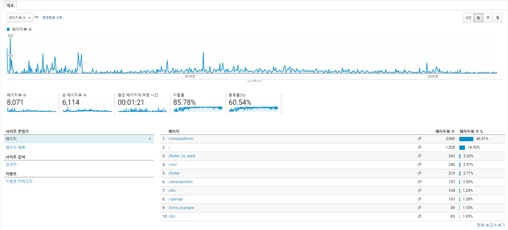
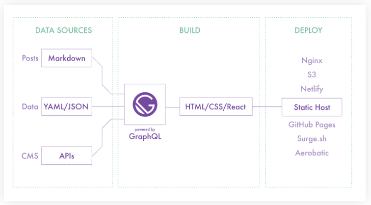
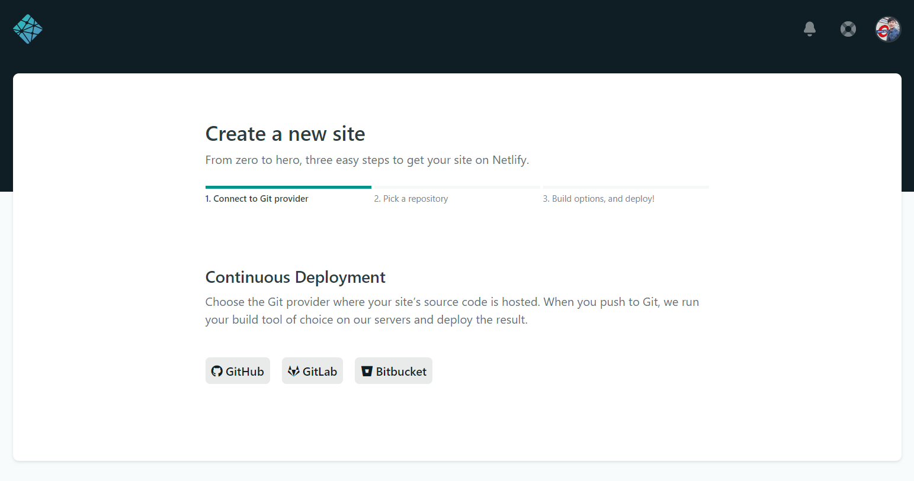
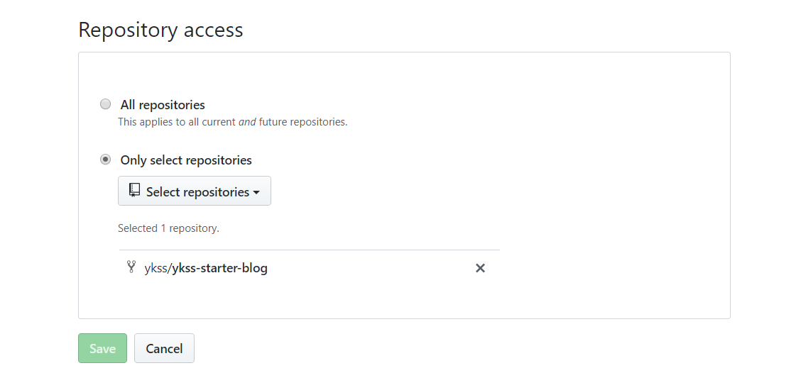
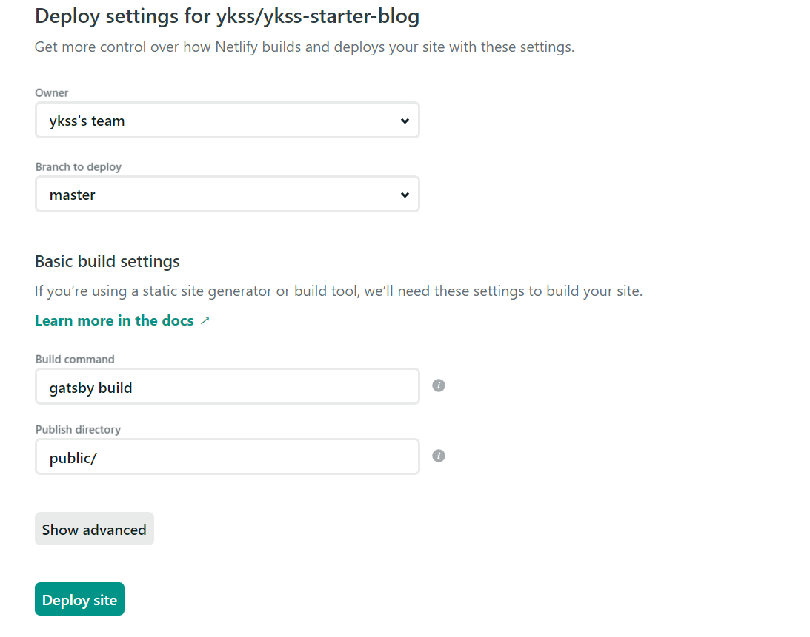

기존에 **Jekyll**을 이용해 블로그를 운영했었다. 대학시절 오픈소스 수업을 들으며 만들었었는데, 한동안 열심히 	포스팅하고 블로그 꾸미기도 하고, 구글 애널리틱스를 붙이는 등 한때 공들였었다. 하지만 취준과 취업 기간동안 동력을 잃고 유령 블로그가 되어버렸다. 근데 신기한 건 아직도 구글 애널리틱스의 정기적인 분석 보고 메일을 	받으면 관리하지 않고 있음에도 블로그 유입이 지속적으로 일어나는게 신기했다. (대부분 *Flutter* 관련 글...) 





다시 공부하고 성장해야겠다는 생각이 들었다. 자격증을 따거나 책을 보고 공부는 했지만, **무엇을 하든지 기록으로 남도록 하는 것**이 의미있고 중요하다는 생각이 들어서 다시 블로그를 하고자 하는 생각이 들었다.

이러한 새로운 마음가짐으로 블로그를 다시 시작하려고 했기 때문에 뭔가 기존의 **Jekyll** 블로그를 다시 운영하기는 마음에 썩 내키지 않았다. 뿐만 아니라 **Jekyll** 블로그를 운영하긴 했지만, 전체적으로 내가 자유자재로 커스텀하기엔 익숙치 않은 느낌이 있었다. 그래서 새로운 블로그로 다시 해보고 싶었다. (**새 술은 새 부대에**라는 말처럼)


​	내가 블로그를 선택하게 된 기준은 다음과 같다.

​	1) 글을 포스팅하는게 쉬운지? (마크다운을 지원한다!)

​	2) 내가 블로그를 전반적으로 이해하고 커스터마이즈 하기 용이 한지(어짜피 자바스크립트와 리액트를 

​        공부하고 있기 때문에, **Jekyll**의 경우 ruby와 친숙하지않다는 단점이 있었다..)

​	3) Github와 연동이 되는지 (Git에도 기록이 남는 장점!)

​	4) 괜찮은 스타터가 있는 블로그 (처음부터 뚝딱뚝딱 만들기는 시간이 많이 소요되고 아직 그럴 실력도 없...)

​	사실 블로그를 제대로 운영해본 적이 없기 때문에 크게 까다로운 기준이 있기보다는 일단 한번 해보자! 하는 마음가짐으로 위 기준에 모두 해당되는 **Gatsby**를 선택했다. 


1. **Gatsby JS** 

   > Gatsby is a blazing fast modern site generator for React.

   Gatsby JS는 단순하게 말하면 정적 HTML 생성기라고 할 수 있다. Gatsby의 경우 DB에서 정보를 받아와 HTML을 만들어내는 SSR(Server Side Rendering) 방식이나 API를 통해 페이지 정보를 받아와서 HTML을 생성하는 CSR(Client Side Rendering) 방식이 아니고 GraphQL을 이용해 정보를 가져와 빌드 시점에서 정적페이지를 만드는 방식이다. 배포 시점에는 이미 HTML 페이지가 완성되어있기 때문에 WAS가 별도로 필요하지 않다. **사전 렌더링**이 가장 큰 특징이라고 할 수 있다.

   

   


   

2. **Gatsby JS의 장점은 무엇일까?**

   1) Javascript와 React를 이용하여 만들 수 있다.

    개인적으로 자바스크립트와 리액트를 공부하고 했기에, 어짜피 공부할 거 블로그도 같은 방향을 가는게 좋지 않을까라는 생각이 있어서, Gatsby를 선택한 가장 큰 이유 중 하나는 자바스크립트였다.

   2) 나름 괜찮은 스타터들이 많다.

   초기 블로그 시작 시 스타터의 유무는 나름 중요한 요소라고 생각한다. 사실 블로그를 운영하는 목적에서 스타터 없이 시작한다면 블로그 운영 전 부터 지쳐 포기하는 일이 생길 수도 있다. 그리고 디자인적으로도 블로그가 맘에 들어야 글도 쓰고 싶을 것 같았다. 그리고 Gatsby 스타터 중에는 맘에 드는 스타터들이 몇개 발견됐었다.

   > https://www.gatsbyjs.org/starters/?v=2 여기서 찾아볼 수 있다.

   


3. **Gatsby JS는 어떻게 사용할까?**

   Gatsby는 CLI를 통해 사용할 수 있다. Gatsby CLI는 Webpack, ReactJs 등이 포함되어 있는 패키지이다. 

```bash
//npm을 통한 설치
npm install --global gatsby-cli

//새로운 프로젝트 생성
gatsby new [프로젝트 이름] <원하는 스타터가 있을 경우 git 주소>

//프로젝트 개발 시작
cd [프로젝트 이름]
gatsby develop
```


5. 배포

   배포는 **Netlify**를 통해 배포한다. 이번에 블로그를 하면서 처음으로 사용해봤는데, 정말 쉽고 간단하게 배포를 할 수 있었다.  **Netlify**는 정적 페이지를 무료로 호스팅해주고, HTTPS 적용도 해주고 무엇보다 GIthub와 연동이 잘 되어 있어 정말 배포 과정이 간단하다. **Netlify**로 배포하면 *.netlify.com 형식의 사이트 주소로 배포가 되지만 나중에 도메인을 구입한다면 자신이 원하는 도메인으로도 배포가 가능하다.

   


   간단한 사용 순서는 다음과 같다.

   ​	1) Netlify에 로그인 한 후에 `create a new site`를 클릭한다. 클릭하면 아래와 같은 화면을 볼 수 있다. 

   

   ​	2) `Continuous Deployment`에서 Github 또는 Gitlab 등 계정을 연결하여, 원하는 저장소를 선택한다. 

   

   ​	3) 기본 설정 셋팅을 하고 `Deploy site` 를 클릭하면 배포가 완료된다.

   

   ​	4) 위와 같은 과정을 마치면 배포가 완료되고, `Site settings`과 `Domain settings`등을 통해 여러가지 

   ​        설정 값을 조절 할 수 있다.


   프로젝트의 구조는 다음 포스트에서 정리해보려고 한다. 


> 참고 출처
>
> 1) [gatsby-로-blog-만들기](https://medium.com/@pks2974/gatsby-로-blog-만들기-ac3eed48e068)
>
> 2) [gatsby 공식 페이지](https://www.gatsbyjs.org/docs/)
>
> 