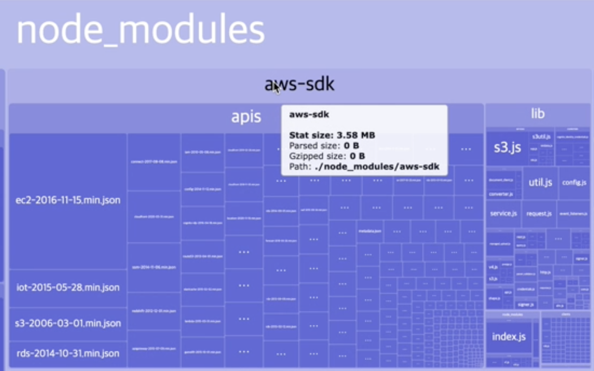

## 배경

자바스크립트에서 `AWS` 상의 여러가지 서비스를 사용하기 위해서 `aws-sdk` 패키지를 설치해서 사용하는 경우가 많다. 내가 개발하는 부분에서도 `aws-sdk`를 패키지로 설치하여 사용하는 경우가 있었는데, 그 중에서 `S3`만 사용하고 있었다. 사실 `aws-sdk`에서 제공하는 수 많은 기능 중에 `S3`만 사용하는데, 패키지 전체를 설치하여 사용하는 것은 비효율적이라는 생각이 들었다.

## 모듈화된 패키지의 필요성

위에서 말한 것 처럼 많은 경우에 전체 패키지를 설치하고, 실제 프로젝트에서는 그 중 매우 일부만 사용하는 경우가 있다. 속담으로 말하면 닭 잡는데 소잡는 칼 쓰는 느낌인 것이다. 이렇게 일부만 사용하면서 전체 패키지를 설치하는 경우가 생기게되면, 프로젝트의 번들 사이즈가 늘어나게 된다. 우리가 개발하는 것은 웹 애플리케이션이고, 브라우저에서는 번들화 된 소스를 다운받고 실행시켜야 하기 때문에, 번들 사이즈는 웹 페이지의 성능에 직접적인 영향을 끼친다. 그렇기 때문에 **번들 사이즈 최적화**가 중요한 관심사로 여겨지는 것이다.

위와 같은 비효율을 없애기 위해서는 일부 패키지들에서는 모듈화된 패키지를 제공하고 있다. 리액트의 대표적인 ui 라이브러리 중 하나인 `mui` 또한 패키지 전체를 설치하여 사용할 수도 있지만, `mui`에서는 컴포넌트 별로 모듈 형태로 제공하기 때문에, 필요한 컴포넌트만 추가하여 사용 가능하다. 이렇게 되면, 실제 사용하는 패키지만 추가하여 번들 사이즈를 효과적으로 줄일 수 있다.

`aws-sdk` 또한 이러한 모듈화된 패키지 형태를 제공한다. 이 글에서는 `aws-sdk`를 내가 필요한 `S3` 부분이 포함된 모듈로 전환하는 부분을 다루려고 한다.

## 번들 사이즈 분석을 통한 전체 패키지와 모듈 패키지 사이즈 비교

모듈화된 패키지와 전체 패키지를 비교하기 위해서는, 먼저 `aws-sdk`가 현재 패키지에 어느 정도 사이즈를 차지하고 있는지를 확인하면 좋다. 이러한 경우에 번들 사이즈를 분석하기 위해서는 `webpack-bundle-analyzer`를 활용할 수 있다. 해당 패키지를 설치하여 번들 사이즈를 분석하면 해당 번들이 어떠한 패키지들로 구성되어 있고, 각각 패키지가 어느정도 크기를 차지하는 지 시각적으로 확인이 가능하다. 아래는 `aws-sdk`가 얼마나 차지하는지 확인해 본 예시이다.

위 캡쳐 화면을 보면 `aws-sdk`가 3.58MB를 차지하고 있음을 볼 수 있다. 이 당시 프로젝트에서는 무려 전체의 25%를 차지하고 있었다. 충분히 `aws-sdk`를 모듈로 사용해야 할 필요성이 느껴졌다.

`aws-sdk` 모듈에 대한 정보는 [AWS 문서](https://docs.aws.amazon.com/ko_kr/sdk-for-javascript/v3/developer-guide/welcome.html)에서 확인할 수 있다. 내 경우에는 `S3` 서비스를 이용하기 위해 사용했고, `S3`를 이용할 때, 인증과 관련된 부분도 필요했기 때문에 `aws-sdk`를 `@aws-sdk/client-s3 , @aws-sdk/client-cognito-identity, @aws-sdk/credential-provider-cognito-identity`과 같은 3개의 모듈로 대체할 수 있었고, 총 사이즈를 3.58MB에서 1.1MB로 줄일 수 있었다.

다만 패키지만 교체하는 것이 아니고, 모듈형으로 설치하면서 문법적으로 약간의 수정이 필요하기 때문에, AWS문서를 참고하여 로직을 바꾸고, 원래의 기능이 제대로 작동하는지 꼼꼼한 확인이 필요하다.

## 정리

`aws-sdk`외에도 많은 라이브러리들이 모듈화된 패키지를 제공하고 있다. 현재 개발하고 있는 패키지의 번들 사이즈를 분석해보고, 과도하게 많은 크기를 차지하고 있는 패키지들이 있다면, 해당 패키지의 모듈 패키지에 대해 찾아보며 번들 사이즈를 줄일 수 있다. 이러한 번들 사이즈 최적화를 통해 웹 애플리케이션의 성능을 개선하면 실제 브라우저 상의 성능 뿐만 아니라 프로젝트의 빌드 속도 향상 등 많은 부분에서 개선을 이룰 수 있을 것이라고 생각된다.
