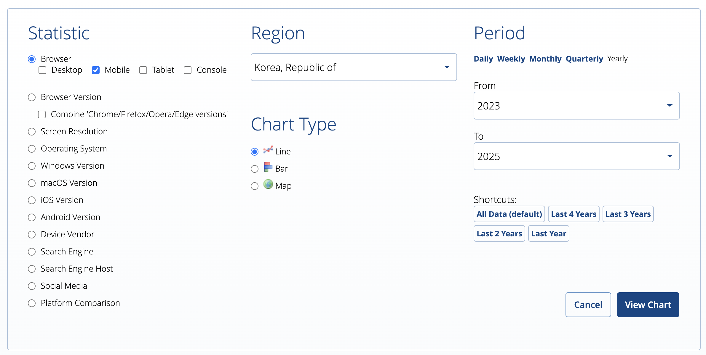

이번 글에서는 프런트엔드 개발자로서 알아두면 쓸모 있는 10가지 북마크 사이트를 소개해 보려고 한다. 사실 소개하는 사이트들은 대부분의 개발자가 이미 많이 접하고, 이용하고 있는 사이트일 것이다. 그럼에도 아직 접해보지 않은 개발자들이 있을 것 같아 이 글을 작성하게 되었다. 깊이 있는 내용이 아니기 때문에 가볍게 읽어보면 좋을 것 같다.

## 1. [스탯 카운터 (Stat Counter)](https://gs.statcounter.com/)

전 세계 브라우저와 디바이스 등의 사용 통계를 제공하는 사이트다. 타겟 사용자의 브라우저/OS 점유율, 화면 해상도 등 다양한 통계 자료를 확인할 수 있어 크로스 브라우징 대응 시 꼭 필요한 유용한 사이트라고 할 수 있다.

이전에 다양한 사용자를 위한 모바일 웹 기반 PWA를 개발한 경험이 있었는데, 당시 다양한 환경이 있었기에 어떤 브라우저 환경들을 지원해야 하고, 어떤 브라우저 환경에 대한 대응이 더 우선시되는지 판단하기 위한 근거로 삼기 위해 처음 사용했었다. 사실 사용 OS와 브라우저 등이 정해져 있는 경우라면 이러한 통계에 대한 필요성이 크지 않지만, 불특정 다수가 사용해야 하는 서비스의 경우에는 이러한 통계 자료가 의사결정을 하는 데 많은 도움이 된다.

위와 같은 필터에서 내가 필요한 부분을 체크해서 통계를 조회해 볼 수 있다. 위 필터는 2023년부터 2025년 동안의 한국 사용자들이 모바일 환경에서 어떤 브라우저를 사용하고 있는지에 대해 조회하는 필터이다.

그럼 위와 같은 통계 결과를 확인해 볼 수 있다. 통계를 통해 만약 한국 사용자를 대상으로 모바일 웹 서비스를 제공할 예정이라면 크롬과 사파리 외에도 삼성 인터넷과 웨일 브라우저에 대한 대응도 중요하게 고려해야 할 것을 알 수 있다.

## 2. [caniuse](https://caniuse.com/)

웹 기술들의 브라우저 지원 현황을 한눈에 확인할 수 있는 사이트다. CSS 속성부터 최신 Web API까지 다양한 기술의 지원 범위를 브라우저 버전별로 상세하게 보여준다.

위는 `view transition API`의 브라우저 지원 현황을 보여주는 예시인데, 84.74%의 버전을 지원하고 있음을 알려준다. 최신 브라우저들은 대부분 지원하고 있지만, 오래된 브라우저 버전이나 특정 브라우저(파이어폭스 등)는 지원하지 않는 것을 확인할 수 있다.

이런 식으로 서비스의 타겟 사용자층을 고려하여 해당 기능이 브라우저 호환성이 어떤지를 판단하여 사용하면 이후에 발생할 예상치 못한 문제를 방지할 수 있다.

## 3. [npm trends](https://www.npmtrends.com/)

npm 패키지들의 다운로드 추이를 비교할 수 있는 사이트다. 여러 라이브러리의 인기도를 한 번에 비교할 수 있어, 프로젝트에 적합한 라이브러리를 선택할 때 참고하기 좋다.

예를 들어 위 스크린샷은 지난 5년간 대표적인 상태 관리 라이브러리인 `recoil`, `zustand`, `jotai`의 다운로드 추이를 비교해 주고 있다. 21년도에는 세 라이브러리가 비슷했지만, 시간이 지나며 `recoil`은 도태되고, `zustand`는 가장 큰 인기를 끌고 있으며, `jotai`는 최근 점점 인기가 증가하고 있는 것을 확인할 수 있다.

물론 각 라이브러리의 장단점을 파악하여 프로젝트에 적합한 것을 적용해야겠지만, 최근 트렌드를 살펴보면 많은 사람들이 어떤 라이브러리를 가장 많이 사용되는지 알 수 있다. 일반적으로는 트렌드를 앞서는 라이브러리가 유지보수도 잘되고, 활발히 업데이트되는 경우가 많다고 할 수 있다.

## 4. [bundlephobia](https://bundlephobia.com/)

npm 패키지의 번들 크기를 분석해 주는 사이트다. 패키지의 용량, gzip 크기, 다운로드 시간 등을 확인할 수 있어 번들 크기 최적화에 도움이 된다.

위 스크린샷은 `axios` 패키지를 검색한 결과인데, `axios`의 버전별 용량, gzip 크기를 확인하고, 또 다른 패키지에 의존하는지 여부도 확인할 수 있다. 번들 사이즈를 줄이는 것이 최적화에 중요한 부분이기 때문에 패키지를 선택할 때 이 사이트를 통해 번들 사이즈를 비교해 보는 것도 많은 도움이 될 것이다.

## 5. [MDN docs](https://developer.mozilla.org/ko/)

웹 기술과 관련된 가장 신뢰할 수 있는 레퍼런스 문서다. HTML, CSS, JavaScript는 물론 웹 API까지 상세한 설명과 예제를 제공하고 있어 웹 개발의 필수 참고 자료다.

실제로 자바스크립트 메서드나 웹 API 등을 찾아볼 때 주로 사용하고, 전 세계의 사용자들이 함께 기여하고 있는 문서이기 때문에 최신 정보를 얻기도 좋고, 신뢰할 만한 문서라고 할 수 있다. 많은 문서의 경우 한국어 번역도 지원하고 있다.

만약 직접 MDN 문서에 기여하고 싶다면, MDN 번역 프로젝트에 참여해 보는 것도 의미가 있다. 아직도 많은 문서가 한국어로 번역되어 있지 않기 때문에, 프런트엔드 생태계에 기여하고 오픈소스 기여 경험을 쌓고 싶다면 좋은 방법이라고 생각한다.

나도 이전에 번역 활동에 참여했었는데, [번역 레포지토리](https://github.com/mdn/translated-content)의 기여 목록을 보면 31개의 문서를 번역하였었다. 사실 꾸준히 참여하려고 했지만, 게으른 탓에 최근에는 전혀 참여하지 못했다. 하지만 오픈 소스에 기여할 수 있는 좋은 경험인 것은 분명하다고 할 수 있다.

## 6. [regex101](https://regex101.com/)

정규표현식을 테스트하고 디버깅할 수 있는 사이트다. 실시간으로 매칭 결과를 확인할 수 있고, 정규식에 대한 자세한 설명도 제공한다. 그리고 여러 테스트 케이스를 추가하여 해당 정규식을 즉시 검증해 볼 수 있다.

위처럼 정규식을 작성한 이후 아래 test string에 테스트 문자열을 작성하면 실시간으로 매칭 결과를 확인할 수 있다. 또 오른쪽에는 정규식에 대한 자세한 설명도 제공하고 있다. 정규식은 프런트엔드와 백엔드에서 모두 많이 사용되기 때문에 이러한 도구는 정규식을 디버깅하는 데 많은 도움이 된다.

## 7. [css-tricks](https://css-tricks.com/)

CSS 관련 다양한 팁과 트릭을 제공하는 블로그다. 최신 CSS 기능부터 실용적인 레이아웃 기법까지 CSS와 관련된 거의 모든 내용을 다루고 있다. 특정 기능이 필요할 때 찾아볼 수도 있지만, 가끔 CSS 관련 팁을 찾아보거나, 어떤 부분까지도 이렇게 구현할 수 있구나 하는 아이디어를 얻기 위해 찾아보면 좋다. 대부분의 트릭은 코드 예시를 제공하고 있기 때문에 코드를 참고하기에도 많은 도움이 된다.

## 8. [daily.dev](https://daily.dev/)

개발자를 위한 뉴스 피드 서비스다. 이 사이트의 가장 큰 장점은 프런트엔드 관련 최신 기술 동향과 유용한 팁들을 브라우저 확장 프로그램을 통해 쉽게 접할 수 있다는 것이다.

위처럼 크롬에 브라우저 확장 플러그인을 설치하면 새 탭을 열 때, daily.dev 페이지가 자동으로 열리게 된다. 사실 의도적으로 매번 트렌드를 파악하기가 쉽지 않은데, 해당 서비스를 사용하면 새 탭이 열릴 때마다 의도치 않게 여러 글이 보이게 되고, 이를 통해 자연스럽게 트렌드를 파악할 수 있다.

## 9. [dev.to](https://dev.to/)

daily.dev와 비슷하게 전 세계 개발자들이 기술 관련 글을 공유하는 커뮤니티 플랫폼이다. 특히 프런트엔드 개발 관련 양질의 글이 많이 공유되어 최신 트렌드를 파악하기 좋다.

위처럼 로그인하면 자신의 관심사를 표시할 수 있고, 관심사에 따라 피드를 받아 볼 수 있기 때문에 효과적으로 트렌드를 파악할 수 있다.

## 10. [korean FE articles](https://kofearticle.substack.com/)

해외 개발 관련 프런트엔드 아티클을 큐레이션 하고 한국어로 번역하여 제공해 주는 메일링 서비스이다. 매주 양질의 프런트엔드 개발 관련 글들을 이메일로 받아볼 수 있다. 메일을 통해 주기적으로 여러 번역 글을 받아 볼 수 있기 때문에 여러 가지 프런트엔드 동향을 파악하는 데 도움이 된다.

사실 나도 2년 넘게 이 그룹에서 번역 활동을 하고 있는데, 번역하다 보면 자연스레 최신 트렌드에 관심을 가지게 되는 것 같다. 어느새 구독자가 만 명이 넘는 메일링 서비스가 되었는데, 앞으로도 많은 프런트엔드 개발자분과 프런트엔드 생태계에 도움이 되는 활동이 되었으면 좋겠다.

## 결론

이번 글에서는 프런트엔드 개발자로서 알아두면 쓸모 있는 10가지 북마크 사이트를 소개해 보았다. 매우 빠르게 변화하는 프런트엔드 생태계에서 각각의 사이트들이 제공하는 기능들을 잘 활용한다면 프런트엔드 트렌드를 쉽게 파악하고 효과적으로 개발하는 데 많은 도움이 될 것으로 생각한다.
