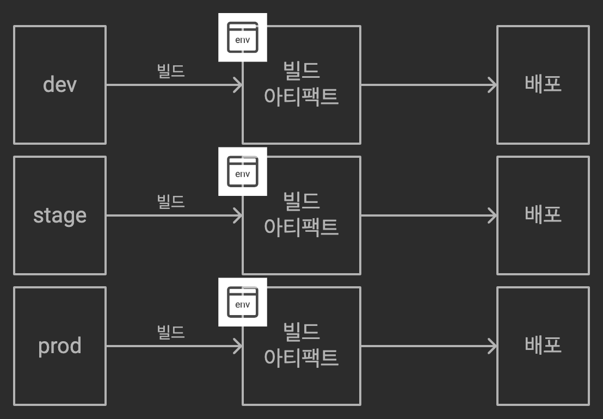

최근 Next 14 환경에서 신규 프로젝트를 개발하던 중 Next.js의 환경 변수 관련 문제로 애먹었던 적이 있어서 이번 기회에 환경 변수에 대해 정리해보려고 한다.

환경 변수는 주로 노출되면 안되는 민감 정보 및 API 엔드포인트나 API 키 등 빌드 환경별로 달라져야 하는 정보에 쓰인다. 실무에서는 대부분 실행 환경이 구분되고, 외부에 노출되면 민감할 수 있는 정보가 많기 때문에 필수적으로 쓰이는 방식이라고 할 수 있다.

## Next.js의 환경변수

일반적인 CSR 방식의 애플리케이션과 다르게 Next.js의 경우, 애플리케이션이 서버와 클라이언트 모두에 걸쳐 있다. 때문에 일반적으로 Next.js에서는 환경변수를 관리하는 것이 조금 더 복잡한 경우가 있다. Next.js에서는 기본적으로 아래와 같이 코드를 구분한다.


1. 서버에서 실행해야 할 코드(SSR)
2. 클라이언트에서 실행해야 할 코드(CSR)
3. 서버와 클라이언트 모두에서 실행 해야 할 코드(SSR + Hydration)

그래서 흔히 쓰는 방식으로 아래와 같이 환경 변수를 선언해보자.

```ts
// .env
API_URL=http://localhost:3000/api/
```

위와 같이 선언된 환경 변수는 `process.env.API_URL`을 통해 서버 환경에서 불러올 때는 문제없이 정상적으로 호출되지만, 클라이언트 환경에서 불러올 때는 정상적으로 불러와지지 않는다. 만약 브라우저에서 노출된다면, 해당 환경변수를 포함한 컴포넌트가 서버에서 생성된 서버 컴포넌트이기 떄문이다. 즉, 서버 환경에서 불러왔기 때문이다.

때문에 Next에서는 클라이언트 측에서도 환경 변수를 불러오기 위해서는 `NEXT_PUBLIC_` 접두사를 붙혀 환경 변수를 선언해야 한다. 그래서 적절하게 판단하여 클라이언트로 노출되어도 괜찮은 정보는 `NEXT_PUBLIC_` 접두사를 붙혀 선언하고, 민감한 정보의 경우, 해당 접두사 없이 선언하는 것이 좋다.

Next에서 환경 변수는 dotenv를 이용하여, 즉 `.env`와 같은 파일에 환경변수를 위치할 수도 있고, `next.config.js`에 환경 변수를 선언하는 것도 가능하다. 하지만 `next.config.js`는 버전 관리(ex. Github)에 포함되기 때문에 민감정보를 선언하는 것은 적절치 않다. 또 `.env` 파일의 경우, `.env.development`, `.env.production`와 같이 환경별로 구성이 가능하다는 장점이 있다. 반면, `next.config.js`에 선언하는 경우에는 함수나 조건문을 이용하여 동적인 값을 할당할 수 있다는 장점이 있다.

환경 별로 `.env.[NODE_ENV]` 파일을 생성하여 사용할 수 있는데 이 경우 환경 변수를 로드하는 순서를 [Next 문서](https://nextjs.org/docs/app/building-your-application/configuring/environment-variables#environment-variable-load-order)에서는 아래와 같이 안내하고 있다.

1. `process.env`
2. `.env.$(NODE_ENV).local`
3. `.env.local` (`NODE_ENV`가 `test` 일때는 체크하지 않는다.)
4. `.env.$(NODE_ENV)`
5. `.env`

위 순서로 환경 변수를 로드하고 앞 순서에서 환경 변수를 찾았다면 해당 변수를 로드하고 탐색을 중지한다. 이렇게 Next에서는 기본적으로 `NODE_ENV`와 연동하여 환경 변수를 읽기 때문에, development, int, stage, production 등 다양한 환경에 맞추어 환경 파일로 대응하기 위해서는 별개에 작업들이 필요하다.

## 빌드타임 환경 변수와 런타임 환경 변수

환경 변수에는 환경 변수가 설정되는 시점에 따라 빌드타임 환경 변수와 런타임 환경 변수가 존재한다.


먼저 빌드타임 환경 변수부터 알아보면, 빌드타임 환경 변수는 애플리케이션이 컴파일되고 빌드되는 동안 설정되고 주로 배포 과정에서 이루어진다. 때문에 빌드타임 환경 변수는 빌드 과정 중에 상수로 코드에 내장되고, 빌드가 완료된 후에는 변경할 수 없다. 만약 빌드 타임 환경 변수를 변경하기 위해서는 애플리케이션을 다시 빌드하고 배포해야 하는 번거로움이 있다. 하지만 빌드 시점에 값이 결정되는 것이 기 때문에, 런타임에 동적으로 값을 조회할 필요가 없어 성능 상으로는 런타임 환경 변수보다 이점이 있을 수 있다. 각 요청마다 변수를 다시 확인할 필요가 없기 때문이다. 주로 버전 정보와 같이 환경 별로 값이 일정하게 유지되어야 하는 경우 빌드타임 환경 변수로 적용하는 것이 적절하다.

반면 런타임 환경 변수는 애플리케이션이 실행되는 동안 설정되며, 애플리케이션 시작 시 또는 실행 중에 변경될 수 있다. 런타임 중에 환경에 따라 동적으로 변경될 수 있기 때문에 동일한 애플리케이션 이미지가 여러 환경에서 다른 동작을 하도록 할 수 있다. 때문에 컨테이너화된 환경에서 유용하다.

위에서 설명한 방법(`.env`, `next.config.js`)들은 모두 빌드타임에 환경 변수를 값으로 치환한다. `NEXT_PUBLIC_`이 붙은 환경 변수 또한 빌드타임에 클라이언트 코드에 포함된다. [Next 공식 문서](https://nextjs.org/docs/app/building-your-application/configuring/environment-variables#bundling-environment-variables-for-the-browser)에서도 아래와 같이 설명하고 있다.

> 참고: 앱이 빌드된 후에는 이러한 환경 변수의 변경에 더 이상 응답하지 않습니다. 예를 들어 Heroku 파이프라인을 사용하여 한 환경에서 빌드된 슬러그를 다른 환경으로 승격하거나 단일 Docker 이미지를 빌드하여 여러 환경에 배포하는 경우 모든 NEXT*PUBLIC* 변수는 빌드 시점에 평가된 값으로 고정되므로 프로젝트를 빌드할 때 이러한 값을 적절하게 설정해야 합니다.

그리고 next 문서에는 기본적으로 런타임에서 환경 값에 액세스 해야하는 경우, 자체 API를 설정하여 클라이언트에 제공하도록 해야한다고 설명하고 있다.

## 런타임에서 환경 변수 주입하기

먼저, 런타임에서 환경 변수를 주입해야 하는 이유를 알아보자.



빌드타임에 환경 변수를 주입하다 보면 각 환경마다 빌드가 되고, 각 환경마다 따로 배포가 되어야 한다. 환경이 세 개라면 빌드를 세번 거쳐야 하는 것이다. 또한 혹시라도 환경 변수를 변경해야 하는 경우라면, 빌드를 다시 해야하는 단점이 존재한다. 특히 빌드 시간이 오래 걸리는 프로젝트의 경우 이는 생산성에 치명적인 영향을 줄 수 있다.


런타임에 환경 변수를 주입하면 빌드는 한 번만 이루어지면 된다. 하나의 빌드 결과물을 가지고 배포 시 런타임 환경변수를 주입하여 여러 환경에 배포할 수 있게된다. 또 환경 변수가 변경되어야 하는 경우에도 다시 빌드할 필요 없이 환경 변수만 변경하여 배포만 다시 하는 것도 가능하게 된다. 이러한 이유로 런타임에 환경 변수를 주입하는 것이 효율성의 측면에서 매우 유리하다고 볼 수 있다.

나의 케이스에서는 아래와 같은 과정으로 빌드와 배포 프로세스가 이루어진다. 케이스에 따라 이러한 프로세스는 각각 다르지만 전체적인 컨셉으로 다른 환경에서도 적용할 수 있을 것이라고 생각된다.

1. 메인 브랜치에 머지하면 빌드 프로세스가 진행되고 빌드가 완료되어 Dockerfile을 통해 생성된 이미지가 저장소에 업로드 된다.
2. Argo CD는 Git 저장소의 변경을 감지한다.
3. 변경된 내용을 쿠버네티스에 배포하고 반영한다.

Argo CD에서는 Git 저장소 코드 베이스와 helm 리포지토리의 설정 파일을 기준으로 배포하는데, helm의 각 환경 `values.yaml` 파일에 아래와 같이 환경 변수를 선언해줄 수 있다.

```yaml
# values-development.yaml
# 애플리케이션 설정
app:
  name: myapp
  replicas: 2
  image:
    repository: myregistry.azurecr.io/myapp
    tag: dev-v1.0.0
    pullPolicy: Always

# 환경 변수
env:
  NEXT_PUBLIC_API_URL: 'https://api-dev.example.com'
  API_KEY: eklslkjglkjglk2grlk
# ...
```

위와 같이 환경별 `values.yaml` 파일에 환경 변수를 설정해주면 빌드 이미지를 가지고 배포할 시 배포 환경의 `values.yaml`을 참조하여 환경 변수가 주입된다.

> 다만, Next.js에서 빌드 시점에 서버 환경에서 페이지를 생성하는 SSG(Static Site Generation)를 사용하는 경우에는 빌드타임에 환경 변수가 주입되지 않아 문제가 발생할 수 있다. 그렇기 때문에 배포 프로세스에 런타임 변수를 주입하는 방법은 SSG를 사용해야하는 경우에는 적합하지 않을 수 있다.

## 주입한 런타임 환경 변수 사용하기

주입된 환경 변수를 손쉽게 사용하기 위해 `next-runtime-env` 패키지를 사용하였다. 해당 패키지는 **"Build once, deploy many"**라는 철학을 Next.js에서도 실현하고자 만들어진 패키지로 런타임에 환경변수를 동적으로 주입한다.

이 패키지를 적용하기 위해서는 아래와 같이 html `<head>`에 `<PublicEnvScript/>`를 추가해야 한다. `PublicEnvScript` 컴포넌트는 `NEXT_PUBLIC_` 접두사가 붙은 모든 환경 변수를 브라우저에 자동으로 노출하는 역할을 한다.

```jsx
// app/layout.tsx
import { PublicEnvScript } from 'next-runtime-env';
export default function RootLayout({ children }) {
  return (
    <html lang="en">
      <head>
        <PublicEnvScript />
      </head>
      <body>{children}</body>
    </html>
  );
}
```

추가한 이후에는 자유롭게 주입한 환경 변수를 아래와 같이 사용할 수 있다.

```js
import { env } from 'next-runtime-env';

const API_URL = env('NEXT_PUBLIC_API_URL');
```

## 결론

Next.js에서 환경 변수를 관리 할 때, 서버와 클라이언트가 나뉜 Next.js의 특성 상 빌드타임 환경 변수 주입에 대한 한계점과 이를 극복하기 위한 런타임 환경 변수 주입과 활용에 대해서 알아보았다. 여러가지 환경과 조건을 고려하여 런타임 환경 변수 주입이 문제가 없다면, 이를 통해 비효율적인 빌드 과정을 줄이고 효율적으로 빌드 및 배포 프로세스를 개선할 수 있을 것이다.

---

> 피드백은 언제나 환영합니다! 혹시 이 글에 제가 잘못 이해한 부분이 있다면 댓글로 남겨주시면 확인 후 수정토록 하겠습니다!
