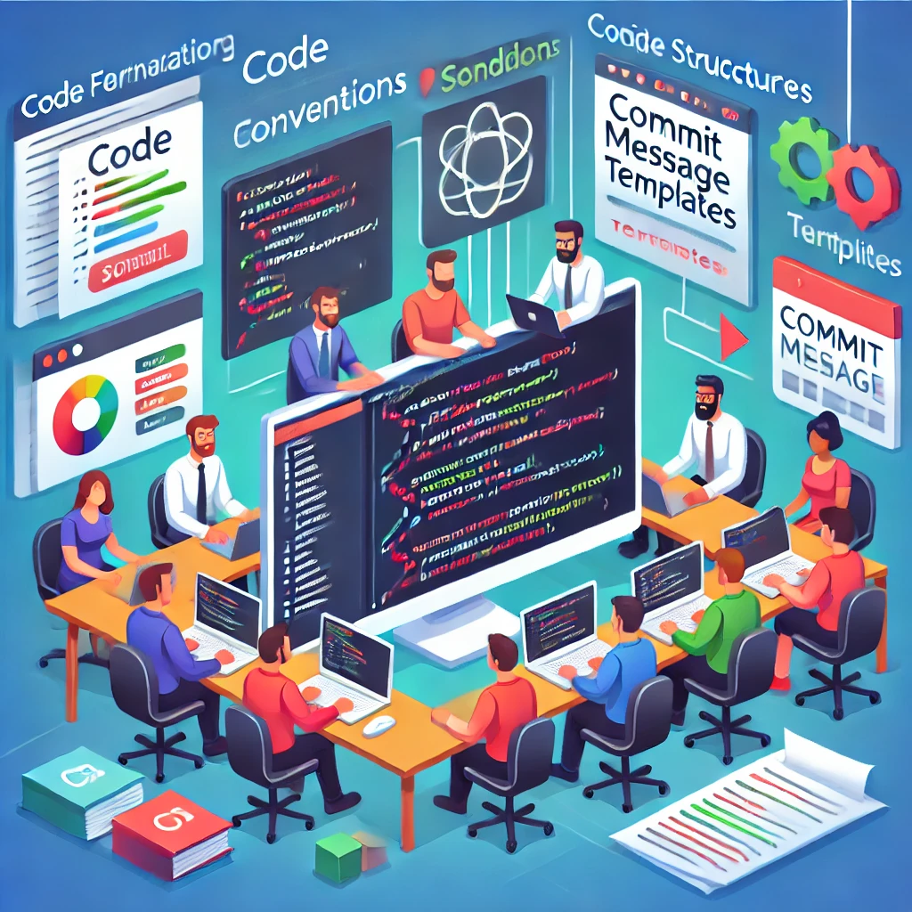

이번 글의 주제는 `컨벤션(convention)`이다. 컨벤션에 대해서 말할 때 누군가는 자질구레한 부분이라고 할 수도 있고, 또 다른 누군가는 꼭 필요한 것이라고 할 수도 있다. 하지만 내가 지금까지 일해오면서 느껴온 컨벤션은 적당한 그 어느 정도의 선을 지킬 때는 여러 가지 긍정적인 영향을 주는 꼭 필요한 것으로 생각한다. 컨벤션이 무엇이고, 어떤 긍정적 영향과 부정적 영향을 주는지, 또 어떤 컨벤션이 좋은 컨벤션이고, 더 나은 컨벤션을 위해서는 무엇을 해야 하는지 지극히 주관적으로 이야기해 보려고 한다.

## 컨벤션은 무엇일까?

소프트웨어 개발에서 컨벤션은 코드 작성, 구조, 명명 규칙 등에 대한 일관된 가이드라인과 표준을 의미하며, 간단히 말해 함께 협업하는 개발자들 사이에서 서로의 약속이라고 할 수 있다. 컨벤션은 일반적으로 코드의 가독성, 유지보수성, 그리고 전반적인 품질을 높이는 데 중요한 역할을 한다.

## 컨벤션의 종류는 어떤 게 있을까?


컨벤션의 종류는 무수하게 많다. 코드 작성의 아주 사소하고 미세한 부분부터 프로젝트 관리의 큰 틀까지 광범위하게 적용될 수 있다. 다음은 주요 컨벤션의 종류와 그 예시이다.

### 코드 스타일 컨벤션

- 문자열 표기
  - 작은따옴표('') vs 큰따옴표("") 사용
  - 템플릿 리터럴(`) 사용 규칙
- 변수 및 함수 명명 규칙
  - camelCase, PascalCase, snake_case 등의 사용 상황
  - 약어 사용 vs 전체 단어 사용 (예: `getUserInfo` vs `getUserInformation`)
  - 이벤트 핸들러 접두사 규칙 (예: `handle-`, `on-`)
- 코드 포맷팅
  - 들여 쓰기 규칙 (탭 vs 스페이스, 간격 수)
  - 최대 줄 길이
  - 중괄호 위치 (같은 줄 vs 새 줄)
- 함수 및 메서드 작성
  - 화살표 함수 vs 일반 함수 사용 규칙
  - 메서드 체이닝 시 줄 바꿈 규칙

### 프로젝트 구조 및 관리 컨벤션

- 버전 관리
  - 커밋 메시지 형식 (예: [JIRA TICKET #] feature: 로그인 API 연동 및 인터페이스 정의)
  - 브랜치 명명 규칙 (예: feature/[JIRA TICKET #]: 개발 사항)
- 파일 구조
  - import 순서 및 그룹화 (예: 외부 라이브러리 -> 내부 컴포넌트 -> API/스토어 -> 타입/상수 -> 스타일)
  - 파일 내 코드 구조 (컴포넌트, 함수, 상수 등의 순서)

### 개발 도구 및 설정 컨벤션

- Linter 및 Formatter 설정
  - ESLint 규칙 설정
  - Prettier 설정 (들여쓰기, 줄 바꿈 등)
- 프로젝트 설정
  - jsconfig.json 또는 tsconfig.json 설정
  - 빌드 및 배포 스크립트 규칙

### 코딩 패턴 컨벤션

- 조건문 및 루프
  - 조건문에서 중괄호 사용 규칙 (한 줄일 때도 사용 vs 생략)
  - 삼항 연산자 vs if-else 사용 규칙
- 에러 처리
  - try-catch 블록 사용 규칙
  - 에러 객체 생성 및 전파 방식
- 비동기 코드
  - Promise 체인 vs async/await 사용 규칙
  - 비동기 함수 명명 규칙

이 밖에도 타입 정의 컨벤션, 테스트 코드 컨벤션 등 프로젝트의 목적과 개발 환경에 따라 수많은 다양한 컨벤션이 존재한다.

## 컨벤션은 왜 중요할까?

협업이 필수적인 개발 업무에서 컨벤션은 팀의 성공을 좌우할 수 있는 핵심 요소이다. 컨벤션이 없거나 제대로 지켜지지 않으면 프로젝트는 혼란스러워지고, 다른 개발자의 코드를 이해하는 데 불필요한 시간과 노력이 소요된다. 심지어 1인 개발자라 하더라도 일관된 컨벤션 없이는 과거에 작성한 자신의 코드를 이해하기 어려울 수도 있다.

단순히 컨벤션의 수가 많다고 해서 반드시 효율적이거나 코드 품질이 높아지는 것은 아니다. 오히려 과도한 컨벤션은 팀의 생산성을 저해하고 여러 부정적인 영향을 초래할 수 있다. 이제 컨벤션이 가져올 수 있는 긍정적인 영향과 부정적인 영향에 대해 자세히 알아보자.

### 적절한 컨벤션이 주는 긍정적인 영향들

적절한 컨벤션은 개발 프로세스와 결과물에 여러 가지 긍정적인 영향을 미친다. 우선, 여러 개발자가 함께 작업할 때 일관된 코드 스타일을 유지할 수 있게 해 주어 전체적인 코드 베이스의 통일성을 보장한다. 이러한 일관성은 코드의 가독성을 크게 향상시켜 다른 개발자의 코드를 더 쉽고 빠르게 이해할 수 있게 한다.

또한, 잘 정립된 컨벤션은 코드의 유지보수성을 높여준다. 모든 개발자가 유사한 패턴과 구조로 코드를 작성하기 때문에, 버그 수정이나 기능 개선 시 코드를 수정하거나 리팩토링하는 것이 훨씬 수월해진다. 이는 자연스럽게 팀의 전반적인 생산성 향상으로 이어지며, 개발자들 간의 소통과 협업 또한 더욱 원활해진다. 코드 리뷰 시에도 컨벤션을 지킨 코드는 더 쉽게 이해할 수 있기 때문에 로직에 더 중점을 두고 리뷰할 수 있다.

특히 주목할 만한 점은 컨벤션이 잘 정립된 경우, 새로운 프로젝트에 참여하는 개발자들이 정립된 컨벤션만 숙지하면 더 빠르게 적응하고 팀에 녹아들 수 있다는 것이다. 익숙한 패턴과 구조를 따르는 코드 베이스는 학습 곡선을 낮추어 주며, 이는 소위 '버스 팩터'(특정 개발자가 부재 시 프로젝트가 중단될 위험)를 크게 감소시키는 효과가 있다. 프로젝트 단위가 아닌 팀 단위의 강한 컨벤션을 가져가는 경우, 팀 내의 다른 프로젝트에 투입되어도 더 수월하게 적응할 수 있어 조직적인 관점에서 볼 때도 큰 장점이 된다.

### 과도한 컨벤션이 가져오는 부정적인 영향들

과도한 컨벤션은 오히려 팀에 독이 될 수 있다. 너무 엄격하고 불필요한 규칙들은 개발자의 창의성을 제한하고, 코드를 작성할 때 자유로운 사고를 방해한다. 예를 들어, 모든 변수명을 특정 형식으로만 강제하거나, 함수의 길이를 무조건 특정 라인 수로 제한하는 등의 규칙은 자유도를 제한하여 때로는 좀 더 나은 코드를 작성하는 데 필요한 창의성을 억제하기도 한다.

컨벤션을 지키느라 과도한 시간을 쓰게 되면, 정작 중요한 비즈니스 로직 구현에 집중하지 못하게 된다. 특히 합리적인 이유 없이 강요되는 규칙들은 개발자들의 사기를 떨어뜨리고 개발 속도를 현저히 저하시킨다.

새로운 개발자가 팀에 합류할 때도 문제가 된다. 너무 많은 컨벤션 규칙은 새로운 팀원이 적응하는데 큰 허들이 된다. 실제로 코드를 작성하기도 전에 수많은 규칙을 외워야 하는 상황이 발생하면, 온보딩 기간이 불필요하게 길어질 수 있다. 그리고 컨벤션이 많아질수록 문서화가 중요한데, 문서가 최신화되지 않는다면 그 또한 적응에 어려움이 될 수 있다.

위 사항을 보면 적절한 컨벤션일 때는 장점이었던 부분이 과도하게 되면 단점으로 변모할 수 있음을 알 수 있다. 그렇기 때문에 적절한 수준의 컨벤션을 유지하는 것이 매우 중요하다.

## 좋은 컨벤션을 유지하는 방법은 무엇일까?

좋은 컨벤션을 유지하기 위해서는 지속적인 관리와 개선이 필수적이다. 한번 정해놓은 컨벤션을 고정불변의 진리처럼 여기지 말고, 팀의 상황과 프로젝트의 특성에 맞춰 유연하게 발전시켜야 한다.

### 지속적인 피드백과 토론

회고와 같은 정기적으로 팀 내에서 현재 적용 중인 컨벤션에 대한 피드백을 수집하고 토론하는 시간을 가져야 한다. 이때 중요한 것은 다음과 같은 질문들을 던지는 것이다.

- 현재의 컨벤션이 실제로 코드 품질 향상에 도움이 되는가?
- 특정 컨벤션이 개발 생산성을 저해하지는 않는가?
- 팀원들이 컨벤션을 따르는 데 어려움을 겪고 있지는 않은가?
- 새로운 기술이나 도구의 도입으로 인해 수정이 필요한 컨벤션은 없는가?

### 실용적인 접근

컨벤션은 실용성에 기반을 두어야 한다. 단순히 "이렇게 하는 것이 좋다"는 막연한 이유가 아닌, 실제로 팀에 도움이 되는지를 기준으로 판단해야 한다.

- 특정 명명 규칙이 실제로 코드의 의도를 더 명확하게 전달하는가?
- 파일 구조나 폴더 구조가 프로젝트의 확장성을 고려했을 때 적절한가?
- 현재의 커밋 메시지 규칙이 변경 이력을 추적하는 데 실질적인 도움이 되는가?

### 유연한 적용

컨벤션은 상황에 따라 예외를 허용할 수 있어야 한다. 때로는 정해진 규칙을 벗어나는 것이 더 나은 코드를 만들 수 있다.

- 예외 적용의 이유를 명확히 문서화한다(코드에 주석으로 남겨놓는 것도 좋은 방법일 수 있다.)
- 팀원들과 해당 예외 상황에 대해 논의하고 합의한다
- 필요하다면 컨벤션 자체를 수정하거나 보완한다

### 문서화와 공유

컨벤션의 변경 사항은 반드시 문서화하고 팀원들과 공유해야 한다.

- 컨플루언스와 같은 위키나 노션 등의 도구를 활용해 컨벤션 문서를 관리한다
- 컨벤션 변경 시 변경 이유와 적용 시점을 명확히 기록한다
- 새로운 팀원이 쉽게 참고할 수 있도록 예시를 포함한다

## 좋은 컨벤션을 유지하는 데 도움을 주는 도구

### PR(MR) 템플릿과 코드 리뷰

PR 템플릿은 개발 내용을 일관성 있게 공유하고 효율적인 코드 리뷰를 위한 필수 도구다. 아래는 자주 사용되는 PR 템플릿의 예시다.

```
### PR 타입
- [x] 기능 추가
- [ ] 기능 삭제
- [ ] 버그 수정
- [ ] 의존성, 환경 변수, 빌드 관련 코드 업데이트

### 체크 리스트
- [ ] 빌드는 정상적인가요?
- [ ] 급한 리뷰가 필요한 PR인가요?
- [ ] 리베이스는 되어있나요?

### 변경 사항
ex) 로그인 API 연동

### PR 포인트
ex) 코드 리뷰할 때 주의 깊게 봐야 할 부분이 있는지, 함께 고민해보고 싶은 부분이 있는지

### 스크린샷 또는 영상
ex) 작업한 내용을 보여줄 수 있는 이미지 또는 영상
```

이러한 PR 텝플릿을 통해 협업할 때, 서로의 개발 사항에 대해 일관성 있는 형태로 공유할 수 있고, 유의미한 코드 리뷰를 끌어낼 수도 있다.

코드 리뷰는 단순히 코드 품질 검증을 넘어 팀의 컨벤션을 발전시키는 핵심 프로세스다. 컨벤션에 대한 점검과 피드백, 개선 논의는 코드 리뷰를 통해 시작된다고 해도 과언이 아니라고 할 수 있다. 리뷰를 통해 기존 컨벤션의 문제점을 발견하고, 더 나은 방향을 제시할 수 있다. 특히 주니어 개발자들이 컨벤션을 자연스럽게 학습할 수 있는 가장 효과적인 방법이기도 하다.

### Git Hooks와 Husky

[husky](https://typicode.github.io/husky/)는 Git Hooks를 쉽게 관리할 수 있게 해주는 유용한 도구이다. 커밋 템플릿을 적용할 수도 있고, 컨벤션을 강제해 놓을 수도 있어서 만약 컨벤션에 맞지 않는 메시지를 작성했을 경우에는 커밋이 일어나지 않게 할 수 있다. 적용 방법에 대해서는 [문서](https://typicode.github.io/husky/)를 참고하면 어렵지 않게 적용할 수 있다.

### SonarQube

[sonarcube](https://www.sonarsource.com/products/sonarqube)는 정적 코드 분석을 통해 코드의 버그, 코드 스멜, 보안 취약점 등을 탐지하고 관리해 주는 효과적인 도구이다. 특히 소나큐브에서는 각 프로젝트 또는 조직에 맞게 커스텀 룰을 만들 수 있는데, 이러한 소나큐브의 특징을 사용하여 컨벤션을 강제하게 하는 도구로 활용하여 코드 품질을 유지하면서 컨벤션을 점검할 수 있다.

또한 CI 파이프라인에 적용하며 PR을 올리면 정적 분석을 해주고, 정적 분석 결과가 통과했을 때만 머지하게 할 수 있어 컨벤션이 중요한 상황에서는 큰 도움이 될 수 있다.

## 결론

"좋은 코드란 어떤 코드일까?"라고 생각해 보면 사실 단 하나의 답으로 내리기는 어려운 것 같다. 하지만 내 경험을 돌아보며 내가 할 수 있는 답변 중 하나는 **"좋은 코드는 약속을 지킨 코드"라는 것**이다.

컨벤션은 단순한 규칙이 아닌, 팀의 문화이자 정체성이기도 하다. 적절한 컨벤션은 코드의 품질을 높이고 팀의 생산성을 향상시키지만, 과도한 컨벤션은 오히려 독이 될 수 있다. 중요한 것은 균형이다. 팀의 상황과 프로젝트의 특성을 고려하여 실용적이고 합리적인 수준의 컨벤션을 정하고, 이를 지속적으로 개선해 나가는 것이 핵심이다.

결국 컨벤션의 궁극적인 목적은 더 나은 소프트웨어를 만드는 것이다. 이는 단순히 코드를 작성하는 방식을 통일하는 것을 넘어, 팀원 간의 효율적인 협업과 원활한 소통을 가능하게 하고, 나아가 프로젝트의 지속 가능한 성장을 끌어내는 것이다. 이러한 목적을 항상 염두에 두고 컨벤션을 바라보아야 한다.
