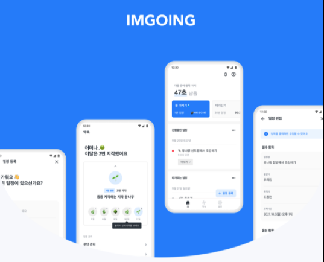
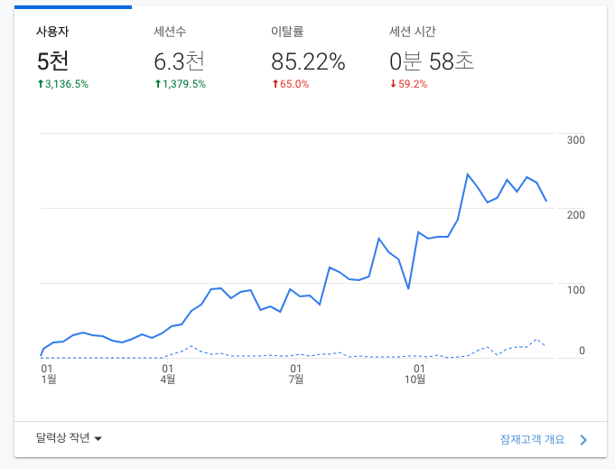
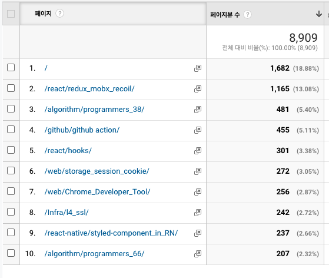

지금껏 여러 블로그를 보면서 회고 글을 많이 봤었다. 하지만 직접 회고를 작성해 본 적은 없었는데, 한 해를 돌아보며 기록한다는 것이 생각해보면 여러모로 의미있는 것 같아서 회고를 작성해본다. 사실 회고를 쓸 만큼 뭔가 거창한 걸 하진 않았지만, 그래도 기록 자체로도 그 의미가 충분하다는 생각이 든다!

## 일 🏬

### 4개의 프로젝트 PM

작년 회사에서의 일을 돌아보면, 일단 반 이상은 프로젝트에 쏟은 것 같다. 재작년부터 이어져 1분기까지 수행했던 두 개의 프로젝트를 마치고, 정말 레거시지만 맡고 있던 시스템이 Active X 기반이었기 때문에, IE의 서비스 종료에 발맞추어 멀티브라우저 지원을 위한 프로젝트와 사실 내 업무는 아닌 것 같지만 그룹웨어에 통합검색 페이지를 구축하는 프로젝트 등을 수행했다.

이 과정 속에서 PM으로써 역할이 만만치 않은 것을 느꼈다. 물론 내가 직접 개발을 수행하거나, 직접 디자인을 하거나 하지는 못했지만, 프로젝트의 기획부터 요건 정리, 일정 수립, 투자 계획 수립 등 한 가지 프로젝트를 수립하고 승인받고 진행하고 완료하는데 정말 여러가지 프로세스들이 필요했다..! 덕분에 이제 투자 프로세스와 프로젝트 진행 프로세스에 대해서는 완전 숙지하게 되었고, 팀 내에서 다른 PM 분들도 도움을 종종 요청해주셔서 내심 뿌듯한 감도 있었다.

PM으로써 명확하게 요건에 대해서 정의하는 것과 중간중간 계속적인 확인과 피드백의 중요성에 대해서도 느꼈고, 어떻게 하면 더 효율적으로 프로젝트를 진행하고 커뮤니케이션할 수 있을지에 대해서 많이 배웠다.

특히, 나는 원래 재택근무를 선호하기도 하고 원격 근무를 좋아라하지만...! 프로젝트 수행 시에 코로나 시국이라 대면으로 프로젝트 회의 등을 진행하지 못하는 상황이라, 생각보다 의사소통에 소모되는 비용과 비효율이 많았다는 생각이 든다. 아직은 커뮤니케이션에 있어 매번은 아니더라도 대면 상황의 소통이 필요함을 느끼게 된 계기였다!

### 지루한 운영 업무

내가 맡고 있는 업무는 여전히 재미없다. 여러가지 프로젝트로 개선하고 이슈 등을 관리하지만, 운영 업무의 한계겠지만 평화롭지만 지루하다. 어쩌다 보니 너무 고여버려서 항상 그랬지만 얼른 다른 업무를 수행해보고 싶다. 하나 달라진 것은 이전에는 막연한 바램이었다면, 이제 내 시스템의 끝이 보이기 시작했다. 일단 내가 이 일을 맡고 있는 동안 정해진 목표는 안정적으로 운영하고, 차곡차곡 준비하여 올해 내에 이 시스템을 새로운 시스템으로 안정적으로 안착시키는 것이다. 물론 벌써 그 목표 달성이 쉽지 않다는 여러가지 시그널 들이 보이지만, 올 한해는 꼭 이 시스템을 마무리 짓고 새로운 일(새로운 직장이면 더 좋을듯..?)에 뛰어 들고 싶다. (ㄷㄱㄷㄱ)

### 아쉬웠던 점

작년에는 두 번의 변화 기회가 있었다. 하나는 다른 회사로의 이동이었고, 하나는 팀 이동이었는데, 회사 이동의 경우는 내가 일하고자 하는 업무와 너무 다른 방향이기 때문에 좋은 기회였지만 거절했고, 팀 이동의 경우는 정말 하고 싶었지만, 내 맘과 다르게 실제로 이루어 지지는 못했다. (실제로 자바 공부를 하고, 인수인계 준비까지 했다는....;;)

그래도 긍정적으로 생각하면 두 번의 기회 모두 먼저 제안이 왔다는 점을 위안으로 삼아야겠다. 그리고 실제 팀 이동이 되었다면, 지금처럼 프론트엔드 개발을 재미있게 하기보단 자바 공부에 힘겨워하지 않았을까...하는 생각을 해본다. 그래도 올해는 꼭 어디론가 떠나고 싶다..!

### 긍정적인 점

어찌됐든 작년 한해 장애 없이 시스템을 운영했고, 4개의 프로젝트를 성공적으로 수행했다. 그리고 중간중간 로드밸런싱과 인프라적인 문제들도 직접 부딫히며 이슈를 해결하기도 했고, 통합검색 업무를 수행하며 신규로 서버를 구축하고 세팅하고 배포까지 진행하는 좋은 경험들을 많이 했던 것 같다. 그리고 업무적으로 유연하게 대처하는 능력 등이 많이 생긴 것 같다는 생각이 들었다.(고여서 그런거같지만...)

결과적으로 작년 한해 실 선정 상반기 우수사원에도 뽑히고, 좋은 평가도 받을 수 있었다! 사람이 간사하다고 느낀게, 프로젝트에 지쳐있고 팀 이동이 실패했을 때, 좋은 평가 하나로 마음에 큰 위로가 되었다.

그리고 회사에서 참여할 수 있는 이벤트들에 적극적으로 참여하고, 좋은 성적을 거두지는 못했지만 그룹사 코딩대회에 참여하기도 했고, 스터디 그룹이나 교육 프로그램, 챌린지 프로그램 등에 참여했었는데, 나름 쏠쏠한 성과가 있었다. 앞으로도 적극적으로 참여하여 성장하는 주니어가 되고 싶다.

## 공부 ✍

### 구매한 책 / 강의 목록

- 자바스크립트는 왜 그 모양일까?
- You Don't Know JS 시리즈(1권,2권)
- 그림으로 배우는 HTTP & Network Basic
- Do it! 리액트 네이티브 앱 프로그래밍
- 대규모 서비스를 지탱하는 기술
- 리액트를 다루는 기술
- 리팩터링
- 이펙티브 타입스크립트
- 타입스크립트 프로그래밍
- 클린 아키텍처 : 소프트웨어 구조와 설계의 원리
- 파이썬 알고리즘 인터뷰
- 눈떠보니 코딩 테스트 전날 (인프런)

올해 책과 강의 목록을 보니 새록새록 작년 기억이 나는 것 같다. 그래도 회사의 도움으로 꽤나 많은 책을 산 것 같다. 상반기에는 이직에 대한 희망을 품고, 코딩테스트를 열심히 준비했었다. 그동안 쓰지않았던 파이썬으로 나름 여러 문제를 풀었고, 그 흔적들은 블로그에 조금씩 남아있다..! 블로그에 포스팅된 문제 기준으로 했을 떄 140문제 정도 열심히 풀고 정리했었다. 하지만 수차례 코테에서 어려움을 겪고, 어느 순간 알고리즘은 접어버린 것 같다 ㅠ\_ㅠ 그 이후 부터는 개발에 몰두했다. 리액트에 대해서 더 공부하고, 자바스크립트, 타입스크립트 활용에 대해서 많이 학습해보았다. 그리고 FE관련 새롭게 학습해야할 부분들에 대해서 많이 찾아보고 공부하고 또 블로그로 정리했던 것 같다. 하지만 산 책 중에 다 읽은 책은 불과 3권 정도에 불과하기 때문에 올해는 분발해서 더 많이 많이 공부해야겠다. 동아리에서 이펙티브 타입스크립트 스터디를 진행했는데, 책 스터디가 책을 끝까지 볼 수 있고, 자세히 볼 수 있는 좋은 방법이라는 것을 깨달았다..ㅎㅎ

알고리즘도 작년엔 도중에 접었지만, 올해는 슬슬 JS로 언어를 바꾸어 다시금 알고리즘을 간간히 풀어야 겠다는 생각이 든다 ㅎㅎ!

### 디프만 10기

작년 한 해 했던 일들 중 가장 뿌듯한 일 중 하나가 디프만을 한 일이었다고 생각한다. 막연히 친구들을 만나서 이야기를 하다가 개발 동아리에 대해서 들었고, '아~ 그런게 있구나' 생각하면서도, 동아리 들어가기도 쉽지않다는 것을 개발 동아리들을 찾아보면서 알게 되고, 큰 기대는 하지 않았다. 일단 내가 과연 민폐끼치지 않고 잘 할 수 있을까? 하는 생각도 들었고, 실질적으로 이렇다할 결과물도 없고, 실력도 없는 나를 과연 뽑아줄까? 하는 생각들 때문에 더욱 그랬다. 그리고 역시나 알아본 동아리 중에서 넥스터즈, 매쉬업에 지원해보았고, 넥스터즈는 서류 광탈, 매쉬업은 면접 탈을 하게 되었다. 그리고 그 과정 중에 개발 동아리의 경쟁률이 생각보다 어마무시하다는 걸 알았다ㅎㅎ

그러다 진짜로 이제 큰 기대 없이 디프만에 지원을 해보았고, 면접 기회를 주셔서 면접도 큰 기대없이 준비도 없이 맘 편히 봤는데 감사하게 합격해서 활동 할 수 있었다. 기대보다 체계적이고 많은 인원이 참여하였고, 실력자분들도 많으셨고 일단 다들 열정 가득해서 분위기만으로도 텐션 업되는 느낌이었다. 그리고 너무 좋은 조원들을 만나서 네트워킹 할 수 있고, 함께 프로젝트를 진행하면서 많은 것을 배울 수 있는 좋은 기회였다. 특히 지금 회사에서 개발 업무를 수행하고 있지 않은 나에게 디자이너, 백엔드 개발자 분들과 협업하는 것은 너무 값진 경험이었고, 함께 개발하는 프론트엔드 분들과 함께 코드리뷰하고 페어 프로그래밍하는 것 또한 너무 많은 도움이 되었다.

사실 활동 기간은 끝났지만, 아직 프로젝트를 완전히 완성하지 못해서 일부 기능만 있는 1차만 출시하고, 최종 버전 출시는 못했는데 이 부분이 너무 너무 아쉽다. 끝까지 달리지 못한 내 자신도 아쉬워서 기간은 끝났지만 꼭 완성하고 싶다. 그리고 아마도 나이를 밝히진 않았지만, 어쩔 수 없이 최연장자인게 느껴져서인지 조장이 되었는데, 딱히 한건 없지만 그대로 좋은 경험이었던 것 같다. 다음 기수도 기회가 되면 꼭 참여해서 더 적극적인 자세로 더 좋은 결과를 만들어내고 싶다.

### AZ-900 자격증 취득

회사에서 MS Learn과 연계하여 클라우드 스킬 챌린지와 자격증 챌린지를 진행했는데, 사실 자격증 자체가 목적이라기 보다는 원래도 회사에서 하는 행사? 같은 것에 적극적으로 참여하기도 했었고, 또 경품 등이 걸려있어서 꼭 해보려고 했던 것 같다. 그래서 틈틈히 MS learn 도큐멘트를 보면서 학습했고, 이제 시험을 신청하고 나서는 벼락치기로 덤프 등 문제와 요약을 찾아보면서 공부했다.

좋았던 점은 시험이 내가 원하는 시간 아무때나 원격으로 집에서도 응시가 가능했고, 특히 당일 신청해서 그날 저녁에 보는 것도 가능했던 것 같다. 다만 꼭 시험전에 테스팅은 필수이다. 처음 응시할 때, 테스트를 안했다가 맥북 환경에서 테스트 뷰어가 실행되지 않고 부정행위로 잡히는 케이스가 발생하여 첫 시험은 시간만 날리고 보지 못했고, 두 번째 응시에 겨우 합격할 수 있었다. 생각보다 은근 True/False 문제가 많아서 까다롭긴 했지만 MS Azure에 대해서 찍먹해볼 수 있는 좋은 기회였다고 생각한다.

안그래도 내가 맡고 있는 업무가 Private Cloud 시스템이기도 했고, 앞으로 Hybrid Cloud로 전환을 계획하고 있기 때문에 그 부분에서도 많은 도움이 되었던 것 같다. (TMI. 경품으로 배민 5만원 상품권 당첨됐다 ㅎㅎ)

## 개발 👨‍💻

은근 작년에 여러가지 시도를 했고, 이것저것 공부를 했기 때문에 github에 많은 레포를 만들었지만 프로젝트성으로 개발한 프로젝트는 많지않았다. 단순히 학습성으로 공부한 것들은 아래와 같다.

- Recoil을 찍먹해보기 위한 투두리스트 구현
- SSR을 찍먹해보기 위해 Next.js를 사용한 노드버드 페이지 구현
- React와 Redux, MongoDB, Koa를 활용한 블로그 페이지 구현
- 바닐라JS를 이용한 투두리스트와 짤봇검색기 구현
- Github Action을 활용한 크롤링 봇 구현

그리고 프로젝트성으로 진행한 것은 아래와 같다. 사실 아래 외에도 사이드 프로젝트로 진행하고있는 것들이 있는데, 완성에 전혀 가깝지 않기 때문에 올해 회고에 완성하여 포함하고 싶다 ㅎㅎ!

### 모바일 초대장 만들기

React.JS로 개발하고 git page로 배포하여 간단히 웹 초대장을 만들었다. 아빠의 출판기념회가 예정되어 있는데 아빠가 모바일 초대장이 필요하다고 하셔서, 업체를 알아보고 계셨는데, 뭔가 모바일 초대장에 돈들이는 게 아까운 것 같아서 무작정 제가 만들게요! 했다. 그래서 사실 정말 급하게 하루 이틀만에 만들었다. 그래서 개발새발로 만들어졌겠지만 뭔가 완성해서 실제로 사용하게 되니까 생각보다 너무 뿌듯했다. 그리고 만들 때, 다른 행사에도 활용할 수 있게끔 config의 내용만 바꿔도 될 수 있게 만들려고 노력했는데, 완전히 하이브리드 하진 않았음에도 그렇게 염두에 두고 만들었었기 때문에 루루(친구 강아지)의 생일파티 초대장을 만드는 건 15분 만에 완성할 수 있었다. 이것도 앞으로 충분히 개선할 여지가 있다는 생각이 들었다. 좀 더 다양한 디자인 템플릿을 만들고, config 파일만 바꿔도 될 정도로 완벽히 구현해놓으면 앞으로 여러가지 용도로 사용이 가능할 것이라는 생각이 들었고, 주변 지인들에게도 나름 센스있는 도움을 줄 수 있을 것 같다는 생각이 들어서 올해에는 좀 더 제너럴하게 개발해보고 싶다.

### 암고잉(imgoing)

디프만 10기 9조로써 진행한 프로젝트로 아직도 개발은 진행중이다. 쳐음에는 웹을 하고싶었지만 앱 아이디어가 나와서 예상치 못하게 ReactNative를 하게 되었는데, 생각보다 리액트와 너무 비슷하기도 했고 많은 걸 배울 수 있는 좋은 경험을 했다. 그리고 좀 더 수월한 개발과 배포를 위해 expo를 사용했는데, expo의 장단점이나 활용방법에 대해서도 알 수 있었다. 그리고 Typescript 기반으로 개발해서 진짜 TS에 대해서는 거의 모르다시피 하고 사용했는데, 아직도 능숙하진 않지만 TS를 어떤식으로 써야하는지에 대해 감을 잡을 수 있었고, 병행해서 진행한 이펙티브 타입스크립트 스터디도 많은 도움이 되었던 것 같다.

프로젝트를 초기에 구상하면서 여러가지 컨벤션을 정하면서 Git flow, Github flow, Gitlab flow 등 브랜치 전략에 대해서 알 수 있었고, 우리는 Git flow를 기반으로 진행하였다. 그리고 스타일링은 1차까지는 `styled-components`를 사용하여 스타일링하였으나, 2차 개발시에는 기본적인 RN의 `StyleSheet`방식으로 스타일링을 진행했다. 그 이유는 사용하면서 은근히 `StyleSheet`방식이 더 편한 점도 있었고, `styled-components`의 경우 공식적인 RN의 스타일링 방법이 아니다보니, 스타일 속성 중에 적용되지 않는 속성 등이 존재하여 불편한 점이 있어 변경하게 되었다.

상태관리의 경우에는 Redux Toolkit을 사용했는데, 기존에 Redux는 너무 사용하기에 번잡한 작업들이 많게 느껴져서 복잡했었는데, 이번에 RTK를 써보면서 이젠 RTK없이 Redux는 못쓰겠다는 생각이 들정도가 되었다. Redux에 비해서 복잡한 과정들이 많이 통합되어 간단해졌고, 여러가지 개별로 추가해야했던 라이브러리들이 RTK에 통합되면서 간편해졌다는 생각이 들었고, RTK Query나 캐싱 등의 기능까지 정말 여러가지 제공이 되어서, 아직 정복하지는 못했지만 많이 활용해보면서 알아가야겠다는 생각이 들었다.

그리고 2차 개발시에는 Monorepo 방식을 위해서 `yarn workspace`와 `yarn berry`를 적용해서 해보았는데, monorepo는 어떤 건지 알 수 있었고, UI나 DesignToken 같은 것들을 따로 패키지로 만들어서 관리했는데, 큰 컨셉과 활용 장점에 대해서 이해할 수 있었다. 만약에 웹, 모바일이 같이 진행되는 프로젝트에 경우 이러한 방식으로 진행되면 효율적인 부분이 많을 것 같다는 생각이 들었다.

그리고 프로젝트를 진행하면서 매주 전체 스크럼을 진행하고 프론트엔드 스프린트를 따로 진행하면서, 매일 개발사항을 공유하기도 하고 목표를 정하면서 짧은 단위로 애자일하게 작업하였는데, 회사에서 경험할 수 있는 방식과는 또 달라서 좋았던 개발 경험이었다. 그리고 프로젝트에서 디자이너가 얼마나 중요한지 그리고 기획자의 역할이 얼마나 중요한지에 대해서도 많이 느끼게 되었다..!

원래 시간이 더 있었다면 초기에 계획했던 것처럼 리팩토링이나, 테스팅에 대해서도 경험해봤으면 더 좋았을 것 같은데 아쉽다..!(일단 완성부터..)

## 블로그 💻

사실 블로그는 다른 사람들에게 보여줄 정도는 전혀 아니고 그럴만한 내용도 없다. 하지만 내가 스스로 공부한 것을 정리하는 일기장 같은 용도로 쓰고 있는데, 그래도 어느새 보니 포스트 개수가 엄청 많이 쌓였다. 그래서 퀄리티는 보장 못하지만 양으로 승부할 수 있는 블로그가 된 것 같다.(전혀 바람직하진 않은 것 같지만...)

그래도 미약하지만 1년간 나름 의미있는 우상향 그래프를 그렸다. 목표가 스스로 정리하고자하는 목표였으니 나름 의외의 수확이었던 것 같다.

가장 인기있는 포스트는 리액트 상태관리 라이브러리인 redux와 mobx, recoil을 비교하는 포스트였는데, 사실 7월에 작성한 포스트임에도 작년 한 해 통틀어 가장 많이 조회한 페이지가 되었다. 올해에는 좀 더 유의미하고 내용까지 알찬 포스트를 작성하는게 목표이고, 단순 공부한 내용 정리보다 개발 과정 중에 맞딱드린 이슈에 대해 고민한 것과 해결한 것들에 대해 정리해서 공유해보고 싶다.

## 운동 💪

1분기까지는 재작년 말부터 진행했던 피티를 꾸준히 했고, 확실히 피티를 하고나니 나 혼자 운동할 때랑은 딴판이라는 생각이 들었다. 그리고 피티가 끝난 이후에는 혼자 운동을 하고 있는데 작년 한 해는 아마도 태어나서 운동을 가장 꾸준히 헀던 한 해였던 것 같다. 지금은 습관처럼 되어서 안가면 홈트라도 조금씩하는데 좋은 습관이 생긴 것 같아서 유지하고 싶다. 올해도 꾸준히 근력 운동 위주로 하면서 체중 감량을 해서 더 건강한 몸을 만드는게 목표이다.

왠만하면 매주 토요일 친구들과 풋살을 했고, 코로나 때문에 거의 못했지만 회사에서도 목요일마다 풋살을 하는 목살 모임을 몇달에 한번씩은 했던 것 같다. 코로나가 좀 나아지고 더 자주 하고 싶다는 생각이 들었다. 개인적인 생각으로는 풋살 실력도 작년 한해 많이 늘지 않았나 싶다 ㅎㅎ!

## 신앙 🙏

작년 한 해도 교회에서 청소년부 교사와, 청년부 리더, 총무를 맡으며 나름 열심히 섬겼지만, 코로나를 핑계로 최선을 다하지 못햇던 것 같다. 하지만 다시하심 공동체 덕분에 말씀을 계속 보고 묵상하고 나눌 수 있어서 너무 좋았다.

올해는 중셀리더니까 개인의 신앙도 성장하고 온전히 섬기는 한 해가 되었으면 좋겠다.

## 정리

일단 첫 회고를 써봤는데, 원래 회고를 이렇게 길게 쓰면 안되는 것 같은데, 너무 주저리주저리 길게 쓴 것 같다. 뭔가 한 해 동안 쓸만한게 임팩트있는게 없었기 때문에 글이 길어진 것 같다. 올 한해는 좀 더 임팩트있는 내용들로 채우고 싶고 올 한해 회고를 진행할 때는 작년보다 더 의미있는 변화들을 회고 할 수 있었으면 좋곘다.
