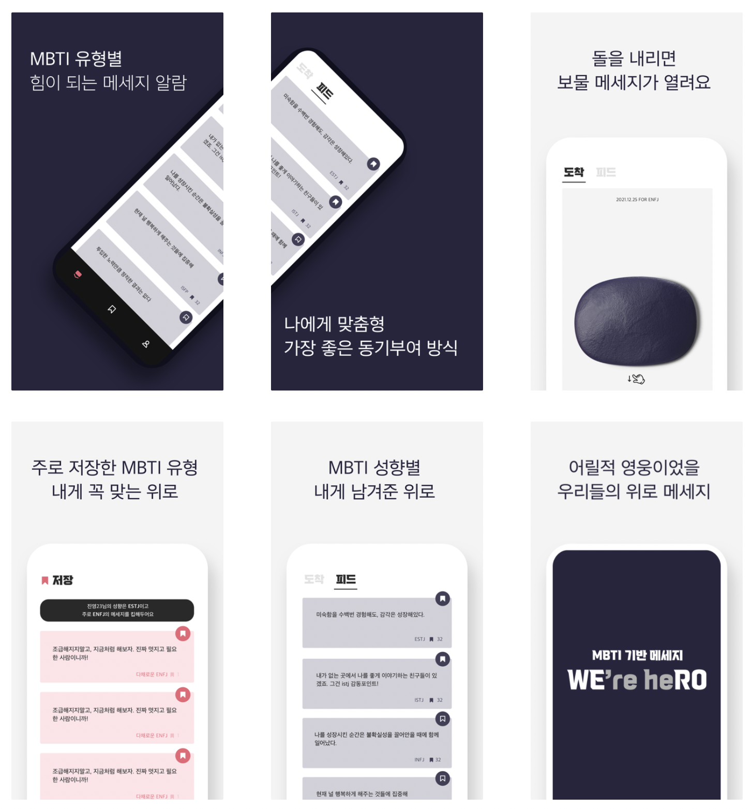
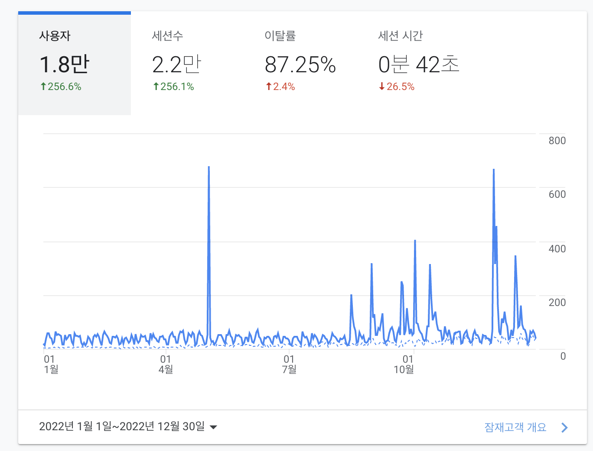
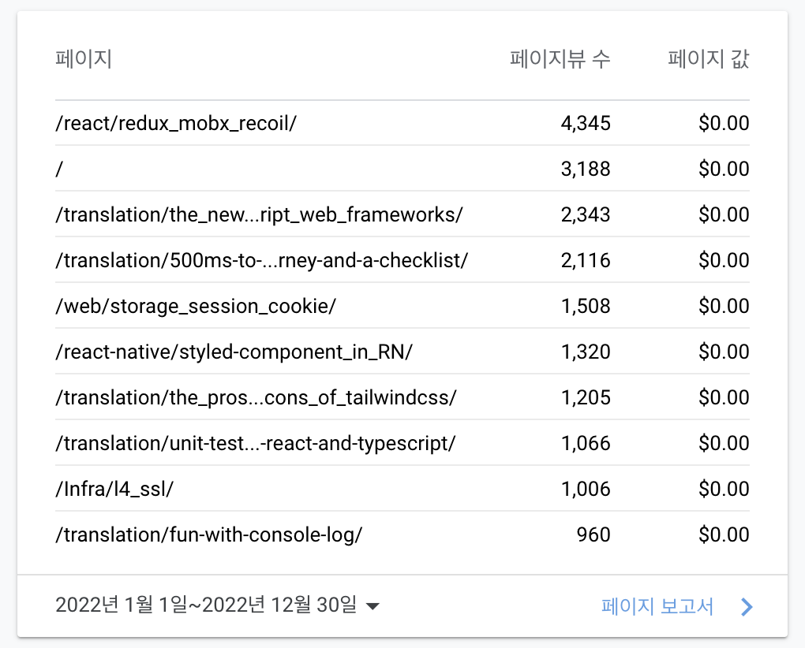

21년부터 회고를 작성하기 시작했는데, 어느덧 3년차 회고를 작성하게 되었다. 올해도 돌아보면 정말 많은 일들이 있었다.

## 일 🏬

### 이직

올 한해 너무나도 감사한 것은 서비스 기업으로 이직하여 그토록 원하던 개발을 하게 된 것이다. 이전 직장에서 지루한 운영 업무와 프로젝트 매니징에 지쳐있었는데, 많은 시행착오와 좌절을 겪었지만 그럼에도 꾸준히 노력했던 결실을 이룰 수 있어서 너무 뿌듯했다. 저번에 이직 후기에도 남겼었지만, 정말 지금까지도 내가 원하는 개발을 하고있다는 것이 믿기지 않을 때도 있다. 바로 서비스 기업으로 왔다면 이러한 느낌을 느끼지 못했을 것 같은데, 돌고돌아 간절한 마음으로 오게해주셔서 지금도 너무 감사하게 일할 수 있던 것 같다.

그리고 아직 이직한 지 반 년 밖에는 되지 않았지만(어떻게 보면 벌써 반년이나...), 지금까지 느낀 것은 이직하면서 여러가지 좋은 점과 아쉬운 점이 있지만, 결과적으로 종합해볼 때 너무 만족스럽다는 것이다. 다행히(?) 개발을 하는 건 나랑 잘 맞는다는 생각이 든다. 잘하지는 않지만, 즐겁다는 것만으로도 너무 감사할 따름이다.

### 새로운 도메인, 새로운 프로젝트

전 직장에서는 그룹웨어 관련 시스템들을 담당했기 떄문에 어떤 한 도메인을 집중적으로 파고들지 못했었다. 이직을 하면서 완전히 새로운 도메인에 적응해야 했다. 이커머스 도메인과 물류 도메인 모두 너무 생소한 도메인이었기 때문에 처음엔 대부분의 용어들이 너무 생소했다. 그리고 도메인 지식이 너무나도 부족했다. 그래서 초반에는 물류센터를 직접 방문해서 전체적인 물류의 과정들을 보면서, 어떠한 시스템이 어떤 과정들에 쓰이는지 알아가게 되었는데, 너무 좋은 경험이었다. 특히 내가 개발하는 시스템이 물류에 직접적인 영향을 끼치는 시스템이라고 생각하니 무언가 좀 더 책임감을 가지게 된 것 같다.

처음 입사했을 때는 온보딩 후에 레거시 시스템 운영을 잠시 했었는데 리액트 기반이 아니다 보니 조금은 아쉬웠지만, 그래도 처음으로 Vue를 사용해 본 좋은 경험이었던 것 같다. 그리고 새로운 기능 개발에 간접적으로 참여하면서 전체적인 물류 도메인에 대한 이해를 높일 수 있었다.

그 후에는 신규 물류센터 오픈을 위한 프로젝트에 참여하게 되었는데, 신규 프로젝트를 하는 경험이 서비스 회사라도 쉽게 할 수 있는 경험은 아니었기 때문에 너무나 좋은 경험이라는 생각이 들었다. 그리고 실제로도 시스템을 새롭게 개발하면서 주니어인 나에게는 프로젝트의 스캐폴딩부터 신규 프로젝트에 고려해야 할 여러가지들에 대해서 고민해보고 배울 수 있는 좋은 기회였다. 사이드 프로젝트에서는 쉽게 경험할 수 없는 여러가지 고민들을 하게되었는데, 이래서 실무 경험이 꼭 필요한 것 같았다.

특히 이번에 신규 프로젝트에 앞서서 아토믹 디자인을 기반으로 디자인 시스템을 자체적으로 개발했는데, 이 경험도 작은 단위의 원자들부터 유기체까지 만들어보면서 아토믹 디자인에 대해 이해하고 디자인 시스템이 어떤 건지 알아갈 수 있는 좋은 기회였다. 처음에는 개발한 것을을 실제로 사용할 수 있을까하는 생각이 들었었는데 중간 중간 계속해서 디자인 시스템을 개선해나가고 다듬어 가면서 프로젝트 전반에 디자인 시스템을 통해 개발 할 수 있는게 신기하기도 했고, 덕분에 디자인 시스템의 장점과 단점들에 대해서도 많이 배우게 되었다.

## 공부 ✍

### 구매한 책 / 읽은 책 / 강의 목록

- 모던 웹을 위한 HTML5 + CSS3 바이블
- 실전 리액트 프로그래밍
- 프로그래머의 뇌
- 구글 엔지니어는 이렇게 일한다

올해는 책은 거의 안샀다... 태블릿을 사면서 야심차게 갤탭으로 독서를 많이 하기위한 계획을 세웠었지만, 갤탭은 유튜브와 넷플릭스를 보기위한 도구로 전락해버렸다... 심지어 공부할 자료도 매우 많음에도 공부를 하지못한 것을 반성한다.

부끄럽게도 이번에는 그나마 보던 책도 끝까지 완독한 책이 없다. 개발을 하면서 마크업과 CSS에 대해서도 좀 더 알아가야겠다는 생각으로 가지고 있던 `모던 웹을 위한 HTML5 + CSS3 바이블`을 꺼내서 자기전에 조금씩 공부했다. 그리고 `실전 리액트 프로그래밍`은 유일하게 거의 완독한 책으로 이직 후 온보딩 과정으로 학습하였다. 단순 개인 학습이 아니라 온보딩 스터디로써 진행했기 때문에 그래도 많이 배웠던 것(?) 같다. 내년에는 부끄럽지 않도록 책을 많이많이 읽어야겠다...(제발...)

### KOREAN FE ARTICLE 그룹

올해 계획한 것은 아니었지만, 해외의 프런트엔드 관련 아티클을 읽고 큐레이팅하여 번역하는 그룹에 참여하게 되었다. 그룹에 들어온 후에 알게 되었지만, 생각보다 많은 사람들이 참여하고자 하는 그룹이었다. 나는 아마 인기가 많아지기 전에 틈새를 잘 공략하여 합류할 수 있지 않았나 싶다. 어찌되었던 이 그룹에 참여하면서 해외 프런트엔드 아티클들을 관심있게 보게되었고, 슬랙 채널에서 끊임없이 아티클들을 보내주기 때문에 그것들을 모두 다 읽지는 못하지만, 그래도 많은 글들에 노출될 수 있어서 이전보다 훨씬 더 여러가지 아티클들을 보게된 것 같다.

내가 스스로 번역하면서도 여러가지 프런트엔드 지식을 배우기도 하고, 번역기의 도움이 대부분이지만 번역을 하면서 영어 공부도 많이 된 것같다. 특히, 그룹에서 함께하는 여러 프런트엔드 개발자분들이 번역해주시는 글을 지속적으로 보면서 다양한 주제에 대해서 자연스럽게 보게되어서 공부도 되는게 너무 좋았고, 여러 많은 사람들의 관심사에 대해 알아가는 것, 흐름에 대해 지속적으로 알아 갈 수 있는 것이 긍정적이었다. 앞으로도 열심히 참여해보려고 한다.

## 개발 👨‍💻

올해는 많은 사이드 개발 프로젝트를 진행하지는 못했지만, 그래도 이직을 했음에도 시간을 짬짬히 내서 개발을 했다는 것에 의의를 두고 싶다. 뿐만 아니라 개발 한 프로젝트들이 아직도 실제로 서비스되고 있다는 점에서 매우 긍정적이라고 할 수 있겠다.

- 위로(WERO)
- 포레스트(Forrest)

### 위로(WERO)

Wero는 `WE're heRO`라는 의미를 가지고 있고, MBTI 기반으로 지친 일상에 각자에게 위로의 메시지를 전해주기 위한 서비스이다. 내가 기획한 서비스는 전혀 아니고, 친구가 먼저 같이 해볼 생각이 있냐고 제안했고, 그 제안을 흔쾌히 받아들여서 ios개발자 1명과 디자이너(기획자) 1명, 그리고 리액트 네이티브로 안드로이드를 개발한 나까지 셋이서 프로젝트를 진행하게 되었다.

정말 특이하게도 ios는 네이티브로 개발을 진행하였고, 나는 안드로이드 개발을 맡았지만 안드로이드 개발은 할 수 없었기 때문에, 경험이 있던 리액트 네이티브로 안드로이드 개발을 진행했다. 어떻게 보면 스택이 맞지 않았기 때문에 각자 진행할 수 밖에 없었지만, 같은 디자인을 보고 같은 기능을 다른 언어로 구현하면서 하나의 프로젝트를 다른 개발자와 함께 협업하지 않고, 처음부터 끝까지 혼자서 개발할 수 있다는 점에서 매우 의미있는 경험이었다. 물론 서로 코드 리뷰를 할 수 없다는 것이 아쉽고, 그래서 그런지 코드 품질은 많이 아쉬움이 남는 것 같다.

해당 프로젝트는 `리액트 네이티브`로 개발하고, `파이어스토어`를 DB로 사용하였고, `파이어베이스 FCM`과 `Github Action`을 통해 주기적으로 푸시 알림을 보내도록 구현하였다. (해당 과정은 [여기](https://ykss.netlify.app/github/push_noti_github_action/)에 간략히 정리했다.)

원래 2차 기능까지도 많이 생각했었는데, 1차 개발 이후 너무 많은 시간이 흘러버렸다. 그래도 아직도 2차 기능 개선에 대한 의지가 조금은 남아있기 때문에 내년에는 다시금 2차 개발을 시도해봐야겠다는 생각이 든다.

## 블로그 💻

올 한해 블로그 관점에서도 매우 의미있는 한 해였다. 작년 한 해 약 5천명의 사용자가 내 블로그에 방문했었고, 나름 우상향 곡선을 그리고 있었는데, 사실 눈에 띌만한 결과는 아니었다. 올해는 12월30일까지의 결과를 살펴보면 1.8만명의 사용자가 내 블로그에 방문했는데, 이것 또한 그렇게 많은 숫자는 아니지만 그래도 작년에 비해서 약 4배가량 증가한 결과여서 개인적으로는 너무 뿌듯했다.

방문자수가 늘 수 있던 가장 큰 비결은 KOREAN FE ARTICLE 번역에 참여하여 번역 글을 포스팅했던 것인데, 다시 한번 참여하길 정말 잘했다는 생각이 든다..!

올해도 가장 인기있는 포스트는 리액트 상태관리 라이브러리인 redux와 mobx, recoil을 비교하는 포스트였는데, 작년에 1,100뷰 정도 나왔었는데, 올해는 4,300뷰나 나왔다. 작년 7월에 작성한 포스트임에도 아직까지 유입이 많이 되는 것은 신기했지만, 한편으로는 그만큼 그 이후에 유의미한 포스팅을 하지 못했다는 것은 아쉬웠다. 그만 우려먹고 새로운 포스트를 많이 작성해야겠다는 생각을 하게되었다. 그리고 역시나 번역글들이 많은 상위 순위를 차지했는데, 내년에는 좀 더 양질의 아티클들을 큐레이팅하고 번역해서 많은 사람이 찾아볼 수 있도록 해야겠다는 생각이 든다.

그리고 현재 블로그의 경우, 여러가지로 기능이 부족한 부분들이 있는데, 태그 별로 모아볼 수 있는 기능이라던지, 포스트를 검색할 수 있는 기능이라던지, 현재 스크롤 위치를 보여주는 기능이라던지, 여러가지 기능들을 개선하는 게 하나의 목표이다.

## 운동 💪

올해는 계속 풋살, 헬스만 쭈욱 하다가 8월에 무릎 내측 측부인대가 완전 파열되는 부상을 입게 되었다. 난생 처음 크게 다쳐본 경험이라 매우 당황스럽고, 회사도 약 한 달이상 못가고 재택근무만 진행하게 되었었는데, 운동할 떄 몸을 사리지 않으면 이렇게 고생하게 되는구나....라는 경험을 제대로 했던 것 같다. 그래서 그 이후로 네 달이 넘게 풋살을 못하고 있는데, 내년에는 조심하면서 다시 시작해보려고 한다. 다친 핑계로 그 이후부터 헬스도 자주 안하고 있고, 홈트도 안하고 있는데, 내년엔 다시 빡세게 몸 관리를 해보고 싶다. 대신 항상 부상은 조심해야곘다... 진짜로..

그리고 클라이밍 같은 운동도 한번 기회가 된다면 도전해보고 싶다!

## 신앙 🙏

올해도 교회에서 청소년부 교사와, 청년부 중셀리더로 열심히 교회에서 섬겼고, 내가 노력한 것보다 더 많은 은혜를 경험하게 되었고, 결과적으로 올 한해를 돌아볼 떄 많은 기쁨과 감사를 느끼게 되었다. 그리고 그 중심에 다시하심 공동체가 있어서 말씀에서 멀어지지 않고 섬길 수 있던 것 같다. 특히 올해 말에는 여러가지로 섬김에 대한 기쁨과 감사를 느끼게 해주셨는데, 내년 한 해도 청년부 회장으로, 청소년부 교사로 섬기면서 그 기쁨과 감사를 온전히 누리면 좋겠다.

## 정리

작년 회고의 바램처럼 이번 한 해의 회고는 작년 회고보다 임팩트 있던 것 같다. 그래서 감사하다. 비록 의식의 흐름으로 주저리주저리 썼지만, 그냥 일기처럼 남겨두고 나중에 돌아봐야지라는 마음으로 굳이 다듬고 싶진 않다. 내년 한 해 회고에는 올해보다 회고에 쓸 내용이 많고 감사함이 더 많았으면 좋겠다~
