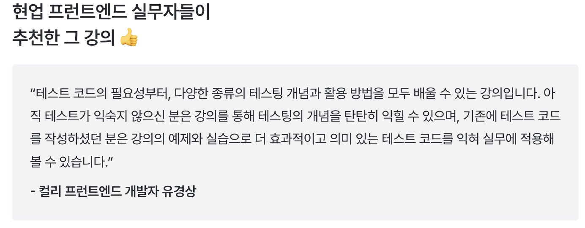
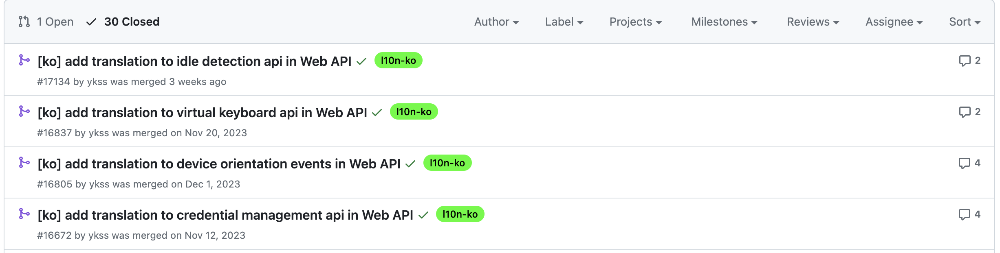
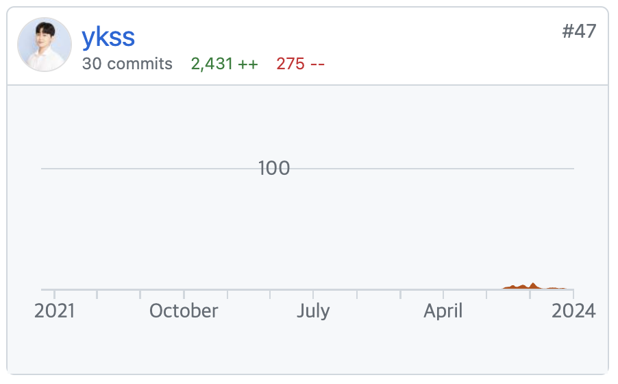
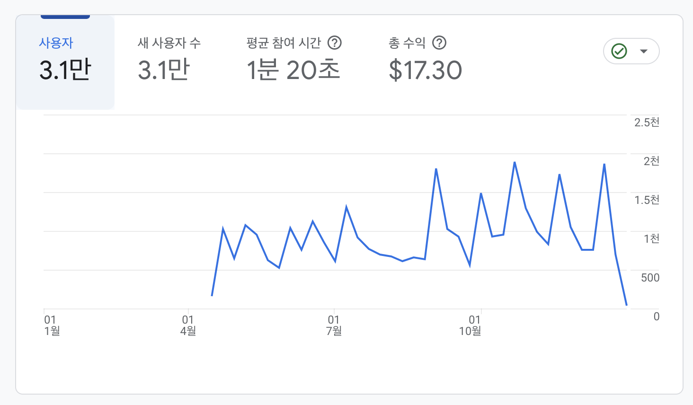
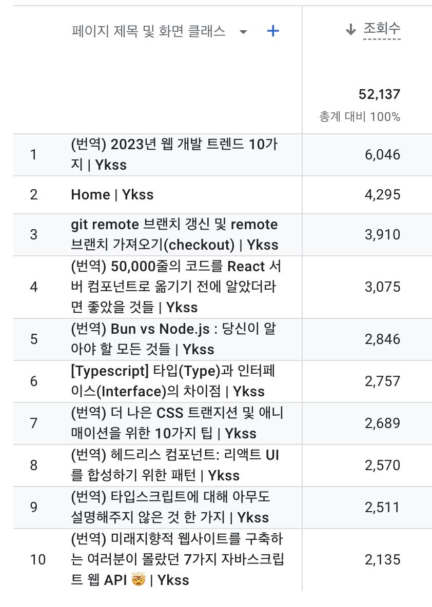
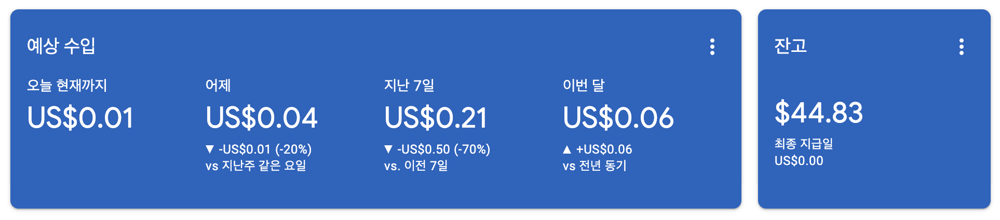

21년부터 회고를 작성하기 시작했는데, 어느덧 3년차 회고를 작성하게 되었다. 2023년을 돌아보면 '게으름', '안주'와 같은 단어들이 떠오른다. 물론 멀리서 보면 꾸준히 열심히 살았지만, 더 성실하지 못해, 더 열정을 쏟지 못해 아쉬움이 많이 남는게 사실이다. 이 회고만 해도 연말까지 완성하고자 했지만, 결국은 한 해가 지나서 올리게 되었다. 이번에도 이전과 다름없이 몇 가지 카테고리를 나눠서 회고를 진행해보려고 한다. 그리고 쓴 시점은 24년이지만, 23년이라고 생각하고 쓸 예정이다.

## 일 🏬

### 물류센터 오픈

작년부터 창원과 평택에 신규 물류센터 오픈을 위한 어플리케이션 개발을 진행했었다. 그리고 올해 상반기에는 성공적인 센터 오픈을 위해 열심히 달려왔던 것 같다. 실제로 개발한 어플리케이션을 운영에 배포하고, 두 곳의 물류센터를 오픈하는 과정을 경험했다. 내가 물류 도메인이 아니었다면, 경험해볼 수 없던 소중한 경험이라고 생각한다. 실제로 창원과 평택으로 두 번의 출장을 가면서, 얼마나 많은 인원들이 물류센터 오픈을 위해 열정을 쏟아넣는지 직접 체험할 수 있었고, 개발한 애플리케이션이 실제 비즈니스에 적용되는 뿌듯함과 큰 보람을 느낄 수 있었고, 내가 하는 일이 얼마나 중요한 일인지도 느끼게 되었다. 그리고 함께 출장을 가며, 팀원들과 한껏 더 친해질 수 있었던 부분들도 회사 생활을 지탱해나가는 데 있어 큰 도움이 되었다. 

그리고 오픈 후 모니터링 기간은 조금은 괴로웠는데, 안정화 기간이라 섣부르게 기존 코드를 개선하기는 어려웠고, 간간히 나오는 이슈 건만 처리하게 되었다. 그리고 근무 시간 이후에도 현장 상황을 모니터링 해야하는 긴장감을 계속 가지고 있어야 했다. 물류 센터에서 쓰이는 애플리케이션이라 실제 배포된 이후에는 비즈니스 임팩트가 너무 컸기 때문에, 리팩토링 작업도 쉽지 않다는 걸 배웠다. 그래서 한 가지 깨달은 것은 '이후에 리팩토링 해야지~~'는 사실상 불가능에 가깝다는 것이고, **'한 번 개발할 때, 제대로 잘 만들자!'**가 더 중요하다는 것을 느끼게 되었다. 그래서 약 한달이 넘는 기간동안, 다른 프로젝트에 쌓인 백로그들을 처리하고, 디자인 시스템에 타입스크립트 적용하는 부분 등 여러가지 작업들을 수행했는데, 돌아보면 일을 스스로 찾아서 해야 하는 경험(?)을 해보는 좋은 경험이었던 것 같기도 하다.

### 근무자 어플리케이션 개발

하반기에는 관리자들뿐만 아니라, 많은 일반 사용자들이 사용하는 근무자 어플리케이션을 개발하게 되었다. 이 프로젝트가 의미있던 것은 여러가지 이유가 있는데, 첫 번째로는 지금까지 팀에서 팔로워 입장에서 프로젝트에 참여했었다면, 이 프로젝트는 나 혼자 담당자가 되어 주도적으로 결정하고, 설계하고, 고민하고, 고민한 것들을 실제 적용시킬 수 있었다는 부분이었고, 두 번째로는 조직에서 지금까지는 내부 관리자들이 주로 이용하고, 특정 기기(PDA, Desktop) 환경에만 국한된 서비스를 개발했다면, 해당 프로젝트는 우리 조직에서 처음으로 일반 사용자들을 대상으로 다양한 기기 환경, 다양한 브라우저 환경에서 실행되는 서비스를 개발한 것이다. 그런 의미에서 처음에는 부담이 많이 되기도 했고, 챌린징한 부분도 있었지만, 결과적으로 너무 잘 해냈다는 생각이 들고 뿌듯하다.

이번 프로젝트가 좋았던 점은 아래와 같다.
1. 기존에 프로젝트를 여러 팀원이 함께 참여하다보면 각자 맡은 부분이 나뉘게 되고 자기가 작업한 부분이 아니면 코드 리뷰만으로는 팔로업하는데 한계가 있어서 아쉬움이 있었는데, 이번 프로젝트에서는 프로젝트의 구조부터 패키지 사용까지 스스로 찾아보고, 비교해보고, 더 나은 구조를 치열하게 고민하는 과정들을 오롯이 내가 경험했다는 것이다. 그 과정이 한편으론 챌린징했지만, 너무너무 값진 경험이었다고 생각한다. 
2. PWA로 개발하면서, PWA에 대해서 많이 서치하고 공부하게 되었고, PWA의 장점과 단점, 그리고 현재 PWA가 가진 한계점까지도 많이 이해할 수 있어서 좋았다. 지금은 큰 한계점들(특히 푸시 관련)을 가지고 있지만, 언젠가 앱을 어느정도 충분히 대체하지 않을까 하는 웹의 미래를 상상되기도 했다. 
3. 흔히 말하는 크로스 브라우징, 크로스 플랫폼 대응 경험을 많이 해봤다는 것이다. 처음 개발 시에는 큰 문제없이 오픈되겠는데? 하고 생각했던 건 큰 방심이었다. QA를 시작하면서 수 많은 이슈들을 만났다. iOS에서는 되는게 AOS는 안되고, 크롬 브라우저에서는 되는데, 사파리나 삼성브라우저에서는 안되기도 하는 등 다양한 조합들의 정말 많은 이슈들을 만났다. 뿐만 아니라, 다양한 기기(플립, 폴드)에 대한 고려와 가로 화면 전환 시에 대한 대응, 키패드 관련 이슈들, 링크를 통한 접속 시, 인앱 브라우저 이슈까지 매일 매일이 쉽지 않았던 QA를 겪었고, 힘겨웠지만 그 과정을 통해 정말 많이 배웠고, 정말 많이 성장했다고 생각한다. 다른 무엇보다 이러한 경험들을 (팀원들의 여러 도움은 받았지만) 혼자 대응해냈다는 것이 값진 경험이었다. 앞으로도 많은 기능들의 개선이 예정되어 있는데, 재밌어 보이는 기능들이 많아서 기대가 되기도 한다.
4. 개발하며 아이디어를 내기도하고, 기획자, 백엔드 개발자분과 더 나은 플로우와 기획에 대해서 적극적으로 소통했다. 그 결과, 기존에 고려되지 못했던 부분들을 고려하여 기획에 반영하는 경험들을 많이 하게되었다. FE 개발자로써 기획된 그대로 만드는 것 외에도 더 나은 기획과 UI를 고민하고, 플로우를 체크하며, 더 나은 플로우, 더 나은 데이터 구조, UI를 제안하고 실제로 반영해보는 좋은 경험이었다.

반면 아쉬운 점도 역시 존재한다.
1. 이슈들에 대한 문서화가 조금 부족하다는 점이 있다. 많은 이슈들을 만났고, 어떻게 해결하고, 어떤 시행착오를 겪었는지 잘 기록해두었으면 좋았을 텐데, 당시에는 여유가 없어서 문서화에 힘쓰지 못했다. 다만 이후에 이슈들을 정리했는데, 채 정리하지 못한 이슈들이 어딘가 남아있을 것 같아 아쉽다.
2. 혼자 프로젝트를 진행하다 보니, 내가 진짜 잘 개발하고 있을까? 라는 의문이 들었다. 물론, 대부분의 개발 건들이 팀원들의 코드 리뷰를 거쳤고, 빡센 QA도 무사히 거쳤지만, 프로젝트 도메인에 대해 어느정도 배경과 지식을 가지고 있어야 더 나은 코드 리뷰를 해줄 수 있을 것 같아서 그 부분에 대한 아쉬움은 조금 남는다.
3. 이번 프로젝트는 조금 러프한 기획을 가지고 시작했다. 그게 함께 일한 기획자분의 스타일이었기도 하고, 디자이너 리소스가 전혀 제공받을 수 없는 상황이기 때문에 와이어프레임 느낌의 스토리보드, 러프한 기획으로 개발을 시작했다. 오히려 구체적이지 않으니, 개발에 자유도는 있었지만, 그 자유도가 결코 좋은 경험만은 아니었던 것 같다. 아무튼 그렇게 개발하면서 기획자분과 많은 소통을 하며 진행했는데, 문제는 기존 기획 사항과 스토리 보드가 실제 개발한 앱과 싱크가 맞지 않았다. 때문에 QA시에 QA 엔지니어분과 기획자분, 나 모두가 곤란한 상황이었다. QA 엔지니어는 기획과 스토리보드를 기준으로 테스트 시나리오를 수립했고, 실제와 기획서&스토리보드가 다른 부분이 많았기 때문에, QA 초기의 진행률이 극악이었다....ㅠㅠ 기존에 팔로워의 역할이 아닌 FE에서는 리딩을 해야하는 역할이었는데, QA 전에 싱크를 맞추지 못했던 부분이 아쉬움이 남는다.
4. 이번 프로젝트의 경우, 기존 존재하던 서비스를 신규로 개발하여 개선된 애플리케이션으로 대체하는 프로젝트였는데, 아쉬운 점은 레거시에 대한 이해가 부족했다는 것이었다. 레거시 서비스를 처음부터 끝까지 파악을 한 상태로 개발했다면 훨씬 더 수월했었을텐데, 기존 서비스의 기능들을 전부 이해하지는 못했었고, 러프한 기획으로 알지 못했던 기능들이 QA 때 이슈로 발견되는 경우도 있었다. 앞으로는 개선 프로젝트나 대체하는 프로젝트를 할 때는 기존 프로젝트에 대한 충분한 이해가 선행되어야 한다는 부분을 배웠다. 

## 활동 ✍

### 개발 학습

올해는 새 책을 한 권도 구매하지 않았다. 원래 공부를 위한 책을 구입하는데는 돈을 아끼지 말아야 하는데, 돈이 아까워서가 아닌, 내가 읽지 않을 것을 너무 잘 알기 때문에 못샀던 것 같다. 그만큼 개인적인 학습에는 거의 시간을 쏟지 못했다는 뜻이어서 너무 아쉽다. 

- 읽기 좋은 코드가 좋은 코드다
  - 오래 전에 샀던 책인데, 그냥 형 집에서 잘 때 마다 틈틈히 읽어서 완독했다. 내용적으로 뭐 아주 신박한게 있는 것은 아니었지만, 네이밍, 코딩 스타일 등에 대해 당연하면서도 지키지 못했던 기본기 등에 대해 돌아볼 수 있었다. 다른 것보다, 책의 제목대로 "읽기 좋은 코드가 좋은 코드"라는 것을 명심하며 개발 할 때, 조금 더 신경쓰게 되었던 것 같다.
- 이펙티브 타입스크립트(~ing)
  - 이 책은 작년에도 스터디를 통해 학습했던 책인데, 그 때는 실무에서 타입스크립트를 제대로 사용해보기 전이었기 때문에, 현재 타입스크립트로 주로 개발하는 지금 조금 다르게 받아들여지지 않을까? 하는 마음에 다시 펼치게 되었다. 아직 다시 완독하지는 못했기 때문에 내년엔 꼭 한번 더 완독해야겠다..!
- 요즘 우아한 개발(~ing)
  - '요즘 우아한 개발'은 OSSCA 활동에서 하나의 카테고리에 참여 우수상(?)으로 신청해서 받았다. 단순히 내가 생각할 때, 좋은 회사(?)들은 어떻게 일할까? 내가 일하는 환경이나 방법과 어떻게 다를까? 하는 호기심에 읽고 싶었고, 호기심보다 귀찮음이 더 커서 아직도 다 읽지 못했다. 그렇게 내용이 많지도 않은데, 얼른 읽어야겠다.
- 자바스크립트는 왜 그 모양일까?(~ing)
  - 이렇게나 끝내지 못한 책이 많다. 이 책은 예전에 기본기를 위해서 읽었던 책인데, 다시금 자바스크립트 코어에 대한 학습 필요성이 스멀스멀 느껴져서 다시 완독하고자 꺼내게 되었다. 내년엔 꼭 완독해야지... 

내년엔 기필코 가지고 있는 책들이라도 많이 읽어야겠다는 생각이 든다. 거기에 자바스크립트, 타입스크립트, 리액트 기본기를 더 학습하고, 바람직한 UI/UX에 대한 학습도 하고싶다. 그리고 후회만 남는 회고가 아닌 뿌듯한 회고를 할 수 있길 바란다.. 젭알... 

책 말고도 인프런 강의도 몇 개 학습했다. 

- [손에 익는 Next.js] 1️⃣ 공식 문서 훑어보기
  - 책과 강의를 통틀어 유일하게 내 돈을 써서 샀던 강의이다. 한동 선배님이 만드신 강의라 관심이 더 갔었는데, 원래도 Next.js를 실무에서 사용하지 않는 내 입장에서는 Next.js에 대해서 컴팩트하게 알 수 있는 좋은 강의였다. 그리고 오랜만에 강의를 보며 따라 만들어 보는 경험을 해서 기분이 새로웠다..! (내년엔 2편도 구매해야겠다..!)
- 실무에 바로 적용하는 프런트엔드 테스트 1부, 2부
  - 주변의 멋진 지인분께서 만드신 강의였고, 프런트엔드 테스트에 대해서 학습하기에 너무 좋은 강의였다. 베타 테스터로 지원해서 강의를 듣게 되었는데, 정가로 돈을 주고 사서 들어도 아깝지 않을 만큼 좋은 강의였다. 아직 2부는 완강하지 못했는데, 꼭 여러번 학습해봐야겠다. 그리고 강의에 추천사(?) 같은 것도 남겨보는 경험을 해서 신기했다.
  - 

### KOREAN FE ARTICLE 그룹

올해도 역시 **KOREAN FE ARTICLE 그룹**에서 번역을 꾸준히 진행했다. 이 활동을 하지 않았다면, 올 한 해가 더욱 무미건조 했을 것 같다. 열심히 공부하지 못했을 때마다, 그래도 번역 활동 덕분에 좋은 글들을 많이 찾아보고, 리뷰할 수 있어서 조금의 안도감(?)을 얻은 것 같다. 가능한 올라오는 모든 글을 리뷰하는 게 목표였는데, 그래도 꾸준히 리뷰를 잘하고 있는 것 같아 뿌듯하다.

다른 것보다 그룹에 속해 있는 멋진 개발자 분들이 많이 계셔서 그 분들을 보면서 꾸준히 자극을 얻을 수 있는 것도 좋고, 나도 더 열심히 해야겠다는 동기 부여가 생겨서 좋은 것 같다. 올해엔 처음으로 오프라인 회식에 참여해서 얼굴들을 뵈었는데, 이러한 네트워킹도 지속적으로 하면 좋겠다는 생각도 들었다. 앞으로도 크나 큰 이슈가 있지 않은 이상은 계속 열심히 참여해야겠다!

### 오픈소스 컨트리뷰트 아카데미

사실 개발 동아리라던가 사이드 프로젝트를 하지 못해서 아쉬운 상황에 갑자기 모집 메일을 보고 충동적으로(?) 신청했다. 신청한 동기 중 하나가 전 직장에서 대외 활동이 간절했던 시절, 지원서도 열심히 작성하고 2번이나 지원했었는데 선발되지 못해서 무언가 아쉬움이 있었다. 그래서 이번엔 그냥 한번 해볼까? 하는 생각으로 공 들이지 않고 지원헀는데 선발되었다. 역시 뭔가 힘을 빼는게 답인가 싶다..! 사실 개발 공부는 많이 못했어도 교회 섬김, 다시하심, 번역, 회사 일, 사람들 만나기 등등으로 삶은 매우 바빴던 터라, 부담이 될 것 같아서 '한국인 모두가 MDN 문서를 볼 수 있도록' 이라는 주제의 프로젝트에 참여했다. 말 그대로 웹 개발의 교과서와 같은(?) MDN 문서를 번역하는 활동이었는데, 난이도랄게 없는 활동이었지만 나름 꾸준히 번역활동에 참여했고, 총 31개의 문서 번역에 참여했고, 전체 MDN 번역 컨트리뷰터 중에서 47번째로 많은 기여를 해서 뿌듯했다. 활동을 통해서 열정있는 멘토님과 팀원들을 보고 신선한 자극도 되었고, 오픈소스 기여에 물꼬를 튼 것 같아서 앞으로도 번역을 포함한 오픈소스 기여를 꾸준히 하고싶다.

### 개발 관련👨‍💻

올해 가장 아쉬운 부분 중 하나가 사이드 프로젝트를 진행하지 못했다는 것이다. 사이드 프로젝트를 수행하지 못한 이유는 바쁘다는 핑계로, 팀원을 구하지 못한다는 핑계로, 기획과 디자인 리소스가 없어 진행하지 못한다는 핑계였다. 너무 많은 핑계들로 진행하지 못한게 후회가 된다. 사실 혼자서도 뭔가 해보려고는 했는데 역시 혼자서는 의지박약이다. 내년에는 꼭 같이 할 수 있는 팀원을 찾거나 그럴만한 환경을 만들어서 뿌듯함을 느껴봐야겠다. 이전에 개발한 프로젝트를 리팩터링하고 개선하는 것도 하나의 방법일 것 같다!

### 블로그 💻

작년에는 1.8만명의 사용자가 내 블로그에 방문했는데, 올해는 3만이 조금 넘는 수치로 증가했다. 엄청 많이 증가하진 못한 것 같다. 다만, 중간에 구글 애널리틱스가 GA4로 이전되면서, 어느정도의 데이터가 누락되어 집계된 부분이 있는 것으로 추측(?)된다.

KOREAN FE ARTICLE 번역 활동이 없었다면 이 정도 방문자는 꿈도 못꿨을 것 같다. 올해도 역시 다시 한번 참여하길 정말 잘했다는 생각이 든다..! 사실 개인적으로 포스팅하고 싶은 글들이 너무 많았는데, 짬내서 글 쓰지 못한 내 탓이다... 내년에는 꼭 글 쓰려고 했던 내용들을 시간내서 포스팅 해봐야겠다.

올해 가장 인기있는 포스트는 2023년 웹 개발 트렌드 10가지였다. 해당 글 포스팅 후 하루 방문자가 6,500명이 될 정도로 나름 인기 있었다. 단순 메일링 뿐만 아니라, GeekNews에도 소개되어서 많은 사람들이 방문했던 것 같다. GeekNews에 내 번역 글이 선정되면 뭔가 좋은 글을 번역한 것 같아서 뿌듯한데, 생각보다 쉽지 않다. 내년에도 좋은 글들을 많이 포스팅 해봐야겠다.

부정적인 시각이 있을 수도 있지만, 호기심에 블로그에 최소한의 구글 에드센스를 붙혔는데, 어떤 로직인지는 모르겠지만 매우 조금씩 쌓이다가 어떤 달에는 10달러씩도 쌓여서 어느새 약 44달러 정도가 모였다. 나중에 100달러가 모여야 현금으로 받을 수 있는데, 언젠간 모이겠지 하는 생각으로 기다려봐야겠다!

### 멘토링

예전에 대학 재학 시절부터 선배들로부터 많은 도움과 애정들을 받았기 때문에 항상 후배들에게 도움이 되고자하는 마음이 있었다. 근데 나도 대학 시절에 만난 여느 선배들과 같이 후배들이 먼저 도움을 요청하지 않으면, 먼저 도움을 줄 수 없기 때문에, 그 마음만 가지고 있던 것 같다. 그러다 올해 7월 쯤 후배로 부터 연락이 와서 파드라는 동아리 숏커톤의 멘토링을 짧게 진행했는데, 그 연이 이어져 12월 롱커톤 멘토링까지 진행했다. 파드는 Pay It Forward의 약자인데, 내가, 그리고 한동이 지향하는 삶의 모습이었기 때문에 기꺼이 시간을 낼 수 있었다. 그리고 10월에는 학교 커리어 페스티벌 행사의 멘토로 학교에 방문하여 약 4시간 동안 후배들을 만나 여러가지 조언을 해주는 시간을 가졌는데, 이 활동들에 참여하면서 너무 뿌듯했던 것 같다.

이러한 멘토링에 참여하면서 느낀 것들이 꽤나 많다. 멘토링 중에 내 부족함들에 대해서 많이 느끼면서, 긍정적인 자극을 받기도 했고, 한편으로는 내가 선배들로부터 받았던 도움을 조금이나마 후배들에게 흘려보낼 수 있어 뿌듯하기도 했다. 그리고 무엇보다 후배들이 가진 꿈과 열정을 느끼면서, 잠시 잊었던 나의 열정의 불씨가 되살아난 것 같다. 문득 예전에 미국에서 선배님들이 후배를 만나면 잃어버린 열정, 한동의 가치들을 되찾는 느낌이라고 하셨는데, 나도 비슷한 느낌을 느껴 신기했다. 그리고 또 열정 가득하고 열심 가득한 후배들의 모습이 대견스러웠다. 이번 멘토링도 생각보다 시간도 많이쓰고, 신경 쓰이는 부분들도 있었지만, 앞으로도 가능하면 멘토링 활동은 어떠한 형태든 해나가고 싶다!

## 독서

올해는 호기롭게 월 1권 책 읽기라는 목표를 세웠었는데, 보란듯이 실패했다. 상반기에는 나름 잘 지키고 있었는데, 어느 순간 책과 멀어지니 엄두조차 안나게 되어버렸다...ㅠㅠ 그래도 노션에 읽은 책을 기록하고, 정리하길 시작했는데 이건 내년에도 쭉 해야겠다. 올해 채 읽지 못한 책과 더불어 읽고 싶었던 책들을 많이 읽도록 노력해야겠다. (1년 8권 목표!!) 

### 올해 읽은 책들
- 나의 데스티니 찾기
- 데스티니 : 하나님의 계획
- 결혼을 말하다
- 팀 켈러의 자유
- 돈, 섹스, 권력 (ing)
- 팀 켈러의 일과 영성 (ing)

## 운동 💪

작년에 무릎 측부 인대 파열로 거의 반 년간 하지 못했던 풋살을 연초에 복귀했다. 다행히 생각보다 무릎 다쳤던 것이 풋살하는 것에는 큰 무리가 없었다. 물론, 더 조심하게 되었고 무릎 보호대가 없이는 불안함이 들긴했다. 그래서 쭈욱 열심히 풋살을 했지만, 연말에는 거의 풋살을 못해서 너무 아쉬웠다. 이제 친구들이 결혼도 하고, 바빠지다 보니 10명 모이기도 쉽지 않은 것 같다. 내년에는 다시 꼭 자주 모여 꾸준히 풋살을 할 수 있길 바란다.

집이 이사를 가면서 삶의 패턴이 많이 바뀌어서, 거의 헬스를 하지 못했다. 그래도 평균 주 2~3회 하던 운동을 하지 못하니 너무 아쉬웠다. 아마도 근육량이 무척이나 줄어든 것 같다. 시간을 짬내서라도 운동을 가거나, 홈트라도 열심히 해야겠다.

그래도 여름에는 집에서 탁구도 좀 치고, 클라이밍도 한번 체험해보았는데, 다른 운동에 대한 가능성(?)을 좀 본 것 같다. 내년에는 다시 꾸준히 운동을 할 수 있도록 헬스를 등록하던지 하는 루틴을 만들어야겠다는 생각을 했다. 내년엔 테니스도 한번 꼭 체험해보고 싶다. 

## 여행 ✈️

올해는 길게 쉰 적이 별로 없었어서 여행을 많이 가지는 못했다. 그래도 10월에 멘토링 겸 학교 방문 겸 해서 1박 2일 포항을 다녀왔다. 작년에 애내기 디그리를 보러 학교에 다녀온 뒤에 약 1년만에 다시 방문했는데, 새롭게 생긴 건물들도 보고, 여전히 캠퍼스는 걸어다니기만 해도 너무너무 좋았다. 가을 단풍 무렵에 다녀와서 더 예뻤던 것 같기도 하다. 그리고 이번에는 특히 혼자 여행이 아니고 계획에 없던 **특별한 사람**과 함께 가게되어 더 뜻 깊고 기억에 남는 행복한 여행이었던 것 같다. 작년에 다녀온 코스를 거의 그대로 다녀왔는데 훨씬 특별하고 새로웠다! 그리고 랩실 교수님도 뵙고 왔는데, 너무 멋지게 **"why not change the world"**를 실천하고 계신 것을 보고, 일만 열심히 하다가 잊어버렸었던 한동의 가치와 사명에 대해서 되돌아보게 된 큰 자극이었다.  

12월에는 5일 휴가를 써서 4박 5일 베트남 여행을 부모님과 함께 다녀왔는데, 지금까지 항상 유럽, 미국, 중국, 일본 등 나라만 다녀봤다 보니 물가가 싼 곳을 여행해본 적이 없었다. 그래서 동남아 휴양지에 가보는게 버킷리스트 중 하나였는데, 드디어 가보게 되었다. 거기다 가족과 해외 여행을 가보는 것도 하나의 버킷리스트였는데, 이번 여행을 통해 두 가지 버킷리스트를 한번에 해결 할 수 있었다. 다낭, 호이안에 대해서는 너무 다 좋았기 때문에, 좋은 걸 하나하나 다 말할 수는 없을 것 같고, 적은 돈으로 값진 대우를 받을 수 있다는 게 행복했다. 맛있는 음식들, 친절한 사람들, 좋은 숙소, 1일 1마사지까지 완벽했다. 이번 여행을 통해서 내가 파워 J인 걸 다시 한번 느꼈다. 항공권, 숙박, 식당, 환전, 쇼핑까지 세세하게 다 계획한건 아니었지만, 내 스스로의 DB에 저장해놔서 차질없이 여행을 특별한 어려움 없이 마칠 수 있었다. 무엇보다 부모님을 모시고 4박 5일간 행복한 시간을 보냈음이 감사하다. 

## 신앙 🙏

23년 한 해에 신앙적으로는 많이 성장한 것 같다. 교회에서도 회장으로 섬기고, 청소년부 교사로 섬겼는데 수련회 및 여러 행사들을 준비하면서 분주함은 있었지만, 확실히 전보다 더 감사하고 기쁜 마음으로 섬겼던 것 같다. 물론, 더 잘할 수 있지않았을까? 하는 생각은 들지만, 그래도 잘하는 것보다 내 자리에서 꾸준히 섬길 수 있음에 감사하게 생각한다. 

내년에는 드디어 임원을 내려놓고 리더로 복귀를 하게 되었는데 마음을 다해 셀을 섬겨 볼 예정이다. 그리고 새로 맞게된 회계의 역할을 통해 또 새로운 것들을 경험해보면서 청소년부에서도 열심히 섬기고 싶다. 예전에는 뭔가 맡는게 더 부담스럽고, 싫기도 하고, 반발심(?) 같은 것들이 들었는데 기꺼이 섬기는 마음을 주심도 감사한다.

올해도 꾸준히 다시하심을 하고 하심 여름 수련회도 참석했는데, 역시나 하심 덕분에 더 영적으로 건강한 삶을 살 수 있었던 것 같다. 연말로 갈수록 아쉬운 부분들은 많았지만, 내년에는 새로운 마음으로 다시금 다시하심 공동체를 위해 기도하고 자리를 지키고, 공동체의 확장을 위해 노력해야겠다. 

그리고 올 한해는 오래간 기도해왔던 기도 제목에 대한 응답을 주심에 너무 감사했다. 삶의 많은 부분을 나눌 수 있는 사람을 만나게 하신 것은 너무 큰 은혜인 것 같다. 주신 응답을 더 소중히 여기고 은혜를 잊지 말아야 겠다. 또 연말에 겨우 성경 1독을 성공했는데(드디어), 내년에도 역시 최소 1독은 해야겠다. 그리고 맡겨주신 동역자와 더 많은 깊은 신앙적인 교제를 하는 한 해가 되었으면 좋겠다. 그리고 아직도 여전히 걱정이 많은 난데, 모든 것을 온전히 맡겨드릴 수 있기를 바란다.

## 정리

올해의 삶을 회고해보면서 우여곡절도 있었고, 아쉬움이 남는 부분들도 꽤 있던 것 같다! 하지만 2023년을 전체적으로 돌아봤을 땐, 더 행복한 일들이 많고, 연말이 다가올수록 더 행복함을 느끼고 많이 웃을 수 있었던 것 같다. 항상 느끼지만 매 해 회고를 통해 한 해를 돌아보는 건 참 의미있다. 아쉬운 점에 대해서는 셀프 피드백이 되고, 행복했던 일들을 돌아보면선 다시금 주변 사람들에게 감사하게 되고, 또 하나님께서 인도하심을 느끼게 된다. 내년 한 해엔 커리어 적으로도 더 유의미한 결과와 성장을 이루어내고, 좀 더 열정을 쏟을 수 있으면 좋겠고, 사랑하는 사람들과 행복한 시간을 많이 보내고, 책도 많이 읽고, 여행도 가고, 꾸준히 운동도 하고, 앞으로의 삶에 대한 더 행복한 밑그림을 그리는 한 해가 되었으면 좋겠다.