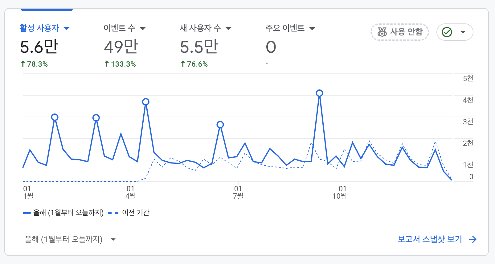
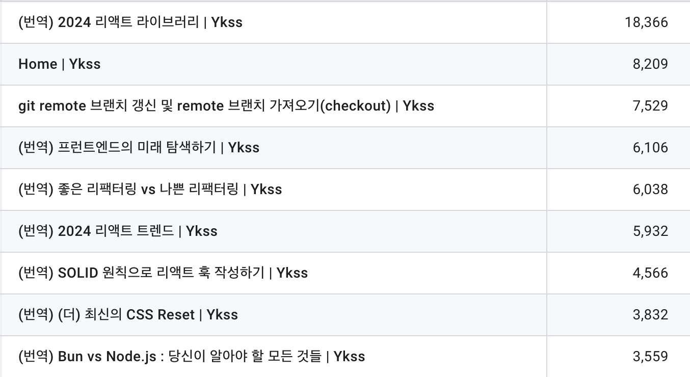
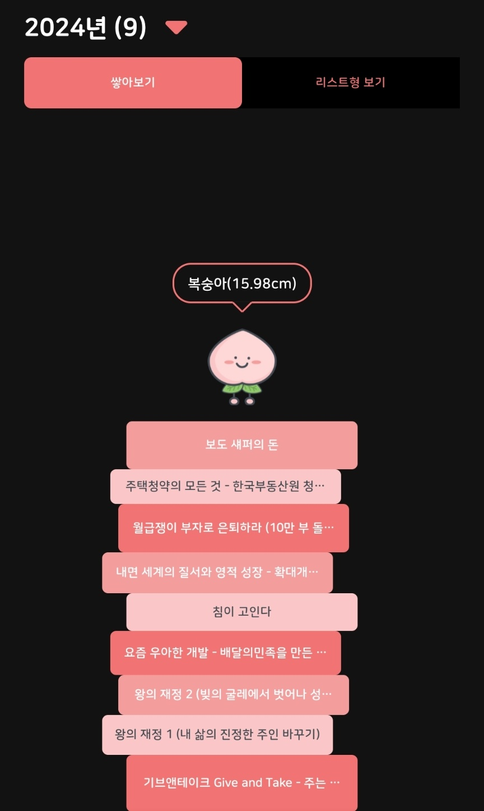

한 해를 돌아보기 위해 올해도 회고를 작성하게 되었다. 벌써 이번이 네 번째 회고이다. 작년 회고에서 작년을 단어로 표현했을 때, '게으름'과 '안주'라는 표현을 했었다. 그 회고가 효과가 있었는지 올 한 해는 '게으름'과 '안주'에서 벗어나, **'도전'의 한 해**였다고 생각한다.

먼저 짧게 한 해를 돌아보자면, 상반기에는 이직에 대한 도전과 이직 후 환경의 변화가 맞물리면서, 치열하게 도전하고, 좌절하기도 하고, 그 과정에서 불안함과 열등감 같은 감정의 소용돌이가 휘몰아쳤던 것 같다. 하지만 그 속에서 많은 것을 배울 수 있던 상반기였다. 반면 하반기에는 불안정했던 모든 것들을 안정화하고 새로운 직장과 환경에서 적응하는 시기였다. 상반기에 많이 흔들렸던 게 무색할 만큼 지금은 변화된 환경에 모두 감사하고 잘 적응하고 있다고 생각한다.

이제 이전의 회고와 같이 몇 가지 카테고리로 나눠 회고를 진행해 보려고 한다.

## 일 🏬

먼저 상반기(1월 ~ 4월)에는 이직 전 이전 직장에서 일들을 회고하려고 한다. (사실 벌써 기억에서 많이 흐려져간다...!)

### 컬리로 (작업자 근무 관리 애플리케이션)

작년에 이어 쭉 컬리로를 개선하는 작업을 진행했다. PWA로 오픈한 이후, 사용량을 올리기 위해 PWA 앱 설치를 유도하는 배너 추가 작업과 근무자가 근무 이력을 확인할 수 있도록 하는 캘린더 기능, 신규 작업자의 교육 필요 여부를 체크해서 알려주는 작업을 진행했었다. 기능들 자체가 구현이 까다롭거나 그랬던 건 아니었지만, 안 해본 부분을 개발해 보는 경험이라 좋았고, 무엇보다 비즈니스의 필요에 의해 기능을 빠르게 추가하고, 추가된 기능을 통해 비즈니스에 바로 적용된다는 흐름을 느끼며 일할 수 있어서 그 부분이 좋았던 것 같다.

그리고 오픈 이후에는 그동안은 진행하지 못했던 최적화나 리팩토링 작업을 진행할 수 있어서 좋았다. 피킹 애플리케이션의 경우, 비즈니스 임팩트가 더 컸기 때문에 리팩토링이나 개선에는 조금은 더 보수적으로 접근했었는데, 혼자 하는 프로젝트이고 비즈니스 임팩트가 적은 프로젝트여서 이미지 최적화나 회원가입/로그인 폼 개선 등 리팩토링 작업을 실제로 적용할 수 있어 좋았다.

### 바코드 유효성 체커

물류센터에 입고 전 잘못된 바코드로 인해 입고가 불가하여 회송되는 이슈들을 선제적으로 해결하기 위해 입고사에서 사용할 바코드 유효성 체커를 웹으로 만들었다. 사실 해당 기능의 경우, 휴대전화 카메라로 바코드를 인식해야 하므로 인식에 대한 정확도를 높이기 위해서는 네이티브로 개발하는 것이 제일 적합할 수는 있지만, 웹의 접근성이 더 뛰어나다는 점과 네이티브 리소스가 부족하다는 점, 그리고 빠르게 만들고 도입해야 했다는 점에서 웹 PWA로 구현하게 되었다. 아마도 거의 2주 사이에 개발 시작부터 배포까지 진행했던 것 같은데, 짧지만, 실제 현장에서 발생하는 비효율을 줄이는 데 도움이 되었다는 피드백을 받을 수 있어서 좋았다.

### PWA -> 네이티브 + 웹뷰 전환

PWA였던 컬리로 애플리케이션을 네이티브와 웹뷰 조합의 앱으로 전환하는 작업을 진행했다. 앱으로 전환하게 된 가장 큰 이유는 네이티브 기능의 필요성이었다. QR 코드를 통해 출/퇴근 하거나 위치정보를 통해 셔틀을 탑승하고, 사용자 서명을 받는 등 이후에 추가될 기능들이 네이티브로 기능 구현이 필요한 부분이 많이 존재했다. 그렇기 때문에 PWA에서 앱으로 전환하게 되었다.

이 작업이 유의미했던 부분은 그동안의 앱은 정말 껍데기만 앱이고 전부 웹뷰인 프로젝트만 해봤었기 때문에 사실 앱과 웹 간에 통신이 필요한 부분이 거의없었다. 하지만 이번엔 웹뷰와 앱 화면이 빈번하게 전환하면서 앱과 웹 간 데이터 교환이 필요한 부분들이 많았어서 그 부분에 대해서 브릿지 방식을 처음 경험해 보며 많이 배우고 재미있게 개발했던 경험이었다. 특히 앱 개발자분들도 웹뷰 개발이 익숙지 않으셔서 함께 브릿지를 정의하고 구현하고 함께 테스트하는 과정이 나름 즐거웠던 것 같아 기억에 많이 남았다. (지금 생각하면 정말 어설프게 작업 되었던 것 같다..!) 아무튼 앱 배포를 내가 함께하진 못했지만, 배포 버튼만 누르면 되기 전까지 작업을 잘 마무리할 수 있어 뿌듯했다.

### 이직에 대한 결정과 퇴사 준비

사실 퇴사를 준비하면서 정신이 없어서 소회를 기록해 놓지는 못했다. 컬리를 떠나기 제일 아쉬웠던 점을 생각해 보면 함께 일한 팀원들과 헤어진다는 아쉬움이 있었고, 그래도 애정이 생겼던 프로젝트에 대해서 앞으로 할 작업이 많은데, 직접 개발하지 못하고 떠나는 게 아쉬웠던 것 같다. 그럼에도 아쉬움을 뒤로하고 새로운 도전을 하기로 결정했고 팀원들과 식사도 같이 하고 그간 못했던 대화도 하며 잘 마무리했던 것 같다. 하지만 정말 떠날 때 느낀 것은 회사에서는 아싸여서 진짜 같이 일한 분들 말고는 사실 소식을 전하기도 애매하다고 느꼈는데, 앞으로는 좀 더 회사 내 네트워킹에도 소홀히 하지 말아야겠다는 생각도 조금 들었다. 이직에 대한 자세한 이야기는 [이 글](https://ykss.netlify.app/essay/review_kurly/)에서 확인할 수 있다.

### 자율주행 버스 및 임직원 셔틀 애플리케이션

입사하자마자 했던 작업이 임직원 셔틀 작업이었다. 당시 입사한 회사가 본사를 이전하면서 임직원 셔틀이 꼭 필요해진 상황이었는데, 임직원들이 앱을 통해 셔틀의 위치와 시간표를 확인하고 편리하게 이용할 수 있도록 기능을 추가하는 작업을 했다. 입사한 지 얼마 되지 않아 빠르게 기능 개발을 진행하였는데, 이를 계기로 더 빠르게 적응할 수 있었던 것 같아 좋았다. 그 이후에는 어드민에 예약 관련 기능 및 운영 스케줄 관리하는 기능 개발 작업도 하였는데, 그 이후에는 서비스가 종료되고 팀이 변경되며 더 이상의 개선을 진행하지는 못했다.

### 충전소 애플리케이션

이 프로젝트도 매우 스피디하게 진행되었는데, 네이티브 앱 + 웹뷰 스택으로 진행하였다. next.js + tailwind CSS + react query + turborepo 등 그동안 이전 직장에서는 경험해 보지 못했던 나름 최신의 스택들을 실무 프로젝트에서 개발할 수 있다는 것이 매우 즐겁고 행복했다. 그리고 배포에 대한 데드라인이 빠르게 정해지면서 기획, 디자인, 개발할 것 없이 정말 빠른 속도로 몰입감 있게 진행되어 너무 좋았고, 함께 협업한 FE 개발자분들로부터 배울 수 있는 부분도 많아 정말 인상 깊었던 경험이었다. 특히 지도 기반 애플리케이션이라 맵을 다루는 경험이나 브릿지 통신을 좀 더 이전에 경험했던 것보다는 딥하고 우아하게(?) 할 수 있다는 부분들에서도 많이 배울 수 있었다. 결과적으로 이 프로젝트는 오픈을 하지는 못했지만, 개인적으로는 오픈하고 계속 개선했었으면 더 많이 배울 수 있는 프로젝트가 아니었을까 싶다.

### 개발자 콘솔

앞의 프로젝트가 사라지고 붕 뜬 시기에 기획, 디자인 없이 개발자의 편의성을 위한 특정 서비스에 대한 개발자 어드민을 만들었는데, 이 과정에서 혼자 처음부터 개발하며 회사에서 신규 프로젝트를 개발하고 배포하는 데까지 필요한 모든 과정을 경험해 볼 수 있어서 좋았다. 특히 CI/CD 부분에 대해서도 맨땅에 헤딩하며 Gitlab -> Docker -> ArgoCD로 이어지는 파이프라인에 대해 더 깊이 이해할 수 있었다. 그리고 이 프로젝트의 경우, Next.js를 활용해 BFF 구조로 만들었는데, BFF 구조의 필요성과 장점, 단점 등에 대해서도 공부하며 적용해 볼 수 있었던 소중한 경험들이었다.

### 차주 애플리케이션

지금까지 진행하고 있는 프로젝트의 경우도 빠른 속도로 진행했는데, keycloakify를 통해 키클록 테마를 적용하여 키클록을 통한 계정 가입과 로그인 등의 기능을 구현하는 작업과 그 외의 마이페이지에 들어가는 기능들을 작업했다. 이 프로젝트에서도 그간 사용하지 않았던 shad/cn ui를 처음 활용해 보고, 브릿지를 통한 토큰 관리 및 네이티브 통신 연동도 진행했다. 아직 현재 진행 중이긴 하지만, 디자이너 및 네이티브 개발자분들, 백엔드 개발자분들 등 다양한 분들과 즐겁게 협업하고 있는 것 같아 만족스럽다. 좀 더 구조적인 부분에서의 개선이나 최적화와 같은 부분들, 그리고 완성도에도 많은 개선을 이뤄갔으면 좋겠다.

## 활동 ✍

### 개발 학습

올해에는 개발 관련 책을 거의 읽지 못했다. 유일하게 작년에 읽다만 한 권을 읽은 게 전부였다!

- 요즘 우아한 개발
  - 우아한 형제들의 구성원들이 어떤 식으로 소통하고 개발하고 일하는지를 가볍게 알아 갈 수 있었던 책이었다.

이번에는 온라인 강의를 따로 수강하지는 않았지만, 상반기에 면접을 준비하며 공부는 어느 때보다 많이 했다는 생각이 든다. 자바스크립트와 리액트에 대해서 여러 개념을 파보았고, 그동안 너무 껍데기만 알고 있었다는 생각을 많이 하게 되었다. 면접들과 실패 경험을 통해서 어떤 부분에 대한 학습이 필요한지 더 알 수 있었고, 단순 개발에 그치지 않고 내가 사용하고 있는 기술들에 대해서 좀 더 deep dive해야겠다는 생각을 많이 했고, 이직 후에는 실무에서 새로운 스택들을 활용해 개발하면서 자연스럽게 경험해 보지 못했던 다양한 부분들에 대해서 학습할 수 있어 좋았다. 내년에는 좀 더 내가 활용하고 있는 것들에 대해 깊게 파보는 경험을 꼭 해보고 싶다.

### KOREAN FE ARTICLE 그룹

작년에 이어 올해도 역시 **KOREAN FE ARTICLE 그룹**에서 번역을 꾸준히 진행했다. 벌써 2년 넘게 이 활동에 참여하고 있다. 앞으로도 큰 사정이 없다면 이 활동을 이어가면서 새로운 기술들이나 트렌드에 대해서 접해나가면서 프런트엔드 생태계에도 긍정적인 기여를 이어 나갈 수 있으면 좋겠다.

### 글또

작년 오픈소스 컨트리뷰션 아카데미에 이어 올해도 개발 동아리라던가 사이드 프로젝트를 하지 못해서 아쉬운 상황에 갑자기 모집 메일을 보고 충동적으로(?) 신청했다. 이전부터 글또라는 그룹에 대해서는 지인 개발자 분들을 통해서 들어왔었는데, 평소 블로그에 번역 글만 올린지 오래됐던터라, 나도 다시 나의 글을 쓰기 위해서는 뭔가의 계기가 필요하다는 생각이 있었기에 신청하게 되었다. 글또에 합류해 보니 생각보다 너무나도 체계적이고 좋은 활동이었고, 정말 대단하신 분들이 많이 활동하셔서 자극이 되기도 하는 활동이라는 생각이 든다. 현재까지 글은 계속해서 쓰고 있지만, 사실 내 글에 대해 전혀 만족스럽지는 않은 것 같다. 시간에 쫓겨 쓴게 대부분이었던 것 같다. 앞으로는 평소에 일하며 문득 드는 생각들을 잘 기록해 놓고 글감으로 발전시켜야겠다는 생각이 든다. 내년에도 이 활동은 이어질 텐데 이 활동의 후반부에는 조금이라도 더 만족스러운 마음이 들었으면 좋겠다. 첫 활동이지만 마지막 기수라는 점이 매우 아쉽지만, 글쓰기에 대한 좋은 습관이 형성되면 좋겠다.

### 개발 관련👨‍💻

작년에 이어 올해도 사이드 프로젝트를 진행하지 못했다. 물론 이직이라는 핑계가 있긴 하지만, 그래도 사이드 프로젝트에 대한 생각과 필요성은 많이 느껴지고 있다. 내년에는 꼭 혼자서라도 만들고 싶었던 앱을 개발하고 앱을 출시까지 하는 게 목표이다. 디자이너가 없다면 AI를 활용해서라도 꼭 진행해 봐야겠다.

### 블로그 💻

작년에는 3만 명이 조금 넘는 사용자가 내 블로그에 방문했는데, 올해는 5.6만이 조금 넘는 수치로 증가했다. 계속해서 정체하지 않고 성장했다는 것에 의미를 두고 싶다. 물론 올해는 더 유의미한 부분이 블로그에 호기심에 붙인 에드센스가 100달러가 넘어 지급받을 수 있게 되었다. 돈을 목적으로 하는 것은 전혀 아니지만, 좀 더 재미는 느껴지는 것 같다.

올해 가장 인기 있는 포스트는 2024년 리액트 라이브러리였다. 역시나 항상 많은 사람들의 관심을 받는 글 중 하나는 그해의 트렌드를 소개하는 글이었다. 프런트엔드 생태계가 트렌드에 민감하기 때문에 자연스러운 현상이라는 생각도 든다. 특이한 건 번역 글이 아닌 git remote 브랜치 갱신에 대한 글이 뷰가 높다는 건데, 개발하다가 내가 막히거나 궁금한 부분은 다른 사람들도 똑같을 수 있다는 점을 느끼게 되었다. 앞으로 종종 이러한 글들도 올려야겠다는 생각이 든다.

그리고 개발 블로그와는 별개로 네이버 블로그에는 블챌을 계기로 일상을 기록하기 시작했는데, 나름 재미있고, 사진을 중심으로 기록하는 게 나중에 보면 재밌을 것 같아서 의미있는 경험을 해본 것 같다.

## 독서

작년 회고에 8권의 책 읽기라는 목표를 세웠었는데, 올해는 9권의 책을 완독 하는 데 성공했다. 아직도 집에 아직 읽지 못한 읽고 싶은 책들이 많은데, 내년에는 한 달에 한 권꼴인 12권의 책을 읽는 것이 목표이다. 북적북적 어플로 읽은 책을 정리해 놓는 것은 매우 재미있는데, 읽은 책에 대해서 어떻게 기록할 수 있을지에 대해서는 딱 맞는 방법을 찾지 못했다. 블로그에 서평을 올리는 것은 생각보다 복잡한 일인 것 같고, 나는 책을 읽을 때 관심 있는 구절을 사진 찍어 놓는데, 이러한 사진들을 올리면 자동으로 기록을 남겨주는 서비스가 생겼으면 좋겠다...!

### 올해 읽은 책들

- 기브앤테이크
- 왕의재정1, 왕의재정2
- 요즘 우아한 개발
- 침이 고인다
- 내면 세계의 질서와 영적 성장
- 월급쟁이 부자로 은퇴하라
- 주택청약의 모든 것
- 보도섀퍼의 돈
- 컴퓨터 밑바닥의 비밀(~ing)

## 운동 💪

올해는 운동 측면에서 볼 때 나름 유의미한 한 해라고 볼 수 있다. 이직을 하게 되면서 저녁에 시간이 생겼기 때문이다. 상반기까지는 하루에 10분이라도 홈트 하는 걸 목표로 집에서 푸시업이나 풀업을 꾸준히 했었다. 거의 한 달에 하루 쉴까 말까 하는 정도로 꾸준히 하긴 했다. 물론 대충 했는지 생각보다 그 효과는 미미했다.

이직 이후에는 호기롭게 7월부터 수영을 등록했고, 현재까지 6개월째 꾸준히 하고 있다. 수영은 언제 한번 꼭 배워야겠다 하고 생각하고 있었는데 이렇게 꾸준히 할 수 있을지는 몰랐다. 어쨌든 수영을 1도 못했던 내가 이제 자유형, 배영, 평영까지는 킥판 없이 어설프게나마 하게 되었고, 접영 발차기를 배우고 있다. 예전에 풀업을 처음 1개 했을 때의 성취감이 수영에서도 느껴져 신기했다. 겨울에 수영을 가는 게 쉽지는 않지만, 앞으로도 일단 킥판 없이 접영할 수 있을 때까지는 열심히 배울 예정이다.

그리고 회사에 헬스장이 생기며 출근할 때마다 헬스를 하는 루틴이 생겼다. 헬스를 하며 드는 생각은 홈트를 백날 열심히 해봤자 헬스장에서 한 시간 운동하는 것보다는 못하다는 것을 많이 느꼈다. 먹는 부분에 대한 조절을 잘 못해서 체중 감량은 하지 못했지만, 헬스를 꾸준히 하며 근육량은 확실히 늘고 있는 것 같아 기분이 좋고 뿌듯하다. 내년에도 꾸준히 해야겠다!

## 여행 ✈️

올해도 어쩌다 보니 해외 여행을 가게 되었다. 이직하고 사실 정신이 없어 여행 갈 겨를은 없었는데, 나중에 후회할까 봐 억지로 의무감에 짧은 대만 여행을 다녀왔다. 대만 여행은 짧지만 여행 지원금이 당첨되는 추억도 생겼고, 산와와 함께 좋은(?) 경험들도 많이 할 수 있어서 그래도 기억에 남는 여행이었다. 어찌 됐든 올해도 해외를 다녀올 수 있었음에 무한 감사하다.

대만 여행을 제외하고는 국내 여행이 있었는데, 새해를 맞아 크라 동기들과 1박2일 속초 여행을 떠났던 것이 기억에 남는다. 비록 바다는 잠깐 보고 거의 숙소에서만 머물렀지만, 오랜만에 바다를 볼 수 있어 좋았던 것 같다. 그리고 1박 여행은 아니지만 준서와 한강, 서울숲, 화담숲이나 용인 계곡 등 이곳저곳을 함께 돌아다녀서 좋았던 것 같다. 내년에는 시간을 내서 국내든 해외든 좀 더 여행을 가야겠다는 생각이 든다.

## 영어공부

올해 하반기에는 회사의 지원으로 Ringle 영어 회화를 하게 되었고, 이에 추가로 듀오링고 학습도 꾸준히 하고 있다. 평소에 영어에 대한 구체적인 계획은 없었는데, 언제든 잘하고 싶다는 생각은 있었기에 기회가 닿는 한 내년에도 꾸준히 공부하여 언젠간 편하게 영어로 대화할 수 있는 날이 온다면 좋겠다.

## 신앙 🙏

> 내 평생에 선하심과 인자하심이 반드시 나를 따르리니 내가 여호와의 집에 영원히 살리로다 (시편23:6)

24년 내게 주신 말씀이었는데, 올 한 해를 돌아보면 말씀대로 격동의 상반기를 지나면서도 선하심과 인자하심을 체험했던 한 해라는 생각이 든다. 내년에도 올해와 같이 여전히 교사와 리더로 섬기게 되었는데, 한 해가 지날수록 섬김에 대해 기쁜 마음으로 받아들여지는 것 같아 감사하다. 그리고 올 한 해 리더로 섬기며 셀에서도 좋은 셀원들을 만나 풍성하게 교제할 수 있었고 올해도 성경을 1 독할 수 있었는데, 내년에도 함께 동역하며 말씀도 같이 읽어가며 값진 한 해가 되기를 기도하고, 내가 받은 사랑을 더 전하는 내년이 되기를 소망한다.

그리고 맡겨주신 동역자들과 더 많은 깊은 신앙적인 교제를 하고 주님과 더욱더 친밀한 관계를 맺는 한 해가 되길 바란다.

## 정리

일단 작년에는 아쉬움이 많이 남는 한 해였던 것 같은데, 올해는 작년보다는 더 나은 한 해였고, 감사한 한 해였다는 생각이 든다. 무언가 하나의 두각을 나타내는 한 해라기 보다는 두루두루 많은 부분에서 배우고 느끼고 성장한 한 해였음은 분명하다. 특히 자취하면서 생활적인 부분이나 재정적인 부분들에서 배우는 것들이 생겨 삶에 대해서 돌아보고 생각해 볼 수 있는 좋은 계기들이 많아 감사했다. 마지막으로 상황이 이렇다 보니 우리나라의 정치와 경제에 대해서도 걱정스러운 부분들이 많은데(사실 관심이 많지는 않지만), 내년 한 해는 모두들 건강하고 더 희망차고 행복한 한 해가 되길 소망한다.
