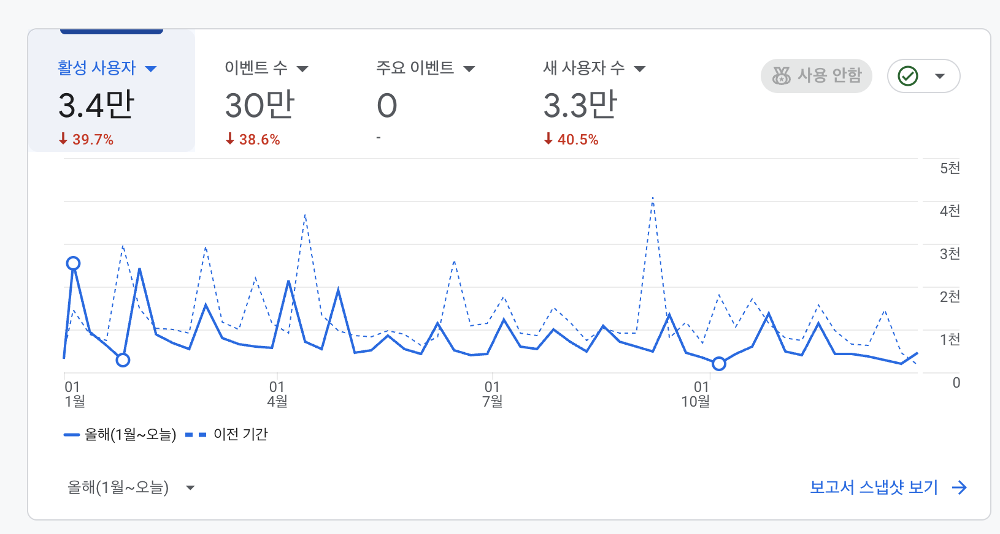
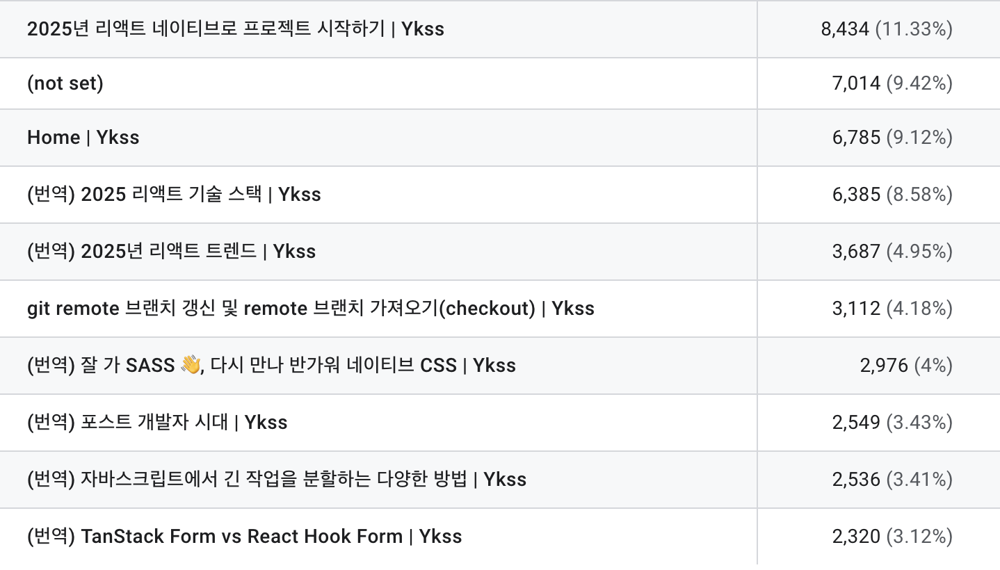
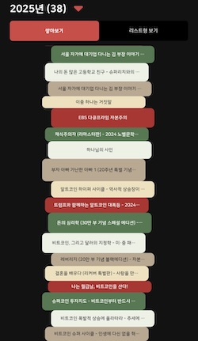
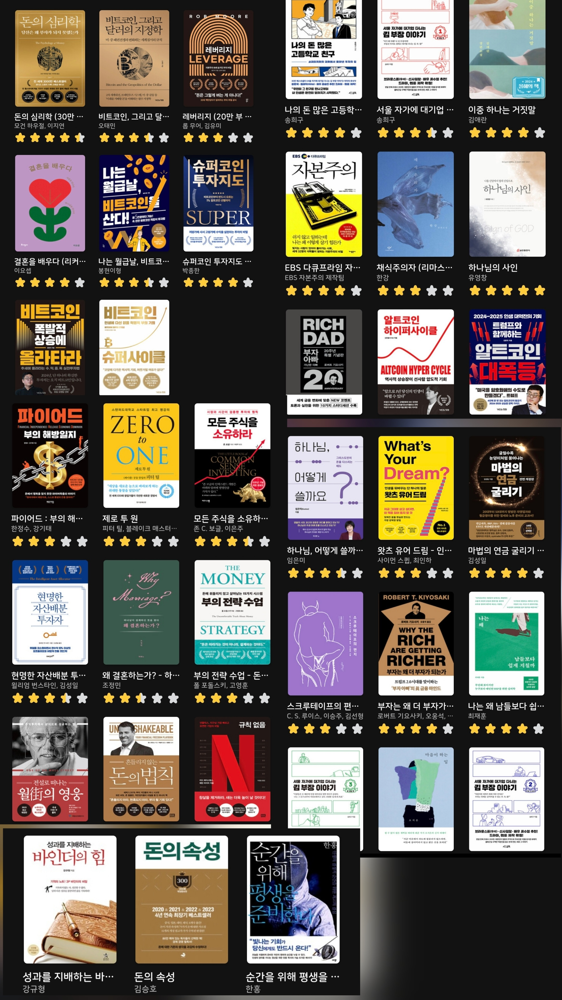

올 한 해는 나에게 잊지 못할 매우 특별한 한 해였다. 특별한 이유는 사실 일과 관련된 부분이 아니라 드디어 내년에 결혼을 하게 되었기 때문인데, 아무래도 결혼 준비에 집중하다 보니 일적으로 온전히 몰두하지 못했나 싶긴 하다.

이번 회고는 여러 가지 회고 방법 중 적용해보지 않았던 SSC(Stop, Start, Continue) 방식의 회고를 항목별로 적용하여, 올해를 회고하면서 내년에 대한 계획까지 함께 하고자 한다.

## 일 🏬

올 한 해에는 팀도 두 번이나 바뀌면서 다양한 프로젝트를 많이 수행했다. 다양한 프로젝트의 웹뷰와 어드민 신규 개발, UI 라이브러리 개발, 공통 패키지 개발 등을 경험해 보았다는 측면에서는 좋았지만, 대부분 우리 팀의 프로젝트가 아닌 타 팀의 프로젝트를 지원한 경우가 많아서 지원 업무를 수행하다가 어느 시점에서 빠지게 되는 것을 반복하니 출시까지 함께하지 못하는 점도 그렇고, 오픈 이후의 경험을 많이 쌓지 못한다는 점들이 아쉬움이 남았던 것 같다. 그래도 마지막 분기에는 (드디어) 우리 팀의 프로젝트를 신규로 개발하고 출시까지 하게 되어 좋았다.

차량제어/관리 애플리케이션 개발자 콘솔, TMS(운송관리 시스템) 차주 앱 개발, FMS(차량 관리 시스템) 운전자 앱 개발, WMS(창고 관리 시스템) 초기 개발, TAP! 셔틀 서비스 앱 웹뷰 및 어드민 개발 등의 개발을 진행했고, 그룹 내 프로젝트에 공유해서 쓸 shadcn 기반의 디자인 킷도 작업했다. 다양한 프로젝트에 참여하긴 했으나 올해는 운영은 거의 해보지 못하고, 신규 개발 후 바로 다른 프로젝트 신규 개발에 투입되어 재미있으면서도 아쉬움은 남았다.

작년 회고 시점과 비교했을 때 1년 만에 AI를 활용한 개발이 놀라울 정도의 속도로 변하고 있다고 느낀다. 때문에 멈춰서 있다면 더 빠르게 도태될 것이라는 생각도 하게 되었다. 내년에는 AI를 최대한 학습하며 모든 영역에서 적극적으로 활용해보고자 한다.

### 분사 준비

그 와중에 회사에도 큰 변화가 생겨 내가 속한 사업부의 서비스들이 자회사로 분사하게 되었고, 그냥 남아 다른 팀으로 갈지, 아니면 서비스를 따라 분사할지 결정이 필요하게 되었다. 사실 안정감을 생각하면 그냥 분사에 동의하지 않는 편이 나을 수도 있었지만, 할 일이 없는 괴로움이 생길까 봐 그래도 아직 내가 할 일이 많아 보이는 분사를 선택했다. 그리고 분사 이후에는 서비스 오픈을 하기 때문에 실질적으로 좀 더 많은 사용자가 생길 것을 기대하며 가게 된 것 같다. 아직 좋은 오피스나 근무 환경(구내식당, 헬스장, 간식 등)이 아련하지만 내년부터는 신논현의 새로운 환경에서 잘 적응해 보아야겠다. 일적인 부분에서도 분사될 회사가 훨씬 더 서비스 지향적으로 나아갈 것으로 기대되고, AI를 더 잘 활용하도록 적극적으로 지원해 줄 것으로 보여서 2026년에는 도전적인 환경에서 좀 더 도전적이고 열정적으로 성장하고 싶다.

> **Stop** : 현실에 안주하는 것. 편안함의 함정에 빠지는 것.
>
> **Start** : 업무에 AI를 최대한 효율적이고 적극적으로 활용하기(개발, 문서화, 테스팅 등). 더 깊게 이해하며 코딩하기.
>
> **Continue** : 적극적으로 소통하기.

## 활동 ✍

### 개발 학습

아티클들을 큐레이션하고 번역하고, 리뷰하면서 트렌드를 학습하려고 한 부분 외에는 사실 개발 공부에 많은 시간을 들이지 못했다. 그나마 업무와 관련된 부분에서 프로젝트를 시작하며 사용하는 라이브러리들의 문서를 필요할 때마다 학습하긴 했지만, 개발 공부라는 측면에서 따로 시간을 많이 내어하지 못한 것이 큰 아쉬움으로 남는다.

### KOREAN FE ARTICLE 그룹

올해도 **KOREAN FE ARTICLE 그룹**에서 번역을 꾸준히 진행했다. 좀 더 적극적으로 참여할 수도 있었을 것 같은데, 조금은 관성에 따라 참여했고 이전보다 리뷰도 많이 참여하지 못해서 아쉬움이 남는다. AI가 점점 더 발전하면서 아닌지 모르겠지만 번역하고 싶은 글을 찾는 것이 이전보다 더 어려워진 부분이 있는 것 같은데, 그럼에도 여전히 번역할 글을 찾는 과정과 번역하는 과정, 리뷰하는 과정을 통해서 습득되는 지식들이 많아 내년에도 꾸준히 참여할 예정이다.

### 글또

작년 말쯤 시작해서 올해 4월까지 활동했다. 사실 지속적으로 글을 쓰기 위한 습관을 들이고자 시작했고, 글 쓰기에 대한 부담을 이겨내고자 시작했는데, 정말 글또 활동의 종료와 함께 내 글쓰기도 끝나버렸다. 그래서 글또 활동 자체는 좋은 자극이 되고 좋은 경험이었지만, 글쓰기에 재미를 붙이고 체득하기엔 조금은 부족한 시간이었던 것 같다. 개발 관련 글을 못쓰는 동안 네이버 블로그에 일상 글만 열심히 써버렸다^^

### 개발 관련👨‍💻

올해 역시 사이드 프로젝트를 진행하지 못했다. 작년에는 이직이라는 핑계로, 올해는 결혼 준비라는 핑계로 진행하지 못했는데, 정말 말 그대로 핑계라고 느껴진다. 지금과 같은 AI 환경에서 그 어떤 때보다 혼자 사이드 프로젝트 진행하기 좋은 시기라고 생각한다. 내년에는 회고할 때 작은 무엇이라도 반드시 개발해 냈음을 회고하도록 할 것이다!

### 블로그 💻

블로그를 하면서 처음으로 방문자 수가 역성장했다! 작년 방문자 수가 5.6만이었으니 무려 2.2만이나 줄어들었다. 개인적인 생각으로는 이제 구글링보다 AI를 많이 활용하면서 직접적으로 페이지를 방문하는 게 줄어들지 않았을까 하는 생각이 드는데, 그러면서도 성장하는 블로그들도 있었을 테니 결국은 핑계인 것 같다. 양질의 콘텐츠를 많이 포스팅하지 못하니 당연하다는 생각도 든다. 방문자 수에 크게 의미를 두는 건 아니지만 그래도 상승세를 살리지 못한 게 약간은 아쉽다!

올해 가장 인기 있는 포스트는 2025년 리액트 네이티브로 프로젝트 시작하기 포스트였다. 항상 번역 글이 내 블로그의 1위였는데, 내가 직접 쓴 글이 1위를 차지하니 왠지 더 뿌듯한 느낌이 들었다. 앞으로도 글감을 잘 모아두고 간간히 포스팅할 수 있도록 노력해야겠다.

> **Stop** : 귀찮거나 핑계 대며 "시작"하지 않는 것.
>
> **Start** : 업무 외의 시간을 활용해 프로젝트 수행하기.
>
> **Continue** : 번역 활동 꾸준히 하고, 블로그에도 간간히 포스팅하기.

## 독서

올해 한 달에 한 권인 12권을 읽자는 목표를 세웠었는데, 무려 38권(+ 현재 거의 다 읽은 책까지 하면 39권!)이라는 고무적인 독서를 했다. 읽은 책 한 권씩 선명하게 기억나진 않지만, 책 읽는 습관을 가지면서 독서를 통해 많은 부분에서 배우고 성장했다고 느낀다. 올해는 경제 관련 서적, 재테크, 신앙서적, 문학 등 정말 다양한 책들을 읽었는데 아무래도 제일 많이 읽은 것은 재정에 대한 책이었다. 그래서 올 한 해는 재정적으로 나만의 생각이나 원칙 같은 것들이 많이 세워지게 되었고, 자산배분 등에 대해도 많이 관심을 가지게 되고 여러모로 세상을 바라보는 인사이트를 키운 한 해였다.

독서 습관에 가장 중요한 것은 도서관 근처에 사는 것이라는 생각이 들었다. 아직 내년 4월까지는 도서관 근처에 살 예정이니, 최대한 책을 가까이 두고 하루에 한 챕터라도 읽는 습관을 계속해서 유지해 나가고 싶고, 내년에도 최소 20권 이상의 독서를 하는 것이 목표이고, 자기 계발이나 경제 관련 책 외에도 인문학 서적들도 다양하게 접해보고자 하는 게 목표이다.

독서를 기록하는 것은 여전히 쉽지 않은데, 그나마 북적북적 앱을 잘 활용하고 있다. 시각적으로 책을 읽으면 쌓이는 게 보기에 뿌듯하고, 책을 읽다 기록해두고자 하는 부분은 사진을 찍으면 사진의 텍스트를 추출해 주어 메모를 남길 수 있어 좋다. 더 좋은 방식을 발견하지 않는다면 당분간은 이대로 기록하지 않을까 싶다.

> **Stop** : 돈에 치우친 책 위주로 읽는 것.
>
> **Start** : 인문고전을 포함해서 다양한 장르의 책 읽기. 어떤 식으로든 기록 남기기.
>
> **Continue** : 지금처럼 책 읽는 습관 지속하기.

## 운동 💪

올해 운동 만족도는 지금까지 중 가장 만족스러웠다. 그 이유는 꾸준히 했기 때문이다. 출근할 때는 거의 90% 이상 점심시간을 활용해 헬스를 했고, 구내식당의 건강한 식단을 먹고, 간헐적 단식을 하며 단백질 드링크를 통해 단백질도 충분히 보충했기 때문인지, 스스로 생각하기에는 눈에 띄게 발전했다는 생각이 든다. 웨딩촬영 때문이기도 했지만 체중도 최고점에서 5-6킬로 정도 감량되었다.

수영은 어느새 1년 반째 하고 있는데 상급반까지 왔다. 아마도 결혼 전(자취집을 떠나기 전)까지는 꾸준히 할 생각이다. 하러 가기는 싫지만, 막상 하러 가면 그 시간은 물속에서 잡생각 없이 온전히 수영에만 집중하는 게 머리도 비워지고 좋은 것 같다. 그리고 올해 7월쯤엔 슬럼프가 와서 정말 그만둘 뻔도 했지만, 포기하지 않고 극복해 낸 후 성취감도 많이 느끼게 되어 올해 삶에 태도적인 부분으로도 긍정적인 영향을 많이 준 것 같다.

원래 헬스나 수영을 하는 이유는 하기 싫은 일을 하는 힘을 기르기 위함이었는데, 그래도 올해는 간간히 뿌듯한 순간들도 있었던 것 같아 좋았다. 그래도 대부분의 경우에는 여전히 하기 싫다^^ 하나 아쉬운 건 거의 매주 하던 풋살을 이제 거의 분기 당 한번 하는 것 같은데, 그건 너무나도 아쉽지만 그 또한 현실이니 받아들여야 할 것 같다..

내년에는 오피스를 옮기며 회사 헬스장도 없어지고, 균형 잡힌 식단도 제공되지 않을 텐데 지금의 이 상태를 어떻게 잘 유지할지 고민해 보고 꼭 시도하고 실천해야겠다.

> **Stop** : 헬스하지 않는 날에 아예 홈트도 하지 않는 것.
>
> **Start** : 바뀐 환경에서도 운동과 식단 놓지 않기. 혹여나 수영을 그만두면 새로운 유산소 운동 찾기.
>
> **Continue** : 지금처럼 꾸준히 운동하기. 하기 싫어도 계속 하기.

## 여행 ✈️

올해는 해외로는 여행하지 못했고, 짧게 국내로 제주도, 속초, 여수&나로도 여행을 다녀왔다.

부모님을 모시고 회사 휴양소를 이용해 속초 롯데리조트 갔던 것도 기억에 남았는데, 부모님을 모시고 셋이서 여행을 다니는 게 소중한 시간이었던 것 같고 다녀오길 잘했다는 생각이 든다. 추석연휴에는 가족 모두 아버지의 교직 생활 첫 부임지였던 나로도를 갔는데, 가서 맛있는 것도 많이 먹고 가족들과 함께 즐거운 시간 보냈던 게 너무 기억에 남는다.

올해 사실 여행 가고 싶은 생각은 더 있었지만, 결혼 준비로 인해 신혼여행을 생각하며 꾹 참았던 것 같다. 내년엔 해외여행이 (이미) 예정되어 있으니 행복하게 새해를 맞이할 수 있을 것 같다!

> **Start** : 신혼여행 잘 준비하고 최대한으로 즐기기!
>
> **Continue** : 가족들과 시간을 소중히 보내기.

## 영어공부

링글 + 듀오링고 조합에서 스픽으로 변경했다. 링글 같은 경우는 시간을 내서 미리 예약하고 수업을 하는 긴장감들이나 그런 부분들이 있었는데, 스픽은 좀 더 유연하게 원하는 시간에 활용할 수 있어서 효과적으로 영어 공부를 할 수 있었다. 물론 공부량은 나 자신의 의지에 달려있기 때문에 상대적으로 많이 공부하지는 못했지만, 생각보다 AI 학습이 효과적이라는 생각이 들었고, 링글에서 피드백받는 것보다 오히려 더 다양한 표현들을 많이 알려주고 교정도 잘해줘서 좋았다. 조금 더 시간을 투자해서 복습도 꾸준히 하면 진짜 실력 향상에 크게 도움이 되지 않을까 싶다. 내년에는 좀 더 꾸준하고 열심히 해봐야겠다!

> **Stop** : 대충 형식적으로만 공부하는 것.
>
> **Start** : 2주 동안 공부한 거 하루는 복습하기. 열심히 공부한 거 신혼여행 가서 써먹기.
>
> **Continue** : 계속 스픽으로 영어 공부하기.

## 신앙 🙏

> 하나님이 세상을 이처럼 사랑하사 독생자를 주셨으니 이는 그를 믿는 자마다 멸망하지 않고 영생을 얻게 하려 하심이라 (요3:16)

2025년 내게 주신 말씀이었다. 매우 근본과도 같은 말씀이었는데, 스스로는 정말 본질적인 부분으로 다시 돌아가라라고 주신 말씀이라고 생각한다. 올 한 해 말씀 중에 하심 수련회 때 주신 여호수아 말씀이 가장 기억에 많이 남는 것 같은데, 내 삶의 길갈을 말씀에 두고, 내가 어떤 일을 하든지 항상 다시금 길갈로 돌아가야겠다는 생각이 들었다. 올해도 다시하심 공동체를 통해 계속해서 말씀에서 떠나지 않도록 붙잡아 주신 것 같고, 또 교회 청소년부와 청년부를 통해서 계속 순종하고 섬기게 하심에 감사했다.

내년에는 많은 환경적인 변화들이 있겠지만, 더 충만한 한 해가 되길 기도한다.

> **Stop** : 이만하면 충분하지 하는 생각.
>
> **Start** : 결혼 후 부부의 신앙생활 잘 세워가기.
>
> **Continue** : 섬김의 자리 끝까지 최선을 다하기. 다시하심 공동체 지속하기.

## 정리

올 한 해를 회고하며 돌아보니 아쉬움이 여러 부분에서 많이 남았던 한 해였다. 하지만 사랑하는 사람과 결혼을 결심하고 준비를 시작했다는 것 하나 만으로도 이 모든 아쉬움들을 상쇄하고도 남을 만큼 기쁘고 행복하고 감사한 한 해였다는 생각이 든다. 내년 회고를 쓸 때쯤엔 과연 어떤 느낌일지 아직 상상도 가지 않지만, 내년엔 지금보다도 더 행복하고 감사하고 후회 없는 회고를 작성하고 있길 기도해 본다!
