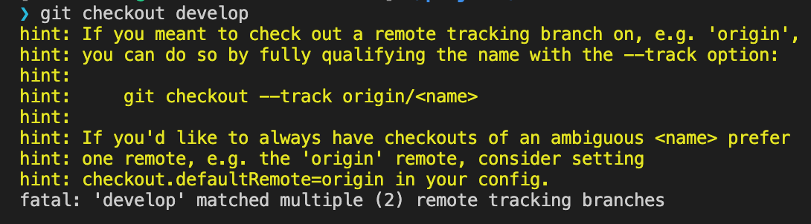

## - Case 1 (remote 브랜치 정보가 갱신되지 않았을 때)

`fatal: Cannot update paths and switch to branch 'feature/rename' at the same time.`

위와 같은 에러가 발생하는 경우는 원격의 브랜치를 찾지 못하는 경우이다. 위와 같은 경우에서는 remote 환경을 갱신해주어야 한다. (`git fetch --all` 도 같은 역할을 할 수 있을 것으로 판단된다.)

```bash
git remote update
```

해당 리포지토리에 있는 브랜치를 확인하기 위해서는 아래와 같은 방법으로 확인이 가능하다.

```bash
# 로컬에 있는 브랜치 확인

git branch

# remote에 있는 브랜치 확인

git branch -r

# 모든 브랜치 확인

git branch -a
```

## - Case2 (remote 브랜치를 가져올 수 없는 경우)

`upstream`이 있고 `origin`이 모두 존재하고 두 `remote`에 모두 `develop` 브랜치가 존재하는 환경에서 `git checkout develop` 을 하면 아래와 같은 에러가 발생한다.



`remote`(원격) 저장소의 브랜치를 가져오고 싶을 때는 `-t` 옵션과 함께 `checkout`을 사용하면 된다. 원격 브랜치의 상태를 가져와 로컬에 동일한 이름의 브랜치를 만들고 해당 브랜치로 이동해주는 역할을 한다. (브랜치 명 전에 remote 저장소 명칭도 명시해주어야 한다.)

> ex) `git checkout -t upstream/develop`

해당 원격 브랜치(upstream/develop)를 기준으로 새로운 브랜치(feature/new_branch)를 만들어 시작할 때는 아래와 같이 할 수 있다.

> ex) `git checkout -b feature/new_branch upstream/develop`

만약 `-t` 옵션을 사용하지 않고, `git checkout [remote branch]`를 할 경우, `detached HEAD` 상태의 브랜치(임시 브랜치로 추측)로 이동하여 소스 확인 및 변경은 가능하지만 변경사항들을 `commit`, `push` 할 수 없게된다.

ex) `[ykss@pc-name] ~/projects/project-web (c713bb#)`

---

출처

1. [Git remote branch 가져오기](https://cjh5414.github.io/get-git-remote-branch/
