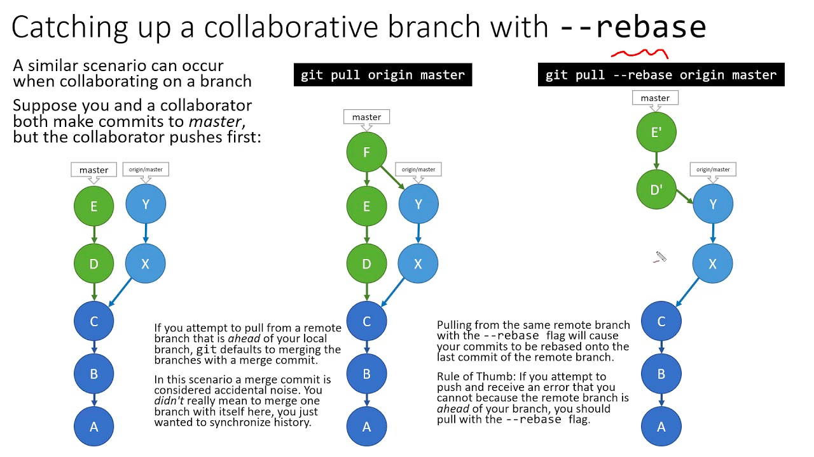
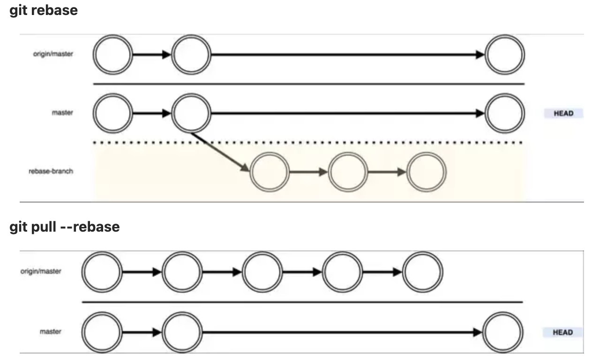

먼저 `git pull`과 `git pull --rebase`의 차이를 알아보자.

## 1. git pull

`git pull`은 원격 저장소(remote)에 있는 최신 상태를 로컬 저장소로 받아와서 병합하는 명령어이다.

- 만약 로컬 저장소의 모든 변경 사항이 이미 원격 저장소에 반영되어 있고, remote에만 최신 사항이 있는 경우에는 fast-forward 병합이 이루어진다.

- 만약 원격 저장소에 있는 소스 상태와 현재 로컬 소스의 상태가 다른 경우(로컬에서도 변경사항이 있는 경우), Merge Commit이 만들어진다. 충돌 사항이 없으면 자동 머지 커밋되고, 충돌이 있을 경우엔 직접 해결해주고 commit 해줘야 한다. Merge Commit을 하게되면 remote의 최신 커밋이 현재 로컬 브랜치에 merge된 것처럼 보인다.

- 이 방식으로 할 경우, 원격 저장소와 로컬 저장소의 커밋 이력이 모두 유지된다.

> - `git fetch`
>
> `fetch`의 경우에는 remote에서 최신 데이터가 있는지 해당 메타 데이터를 업데이는 하는 것이다. pull과의 차이는 가져온 파일에 대하여 merge를 수행하는지 여부이다. 단순히 원격 저장소의 내용을 확인만 하고 병합은 원치 않는 경우 사용한다. `(pull = fetch + merge)`

## 2. `git pull --rebase`

`--rebase` 옵션을 사용하면 Commit 이력을 한 줄로 깔끔히 관리 할 수 있다.

- 로컬 저장소에서도 변경이 생긴 경우, `--rebase` 옵션을 사용하면 remote의 Commit 이력이 로컬 저장소로 합쳐지고, 로컬 저장소의 변경 사항은 다시 반영된다. 즉, 로컬 저장소에서 변경된 커밋은 갱신되어 hash가 반영된다.

- `pull`과의 가장 큰 차이는 이력을 그대로 전부 남길지, 불필요한 이력은 정리하여 관리할 지의 차이이다.

`git pull --rebase = fetch + rebase`



## 3. git rebase

merge와 동일하게 합치는 역할을 하지만 `rebase`가 좀 더 깨끗한 히스토리를 남기는 방법이다. 일을 병렬로 진행 했어도 모든 작업이 차례대로 수행된 것처럼 보인다.

- `rebase` 하게 되면 커밋 히스토리가 보다 깔끔해진다.

- 커밋 히스토리 그래프가 선형으로 관리된다.

- 주의할 점은 `rebase` 하게되면 기존의 커밋을 그대로 사용하는 게 아니고 내용은 같지만 새로운 커밋을 만드는 것이기 때문에 그 점을 알아야 한다.

> - `git rebase -i`
>
> 과거의 커밋을 통합하거나 수정할 때 사용할 수 있다. 수행하면 아래와 같이 표시된다.

```bash
pick 9a54fd4 commit의 설명 추가
pick 0d4a808 pull의 설명을 추가

# Rebase 326fc9f..0d4a808 onto d286baa
#
# Commands:
# p, pick = use commit
# r, reword = use commit, but edit the commit message
# e, edit = use commit, but stop for amending
# s, squash = use commit, but meld into previous commit
# f, fixup = like "squash", but discard this commit's log message
# x, exec = run command (the rest of the line) using shell
#
# If you remove a line here THAT COMMIT WILL BE LOST.
# However, if you remove everything, the rebase will be aborted.
```

위의 상황에서 두 번째 줄의 pick을 s로 변경하고 저장하면 두 개의 커밋이 통합된다.



---

출처

1. [Git Rebase 제대로 알고 쓰기 (feat. cherry-pick)](https://readystory.tistory.com/151)

2. [Git 활용](https://russwest.tistory.com/22)

3. ["git pull" vs "git pull --rebase"](https://jasonspace.tistory.com/11)
