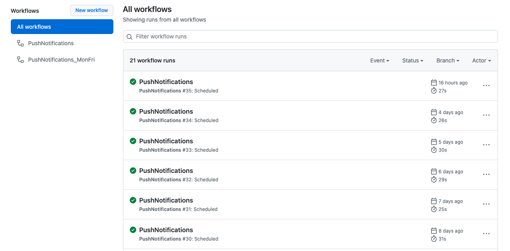

이전에 깃험 액션을 맛보기만 했었는데, 이번에 사이드 프로젝트에서 주기적으로 푸시를 보내야하는 요건이 있었다. 만약 서버가 별도로 있다면, 서버에 스케줄링을 걸어서 푸시 배치 잡을 실행하는 방법으로 했을 수 있겠지만, 이번 프로젝트의 경우 Serverless로 구글 파이어스토어를 사용하는 프로젝트였다. 그렇기 때문에 자연스럽게 파이어베이스의 클라우드 메시징을 활용하여 ios나 안드로이드 앱에 푸시를 보내는 방식이었다.

푸시 알림 메시지를 보내는 서버 코드는 이미 완성하였지만, 관건은 매일 같은 시간, 또는 요일별 다른 시간에 어떻게 푸시를 보낼 수 있을까 였는데, 거기서 깃헙액션이 떠올라 깃헙액션을 활용해 보기로 하였다.

## Github Action 코드를 통한 스케줄링의 이해

```typescript
name: PushNotifications
on:
  schedule:
    - cron: "40 23 * * 0-4"
jobs:
  build:
    runs-on: ubuntu-latest
    steps:
      - uses: actions/checkout@v2
      - name: 1. node 설치
        uses: actions/setup-node@v3.0.0
      - name: 2. 이동 및 설치, 코드실행
        run: |
            cd Wero-Server
            npm install
            node server.js
```

위 코드는 깃헙 액션의 워크플로우 `.yml` 파일이다. 사실 간단한 코드라고 볼 수 있다. 먼저 워크플로우 이름을 설정이 필요하다. 그 후에 `on`에 `schedule`항목을 추가할 수 있는데, 이것은 결국 어느 시점에 아래 `jobs`를 실행할 건지를 정해주는 작업이라고 할 수 있다. 위 코드에서는 `cron`작업을 통해 특정 시간에 아래 job을 실행하도록 했지만, 이것은 특정 시간이 될 수도 있고, commit을 push할 때마다 실행되게도 할 수 있다.

먼저 지금 코드에서 적용된 것은 `cron`인데, 이것은 리눅스 기반에서 배치잡을 스케줄링할 때 흔히 쓰이는 `crontab`을 활용한 것이다. 간단히 설명하면 `40 23 * * 0-4`로 되어있는데, 맨 앞의 40은 분을 나타낸다. 이렇게 시간을 명시해서 딱 40분에 해당 스케줄을 걸 수도 있고, `*`을 통해 매 분 마다 실행하게 할 수도 있고, `*/5`를 통해 5분마다 실행되게도 할 수 있다. 첫 번째가 분이었다면, 두 번째는 시간이다. 지금 설정되어있는걸로 보면 23시 40분으로 보이지만, 크론의 시간은 UTC 기준으로 되어있기 때문에 우리나라 기준으로 생각했을 때는 +9시간을 생각해서 계산해야 한다. 그렇기 때문에 한국시간으로 오전 8시 40분이라고 생각하면 된다. 그 뒤에 \* \*로 표시되어 있는 부분은 날짜와 달이다. 현재는 날짜와 달 상관없이 실행되도록 되어있지만, 특정 달과 일을 지정해서 실행할 수 도 있다. 맨 마지막 열이 `0-4`로 되어있는데, 이것은 요일을 말한다. `*`로 되어있으면 모든 요일이고, `0`부터 일요일에서 `6`이 토요일이다. 그래서 `0-4`는 사실상 일요일에서 목요일까지를 말한다. 하지만 한국시간으로 더하는 9시간을 고려해서 한국시간에서는 현재 평일 오전 8시 40분 마다 아래 잡이 실행된다고 볼 수 있다. 이런식으로 생각보다 간단한 설정으로 작업할 수 있다.

## 멀티 스케줄링

만약 평일에는 오전 8시 40분에 푸시 알림을 보내고, 주말에는 오후 11시 20분에 푸시알림을 보내고 싶다면, 아래와 같이 cron을 두개 걸어주면 간단하다.

```typescript
name: PushNotifications
on:
  schedule:
    - cron: "40 23 * * 0-4"
    - cron: "20 14 * * 6-7"
```

위와 같이 두 줄에 나누어 각각 크론을 걸어 주면 한 코드 실행을 다른 규칙으로도 실행가능하다.

## 결론

serverless인 경우, 깃헙액션을 잘만 쓰면 아주 유용하게 사용가능하다는 생각이 든다. 현재 프로젝트에 적용하여 아래와 같이 스케줄에 따라 깃헙액션이 실행되며 푸시알림을 보내고 있다.



---

> 참고

1. [크론탭 참고 사이트](https://crontab.guru/)
