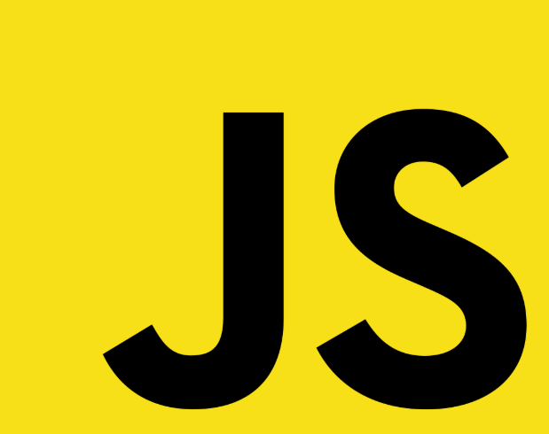

> 해당 포스트는 ES6이전의 자바스크립트를 기준으로 작성하였습니다.


#### 1. 상속

클래스를 기반으로 하는 상속은 **ES6**이후에서만 지원하고, 자바스크립트의 객체 프로토타입 체인을 통하여 상속을 구현해 낼 수 있다. 여기서 상속의 구현에는 두가지 방법이 있다. 첫번째는 클래스 기반의 전통적인 상속 방식을 모방하는 것이고, 두번째는 클래스 개념 없이 객체의 프로토타입으로 구현하는 것이다. 


##### 1) 프로토타입을 이용한 상속

```javascript
function create_object(o){
	function F() {}
	F.prototype = o;
	return new F();
}
```

위 코드는 더글라스 크락포드가 자바스크립트 객체를 상속하는 방법으로 권장한 코드이다. 이 코드를 이해하면 자바스크립트의 상속 개념을 이해한 것과 다름 없다. `create_object()`함수는 `o`라는 객체 인자를 받는 함수이고 함수 내부의 코드를 보면 `F`라는 이름의 빈 함수 객체를 만든다. 그리고 `F`함수의 프로토타입 객체에 인자로 들어온 `o`라는 객체를 연결한다.  그리고 `F`를 생성자로 하는 새로운 객체를 만들어 반환한다. 이렇게 반환된 객체는 부모 프로퍼티에 접근 할 수 있고 자신의 프로퍼티를 만드는 것 또한 가능하다. 위의 `create_object()`함수는 매번 정의할 필요 없이 `Object.create()` 함수로 사용할 수 있다. 

```javascript
var player = {
    name : "mount",
    getName : function() {
        return this.name;
    },
    setName : function(name) {
        this.name = name;
    }
};

function create_object(o){
	function F() {}
	F.prototype = o;
	return new F();
}

var mount = create_object(player);

mount.setName("mount");
console.log(mount.getName()); // (출력 값) mount
```


---


### 출처

> 1. [INSIDE JAVASCRIPT (한빛미디어, 송형주,고현준 지음)](https://book.naver.com/bookdb/book_detail.nhn?bid=7400243)
> 2. [인프런 'Javascipt 핵심 개념 알아보기 - JS Flow'](https://www.inflearn.com/course/핵심개념-javascript-flow/)


