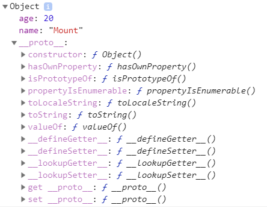

## 프로토타입


자바스크립트의 모든 객체는 자신의 부모 객체와 연결되어 있다. 뿐만 아니라 객체지향의 **상속**개념과 유사하게 부모 객체의 프로퍼티를 쓸 수 있는 특징이 있다. 이러한 부모 객체를 **'프로토타입'**이라고 한다. 

```javascript
let player = {
	name : 'Mount',
	age : 20,
};

console.log(player.toString()); //(출력 값) [object Object]

console.dir(player);
```

위의 예시 코드를 보면 `player` 객체를 생성한 이후에 `player`객체에는 없는 `toString()` 메서드를 호출하여 결과 값을 `console.log()`를 통해 출력한다. 하지만 해당 메서드가 `player`객체에는 존재하지 않음에도 에러 없이 `[object Object]`라는 결과가 출력된다. 여기서 에러가 발생하지 않고 값이 출력되는 것은 `player`객체의 프로토타입에 `toString()`이라는 메서드가 정의되어 있는 것을 **객체지향의 상속**처럼 호출했기 때문이다.


`player`객체가 어떻게 이루어져 있는지에 대해 더 살펴보기 위해 `console.dir()`을 통해 알아보자. `console.dir()`은 객체의 속성을 출력해주는 메서드이다. 




출력 결과를 살펴보면 분명 객체를 생성할 때는 `name`과 `age` 프로퍼티만 지정했음에도 `__proto__`라는 프로퍼티가 들어가있음을 확인할 수 있다. 여기 나타나있는 `__proto__`가 `player`객체의 부모 객체인 **프로토타입**이다. 해당 객체를 살펴보면 여러가지 메서드들이 정의되어 있고 그 중 `toString()`메서드도 존재한다. 그래서 프로토타입의 메서드를 참조하였기 때문에 에러없이 결과값을 출력할 수 있었다. 여기서 **객체 리터럴 방식**으로 생성된 객체는 `Object.prototype`객체가 객체의 **프로토타입**이 된다는 것을 알 수 있다. 프로토타입은 객체 생성 시에 자동으로 생성되지만, 프로토타입 객체를 **임의의 다른 객체로 변경하는 것도 가능**하다. 


---


## 배열

자바스크립트에서 배열도 객체이다. 타 언어의 배열과 기능은 같지만 배열의 크기를 따로 지정하지 않아도 되고, **배열의 어떤 위치에 어느 데이터 타입을 할당해도 문제가 없다.**

 

객체를 생성할 때, '{ }'를 통해 생성했다면, 배열은 '[ ]'를 통해 생성할 수 있다. 객체의 경우 프로퍼티 이름과 프로퍼티 값을 둘 다 표기했지만, **배열의 경우는 값만 할당**하면 된다. 그리고 할당한 배열의 접근하려면 **인덱스 값을 통해 접근**할 수 있다. 배열의 경우도 객체처럼 동적으로 값을 추가할 수 있는데, 배열에 순차적으로 값을 할당하지 않아도 되고 어느 위치에나 값을 동적으로 할당할 수 있다.

```javascript
let dayOfWeeks = ['Mon','Tue','Wed','Thu','Fri','Sat','Sun'];

console.log(dayOfWeeks[3]); //(출력 값) 'Thu'

let emptyArr = [];
console.log(emptyArr[0]); // (출력 값) undefined

//배열 요소 동적 생성
emptyArr[0] = 30;
emptyArr[3] = "FIVE";
console.log(emptyArr); // (출력 값) [30, undefined x 2, 'FIVE'];
console.log(emptyArr.length); // (출력 값) 4
```

코드의 마지막에 보이는 것처럼 배열에는 기본적으로 `length`프로퍼티가 있다. 위에 객체의 프로토타입에서 살펴본 것과 같이 '[ ]'을 통해 생성되어 배열로 인식된 객체들은 `Array`프로토타입을 가지게 되고, 해당 프로토타입내에 있는 프로퍼티와 메서드 등을 `프로토타입 체이닝`을 통해 사용할 수 있게 된다. `length`프로퍼티는 해당 배열의 길이를 나타내는 프로퍼티로 배열을 사용할 때, 유용하게 사용될 수 있다. 이밖에도 `Array`프로토타입 내에는 `slice()`,`push()`,`sort()`등 다양한 메서드와 프로퍼티가 존재한다. 


### 배열과 객체의 차이

분명 배열 또한 객체라고 말했고, 배열은 객체가 맞다. 배열에도 객체가 그랬던것처럼 프로퍼티를 동적으로 생성할 수도 수정할 수도 있다. 하지만 둘의 차이점도 존재한다. 예시 코드를 통해 살펴보자.

```javascript
//배열 생성
let playerArr = ['kante','mount','willian'];
console.log(playerArr[0]); // (결과 값) 'kante'

//객체 생성
let playerObj = {
	'0' : 'kante',
	'1' : 'mount',
	'2' : 'willian'
}
console.log(playerObj[0]); // (결과 값) 'kante'
//원래 playerObj['0']; 과 같이 호출해주는게 맞지만 자바스크립트에서 [ ]내의 숫자를 자동으로 문자열로 취급해준다.

//typeof 비교
console.log(typeof(playerArr)); // (결과 값) object
console.log(typeof(playerObj)); // (결과 값) object

//프로퍼티, 메서드
console.log(playerArr.length); // (결과 값) 3
playerArr.push('james'); // ['kante','mount','willian','james']

console.log(playerObj.length); // undefined
playerObj.push('james'); // Uncaught TypeError: playerObj.push is not a function
```

위에서 확인할 수 있는 것처럼 생성하고 읽는 것에는 큰 차이점은 없으나, 실제로 활용하는데 있어 배열의 프로퍼티와 메서드를 사용하기 위해서는 `Array` 프로토타입을 거쳐야 하는데, 배열과 객체 사이에서 `Array`프로토타입을 거치는지에 대한 유무에서 차이가 발생한다. 배열 표준 메서드는 배열을 활용하는데 있어 매우 유용한 기능이기 때문에 배열은 배열로 생성하여 사용하는 것이 바람직하다. 


자바스크립트에서는 객체임에도 `length`프로퍼티를 가진 **유사배열객체**가 있는데, 해당 객체는 객체임에도 불구하고, 표준 배열 메서드를 사용할 수 있다. 하지만 그 과정에서 `apply()`메서드를 통해 바인딩을 해주어야 한다. 이 부분에 대해서는 다음번에 다루도록 할 것이다.


### 출처

> 1. [INSIDE JAVASCRIPT (한빛미디어, 송형주,고현준 지음)](https://book.naver.com/bookdb/book_detail.nhn?bid=7400243)
> 2. [인프런 'Javascipt 핵심 개념 알아보기 - JS Flow'](https://www.inflearn.com/course/핵심개념-javascript-flow/)


