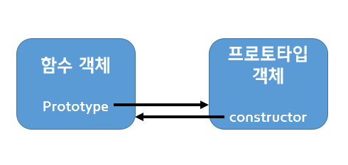

자바스크립트에서 함수는 가장 중요한 개념이라고 할 수 있다. 함수를 얼마나 이해하느냐에 따라 자바스크립트를 얼마나 잘 활용할 수 있을지에 큰 영향을 미친다. 


---


### 함수 생성

함수를 생성하는 방법은 크게 3가지가 있고 어떠한 방법으로 생성되느냐에 따라 미세한 차이가 있다. 


1.  함수선언문 & 리터럴

```javascript
function (x,y) {
	return x+y;
}

function plus(x,y) {
    return x+y;
}

console.log(plus(3,5)); // (출력 값) 8
```

함수 리터럴 방식과 함수 선언문 방식은 거의 유사하다. 두 방식 모두 함수를 생성할 때는 `function` 키워드로 시작한다. 여기서 함수리터럴 방식은 함수 생성시 함수 명이 필수가 아니다. 함수 이름없이 **익명함수**로 생성하는 것도 가능하다. 하지만 함수선언문 방식으로 함수를 생성할 때는 **반드시 함수명이 정의**되어있어야 한다. 해당 함수명으로 함수를 호출한다. 두 방식 모두 `x`,`y`는 매개변수(argument)로 다른 언어와의 차이점은 데이터 타입을 따로 지정하지 않아도 된다. 


2. 함수표현식

```javascript
let plus = function(x,y) {
    return x+y;
};

let add = plus;

console.log(plus(3,2)); // (출력 값) 5
console.log(add(4,2)); // (출력 값) 6
```

자바스크립트에서는 함수도 객체이기 때문에 함수도 또한 다른 변수에 할당하는 것이 가능하다. 이런 방식으로 함수를 만들어 어떤 변수에 할당하여 생성하는 것이 **함수표현식**이다.  함수표현식 방식에서는 함수 이름을 지정해도 되지만 보통은 따로 함수 이름을 사용하지 않는다. 여기서 `plus`는 함수 이름이 아니고 함수가 할당된 변수로 '함수 변수'라고 부른다. **익명 함수의 호출은 함수 변수에 '()'를 붙여서 가능하다.** 함수 표현식 뒤에는 ;(세미콜론)을 붙이는 게 좋다.


3. Function() 생성자 함수

자바스크립트의 함수도 `Function()`이라는 기본 내장 생성자 함수로 부터 생성되는 **객체**이다. 함수 선언문이나 표현식 방식도 내부적으로는 `Function()`생성자를 거쳐 생성되는 것이다. `Function()`생성자로도 여전히 생성가능하지만 대부분 잘 사용하지 않는다.

```javascript
new Function (arg1, arg2, ... , argN, functionBody)
//arg~ : 함수의 매개변수
//functionBody : 함수 호출 시 실행될 코드

let add = new Function('x','y','return x + y');
console.log(add(3,4)); // (출력 값) 7
```


---


### 함수호이스팅

이전에 `var`,`let`,`const`를 비교하는 포스트에서 **호이스팅**에 대해서 잠깐 다룬 적이 있다. 코드가 실행되는데 있어 **선언 -> 초기화 -> 할당**의 단계를 거치는데 **호이스팅**은 변수나 함수의 선언문을 모두 먼저 **끌올**해서 선언하는 것이다. 이것은 자바스크립트의 **변수 생성과 초기화**가 분리되어 이뤄지기 때문이다. 때문에 함수 호출을 먼저하고 나중에 함수가 선언되어 있어도 에러없이 호출이 가능하다. **하지만. 호이스팅은 함수선언문으로 함수를 선언했을 때만 적용되고, 함수 표현식으로 선언되었을 때는 적용되지 않는다. **

```javascript
// 함수선언문 방식
plus(2,5); // (출력 값) 7 

function plus(x,y) {
	return x+y;
}

plus(2,5); //(출력 값) 7
```

```javascript
// 함수표현식 방식
plus(2,5); // uncaught type error

function plus(x,y) {
	return x+y;
}

plus(2,5); (출력 값) 7
```


---


### 함수도 객체다

자바스크립트에서 함수는 함수 코드 실행 뿐만 아니라 객체이기 때문에 **프로퍼티**도 가질 수 있다. 이밖에도 함수는 객체이기 때문에 여러가지 동작이 가능하다.

* 리터럴에 의해 생성
* 변수나 배열, 또는 객체의 프로퍼티에 할당
* 함수의 인자로 전달
* 함수의 리턴값으로 리던
* 동적 프로퍼티 생성 및 할당

이렇게 쓰일 수 있기 때문에 함수는 객체이면서 **일급 객체**로 불린다. 이러한 함수의 특징으로 함수형 프로그래밍이 가능하다. 그리고 배열 객체도 배열의 기본 표준 메서드가 있던 것처럼 함수도 또한 그러한 프로퍼티가 존재한다. `name`,`caller`,`argument`,`length`등이 있는데 `name`은 함수의 이름을 나타내고 `caller`프로퍼티는 **자신을 호출한 함수**를 나타낸다. `argument`프로퍼티는 **함수를 호출할 때 전달된 인자 값**을 나타낸다. `length`프로퍼티는 **함수를 선언할 때 정의한 인자 개수**를 나타낸다. 마지막으로 `__prototype__`은 객체이기 때문에 부모인 프로토타입을 가지는 것이고 프로토타입이 무엇인지를 나타낸다. 함수 객체의 프로토타입은  `Function.prototype` 객체이고 `Empty()`함수이다. 


여기서 `Function.prototype`객체가 가지는 프로퍼티와 메서드 여러가지가 있다.

* constructor 프로퍼티
* toString() 메서드
* **apply(thisArg, argArray) 메서드**
* **call(thisArg, [, arg1 [,arg2, ]]) 메서드**
* bind(thisArg, [, arg1 [, arg2,]]) 메서드

위 메서드 중 `apply()`와 `call()`은 자주 사용되는 중요한 메서드이므로 주의깊게 살펴봐야 한다.


---


### prototype 프로퍼티

모든 함수는 `prototype`프로퍼티를 가지고 있다. 이 프로퍼티는 `__proto__`과 다른 것이기 때문에 혼동해서는 안된다.  `__proto__`는 모든 객체에 존재하고 자신의 부모 역할을 하는 프로토타입 객체를 가리킨다. 하지만 `prototype`프로퍼티는 함수 객체에 존재하는 프로퍼티이고, 이 함수가 생성자로 사용될 때 이 함수를 통해 생성된 객체의 부모 역할을 하는 프로토타입 객체를 가리킨다. `prototype`프로퍼티는 단지 `constructor`프로퍼티만 가지고 있는 하나의 객체를 가리킨다. 그리고 그 객체가 가지고 있는 `constructor`프로퍼티는 자신과 연결된 함수를 가리킨다. 결국 아래 그림처럼 서로 참조하는 관계이다.




---


### 출처

> 1. [INSIDE JAVASCRIPT (한빛미디어, 송형주,고현준 지음)](https://book.naver.com/bookdb/book_detail.nhn?bid=7400243)
> 2. [인프런 'Javascipt 핵심 개념 알아보기 - JS Flow'](https://www.inflearn.com/course/핵심개념-javascript-flow/)


