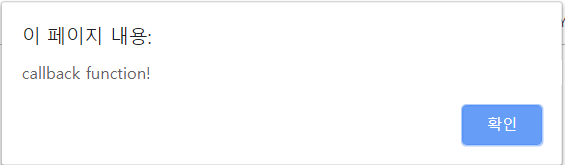

자바스크립트에서 함수는 다양한 형태를 가지고 있다.  일반적인 함수 외에 다른 함수들에 대해서 알아보자.

---


### 콜백함수 

함수 표현식에서 함수 이름은 Optional한 부분이고, 이름이 붙지않은 함수를 익명 함수라고 하는데, 익명 함수의 대표적인 쓰임은 **콜백 함수**이다. 콜백 함수는 어떤 이벤트가 발생하거나 어떤 시점에서 호출되는 함수를 말한다. 개발자가 콜백 함수를 등록해놓고, 특정 이벤트가 발생했을 때 이벤트 핸들러를 통해 콜백 함수를 호출하도록 설정해놓는 방식으로 사용된다.

```javascript
window.onload = function() {
	alert("callback function!");
};
```

위 코드는 `window.onload`라는 이벤트 핸들러를 사용했는데, 웹 페이지가 다 로딩되고 load 이벤트가 발생했을 때 뒤의 함수가 콜백 함수로 작동되는 코드이다. 코드를 적용하여 크롬에서 테스트 해보면 아래와 같은 결과를 확인할 수 있다.




---


### 즉시 실행 함수

함수를 정의하면서 바로 실행하는 함수가 **즉시 실행 함수(Immediate function)**이다. 즉시 실행 함수는 함수 리터럴을 괄호로 둘러싸고 함수 이름은 optional하다. 그리고 함수가 바로 실행될 수 있도록 `()`를 추가해주면 괄호 안의 함수에 인자를 바로 전달하고 즉시 실행 함수를 호출할 수 있다. 하지만 **즉시 실행 함수의 경우 재 호출이 불가능**하다. 그렇기 때문에 **최초에 한번만 실행하는 초기화 함수**로 쓰일 수 있다.  라이브러리 코드가 처음 로드되어 초기화 될 때, 즉시 실행 함수 패턴이 많이 쓰인다.

```javascript
(function (name) {
	console.log('Immediate function! -> + name');
})('foo');
// (출력 값) Immediate fucntion! -> foo
```


---


### 내부 함수

내부 함수는 말 그대로 함수 내부에 또 정의되어 있는 함수를 뜻한다. 내부 함수는 자바스크립트의 기능을 배가 시켜주는 **클로저를 생성**하거나 **외부에서의 접근을 막고 독립적인 함수를 구현**하는 용도로 사용된다. **내부 함수는 자신을 둘러싼 외부 함수의 변수에 접근 가능**하다. **스코프 체이닝**과 관련이 있는데, 기본적으로 함수 스코프 밖에서는 함수 스코프 안에 선언된 모든 변수나 함수에 접근이 불가능하다. 

```javascript
function player() {
	var basicSalary = 100;
	var bonus = 50;
	
	function topPlayer() {
		var bonus = 250;
		console.log(basicSalary); // (출력 값) 100 
		console.log(bonus); // (출력 값) 250
	}
	
	topPlayer();
}
player();
topPlayer(); // topPlayer is not defined
```

하지만 자바스크립트 스코프 체이닝으로 함수 내부에서는 함수 밖에 선언된 변수나 함수의 접근이 가능하다. 함수 외부에서 내부 함수를 호출하기 위해서는 **부모 함수에서 내부 함수를 외부로 리턴하면 외부에서도 내부 함수를 호출하는 것이 가능**하다. 

```javascript
function player() {
	var salary = 200;
	
	var topPlayer = function() {
		console.log(salary);
	}
	
	return topPlayer;
}

var inner = player();
inner(); // (출력 값) 200
```

위 코드는 `player()`함수를 호출하고, 그 결과로 반환된 `inner()`함수를 호출한다. 여기서 `player()`함수는 이미 실행이 끝난 함수이고, 이렇게 실행이 끝난 함수 스코프의 변수를 참조하는 `inner()`와 같은 함수를 **클로저**라고 한다.  **클로저**에 대해서는 차후에 다루도록 하겠다.


---


### 함수를 리턴하는 함수

위에 내부 함수의 예시에서도 볼 수 있었지만, 함수에서 함수 자체를 리턴할 수도 있다. 이러한 점을 활용하여 함수를 호출하면서 다른 함수로 바꾸거나, 자기 자신을 재 정의하는 것도 구현이 가능하다. 

```javascript
var self = function () {
	console.log("first");
	return function () {
		console.log("second");
	}
}
self = self(); // (출력 값) first
self(); // (출력 값) second
```

처음 `self()` 함수를 실행했을 때는 'first'가 출력이 되고, `self`라는 함수 변수에 리턴하는  익명 함수가 담기게 된다. 그리고 나서 다시 `self()`함수를 실행하면 'second'가 출력된다. 첫번째 `self()`함수 호출 후에 `self()`함수 변수의 함수가 원래 함수에서 새로운 함수로 변경된 것이다.


---


### 출처

> 1. [INSIDE JAVASCRIPT (한빛미디어, 송형주,고현준 지음)](https://book.naver.com/bookdb/book_detail.nhn?bid=7400243)
> 2. [인프런 'Javascipt 핵심 개념 알아보기 - JS Flow'](https://www.inflearn.com/course/핵심개념-javascript-flow/)


