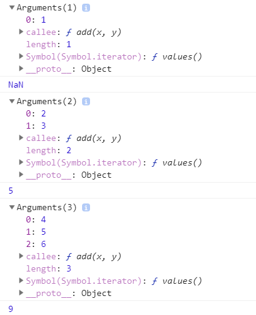

### arguments 객체

자바스크립트는 엄격하지 않기(?)때문에 함수에 인자가 정의되어있을 때, 정의된 인자에 맞추지 않아도 에러가 발생하지 않는다. `function add(x, y){ console.log(x, y); }`처럼 함수가 정의되어 있다고 했을 때, `add()`,`add(3)`, `add(1,2,3)`처럼 호출을 해도 에러가 발생하지 않는다. 다시 말해, 정의된 함수의 인자보다 적게 호출했을때나, 더 많게 호출했을 때도 에러가 발생하지 않는 것이다. 더 적게 호출 했을 때는 `undefined`가 출력되고 , 초과된 인수는 무시된다. 


이러한 특징때문에 호출된 인자 개수에 따라 다른 코드를 실행해야할 때를 위해 `arguments`객체를 사용해야 한다. `arguments`객체는 함수를 호출 할 때 넘긴 인자들이 배열 형태로 저장된 객체이다. 하지만 이 객체는 실제 배열이 아니고 **유사 배열 객체**이다. (유사 배열 객체는 length등 배열의 특징을 가지고 있으나 표준 배열 메서드 등의 활용은 별도의 바인딩 없이 불가한 객체이다.) 

```javascript
function add(x, y) {
	console.dir(arguments);
	return x + y;
}
console.log(add(1)); // (출력 값) NaN
console.log(add(2,3)); // (출력 값) 5
console.log(add(4,5,6)); // (출력 값) 9
```



위의 그림은 크롬 브라우저에서 해당 코드를 실행한 결과이다. 위 그림에서 보면 `arguments`객체 안에는 배열과 같이 인덱스 값에 따라 전달받은 인수가 모두 저장되어있고, `length`프로퍼티가 존재해 전달 받은 인수의 개수를 알 수 있다. `callee`프로퍼티는 현재 실행 중인 함수의 참조 값을 나타낸다. 이렇게 보면 `arguments`객체가 배열처럼 보이지만 유사 배열 객체이므로 배열 메서드를 사용할 수 없고, 사용하기 위해서는 `call()`,`apply()`등의 메서드를 이용해야 한다. `arguments`객체는 아래와 같이 인자의 개수를 정확히 모를 경우에도 효율적으로 사용 할 수 있다.

```javascript
function sum () {
	var result = 0;
	
	for(var i=0; i<arguments.length; i++){
		result += arguments[i];
	}
	
	return result;
}
```


---


### this 바인딩

함수를 호출할 때는 인자에 대한 정보인 `arguments`만 전달되는 것이 아니고 `this`인자 또한 전달된다. `this`는 자바스크립트를 한단계 더 능숙하게 다루기 위해서는 꼭 이해해야하는 매우 **중요한 개념**이다. 많은 사람들이`this`를 이해하기 어려운 이유는 **함수가 호출되는 방식**에 따라서 `this`가 **다른 객체**를 참조하기 때문이다. 이것을 **this 바인딩**이라고 한다. 


#### 1. 객체의 메서드 호출 시 this 바인딩

객체의 메서드를 호출할 때, 메서드 내부 코드에서 사용된 `this`는 **해당 메서드를 호출한 객체로 바인딩**된다. 

```javascript
var player = {
	name : 'Mason Mount',
	sayName : function() {
		console.log(this.name);
	}
};

var otherPlayer = {
	name : "kante"
};

otherPlayer.sayName = player.sayName;

player.sayName(); // (출력 값) Mason Mount
otherPlayer.sayName(); // (출력 값) kante
```

`player`라는 객체에서 사용된 메서드 `sayName()`에서 사용된 `this`는 `player`의 `name`을 참조하여 출력한 것이고, `otherPlayer`객체의 메서드 `sayName()`에서 사용된 `this`는 자신을 호출한 `otherPlayer`의 `name`을 참조하여 호출한다.


#### 2. 함수를 호출할 때 this 바인딩

자바스크립트에서 함수를 호출하면 해당 함수 내부 코드의 `this`는 **전역 객체에 바인딩**된다. 브라우저에서 자바스크립트를 싱행하는 경우 전역 객체는**`window`**객체가 된다. (Node.js에서 전역 객체는 `global` 객체가 된다.)  함수 호출에서의 `this`바인딩 특성은 **내부 함수를 호출할 때도 그대로 적용**된다. 그러므로 내부 함수에서 `this`를 사용할 때는 주의해야 한다.

```javascript
var num = 100;

var test = {
	num : 1,
	testMethod : function () {
		this.num += 1; // test 객체의 num을 참조
		console.log(this.num) // (출력 값) 2
        
        innerMethod = function() {
            this.num += 1; // test 객체의 num이 아닌 전역 객체의 num 참조
            console.log(this.num) // (출력 값) 101
            
            innerInnerMethod = function() {
                this.num += 1; // test 객체의 num이 아닌 전역 객체의 num 참조
                console.log(this.num) // (출력 값) 102
            }
            innerInnerMethod();
        } 
        innerMethod();
	}  
};
test.testMethod();
```

내부 함수는 객체의 메서드로 간주되지 않고, 함수 호출로 간주되기 때문에 `window.num`에 바인딩되어 위와 같은 결과가 나오는 것이다. 그러므로 내부 함수에서 `this`는 유의해야한다.  이러한 한계를 극복하려면 부모 함수의 `this`를 내부 함수가 접근 가능한 다른 변수에 저장하는 방법이 있다. 주로 `this`의 값을 저장하는 변수를 `that`으로 만들어 사용한다. 

```javascript
var num = 100;

var test = {
	num : 1,
	testMethod : function () {
        var that = this;
        
		this.num += 1; // test 객체의 num을 참조
		console.log(this.num) // (출력 값) 2
        
        innerMethod = function() {
            that.num += 1; // test 객체의 num 참조
            console.log(that.num) // (출력 값) 3
            
            innerInnerMethod = function() {
                that.num += 1; // test 객체의 num 참조
                console.log(that.num) // (출력 값) 4
            }
            innerInnerMethod();
        } 
        innerMethod();
	}  
};
test.testMethod();
```

위와 같은 방법으로 내부 함수 `this` 바인딩의 한계를 극복할 수 있다. 뿐만 아니라 `this`바인딩을 명시적으로 할 수 있는 `call`과 `apply` 메서드도 존재한다. 


 #### 3. 생성자 함수 호출 시 this 바인딩

자바스크립트의 생성자 함수는 객체를 생성하는 역할이다. 하지만 다른 언어와는 다르게 기존 함수에 `new` 연산자를 붙여서 호출하면 해당 함수가 생성자 함수로 동작한다. 그렇기 때문에 의도지 않게 함수가 생성자로 쓰일 수도 있기 때문에 그런것들을 구분하기 위해서 생성자로 쓰는 함수의 경우 **함수의 첫 문자를 대문자로** 표기하는 것을 권장하고 있다. 생성자 함수 코드 내부에서의 `this`는 지금까지 경우와 또 다른 방식으로 바인딩된다. 그래서 먼저 생성자 함수가 어떻게 동작하는 지에 대해 이해해야 한다.


---

##### 생성자함수가 동작하는 방식

1. 빈 객체 생성 및 this 바인딩

생성자 함수 실행 전에 빈 객체를 먼저 생성한다. 이 객체가 생성자 함수를 통해 새로 만들어진 객체이다.  **이 객체가 `this`로 바인딩**된다. 그러므로 이후 생성자 함수 내에서 사용된 `this`는 이 빈 객체에 바인딩된다. 이 과정에서 생성된 객체의 프로토 타입 객체는 생성자 함수의 `prototype`프로퍼티이다.

2. this를 통한 프로퍼티 생성

함수 코드 내부에서 `this`를 사용하여 빈 객체에 동적으로 프로퍼티나 메서드 생성이 가능하다.

3. 생성된 객체 리턴

특별하게 리턴문이 없을 경우, `this`로 바인딩된 새로 생성한 객체가 리턴된다. (생성자 함수가 아닌 일반 함수를 호출할 때 리턴 값이 명시되어 있지 않으면 `undefined`가 리턴된다.) 하지만 리턴 값이 새로 생성된 객체(`this`)가 아닌 다른 객체를 반환하는 경우에는 해당 객체가 리턴된다.

```javascript
var Player = function(name) {
	// 함수 실행 전
	this.name = name;
	// 특별한 리턴 값이 없다.
};

var mount = new Player('mount');
console.log(mount.name); // (출력 값) mount
```

위 코드를 보면 `Player`라는 생성자 함수를 먼저 정의한다. (생성자 함수이므로 첫 문자를 대문자로 표기했다.) 아래 `new` 연산자와 함께 `Player` 함수가 호출되면 함수 코드 실행 전에 빈 객체가 생성되고 해당 객체의 프로토타입 객체로 `Player.prototype` 객체가 연결된다. 이렇게 생성된 객체가 함수 코드의 `this`로 바인딩된다. 그리고 `this.name = name` 코드에서 빈 객체에 `name` 프로퍼티가 동적으로 생성된다. 그리고 특별한 리턴 값이 없으므로  `this` 바인딩 된 객체가 생성자 함수의 리턴 값이 되어 `mount`라는 변수에 저장된다.


##### 생성자 함수 방식과 객체 리터럴 방식의 차이

객체 리터럴로 생성된 객체는 **재생성할 수 없다**. 이에 반해 생성자 함수의 경우 재생성이 가능하다.  또 프로토타입 객체가 다른 것이 매우 중요한 차이점이다. 생성자로 생성된 객체의 경우, 생성자의 `prototype`프로퍼티가 프로토타입 객체가 되지만, 객체 리터럴 방식으로 생성된 경우에는 프로토타입 객체가 `Object.prototype`이 된다.


---


#### 4. call과 apply 메서드를 이용한 명시적인 this 바인딩

`apply()`와 `call()`메서드를 통해서 `this`를 특정 객체에 **명시적으로 바인딩**할 수 있다. 두 메서드는 `Function.prototype` 객체의 메서드이기 때문에 모든 함수에서 사용 가능하다. 두 메서드는 같은 기능을 가지고 있고, 넘겨받는 인자의 형식만 다르다. 먼저 `apply()`함수에 대해 알아보자.

`apply()`메서드는 `this`를 특정 객체에 바인딩하는 기능이 포함되어있을 뿐 본질적으로는 **함수** 호출이 목적이다.  `apply()`의 사용 형식은 `function.apply(thisArg, argArray)`와 같이 사용한다. 여기서 `thisArg`는 `apply()` 메서드를 호출한 함수 내부에서 사용한 `this`에 바인딩할 객체를 가르킨다. `argArray`는 함수를 호출할 때 넘길 인자들의 배열을 가르킨다.  아래 예시를 통해 이해해보자.

```javascript
function Player(name, age, position) = {
	this.name = name;
	this.age = age;
	this.position = position;
}

var mount = {};

Player.apply(mount,['mount',20,'midfielder']);
console.dir(mount);

Player.call(mount,'mount',20,'midfielder'); // call 방식으로 하면 이렇게 된다.
```

`Player()`라는 생성자 함수를 만들고, `mount`라는 빈 객체를 객체 리터럴을 통해 생성한다. 그 후에 `Player`함수의 `apply()`메서드를 생성하고, 첫번째 인자에 `this`를 바인딩 할 `mount`를 넣고, 두번째 인자에 넘길 인자 배열인 `['mount',20,'midfielder']`을 보냄을 통해 빈 객체였던 `mount` 객체에 인자들을 할당한다.

 이러한 `apply()`와 `call()`메서드는 이밖에도 유사 배열 객체에서 **배열 메서드**를 사용하는 경우에 많이 쓰인다. 기본적으로 유사 배열 객체는 표준 배열 메서드를 사용할 수 없지만 `apply()`를 통해서 바인딩하면 가능하다. 대표적인 유사 배열 객체인 `arguments`가 배열 메서드를 사용할 때 다음과 같이 많이 쓰인다. `var args = Array.prototype.slice.apply(arguments);` 이렇게 하면 `arguments`에 `slice()` 메서드를 사용한 결과가 변수 `args`에 저장된다. 


---


### 출처

> 1. [INSIDE JAVASCRIPT (한빛미디어, 송형주,고현준 지음)](https://book.naver.com/bookdb/book_detail.nhn?bid=7400243)
> 2. [인프런 'Javascipt 핵심 개념 알아보기 - JS Flow'](https://www.inflearn.com/course/핵심개념-javascript-flow/)


