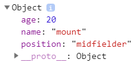

### 함수의 반환(return)

자바스크립트의 함수는 **항상 리턴값을 반환한다.** 개발자가 `return`을 별도로 표시하지 않더라도, 일정한 규칙에 따라 리턴 값이 반환된다. 어떤한 규칙이 있는지 살펴보자.


---


#### 1. 일반함수나 메서드의 경우

일반 함수나 객체의 메서드의 경우에서 `return`을 지정하지 않았을 경우에, `undefined` 값을 리턴한다.

```javascript
var testFunc = function() {
    console.log("No return Function!");
}

var result = testFunc(); // (출력 값) No return Function!
console.log(result); // (출력 값) undefined
```


---


#### 2. 생성자 함수의 경우

생성자 함수에서 리턴 값을 지정하지 않을 경우 `this`로 바인딩된 **새로 생성된 객체가 리턴**된다. 일반적으로 생성자 함수에서는 리턴 값을 지정하지 않지만 몇가지 예외 상황도 존재한다. 생성자 함수에서 명시적으로 다른 객체를 반환하면 어떻게 될지 살펴보자.

```javascript
function Player(name, age, position) = {
	this.name = name;
	this.age = age;
	this.position = position;
	
	// 명시적으로 리턴값 지정
	return {name:'mount',age:20,position:'midfielder'};
}

var kante = new Player('kante',28,'midfielder');
console.dir(kante);
```



`new`연산자를 통해 생성자로 새로운 객체를 생성하더라도, 명시적으로 리턴값이 정해져있기 때문에 생성자 함수 내에서 명시적으로 정의된 객체가 새로운 객체에 리턴되어 저장된다. 하지만 여기서 또 한가지 주목할 것은 생성자 함수에서 넘긴 리턴 값이 `Object`가 아닌 `boolean`,`number`,`string`의 경우에는 명시적으로 넘긴 리턴 값을 무시하고 `this`로 바인딩 된 새로 생성된 객체가 리턴되어 변수에 저장된다. 

```javascript
function Player(name, age, position) = {
	this.name = name;
	this.age = age;
	this.position = position;
	
	// 명시적으로 리턴값 지정
	return 'mount'; //명시된 리턴값이 string이므로 무시된다.
}

var kante = new Player('kante',28,'midfielder');
console.log(kante); // Player {name: 'kante', age: 28, position:'midfielder'}
```


---


### 출처

> 1. [INSIDE JAVASCRIPT (한빛미디어, 송형주,고현준 지음)](https://book.naver.com/bookdb/book_detail.nhn?bid=7400243)
> 2. [인프런 'Javascipt 핵심 개념 알아보기 - JS Flow'](https://www.inflearn.com/course/핵심개념-javascript-flow/)


