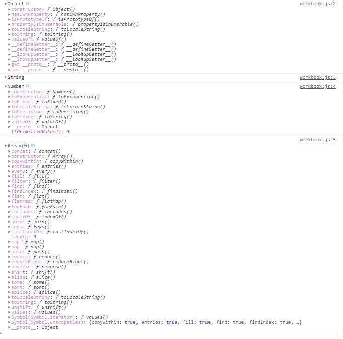

자바스크립트에서 **프로토타입** 개념과 **프로토타입 체이닝** 개념은 매우 중요한 개념이다. 자바스크립트에서는 **프로토타입과 프로토타입 체이닝**을 통해 객체지향 프로그래밍을 하기 때문이다. 자바스크립트 초기만해도 다른 언어에는 있는 `Class`개념이 없었다. (**ES6**이후 도입되었다.) 클래스 개념이 존재하지 않았었기 때문에 당시에는 **프로토타입** 객체를 활용하여 OOP의 상속 개념 등을 구현하였다. 물론, 지금은 자바스크립트에서도 **클래스**와 상속을 사용할 수 있지만 프로토타입과 프로토타입 체이닝을 통해 어떻게 객체지향 프로그래밍을 했는지 살펴보면서 **프로토타입에 대해 이해**해보자.


#### 1. 프로토타입의 두가지 의미

자바스크립트의 모든 객체는 자신의 부모 프로토타입 객체를 가르키는 링크 프로퍼티가 있다. `[[prototype]]`으로 불리고 크롬 브라우저에서 조회했을 때는 `__proto__` 로 표시된다. 이 프로토타입과 함수 객체의 `prototype`프로퍼티를 구분할 수 있어야 한다. 이 둘의 차이점을 제대로 이해하기 위해서는 **자바스크립트의 객체 생성 규칙**을 알아야 한다.  자바스크립트의 모든 객체는 **자신을 생성한 생성자 함수의 `prototype` 프로퍼티가 가리키는 프로토타입 객체를 `__proto__` 링크로 연결시킨다.** 


#### 2. 객체 리터럴 방식으로 생성된 객체의 프로토타입 체이닝

자바스크립트의 객체는 자기 자신의 프로퍼티 뿐만 아니라 부모 객체의 프로퍼티 또한 접근 가능하다. 이것이 **프로토타입 체이닝**이다. 객체 리터럴로 생성한 객체는 `Object()` 생성자 함수로 생성된 것이다. 그렇기 때문에 `Object()` 함수가 가지고 있는 프로퍼티에 접근이 가능한 것이다.  자바스크립트에서는 특정 객체의 프로퍼티나 메서드에 접근할 때, 해당 객체에 접근하려는 프로퍼티나 메서드가 없으면 해당 객체의 `__proto__` 링크를 따라 부모 객체의 프로퍼티와 메서드를 체크한다. 모든 객체는 체이닝을 통해 `Object.prototype`에 접근이 가능하기 때문에 `toString()`이나 `hasOwnProperty()`등의 표준 메서드 또한 모든 객체가 이용 가능하다. 


#### 3. 생성자 함수로 생성된 객체의 프로토타입 체이닝

앞서 언급했지만 자바스크립트의 모든 객체는 생성자 함수의 `prototype` 프로퍼티가 가리키는 객체를 자신의 프로토타입 객체로 취급한다. 

```javascript
function Player(name,age,position){
	this.name = name;
	this.age = age;
	this.position = position;	
}

var mount = new Player('mount',20,'midfielder');

console.log(mount.hasOwnProperty('name')); // (출력 값) true
console.dir(Player.prototype); 
```

위에서 생성자 함수를 통해 생성된 `mount` 객체는 `hasOwnProperty()` 메서드를 사용하는데, `mount`의 부모 객체인 `Player.prototype` 객체에는 `hasOwnProperty()` 메서드가 존재하지 않는다. 하지만 `mount.hasOwnProperty('name')`은 정상적으로 결과를 출력한다. 위 코드를 통해 **프로토타입 체이닝**은 단순히 자신의 부모 객체까지만 참조하는 것이 아니고, `Object.prototype` 객체에 도달할 때까지 참조한다. 그렇기 때문에 모든 객체가 **표준 메서드**를 사용 가능한 것이다. `Object.prototype`객체가 모든 객체의 프로토타입 체이닝의 **종점**이라고 생각하면 되겠다. `Object.prototype`의 프로퍼티와 메서드는 어떤 객체도 사용 가능하기 때문에 어떠한 메서드 등이 있는지 살펴보면 표준 메서드를 제대로 활용하는데 도움이 될 것이다. 이러한 메서드는 `Object.prototype`뿐만 아니라 `Number.prototype`, `String.prototype`, `Array.prototype`등에도 각 타입 별로 표준 메서드가 존재하기 때문에 해당 메서드들을 적절히 사용하면 효율적으로 코딩할 수 있다. 뿐만 아니라 해당 프로토타입 객체에 사용자가 프로퍼티나 메서드를 추가하여 커스터마이즈 하여 사용할 수도 있다.




#### 4. 프로토타입 커스터마이즈

프로토타입도 결국은 자바스크립트의 객체이다. 그렇기 때문에 어떠한 프로토타입에도 프로퍼티를 추가하거나 메서드를 추가하는 것이 가능하다.  프로토타입 객체에 프로퍼티나 메서드를 추가하면 해당 생성자 함수를 통해 생성된 모든 객체에서 추가된 프로퍼티나 메서드를 참조할 수 있게 된다. 만약에 해당 메서드에서 `this`를 사용하면 해당 `this`는 호출한 객체로 바인딩된다.

```javascript
function Player(name, age, position) {
	this.name = name;
	this.age = age;
	this.position = position;
}

var mount = new Player('mount',20,'midfielder');

Player.prototype.run = function () {
	console.log("Run!");
}

mount.run(); // (출력 값) Run!
```


---


### 출처

> 1. [INSIDE JAVASCRIPT (한빛미디어, 송형주,고현준 지음)](https://book.naver.com/bookdb/book_detail.nhn?bid=7400243)
> 2. [인프런 'Javascipt 핵심 개념 알아보기 - JS Flow'](https://www.inflearn.com/course/핵심개념-javascript-flow/)


