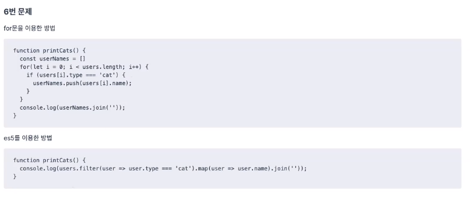

---
title: 'let, const, var 의 차이는?'
date: 2020-4-11 18:37:00
category: 'Javascript'
draft: false
---

## 1번 문제

위 문제는 `new` 키워드 유무의 차이를 아는 것이 핵심이다. 나는 처음에 그 핵심에 대해서 인지하지 못해서 1번 보기를 정답으로 선택했는데, 정답은 4번(오류가 발생한다)였다.

자바스크립트에서 **함수를 `new`를 써서 호출하였느냐, 아니냐**에 따라 차이를 알고있는지가 중요하다. `new`가 붙어있을 경우 `this`가 함수에 바인딩되지만 `new`가 없이 호출되었을 경우 `this`는 `전역객체(window)`를 바라보게 되어 `this.name = name`은 `window.name = name`이 되어 오류가 발생하는 것이다. 

## 2번 문제

2번 문제는 **즉시 실행 익명 함수**에 대해 알고있는지를 확인하는 문제이다. `IIFE`라고 불리고 Immediately Invoked Function Expression의 약자이다. 이 함수는 정의하는 동시에 실행된다. 이 함수를 활용함을 통해 변수나 함수의 전역화를 최소화 시킬 수 있다. 일종의 `private`효과를 줄 수 있다. 하지만 ES9에서 `private`가 나오기 때문에 기능에 대해서만 알고 있으면 된다. 이 부분에 대해서는 다행히 공부한 기억이 나서 수월했다. 정답은 3번!

## 3번 문제 

3번 문제는 `function scope`관련 문제이다. `play`메서드의 `this`는 `roto`라는 객체에 바인딩되어 `'roto'`라는 값을 가지고 있는 `memberName`변수를 가져올 수 있지만 객체 바깥에 있는 `name` 변수는 가져오지 못하기 때문에 `undefined`가 출력된다. 

이것을 의도대로 해결하기 위해서는 아래와 같이 수정하면서 해결 할 수 있다. `name`변수를 불러올 수 있게 `this`가 아닌 `idiots` 객체로 직접 명시하여 처리하면 해결된다.

## 4번 문제

이 문제의 핵심도 `this`이다. `perform` 함수 아래 `setTimeout()`으로 실행되는 함수의 `this`는 `RockBand`의 `this`로 바인딩되는 것이 아니기 때문에 참조 오류가 발생한다. 전역 객체에는 `members`가 선언되어 있지 않기 때문이다. 

위 문제는 **클로저**를 통해서 해결할 수도 있고, `bind`를 이용해서 해결하는 방법도 존재한다. 

## 5번 문제

이 문제는 전형적인 클로저 문제이고, `setTimeout`이 실행되는 시점에 이미 `for`문이 종료되어 있어서 `i`는 이미 5가 저장되어있어서, 5만 계속 출력된다. `i`를 `var`대신 `let`을 쓰면서 해결될 수 있고, `setTimeout` 함수를 IIFE로 감싸고 `i`를 파라미터로 넘겨도 된다.

## 6번 문제

위 문제는 조건에 맞게 코딩해보는 문제인데, 크게 `for`문을 이용하는 전통적인 방법이 있고, 아래 `Arrow` 와 표준 배열 메서드를 활용하여 출력하는 방법이 있다.

## 7번 문제

`var`와 `let`, `const`의 차이에 대해 기술하는 문제이다. `var`는 호이스팅 현상이 발생하는 것을 기억하자.

## 8번 문제

클로저가 무엇인지 설명하는 것이 문제이다. 간단히 말하면 자신의 scope 외부에 있는 것을 가져와 쓰는 것 정도로 표현할 수 있다. 

---

### 출처

1. 프론트엔드 개발을 위한 자바스크립트