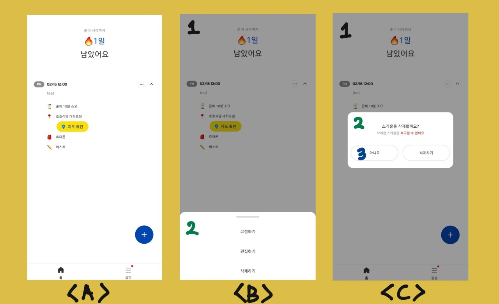

RN 개발 중에 스스로 맟닥뜨렸던 여러가지 이슈들이 있었다. 그 이슈들을 일일히 다 정리하지는 못했고, 진짜 구글링덕분에 해결한 문제들이 너무 많았지만, 구글링으로도 쉽게 해결되지 않았던 문제들은 스스로 정리해보려고 한다. 사실 나의 구글링 스킬이 부족해서 해당 답을 찾지 못했을 수도 있고, 너무 당연한 문제였어서, 나만 문제점으로 여겼을 수 있지만, 그래도 누군가에겐 도움이 될 수 있기 때문에 글로 정리해보려고 한다.

내가 맟닥드렸던 상황은 서비스 개발 시에 모달 뷰가 자주 쓰이는 상황이었다. 위 이미지를 통해 한번 설명해보자면, A 화면에서 특정 버튼을 누를 경우, B 화면과 같이 모달 뷰가 떠야 하는 상황이었다. 해당 모달 뷰는 B 화면의 1, 2번 컴포넌트를 통해 구성되어 있는데 1번은 모달 컨테이너 배경이고, 투명도가 적용된 백그라운드 컬러를 보여주기도 하고, 1번 컴포넌트를 클릭 시 모달이 취소되는 이벤트를 가지고 있다. 2번의 경우는 일반적인 모달 메뉴 형태의 컴포넌트이고, 1번의 하위(자식) 컴포넌트에 해당한다.

문제의 상황은 C 화면에서 나타나는데 1 - 2 - 3 의 구조로 컴포넌트가 이루어져있었다. 1번은 B화면에서와 동일한 컴포넌트이고 이벤트도 동일한 이벤트였다. 문제는 여기서 2번 컴포넌트는 의도대로라면 아무 동작을 하지 않아야하는데 2번 컴포넌트를 눌렀을 때도, 1번의 이벤트가 발생하는 문제가 있었다. 더 큰 문제는 3번 컴포넌트의 경우, 버튼 컴포넌트로 아니오와 삭제하기에 각각 다른 이벤트가 발생되어야 하는데, 이상하게 ios 에뮬레이터에서는 정상 동작했지만, 안드로이드 폰에서 테스트 했을 때는 이벤트가 일어나지 않고 1번 컴포넌트의 이벤트가 일어나면서 모달이 종료되는 현상이 발생했다.

그래서 내 의도와는 다르게 1번 컴포넌트의 이벤트가 3번 컴포넌트까지 퍼지게 되는 상황이 생기게 되어서, 하위 컴포넌트로의 이벤트를 막는? 방법들을 찾아보려고 했지만 쉽게 찾아지지 않았다. 그러다가 여러가지 시도를 해보게 되었는데 문제점을 해결책을 찾게 되었다.

일단 1번의 경우, Pressable과 같은 클릭 이벤트 가능한 컴포넌트를 썼었고, C 화면에서 2번의 경우 클릭 이벤트가 필요없었기 때문에 단순히 View를 썼었다. 정확히 도큐멘테이션을 통해 확인한 것은 아니지만 1 - 2 - 3 번과 같이 상위 컴포넌트에서 하위 컴포넌트로 이뤄진다고 했을 때, 1번 컴포넌트는 clickable한 컴포넌트이고 2번은 unclickable한 View와 같은 컴포넌트라면 1번의 이벤트가 2번에도 덧씌워졌다. 그래서 의도치 않게 1번의 이벤트가 하위 컴포넌트 까지 전파되었던 것이다.

이런 경우 해결책으로 C 화면의 2번 컴포넌트 같은 경우 사실 클릭 이벤트가 필요없는 컴포넌트이고 단순히 컨테이너 역할이지만, 그래도 Pressable이나 TouchableOpacity와 같이 클릭할 수 있는 컴포넌트로 만들고 따로 이벤트 지정을 해주지 않아도 1번 컴포넌트의 이벤트가 2번 컴포넌트에 발생하지 않게 된다! (StopPropagation느낌!) 이렇게 하면 내가 의도했던 것과 같이 동작하게 된다.

### 정리

위 케이스를 통해서 컴포넌트에서 의도치 않게 이벤트가 하위 컴포넌트로 전파되는 경우를 막을 수 있었고, 각각 컴포넌트의 특징을 이해하는 것이 매우 중요하겠다는 생각이 들었다. 평소에 컴포넌트 별로 대략 훑어만 보는 경우가 많고, 막상 도큐멘테이션은 나중에 찾아보는 경우가 많은데, 살펴보면 기본적으로 컴포넌트에서 제공하는 특성이 있음에도 그것을 모르고 더 어렵게 접근하는 경우가 많았기 때문에, 기본 컴포넌트의 경우 하나하나 잘 이해해야 더 잘 활용할 수 있겠다는 생각이 들었다.
