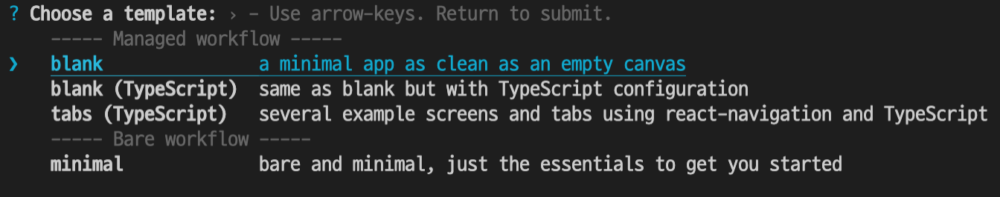
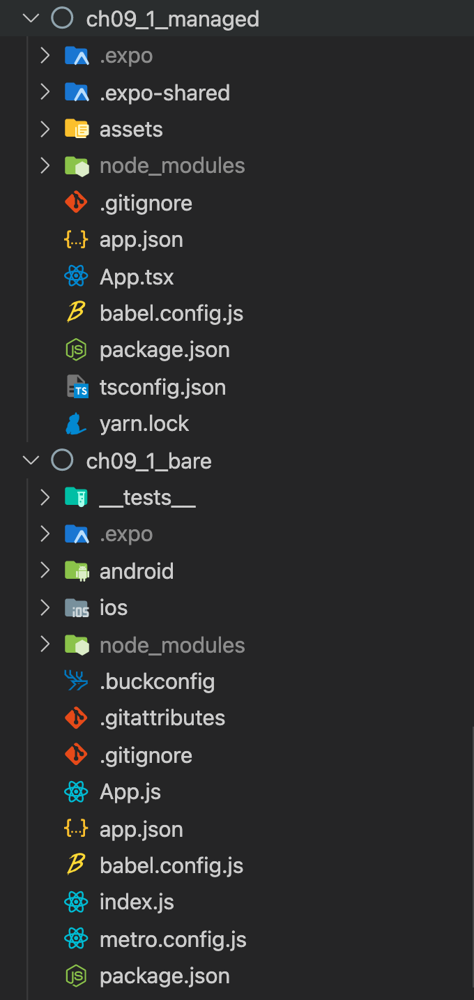
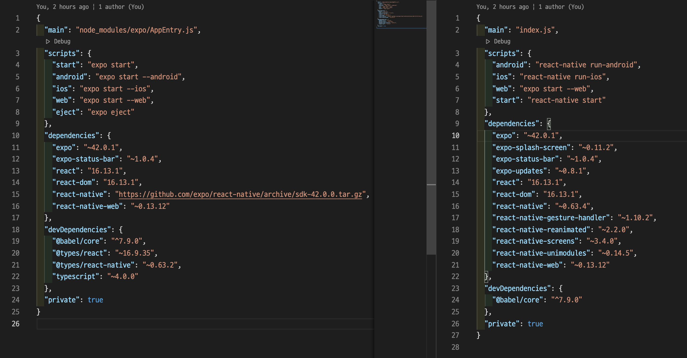

처음 RN으로 앱을 만들어보면서 자연스럽게 expo를 쓰면 좋다! 해서 Expo를 사용해서 개발해본게 처음이었는데, 막상 새로운 프로젝트를 기획하면서 Expo를 써야할지 말아야할지에 대해서 고민할 때, 제대로 알고있지 못했기 때문에 써야할지 말아야할지는 판단할 수 없었다. 그래서 이번 포스트를 통해 Expo에 대해서 정리해보려고 한다.

## 1. Expo란?

Expo는 RN 개발 시에 개발, 구축, 배포 과정을 빠르게 진행할 수록 도와주는 툴이고 서비스 셋이다. Expo는 RN을 개발 할 때 React-native-cli로 프로젝트를 생성하는 방법 말고, expo-cli 프로젝트로 생성하여 사용할 수 있으며, 리액트 네이티브가 크로스플랫폼 프레임워크다 보니 네이티브 부분의 개발이 필요할 때, JAVA나 Objective-c와 같은 네이티브 개발을 하지 않기 위해 Expo가 만들어졌다.

엑스포는 이전에는 리액트 네이티브 프레임워크 위에서만 동작하는 프레임워크이자 플랫폼이었지만, 최근에는 3가지 방식의 프로젝트를 모두 지칭하는 용어로 쓰인다.

- 관리 워크플로(managed workflow) 방식 엑스포 프로젝트 : 가장 널리 알려진 프로젝트로, 엑스포가 프로젝트를 관리한다는 의미이다.

- 베어 워크플로(bare workflow) 방식 엑스포 프로젝트 : 최근 많이 쓰이는 프로젝트로, react-native-unimodules라는 패키지만 사용하고 엑스포의 관리를 받지 않는 프로젝트이다.

- 엑스포 웹 프로젝트 : 리액트 네이티브 프레임워크를 사용하는 자바스크립트 코드를 웹 브라우저에서 실행하는 것을 목표로하는 아직은 실험 단계의 프로젝트이다.

## 2. Expo 설치

위의 세가지 프로젝트 모두 `expo-cli`를 통해 만든다. 버전의 경우는 `expo --version`명령으로 알 수 있다.

```bash
npm i -g expo-cli
expo --version
```

## 3. Expo 관리 프로젝트와 베어 프로젝트

관리 워크플로 방식 생성의 경우는 `expo init`을 통해 managed workflow에서 골라 프로젝트를 생성하면 되고, 베어 워크플로의 경우, bare workflow에서 선택하여 생성하면 된다.



관리 프로젝트와 베어 프로젝트의 차이가 엑스포의 관리를 받는지 여부인데, 그것을 제대로 살펴보기 위해 디렉터리 구조를 비교해보자.



위쪽이 관리 프로젝트이고, 아래 쪽이 베어 프로젝트인데, Expo 관리 프로젝트에서는 ios나 android 폴더가 보이지 않는 것을 확인할 수 있다. 그에 반해 베어 프로젝트의 경우, 기본 리액트 네이티브 프로젝트 생성과 같은 구조이다.



expo init으로 생성된 `package.json`을 살펴보면, 일반적으로 생성한 `package.json`과는 다르게 `eject`라는 명령과 함께 커스터마이징된 react-native 패키지를 사용된다. 이것이 엑스포가 관리한다는 것을 의미한다.

### 3.1 Expo 관리 프로젝트의 특징

엑스포 관리 프로젝트의 경우에는 애뮬레이터나 폰에서 독립된 앱이 아닌 엑스포 고 앱안에서만 동작한다. 그리고 엑스포 관리 프로젝트의 장점은 개발자가 네이티브쪽 코드를 전혀 고려하지 않고 JS 혹은 TS 코드만 집중할 수 있도록 해준다. 요즘에는 `npm react-native link` 명령을 통해 대부분 패키지가 동작하기 때문에 상대적으로 엑스포 관리 프로젝트의 효용이 줄긴했다. 그리고 엑스포 관리 프로젝트의 경우 엑스포가 지원하지 않는 패키지를 전혀 사용할 수 없다는 단점이 있다. 엑스포 관리 프로젝트는 엑스포가 지원하는 패키지를 미리 설치한 커스텀 버전의 리액트 네이티브 패키지를 사용하기 때문에 커스텀 패키지 안에 미리 설치하지 않은 패키지는 사용 불가하다. 이러한 단점을 해결하고자 제공하는게 `expo eject` 명령이다. 이 명령을 실행하면 엑스포 관리 프로젝트에서 베어 프로젝트로 전환된다.

### 3.2 Expo 베어 프로젝트의 특징

---

출처

1. [스타일드 컴포넌트를 사용하는 이유](https://eunbin00.tistory.com/31)
2. [react-native 프로젝트의 style에 대해서 알아보기](https://velog.io/@jinsunee/react-native-%ED%94%84%EB%A1%9C%EC%A0%9D%ED%8A%B8%EC%9D%98-style%EC%97%90-%EB%8C%80%ED%95%B4%EC%84%9C-%EC%95%8C%EC%95%84%EB%B3%B4%EA%B8%B0)
