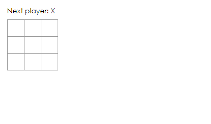

## 리액트는 무엇일까요?


> React는 사용자 인터페이스를 구축하기 위한 **선언적**이고, **효율적**이고 **유연한** 자바스크립트의 라이브러리이다.


리액트를 어떤 프레임워크나 하나의 프로그래밍 언어로 생각하는 사람들도 많은데, 리액트는 라이브러리다. "컴포넌트"라는 작고 고립된 코드의 파편으로 복잡한 UI를 구성하는 것이다. 

예를 들어서 `React.Component`의 하위 클래스를 살펴보자.
```javascript
class PlayerList extends React.Component {
    render() {
        return (
            <div className="player-list">
                <h1>Player List for {this.props.name}</h1>
                <ul>
                    <li>Kante</li>
                    <li>Zouma</li>
                    <li>Werner</li>
                </ul>
            </div>
        );
    }
}
```
위처럼 컴포넌트를 사용하여 화면에 표현할 것이 무엇인지 전달한다. React는 데이터가 변경될 때 컴포넌트를 효율적으로 업데이트하고 다시 렌더링한다.

예시에서 `PlayerList`는 React 컴포넌트 클래스 또는 컴포넌트 타입이라고 한다. 여기서 `render`함수는 화면에서 보여줄 내용을 반환한다. 단순히 내용을 반환하는 것이 아니라 내용을 경량화한 **React 엘리먼트**를 반환한다. 대부분의 React 개발자는 "JSX" 문법을 사용하여 React 구조를 더 쉽게 작성한다. JSX는 자바스크립트의 강력한 기능을 가지고 있다. JSX 내부의 중괄호 안에는 어떤 `Javascript` 표현식을 사용할 수 있다. React 엘리먼트는 자바스크립트 객체이고 변수에 저장하거나 이곳저곳으로 전달 가능하다. `PlayerList` 컴포넌트는 DOM 컴포넌트만을 렌더링하지만, 커스 React 컴포넌트를 렌더링하는 것도 가능하다. `<PlayerList />`와 같은 컴포넌트를 만들어 참조할 수도 있다. React 컴포넌트는 캡슐화되어 독립적으로 동작할 수 있다. 그렇기 때문에 단순한 컴포넌트로 복잡한 UI를 만들 수 있는 것이다.


## 튜토리얼 초기 코드 살펴보기

일단 로컬에서 튜토리얼을 수행하기 위해서는 어느정도 환경이 셋팅되어 있어야 한다. 

1. Node.js가 설치되어 있는지 확인
2. CRA 설치 지침에 따라 프로젝트 생성
   ```
   npx create-react-app my-app
   ```
3. 새로 생성된 프로젝트에서 `src/` 폴더 내용을 비운다.
4. 초기 파일들(`index.css`,`index.js`)을 생성하고 `index.js` 파일에 아래 코드를 추가한다.
   ```javascript
    import React from 'react';
    import ReactDOM from 'react-dom';
    import './index.css';

   ```
5. 그리고 `npm start` 명령어와 함께 브라우저에서 확인해보자. 그럼 아래와 같은 화면을 확인할 수 있다. 


다음 포스트부터는 초기 코드에 대한 분석과 본격적으로 튜토리얼을 진행해보자!

출처 : [리액트 튜토리얼](https://ko.reactjs.org/tutorial/tutorial.html#setup-option-2-local-development-environment)
