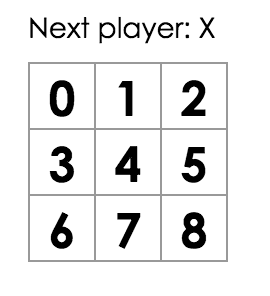
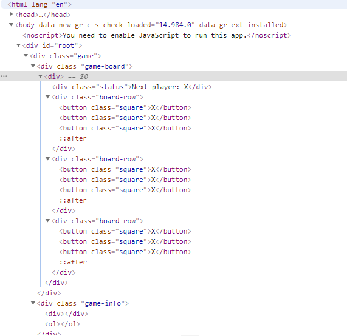

## 초기 코드 보기 

```javascript
class Square extends React.Component {
    render() {
      return (
        <button className="square">
          {/* TODO */}
        </button>
      );
    }
  }
  
  class Board extends React.Component {
    renderSquare(i) {
      return <Square />;
    }
  
    render() {
      const status = 'Next player: X';
  
      return (
        <div>
          <div className="status">{status}</div>
          <div className="board-row">
            {this.renderSquare(0)}
            {this.renderSquare(1)}
            {this.renderSquare(2)}
          </div>
          <div className="board-row">
            {this.renderSquare(3)}
            {this.renderSquare(4)}
            {this.renderSquare(5)}
          </div>
          <div className="board-row">
            {this.renderSquare(6)}
            {this.renderSquare(7)}
            {this.renderSquare(8)}
          </div>
        </div>
      );
    }
  }
  
  class Game extends React.Component {
    render() {
      return (
        <div className="game">
          <div className="game-board">
            <Board />
          </div>
          <div className="game-info">
            <div>{/* status */}</div>
            <ol>{/* TODO */}</ol>
          </div>
        </div>
      );
    }
  }
  
  // ========================================
  
  ReactDOM.render(
    <Game />,
    document.getElementById('root')
  );
```
위 코드에는 `Square`, `Board`, `Game` 이라는 세가지 컴포넌트가 있다. `Square` 컴포넌트는 `<button>`을 렌더링하는 컴포넌트이고, `Board`는 9개의 사각형을 렌더링 한다. 마지막으로 `Game` 컴포넌트는 게임판을 렌더링하고 게임판에 대한 상태 값을 가지고 있다. 지금 코드에는 단순히 렌더링만 할 뿐이고, 어떤 기능을 수행하지는 못하는 코드 상태이다.


## Props를 통해 데이터 전달하기

`Board`의 `renderSquare` 함수를 수정하면서 `Board` 컴포넌트에서 `Square` 컴포넌트로 데이터를 전달할 수 있다. 아래 코드 처럼 `renderSquare` 로 컴포넌트를 만들 때 전달받은 매개변수 `i`를 컴포넌트 생성 시 value로 전달할 수 있다.
```javascript
class Board extends React.Component {
  renderSquare(i) {
    return <Square value={i} />;
  }
}
```

그리고 `Square` 컴포넌트에서는 전달 받은 `value` 값을 `{this.props.value}`로 표시해줄 수 있다.


## 상호작용하는 컴포넌트 만들기

user가 Square 컴포넌트를 클릭했을 때 "X" 체크가 되도록 하는 상호작용 컴포넌트를 만들어 보자. 아래와 같이 button에 `onClick` prop을 추가해서 클릭했을 때 alert가 뜰 수 있도록 할 수 있다.(여기서 prop은 프로퍼티를 말하는 것으로 생각된다.)

```javascript
class Square extends React.Component {
    render() {
      return (
        <button className="square" onClick={() => alert('click')}>
          {this.props.value}
        </button>
      );
    }
  }
```

단순히 alert를 띄우는 것이 아니고 `Square` 컴포넌트가 클릭된 것을 기억하게 하려면 `state`를 이용해야 한다. 리액트에서 컴포넌트는 기억하기 위해 `state`를 사용해야 한다. 생성자에 `this.state` 를 설정하면서 `state`를 가질 수 있다. 현재 값을 `this.state`에 저장하고 `square`을 클릭하는 경우 `state`를 변경해보자.

```javascript
class Square extends React.Component {
    constructor(props) {
        super(props); // javascript 클래스에서 하위 클래스 생성자를 정의할 땐 항상 super를 호출해야 합니다. 모든 react 컴포넌트 클래스는 생성자를 가질 때 super(props) 호출 구문부터 작성해야 한다.
        this.state = {
            value: null,
        };
    }

    render() {
      return (
        <button 
            className="square" // 가독성을 위해 띄어주는게 좋다.
            onClick={() => this.setState({value:'X'})}>
          {this.state.value}
        </button>
      );
    }
  }
```


크롬 개발자 도구를 이용하면 아래와 같이 React 컴포넌트 트리를 볼 수 있다. 개발 시 유용하게 이용하면 좋다.



다음 포스트에서는 게임을 완성해보도록 하자.


출처 : [리액트 튜토리얼](https://ko.reactjs.org/tutorial/tutorial.html#setup-option-2-local-development-environment)
