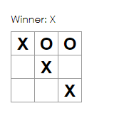

## 불변성이 중요한 이유
이전 포스트에서 기존 배열을 수정하지 않고 `.slice()` 연산자를 사용해서 `squares` 배열의 사본을 만들었다. 그 이유는 불변성과 관련이 있다. 일반적으로 데이터 변경 시에는 데이터의 값을 직접 변경하거나 원하는 변겨 값을 가진 새로운 사본으로 데이터를 교체하는 방법이 있다.

1. 객체 변경을 통해 데이터 수정하기 
```javascript
var player = {score: 1, name: 'Son'};
player.score = 2;
```

2. 객체 변경 없이 데이터 수정
```javascript
var player = {score: 1, name: 'Son'};
var newPlayer = Object.assign({},player, {score = 2});
//이렇게 되면 player는 변경되지 않는다.
```

2번의 방법은 데이터를 변경하지 않음으로써 불변성을 유지하는 방법이다. 불변성을 유지하면 몇가지 장점이 있다. 불변성은 1) 복잡한 특징을 구현하기 쉽게 만든다. 예를 들어 뒤로 돌리기 기능을 구현 시에 직접적인 데이터 변경을 피함으로써 이전 버전의 이력을 유지하고 재사용 할 수 있다. 2) 불변하기 때문에 변화를 감지하는 것이 쉽다. 이전과 값이 다르면 변화한 것이기 때문이다. 3) 불변성의 가장 큰 장점은 데이터 변경을 판단하는 것을 바탕으로 컴포넌트를 다시 렌더링할지 말지 결저할 수 있다. 그래서 React 순수 컴포넌트를 만드는데 도움이 된다.


## 함수 컴포넌트
`Square`를 함수 컴포넌트로 바꾸어 보자. React에서 함수 컴포넌트는 더 간단하게 컴포넌트를 만드는 방법이다. state없이 `render` 함수만 가진다. `React.Component`를 확장하는 클래스를 정의하는 대신에 `props`를 입력받아 렌더링 대상을 반환하는 함수를 작성할 수 있다. 함수 컴포넌트는 더 빠르게 작성가능하다. 

```javascript
function Square(props) {
  return (
    <button className="square" onClick={props.onClick}>
      {props.value}
    </button>
  );
}
```


## 순서 만들기
아직까지는 틱택토 게임임에도 "O"가 표시되지 않고 있다. 첫번째 차례에는 "X"를 표시하는 것으로 할 것이다. Board 생성자의 초기 state를 수정하면서 기본 값을 셋팅할 수 있다.
```javascript
class Board extends React.Component {
  constructor(props) {
    super(props);
    this.state = {
      squares: Array(9).fill(null),
      xIsNext: true,
    };
  }
```
플레이어가 클릭할 때마다 `xIsNext` 값이 변경되어 다음 플레이어가 누군지 결정하고 게임의 state를 저장할 것이다. Board의 `handleClick` 함수를 수정하여 `xIsNext` 값을 뒤집을 것이다.
```javascript
handleClick(i) {
    const squares = this.state.squares.slice();
    squares[i] = this.state.xIsNext ? 'X':'O';
    this.setState({ 
      squares: squares,
      xIsNext: !this.state.xIsNext,
     });
  }
```
위와 같이 수정하고나서는 이제 'X'와 'O'가 번갈아 나타날 것이다. 다음에 할 것은 Board의 `render`에 있는 status 텍스트를 바꾸어 어느 플레이어가 다음 차례인지 알려줄 것이다. 
```javascript
 render() {
    const status = "Next player: " + (this.state.xIsNext ? 'X':'O');
    //아랫부분은 동일

```
이제 다음 플레이어 순서 표시까지 완료되었다. 게임의 기능을 완성하기 위해 마지막으로 필요한 것은 승자를 결정하는 것이다. 이제 어떻게 승자를 결정할지 살펴보자.


## 승자 결정하기
플레이어에게 승부가 결정나거나, 더 둘곳이 없을 때 알려주어야 한다. 그것을 위해 아래 함수를 쓸 것이다.
```javascript
function calculateWinner(squares) {
  const lines = [
    [0, 1, 2],
    [3, 4, 5],
    [6, 7, 8],
    [0, 3, 6],
    [1, 4, 7],
    [2, 5, 8],
    [0, 4, 8],
    [2, 4, 6],
  ];
  for (let i = 0; i < lines.length; i++) {
    const [a, b, c] = lines[i];
    if (squares[a] && squares[a] === squares[b] && squares[a] === squares[c]) {
      return squares[a];
    }
  }
  return null;
}
```
승리를 확인하기 위해 `render`함수에 `calculateWinner(squares)`를 호출하여 Winner를 표시해 줄 것이다.
winner를 표시해주기 위해 Board의 `render`함수에서 선언한 `status` 코드를 아래처럼 수정하자.
```javascript
render () {
  const winner = calculateWinner(this.state.squares);
  let status;
  if (winner) {
    status = 'Winner: ' + winner;
  } else {
    status = 'Next Player: ' + (this.state.xIsNext ? 'X' : 'O');
  }
  // 아래는 동일
```
마지막으로 누군가가 이미 승리하거나 Square이 채워져있으면 Board의 `handleClick` 함수가 클릭을 무시하도록 변경할 것이다.
```javascript
handleClick(i) {
    const squares = this.state.squares.slice();
    if(calculateWinner(squares) || squares[i]) return;
    squares[i] = this.state.xIsNext ? "X" : "O";
    this.setState({
      squares: squares,
      xIsNext: !this.state.xIsNext,
    });
  }
```
이제 완성했으니 확인해보자.



게임의 기능은 모두 완성했지만 마지막으로 이전 차례로 되돌리는 "시간 되돌리기"(Undo) 기능을 다음 포스트에 만들어보자.


출처 : [리액트 튜토리얼](https://ko.reactjs.org/tutorial/tutorial.html#setup-option-2-local-development-environment)
