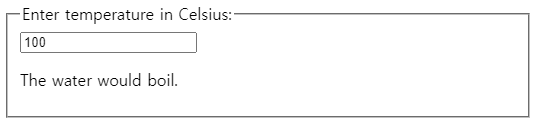
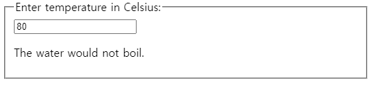

동일한 데이터에 변경사항을 여러 컴포넌트에 반영할 때에는 가장 가까운 공통 조상으로 state를 끌어올려야한다. 그것에 대해 알아보기 위해 온도 계산기를 만들면서 이해해보자. 먼저 `BoilingVerdict`라는 컴포넌트를 만들자. 이 컴포넌트는 섭씨 온도를 의미하는 `celsius` prop을 받아서 이 온도가 물이 끓기에 적합한지를 판단하여 출력한다.
```javascript
function BoilingVerdict(props) {
    if(props.celsius >= 100) {
        return <p>물이 끓을 것입니다.</p>
    }
    return <p>물이 끓지 않을 것입니다.</p>
}
```
그리고 다음엔 `Calculator`라는 컴포넌트를 만들것인데, 이 컴포넌트는 온도를 입력할 수 있는 `<input>`을 렌더링하고, 그 입력한 값을 `this.state.temperature`에 저장한다. 그리고 현재 입력값에 대해 `BoilingVerdict`를 렌더링한다.
```javascript
class Calculator extends React.Component {
    constructor(props) {
        super(props);
        this.handleChange = this.handleChange.bind(this);
        this.state = {temperature : ''};
    }

    handleChange(e) {
        this.setState({temperature : e.target.value});
    }

    render() {
        const temperature = this.state.temperature;
        return (
            <fieldset>
                <legend>섭씨 온도를 입력하세요.</legend>
                <input
                    value = {temperature}
                    onChange = {this.handleChange} />
                <BoilingVerdict
                    celsius = {parseFloat(temperature)} />
            </fieldset>
        );
    }
}
```
입력값에 따라 아래와 같은 결과화면이 나오게 된다.




## 두 번째 Input 추가하기
사용자에게 섭씨 온도 말고 화씨 온도도 추가하고 두 필드가 동기화 되게끔 해보자 `Calculator`에서 `TemperatureInput` 컴포넌트를 뺴내는 작업부터 하고 `c`와 `f`값을 가질 수 있는 `scale` prop을 추가하자.
```jsx
const scaleNames = {
    c: '섭씨',
    f: '화씨'
};

class TemperatureInput extends React.Component {
    constructor(props) {
        super(props);
        this.handleChange = this.handleChange.bind(this);
        this.state = {temperature: ''};
    }

    handleChange(e) {
        this.setState({temperature:e.target.value});
    }

    render(){
        const temperature = this.state.temperature;
        const scale = this.props.scale;
        return (
            <fieldset>
                <legend>{scaleNames[scale]} 온도를 입력하세요.:</legend>
                <input
                    value = {temperature}
                    onChange = {this.handleChange} />
            </fieldset>
        );
    }
}

class Calculator extends React.Component {
    render(
        return (
            <div>
                <TemperatureInput scale="c" />
                <TemperatureInput scale="f" />
            </div>
        );
    );
}

ReactDOM.render(
  <Calculator />,
  document.getElementById('root')
);
```
이렇게 하면 두 개의 입력 필드를 가지지만 둘 중 하나에 온도를 입력해도 다른 하나가 갱신이 되지 않는, 즉 동기화가 유지되지 않는 문제가 있다. 또한 `BoilingVerdict` 또한 보여줄 수 없다. 현재 온도정보는 `TemperatureInput` 컴포넌트가 가지고 있어서 `Calculator`는 그 정보를 알 수 없다.


## 변환 함수 작성하기
섭씨를 입력하면 화씨로, 화씨를 입력하면 섭씨로 바꿔주는 함수를 만들어보자.
```jsx
function toCelsius(fahrenheit) {
  return (fahrenheit - 32) * 5 / 9;
}

function toFahrenheit(celsius) {
  return (celsius * 9 / 5) + 32;
}
```
그리고 만든 함수를 이용해서 입력값을 변환해서 출력해주는 함수를 만들자.
```jsx
function tryConvert(temperature, convert) {
  const input = parseFloat(temperature);
  if (Number.isNaN(input)) {
    return '';
  }
  const output = convert(input);
  const rounded = Math.round(output * 1000) / 1000;
  return rounded.toString();
}
```


## State 끌어올리기
현재는 입력값이 각각 state에 독립되어 저장되고 있다. 하지만 동기화되는 것이 목적이기 때문에 state를 공유하도록 변경해야 한다. 그건 공통 조상으로 state를 끌어올리면 된다. 이제 `TemperatureInput`에 있던 state를 `Calculaotor`로 끌올하는 것이다. 이렇게하면 두 입력값이 동기화 될 수 있다. 일단 기존의 `TemperatureInput` 컴포넌트를 고쳐야 한다. 이 컴포넌트에서 상태를 관리하지 않기 때문에 state 관련된 것은 전부 삭제해야 하고 상위 컴포넌트로 부터 받은 props를 활용해야 한다. **props는 읽기전용**이기 때문에 변경하는 것도 직접 변경할 수 없고, `this.props.onTemperatureChange()`라는 전달받은 메서드를 호출하여 변경한다.
```jsx
class TemperatureInput extends React.Component {
    constructor(props) {
        super(props);
        this.handleChange = this.handleChange.bind(this);
    }

    handleChange(e) {
        this.props.onTemperatureChange(e.target.value);
    }

    render(){
        const temperature = this.props.temperature;
        const scale = this.props.scale;
        return (
            <fieldset>
                <legend>{scaleNames[scale]} 온도를 입력하세요.:</legend>
                <input
                    value = {temperature}
                    onChange = {this.handleChange} />
            </fieldset>
        );
    }
}
```
이제는 `Caculator` 컴포넌트를 고쳐보자. `Calculator` 컴포넌트는 기존에 state가 없었지만 이제 state를 생성하여 관리하고 그 state를 하위 컴포넌트들에 넘겨줘야 한다.

```jsx
class Calculator extends React.Component {
    constructor(props) {
        super(props);
        this.handleCelsiusChange = this.handleCelsiusChange.bind(this);
        this.handleFahrenheitChange = this.handleFahrenheitChange.bind(this);
        this.state = {temperature: '', scale: 'c'};
    }

    handleCelsiusChange (temperature) {
        this.setState({scale: 'c', temperature});
    }

    handleFahrenheitChange(temperature) {
        this.setState({scale: 'f', temperature});
    }

    render(
        const scale = this.state.scale;
        const temperature = this.state.temperature;
        const celsius = scale === 'f' ? tryConvert(temperature, toCelsius) : temperature;
        const fahrenheit = scale === 'c' ? tryConvert(temperature, toFahrenheit) : temperature;

        return (
            <div>
                <TemperatureInput 
                    scale = "c"
                    temperature = {celsius}
                    onTemperatureChange = {this.handleCelsiusChange} />
                <TemperatureInput 
                    scale = "f"
                    temperature = {fahrenheit}
                    onTemperatureChange = {this.handleFahrenheitChange} />
                <BoilingVerdict
                    celsius={parseFloat(celsius)} />
            </div>
        );
    );
}
```
이제 이렇게 하면 어떤 입력 필드를 수정해도 `Calculator`의 state 값이 변화한다. 입력 값을 변경하면 일어나는 일은 아래와 같다. 

* React는 DOM `<input>`의 `onChange`에 지정된 함수를 호출한다. `TemperatureInput`의 `handleChange` 메서드에 해당한다. 
* `this.props.onTemperatureChange()`를 호출하고 `onTemperatureChange`는 부모 컴포넌트인 `Calculator`에서 받아 온 것이다.
* 여기서는 어떤 입력 필드를 수정하느냐에 따라서 호출되는 메서드가 다르다.
* 두 메서드 모두 새 입력값과 입력 단위를 `this.setState()`로 업데이트 하고 다시 렌더링하도록 요청한다.
* 리액트는 렌더링하기 위해 `render` 메서드를 호출하고 이 단계에서 입력 필드에 표시할 온도가 단위에 맞추어 재계산된다.
* `TemperatureInput`컴포넌트에서는 이제 `Calculator`에서 전해준 새로운 `props`를 바탕으로 `render` 메서드를 호출하여 렌더링한다.
* 리액트는 `BoilingVerdict` 컴포넌트에 섭씨온도를 props를 통해 건네서 렌더링하게 한다.
* 리액트 DOM은 위 적용된 것을 바탕으로 DOM을 갱신한다. 값을 변경해서 입력 받은 필드는 입력한 값을 넣고, 다른 필드는 변환된 온도 값을 갱신한다.


출처 : [리액트 주요 개념안내서](https://ko.reactjs.org/docs/hello-world.html)
