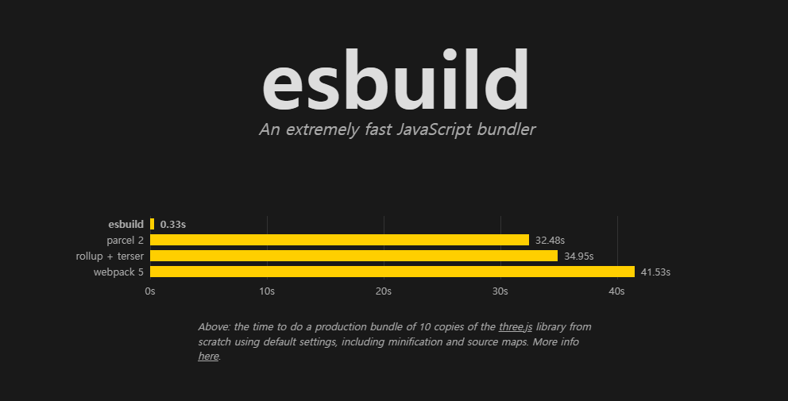
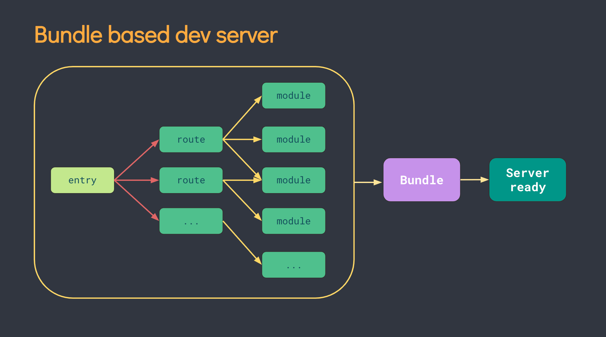
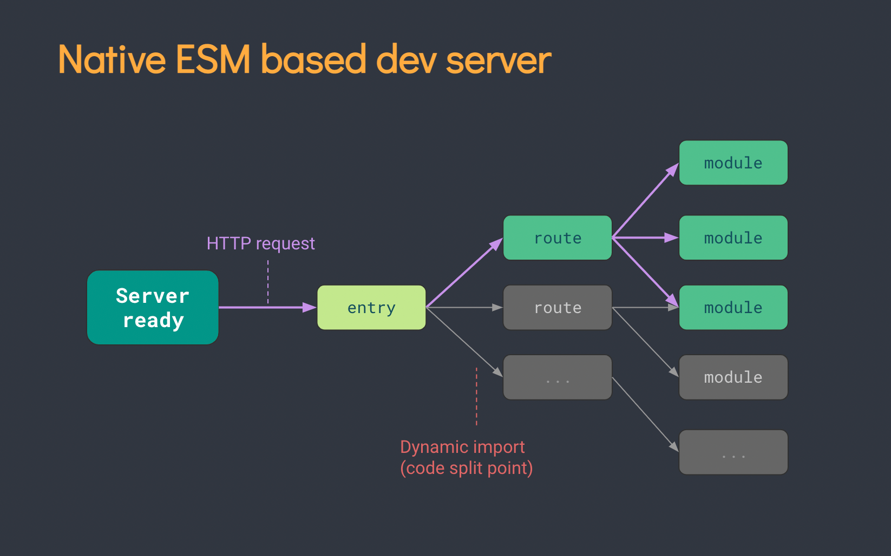

지금까지 주로 리액트 프로젝트나 사이드 프로젝트에서 리액트로 개발할 때, CRA를 통해서 프로젝트를 생성했다. `CRA`는 리액트 팀이 공식적으로 추천하는 보일러 플레이트로, HMR(Hot Module Replacement)와 같은 기능을 제공하고, 웹팩(webpack), 바벨(babel), ESlint 등을 포함하고 있고, 기본 config까지 해준다.

자바스크립트는 인터프리터 언어이기 때문에 기본적으로 느린 단점을 가지고 있다. 웹팩(webpack)은 자바스크립트로 구성된 툴이기 때문에 느리다는 단점도 그대로 가지고 있다. 하지만 `esbuild`의 경우, `Go`언어로 작성된 빌드 툴로 속도가 무지 빠르다는 장점을 가지고 있다.

`Vite` 는 `Esbuild` 를 기반으로 만들어진 프론트엔드 빌드 툴로 자바스크립트 코드를 모두 번들할 필요 없이 브라우저에서 자바스크립트 어플리케이션을 작동시킬 수 있도록 한다. ES 모듈로 브라우저가 필요하는 코드의 일부분만 변환하고 제공한다는 것이 핵심이다.

개발 모드 빌드 시, `Vite` 는 자바스크립트 모듈을 의존성 모듈과 소스코드로 나누어 빌드한다.

- **의존성 모듈**의 경우, `node_modules` 폴더에서 import 되는 모듈이고 개발 중에는 자주 바뀌지 않는다. 이 부분은 `esbuild`를 통해 처리된다. 웹팩이 브라우저의 요청 이전에 모든 자바스크립트 모듈을 처리하지만, `Vite`는 브라우저 요청 전 의존성 모듈만 미리 번들링 한다.
- **소스코드는 `.jsx`, `.vue`와 같은 라이브러리 관련 확장자를 포함하며 자주 수정되는데, `native ESM`**을 통해 소스코드를 제공해서 브라우저로 하여금 번들러 작업 일부를 넘겨 받게 한다. 브라우저의 요청이 있을 시에만 소스코드를 변환하고 제공한다.

## Webpack과 Vite의 차이

HMR은 나머지 페이지에 영향없이, 특정 모듈만 즉시 반영 시켜주는 기능인데, 프로젝트의 크기가 커질수록 속도가 저하되는 경향이 있다. 하지만 `Vite`는 네이티브 ESM기반으로 HMR을 구현하므로 수정된 모듈 관련 부분만 교체하기 때문에 어플리케이션 크기와 관계없이 빠르게 HMR이 이뤄지도록 한다.

## 정리

- 번들링을 생략하여 개발 서버를 빠르게 구동시킨다.
- 더 빠른 리로딩과 캐싱을 위해 HTTP 상태 코드를 활용한다.
- HMR을 위해 native ESM을 사용한다. 더 빠른 HMR이 가능하다.
- 최소한의 config로도 사용 가능하다.

---

출처

1. [CRA vs Vite](<[https://velog.io/@jaewoneee/리액트-보일러플레이트-Create-React-App-vs-Vite](https://velog.io/@jaewoneee/%EB%A6%AC%EC%95%A1%ED%8A%B8-%EB%B3%B4%EC%9D%BC%EB%9F%AC%ED%94%8C%EB%A0%88%EC%9D%B4%ED%8A%B8-Create-React-App-vs-Vite)>)
