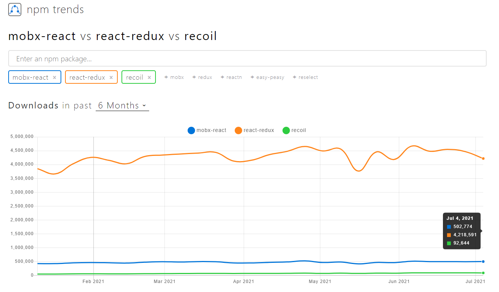
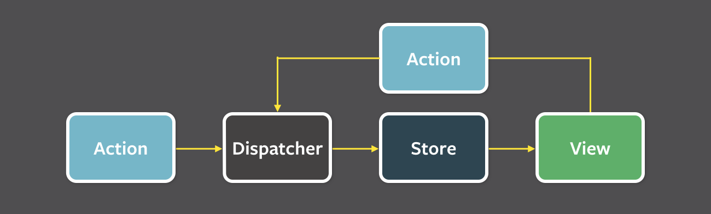
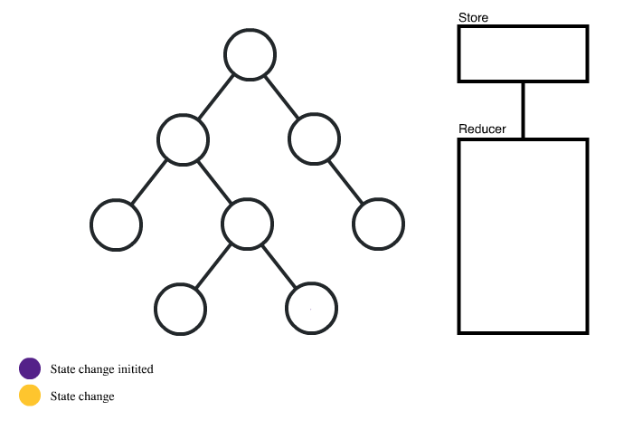
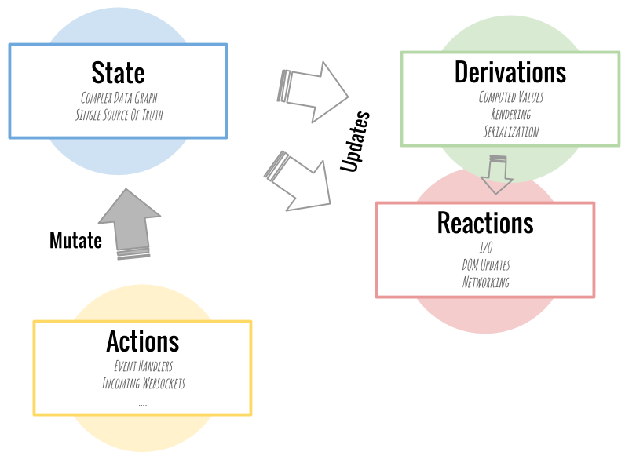

React 전역 상태관리 라이브러리가 많이 등장하고 있는데, 대표적으로 가장 많이 쓰이는 라이브러리는 단연 Redux이다. 그리고 그 다음이 Mobx정도라고 할 수 있다. 그리고 최근에 페이스북에서 만든 상태관리를 위한 Recoil이 뜨고있다. 이러한 상황에서 나는 Redux정도만 사용해보았기 때문에 redux와 mobx, recoil을 비교하며 각각의 특징에 대해서 알아가면서, 어떠한 부분 때문에 Recoil이 등장하여 주목받고 있는지에 초점을 맞춰 알아보려고 한다.



일단 `npm trends`를 통한 최근 추세를 보면 redux가 압도적으로 많이 사용되고 있고, mobx나 recoil은 상대적으로 적은 부분을 차지한다. 하지만 수치적으로 봤을 때, mobx나 recoil도 꾸준한 증가세를 보이고 있는 라이브러리이다.

## Redux


먼저 Redux에 대해 살펴보자면 아래 다이어그램을 통해 흐름을 이해 해볼 수 있다. Redux를 사용하기 위해서는 Action, Reducer, Dispatcher, Store, View 등에 대한 개념을 이해해야 한다. 위의 개념들을 통해 여러 컴포넌트에 사용되는 state를 분리 통합하여 관리할 수 있게 하고 애플리케이션의 안정성을 높일 수 있는 라이브러리이다.



### 주요 개념

리덕스 라이브러리에 대한 기본적인 이해 부분은 [이전 포스트](<https://ykss.netlify.app/react/react_skills(8)/>)에서도 확인 가능하지만 짧게 정리해보자.

#### Action

Redux에서 Action은 state를 바꾸는 방식이다. 액션 객체를 가지고 있고, 반드지 type 필드가 있어야 한다.

#### Dispatch

Action을 발생시키는 것으로 action 객체를 파라미터로 받는다.

#### Reducer

변화를 일으키는 함수로 Action의 결과로 state를 어떤 식으로 바꿀지 구체적으로 정의하는 부분이다. 리듀서가 현재 상태와 전달받은 액션 객체를 파라미터로 받아서 새로운 상태로 반환해준다. 리듀서는 파라미터 외의 값을 의존하면 안되고, 이전 상태는 건드리지 않은 상태로 새로운 상태 객체를 만들어 반환하는 순수 함수여야 한다.

#### Store

프로젝트에 리덕스를 적용하기 위해 필요한 것으로 프로젝트에는 단 한 개의 Store만 가지며 상태의 중앙 저장소라고 할 수 있다. Store안에는 리듀서와 내장 함수 등이 포함되어 있다. dispatch와 subscribe 등도 스토어의 내장 함수이다. 상태를 읽을 때는 `getState()` , 상태를 바꿀 때는 `dispatch()`를 호출한다.



### Redux의 특징

- 상태를 전역적으로 관리하기 때문에 어느 컴포넌트에 상태를 둬야할지 고민할 필요가 없게 한다.

- 데이터 흐름을 단방향으로 흐르게 한다.
- 상태 관리에서 불변성 유지가 매우 중요하다. 상태를 읽기전용으로 취급한다. Immutable.js 와 같은 라이브러리가 쓰이기도 한다.
- flux 아키텍처를 따른다. (dispatch 관리를 위해 redux-thunk나 redux-saga와 같은 미들웨어가 필수이다.)
- 개념에 대한 이해가 선행되어야 하고, 여러 라이브러리를 함께 사용하는 경우가 있기 때문에 러닝커브가 높은 편이다.
- 액션을 하나 추가하는데, 작성 필요한 부분이 많고, 컴포넌트와 스토어를 연결하는 필수적인 부분들이 있어 코드량이 많아질 수 있다.

## Mobx


Mobx는 Redux와 비슷한 상태 관리 라이브러리이지만 Redux에 비해 간결하고 깔끔한 구조를 가지고 있다는 평가를 받는다. Mobx의 컨셉은 아래와 같다. 가장 큰 특징은 모든 상태 변화가 일어나는 부분을 자동으로 추적해주는 것이다.



### 주요 개념

#### State

Observable State로 관찰 받고 있는 데이터이다. Mobx에서는 해당 State가 관찰하고 있다가 변화가 일어나면 Reactions과 Derivations를 발생시킨다.

#### Derivations(Computed values)

기존의 상태가 변화에 따라 계산된(파생된) 값을 의미한다.

#### Reactions

Observable State의 변화에 따른 부가적인 변화를 의미하고 값이 바뀜에 따라 해야할 일을 정하는 것이다. Derivation과는 달리 값을 생성하지는 않고, 대체로 I/O와 관련된 작업을 하고, DOM업데이트와 네트워크 요청 등에 관여한다.

#### Action

상태를 변경시키는 모든 것을 의미한다. Mobx에서는 모든 사용자의 액션으로 발생하는 상태 변화들이 전부 Derivations와 Reactions로 처리되도록 한다.

### Mobx의 특징

- React에 종속적인 라이브러리가 아니고, Redux와 다르게 store에 제한이 없다.
- observable을 기본적으로 사용하고, 절대적으로 필요한 경우에만 state를 변경한다.

- 객체 지향적이다. 그렇기 때문에 서버 개발자들에게 친숙한 아키텍쳐를 제공할 수 있다. 특히 JAVA Spring과 유사하다.
- JAVA의 annotation과 유사한 `decorator`를 제공한다. Redux에서 컴포넌트와 state를 연결하기 위해 사용하는 `mapStateToProps`, `mapDispatchToProps` 등의 보일러플레이트 코드가 사라지고 데코레이터를 통해 깔끔한 코드 작성이 가능하다. Mobx 스토어와 React 컴포넌트를 연결하는게 @inject 데코레이터 하나로 가능하다.
- 캡슐화가 가능하다. Mobx Config 설정을 통해 State를 오직 메서드를 통해서만 변경할 수 있도록 Private하게 관리 가능하다.
- State의 불변성 유지를 위해 노력하지 않아도 된다. Redux에서는 state의 불변성 유지를 위해 여러 라이브러리를 사용하기도 하는데, Mobx에서는 그러지 않아도 된다.

## Recoil


Recoil은 context API 기반으로 구현된 함수형 컴포넌트에서만 사용 가능한 페이스북에서 만든 라이브러이이다. 호환성이나 단순함을 위해선 React에 내장된 상태 관리 기능을 사용하는게 가장 바람직하다고 할 수 있다. 예를들을 Hooks나 Context API를 사용하여 상태 관리를 할 수 있는데, 그런 경우에 여러가지 한계가 존재한다.

- 컴포넌트 상태를 공통된 상위 컴포넌트까지 끌어올려 공유할 수 있지만, 이 과정에서 거대한 트리가 리렌더링 되기도 한다.
- Context는 단일 값만 저장 가능하고, 자체 Consumer를 가지는 여러 값들의 집합을 담는 것은 불가하다.
- 위 특성으로 인해 state가 존재하는 곳 부터 state가 사용되는 곳 까지 코드 분할이 어렵게된다.

이러한 상황에서 Recoil은 React스러움을 유지하며 개선하는 방식의 라이브러리이다. Recoil은 방향 그래프를 정의하고 리액트 트리에 붙이는데, 이 그래프의 뿌리(atom)으로 부터 순수 함수(selector)를 거쳐 컴포넌트로 흐른다.

- 공유되는 상태도 리액트의 로컬 상태처럼 간단하게 get/set 인터페이스 가능하도록 API가 제공된다.
- 동시성 모드(Concurrent Mode)등 여러 React 기능들과 호환 가능하다.
- 상태 정의는 증분 및 분산되어 code splitting 이 가능하다.

### 주요 개념

#### Atoms

Atoms는 Recoil에서 상태의 단위를 의미하고, 업데이트와 구독이 가능하다. atom이 업데이트되면 각각의 구독된 컴포넌트는 새로운 값을 반영해서 리렌더링된다. Atoms는 리액트의 로컬 state 대신 사용할 수 있다. 동일한 atom이 여러 컴포넌트에서 사용되는 경우 모든 컴포넌트는 상태를 공유한다. Atoms에는 고유한 키가 필요하고 이 키는 전역적으로 고유해야 한다. 그리고 react state처럼 디폴트 값도 가진다.

```jsx
const exampleState = atom({
  key: 'exampleState',
  default: null,
})
```

컴포넌트에서 atom을 읽고 쓸 때는 `useRecoilState`라는 훅을 사용해야한다. 이건 리액트의 `useState`와 비슷하나, 상태가 컴포넌트간에 공유될 수 있다는 점에서 차이가 있다. 아래 두 컴포넌트의 state는 공유된다.

```jsx
function ExampleButton() {
  const [exampleSize, setExampleSize] = useRecoilState(exampleState)
  return (
    <button
      onClick={() => setExampleSize(size => size + 1)}
      style={{ exampleSize }}
    >
      Click to Enlarge
    </button>
  )
}

function Text() {
  const [exampleSize, setExampleSize] = useRecoilState(exampleState)
  return <p style={{ exampleSize }}>This text will increase in size too.</p>
}
```

#### Selectors

Selector는 atoms나 다른 selectors를 입력으로 받는 순수 함수(pure function) 이다. 상위 atoms이나 selectors가 업데이트 될 경우 하위 selectors도 재 실행된다. 컴포넌트는 atom 뿐만 아니라 selectors를 구독할 수 있고, 구독하고 있는 selectors가 변경되면 구독한 컴포넌트도 리렌더링된다. Selectors는 상태를 기반으로 데이터를 계산하고 최소한의 상태 집합만 atoms에 저장하고, 파생 데이터는 selector에서 계산하면서 불필요한 상태를 만들어내지 않는다. 컴포넌트 관점에서 atoms와 selectors는 동일한 인터페이스이므로 대체 가능하다.

```jsx
const exampleLabelState = selector({
  key: 'exampleState',
  get: ({ get }) => {
    const exampleSize = get(exampleState)
    const unit = 'px'

    return `${exampleSize}${unit}`
  },
})
```

여기서 `get`속성은 계산될 함수를 의미하고 전달되는 `get`인자를 통해 atoms와 다른 selectors에 접근 가능하다. 여기서 접근하면 자동으로 종속 관계가 생성되어 참조했던 atoms나 selectors가 업데이트되면 이 함수도 재실행된다.

Selectors는 `useRecoilValue()`를 통해 조회 가능하다. `useRecoilState`와는 다르게 writable 하지 않고, 반환 값의 조회만 가능하다. 필요하다면 writable한 selector 작성도 가능하다.

### Recoil 특징

1. 비동기 처리를 기반으로 작성되어 동시성 모드를 제공하기 때문에, Redux와 같이 다른 비동기 처리 라이브러리에 의존할 필요가 없다.

   > Concurrent Mode : 흐름이 여러 개가 존재하는 경우이다. 리액트에서 렌더링의 동작 우선순위를 정하여 적절한 때에 렌더링해준다.

2. atom -> selector를 거쳐 컴포넌트로 전달되는 하나의 data-flow를 가지고 있어, 복잡하지 않은 상태 구조를 가지고 있다.

3. atom과 selector만 알고도 어느정도 구현이 가능하기 때문에 러닝커브가 비교적 낮다고 할 수 있다.

4. store와 같은 외부 요인이 아닌 React 내부의 상태를 활용하고 context API를 통해 구현되어있기 때문에 더 리액트에 가까운 라이브러리라고 할 수 있다.

## 정리

기존 Redux가 주로 사용되면서 불편함들을 개선하기 위해, 또는 다른 방식으로 문제를 해결하기 위해 Mobx가 등장하였고, 또 뒤의 두 라이브러리의 불편함이나 문제를 개선하기 위해 Recoil이 등장했다고 생각한다. 각각의 라이브러리의 장점과 단점이 있지만, Recoil은 기존 React 내장 Hooks의 사용하는 방식과 크게 다르지 않고 유사하기 때문에 쉽게 배우고 활용할 수 있다는 부분에서 큰 장점이 있다고 생각한다. 그리고 그러면서도 전역 상태관리가 더 쉽고 편리하게 이루어질 수 있다는 점에서 앞으로 점점 더 많이 사용될 것으로 예상해본다.

---

### 출처

1. [Recoil 공식 도큐멘테이션](https://recoiljs.org/)
2. [리액트개발자가 겪게되는일](https://repo.yona.io/doortts/blog/post/297)
3. [React에서 Mobx 경험기 (Redux와 비교기)](https://techblog.woowahan.com/2599/)

4. [React에서 Redux가 왜 필요할까?](https://devlog-h.tistory.com/26)
