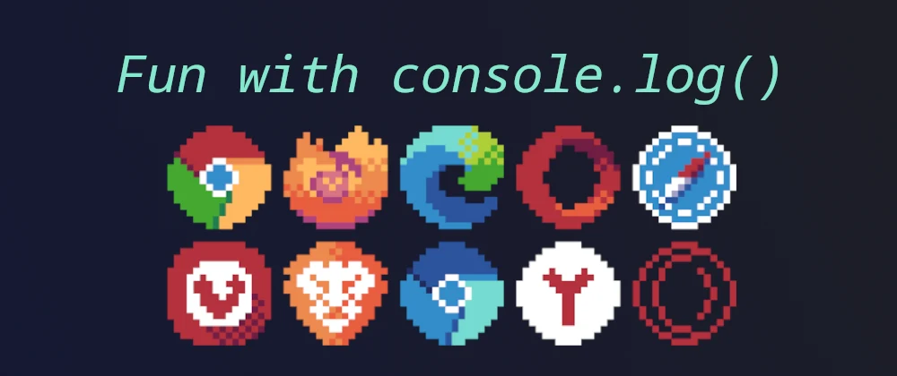

> 원문: [Fun with console.log()💿](https://dev.to/lissy93/fun-with-consolelog-3i59)

여러분이 웹 앱을 개발한 적이 있다면, [`console.log(...)`](https://developer.mozilla.org/en-US/docs/Web/API/Console/log)가 익숙 하실겁니다. 이 메서드는 개발자 콘솔에 데이터를 출력하며, 디버깅과 로깅, 그리고 테스트에 유용합니다.

`console.log(console)`을 실행하면, 여러분은 [`console`](https://developer.mozilla.org/en-US/docs/Web/API/Console) 객체에 훨씬 더 많은 것이 있음을 알 수 있습니다.

이 포스트에서는 여러분의 로깅 경험을 향상할 수 있는 10가지 유용한 요령을 간략하게 설명합니다.

#### 목차

- [Tables](#tables)
- [Groups](#groups)
- [Styles](#styled-logs)
- [Times](#time)
- [Asserts](#assert)
- [Counts](#count)
- [Traces](#trace)
- [Directory](#dir)
- [Debugs](#debug)
- [로그 수준](#로그-수준)
- [다중 값 로그](#다중-값-로그)
- [로그 문자열 형식](#로그-문자열-형식)
- [Clear](#clear)
- [특별한 브라우저 메서드](#특별한-브라우저-메서드)

## Tables

[`console.table()`](https://developer.mozilla.org/en-US/docs/Web/API/Console/table) 메서드는 객체/배열을 깔끔한 형식의 테이블로 출력합니다.

```js
console.table({
  'Time Stamp': new Date().getTime(),
  OS: navigator['platform'],
  Browser: navigator['appCodeName'],
  Language: navigator['language'],
});
```


## Groups

[`console.group()`](https://developer.mozilla.org/en-US/docs/Web/API/Console/group) 사용하여 관련된 콘솔 문을 접을 수 있는 섹션과 함께 그룹화할 수 있습니다.

문자열을 매개 변수로 전달하여 선택적으로 섹션에 제목을 지정할 수 있습니다. 콘솔에서 섹션을 접고 펼칠 수 있지만, `group` 대신 `groupCollapsed`를 사용하여 기본적으로 접힌 채로 표시할 수도 있습니다. 섹션 내에 하위 섹션을 중첩하는 것도 가능하지만 `groupEnd`를 사용하여 각 그룹을 닫아야 하는 것을 기억하세요.

다음 예에서는 일부 정보가 포함된 열린 섹션을 출력합니다.

```js
console.group('URL Info');
console.log('Protocol', window.location.protocol);
console.log('Host', window.origin);
console.log('Path', window.location.pathname);
console.groupCollapsed('Meta Info');
console.log('Date Fetched', new Date().getTime());
console.log('OS', navigator['platform']);
console.log('Browser', navigator['appCodeName']);
console.log('Language', navigator['language']);
console.groupEnd();
console.groupEnd();
```


## Styled Logs

색상, 글꼴, 텍스트 스타일 및 크기와 같은 기본 CSS로 로그 출력을 스타일링할 수 있습니다. 이에 대한 브라우저 지원은 꽤 다양합니다.

예를 들어 다음 코드를 실행해보세요.

```js
console.log(
  '%cHello World!',
  'color: #f709bb; font-family: sans-serif; text-decoration: underline;'
);
```

아래와 같은 결과가 출력된 것을 볼 수 있습니다.


꽤 멋지지 않나요? 여러분이 할 수 있는 것이 훨씬 많습니다!

글꼴, 스타일, 배경색을 변경하거나 그림자나 곡선을 추가할 수도 있습니다.


여기 제가 개발자 대시보드에서 사용하는 것과 유사한 것이 있습니다. 코드는 [여기](https://github.com/Lissy93/dashy/blob/master/src/utils/CoolConsole.js) 있습니다.


## Time

또 다른 일반적인 디버깅 기법은 실행 시간을 측정하여 작업에 걸리는 시간을 추적하는 것입니다. 이는 [`console.time()`](https://developer.mozilla.org/en-US/docs/Web/API/Console/time)을 사용하여 타이머를 시작하고 매개변수로 레이블을 전달한 다음, 동일한 레이블을 매개변수로 [`console.timeEnd()`](https://developer.mozilla.org/en-US/docs/Web/API/console/timeEnd)를 사용하여 타이머를 종료할 수 있습니다. 또한 [`console.timeLog()`](https://developer.mozilla.org/en-US/docs/Web/API/console/timeLog)를 사용하여 장기 실행 작업 내에 마커를 추가할 수도 있습니다.

```js
console.time('concatenation');
let output = '';
for (var i = 1; i <= 1e6; i++) {
  output += i;
}
console.timeEnd('concatenation');
```

```bash
concatenation: 1206ms - timer ended
```


성능 탭 내에 마커를 추가하는 비표준 메서드인 [`console.timeStamp()`](https://developer.mozilla.org/en-US/docs/Web/API/console/timeStamp)도 있습니다. 이 메서드는 페인트 및 레이아웃 이벤트와 같이 타임라인에 기록된 다른 이벤트들과 코드의 특정 지점을 함께 연관시킬 수 있습니다.

## Assert

오류가 발생하거나 특정 조건이 참 또는 거짓인 경우에만 콘솔에 기록할 수 있습니다. 이 작업은 [`console.assert()`](https://developer.mozilla.org/en-US/docs/Web/API/console/assert)를 사용하여 수행할 수 있으며, 첫 번째 매개 변수가 `false`가 아니면 콘솔에 아무것도 기록하지 않습니다.

첫 번째 매개 변수는 체크할 부울 조건이며, 그다음 매개 변수는 출력하고자 하는 0개 혹은 많은 데이터 지점들입니다. 그리고 마지막 매개 변수는 출력할 메시지입니다. 따라서 `console.assert(false, 'Value was false')` 첫 번째 매개 변수가 `false`이기 때문에 메시지를 출력합니다.

```js
const errorMsg = 'the # is not even';
for (let num = 2; num <= 5; num++) {
  console.log(`the # is ${num}`);
  console.assert(num % 2 === 0, { num }, errorMsg);
}
```


## Count

로깅을 위해 수동으로 숫자를 증가시킨 적이 있으신가요? [`console.count()`](https://developer.mozilla.org/en-US/docs/Web/API/console/count)는 어떤 것이 실행된 횟수 또는 코드 블록이 입력된 빈도를 추적하는 데 유용합니다.

선택적으로 카운터에 레이블을 지정하여 여러 카운터를 관리하고 출력을 더 명확하게 만들 수 있습니다.

카운터는 항상 1부터 시작합니다. [`console.countReset()`](https://developer.mozilla.org/en-US/docs/Web/API/console/countReset)을 사용하여 언제든지 카운터를 리셋할 수 있습니다. 이 경우도 레이블 매개 변수를 선택적으로 사용할 수 있습니다.

다음 코드는 각 항목에 대한 카운터를 증가시키며, 최종값은 8이 됩니다.

```js
const numbers = [1, 2, 3, 30, 69, 120, 240, 420];
numbers.forEach(name => {
  console.count();
});
```

다음은 레이블이 지정된 카운터의 출력 예입니다.


레이블을 전달하는 대신 값을 사용하면 각 조건 값에 대해 별도의 카운터를 가질 수 있습니다. 아래는 예시입니다.

```js
console.count(NaN); // NaN: 1
console.count(NaN + 3); // NaN: 2
console.count(1 / 0); // Infinity: 1
console.count(String(1 / 0)); // Infinity: 2
```

## Trace

자바스크립트에서 우리는 종종 깊게 중첩된 메서드와 객체를 사용합니다. [`console.trace()`](https://developer.mozilla.org/en-US/docs/Web/API/console/trace)를 사용하여 스택 추적을 할 수 있고, 특정 지점에 도달하기 위해 호출된 메서드를 출력할 수 있습니다.


선택적으로 스택 추적과 함께 출력될 데이터를 전달할 수 있습니다.

## Dir

콘솔에 큰 객체를 로깅하는 경우, 그것은 읽기 어려울 수 있습니다. [`console.dir()`](https://developer.mozilla.org/en-US/docs/Web/API/console/dir) 메서드를 사용하여 확장 가능한 트리 구조로 형식을 지정합니다.

다음은 디렉터리 스타일 콘솔 출력의 에시입니다.


[`console.dirxml()`](https://developer.mozilla.org/en-US/docs/Web/API/console/dirxml)을 사용하여 유사한 방법으로 XML 또는 HTML 기반 트리를 인쇄할 수도 있습니다.

## Debug

엡 내에 여러분이 개발 중에 사용하는 몇몇 로그가 설정되어 있을 수 있지만, 그것들이 사용자에게 보이기를 원하지 않습니다. 로그 구문을 [`console.debug()`](https://developer.mozilla.org/en-US/docs/Web/API/console/debug)로 대체하면 `console.log`와 정확히 같은 방식으로 작동하지만, 빌드 시스템에서 제거되거나 프로덕션 모드에서 실행될 때는 비활성화됩니다.

## 로그 수준

브라우저 콘솔에는 여러 필터(정보, 경고, 에러)가 있으며, 이를 통해 로그된 데이터의 상세 정도를 변경할 수 있습니다. 이러한 필터를 사용하려면 다음 중 하나를 사용하여 로그 구문을 전환하십시오.

- [`console.info()`](https://developer.mozilla.org/en-US/docs/Web/API/console/info) - 로깅 목적의 정보성 메시지로, 일반적으로 작은 "i"와/또는 파란색 배경을 포함합니다.
- [`console.warn()`](https://developer.mozilla.org/en-US/docs/Web/API/console/warn) - 경고 / 치명적이지 않은 오류를 나타내며, 일반적으로 삼각형 느낌표 마크 와/또는 노란색 배경을 포함합니다.
- [`console.error()`](https://developer.mozilla.org/en-US/docs/Web/API/console/error) - 기능에 영향을 미칠 수 있는 오류를 나타내며, 일반적으로 원형 느낌표와/또는 빨간 배경을 포함합니다.

Node.js에서 서로 다른 로그 레벨은 운영 환경에서 실행될 때 서로 다른 스트림에 기록됩니다. 예를 들어 운영 환경에서 `error()`는 `stderr`에 기록되고 `log`는 `stdout`에 출력되지만, 개발 환경에서는 모두 정상적으로 콘솔에 표시됩니다.

## 다중 값 로그

`console` 객체는 대부분 여러 매개 변수를 허용하므로 출력에 레이블을 추가하거나 한 번에 여러 데이터 지점을 출력할 수 있습니다. 예시는 다음과 같습니다. `console.log('User: ', user.name);`

그러나 레이블이 지정된 여러 값을 인쇄하는 더 쉬운 접근법은 [구조 분해 할당(object deconstructing)](https://developer.mozilla.org/en-US/docs/Web/JavaScript/Reference/Operators/Destructuring_assignment)을 사용하는 것입니다. 예를 들어, `x`,`y`,`z`와 같은 세 개의 변수가 있는 경우, 각 변수 이름과 값이 출력되도록 `console.log({x, y, z});`와 같이 중괄호로 둘러싸서 객체로 로깅 할 수 있습니다.


## 로그 문자열 형식

출력할 형식 문자열을 빌드해야 하는 경우, 형식 지정자를 사용하여 C언어 스타일 printf를 사용할 수 있습니다.

다음과 같은 지정자들이 지원됩니다.

- `%s` - 문자열 또는 문자열로 변환되는 다른 모든 타입
- `%d` / `%i` - 정수
- `%f` - 실수
- `%o` - 최적의 형식 사용
- `%O` - 기본 형식 사용
- `%c` - 사용자 정의 형식 사용 ([더 많은 정보](#styled-logs))

예시

```js
console.log(
  'Hello %s, welcome to the year %d!',
  'Alicia',
  new Date().getFullYear()
);
// Hello Alicia, welcome to the year 2022!
```

물론 [템플릿 리터럴](https://developer.mozilla.org/en-US/docs/Web/JavaScript/Reference/Template_literals)을 사용하여 동일한 작업을 수행할 수도 있습니다. 짧은 문자열의 경우 템플릿 리터럴 방식이 더 읽기 쉽습니다.

## Clear

마지막으로 이벤트에서 출력을 찾을 때, 여러분은 페이지가 처음 로딩되면서 콘솔에 로그 된 모든 것을 제거하고 싶을 수 있습니다. 이 작업은 [`console.clear()`](https://developer.mozilla.org/en-US/docs/Web/API/console/clear)를 사용하여 수행할 수 있으며, 모든 내용을 지우지만, 어떤 데이터도 초기화하지 않습니다.

일반적으로 휴지통 아이콘을 클릭하여 콘솔을 지울 수 있고, 필터 텍스트 입력을 통해 콘솔을 검색할 수도 있습니다.

## 특별한 브라우저 메서드

브라우저 콘솔에서 직접 코드를 실행할 때, 디버깅, 자동화 및 테스트에 매우 유용한 몇 가지 간단한 메서드를 사용할 수 있습니다.

그중 가장 유용한 것들은 다음과 같습니다.

- `$()` - `Document.querySelector()`의 약어입니다. (DOM 요소를 선택하기 위한 jQuery 스타일)
- `$$()` - 위와 동일하지만, 배열에서 여러 요소를 반환할 때 모두를 선택(`selectAll`) 합니다.
- `$_` - 마지막으로 평가된 식의 값을 반환합니다.
- `$0` - 검사 창에서 가장 최근에 선택한 DOM 요소를 반환합니다.
- `$1`...`$4`를 사용하여 이전에 선택한 UI 요소를 가져올 수 있습니다.
- `$x()` - Xpath 쿼리를 사용하여 DOM 요소를 선택할 수 있습니다.
- `keys()` 와 `values()` - Object.getKeys()의 약어로 객체의 키 또는 값의 배열을 반환합니다.
- `copy()` - 클립보드에 내용을 복사합니다.
- `monitorEvents()` - 지정된 이벤트가 발생할 때마다 명령을 실행합니다.
- `console.table()`과 같은 특정 공통 콘솔 명령의 경우, 앞에 `console.`을 입력할 필요 없이, `table()`만 입력해도 됩니다.

여기에 더 많은 콘솔 단축 커맨드가 존재하며 [전체 리스트는 이것입니다.](https://developer.chrome.com/docs/devtools/console/utilities/)

> **경고** 이것은 개발자 도구 콘솔에서만 작동하며, 여러분의 코드에서는 작동하지 않습니다!

## 그리고 좀 더...

콘솔에 로깅할 수 있는 작업은 훨씬 더 많습니다! 자세한 내용은 [MDN `console` 문서](https://developer.mozilla.org/en-US/docs/Web/API/console) 또는 [크롬 개발자 콘솔 문서](https://developer.chrome.com/docs/devtools/console/api/)에서 확인하세요.

아래는 모범 사례에 대한 간략한 참고 사항입니다.

- console.log 구문이 메인 브랜치에 병합되지 않도록 lint 룰을 정의하세요.
- 환경에 따라 디버그 로그를 활성화/비활성화하고 적절한 로그 수준을 사용하여 모든 형식을 적용할 수 있는 래퍼(wrapper) 함수를 작성하세요. 이것은 또한 코드 업데이트가 한 곳에서만 필요한 서드파티(third-party) 로깅 서비스와 통합하는 데도 사용할 수 있습니다.
- 민감한 정보를 로그로 남기지 마세요. 브라우저 로그는 설치된 확장 프로그램에 의해 캡처될 수 있기 때문에 안전한 것으로 간주해서는 안 됩니다.
- 필터링 및 비활성화를 더 쉽게 만들기 위해 항상 올바른 로그 수준(`info`,`warn`,`error`와 같은)을 사용하세요.
- 필요한 경우, 시스템에서 로그를 구문 분석할 수 있도록, 일관된 형식을 따르세요.
- 항상 짧고 의미 있는 영문 로그 메시지를 작성하세요.
- 로그 안에 맥락 또는 범주를 포함하세요.
- 너무 남용하지 말고, 유용한 정보만 로그로 남기세요.

> 🚀 한국어로 된 프런트엔드 아티클을 빠르게 받아보고 싶다면 Korean FE Article(https://kofearticle.substack.com/)을 구독해주세요!
