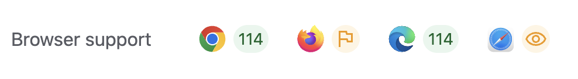

> 원문: [Introducing the popover API](https://developer.chrome.com/blog/introducing-popover-api/)

팝오버는 웹의 모든 곳에 있습니다. 메뉴, 토글 팁, 대화 상자(dialog)에서 볼 수 있으며, 계정 설정, 정보 표시 위젯, 제품 카드 미리 보기 등의 형태로 나타납니다. 이러한 컴포넌트가 널리 사용되고 있음에도 불구하고 브라우저에서 이러한 컴포넌트를 구축하는 것은 의외로 여전히 번거롭습니다. 포커스, 열기 및 닫기 상태, 컴포넌트에 액세스 가능한 훅, 진입 및 종료를 위한 키보드 바인딩을 추가해야 합니다. 이 모든 것은 팝오버의 유용하고 고유한 핵심 기능을 구축하기 전에 필요한 작업입니다.

이 문제를 해결하기 위해 팝오버를 구축하기 위한 새로운 선언적 HTML API 세트가 Chromium 114의 `popover` API를 시작으로 브라우저에 제공될 예정입니다.

## 팝오버 속성

>  > [출처](https://developer.mozilla.org/en-US/docs/Web/HTML/Global_attributes/popover)

모든 복잡성을 직접 관리하지 않고 브라우저에서 [`popover` 속성](https://developer.mozilla.org/en-US/docs/Web/HTML/Global_attributes/popover)과 관련 기능 세트를 사용하여 처리하도록 할 수 있습니다. HTML 팝오버는 아래와 같은 사항을 지원합니다.

- **최상위 레이어로 끌어올려 줍니다.** 팝오버는 페이지의 다른 레이어 위에 [별도의 레이어](https://developer.chrome.com/blog/what-is-the-top-layer/)로 표시되므로 z-index를 찾느라 애쓸 필요가 없습니다.
- **외부 클릭 닫힘(light-dismiss) 기능이 포함되어 있습니다.** 팝오버 영역 외부를 클릭하면 팝오버가 닫히고 초점이 다시 돌아옵니다.
- **기본적인 포커스 관리를 지원합니다.** 팝오버 창을 열면 다음 탭이 팝오버 창 안에서 멈춥니다.
- **접근 가능한 키보드 바인딩을 지원합니다.** `esc` 키를 누르면 팝오버 창이 닫히고 포커스가 복구됩니다.
- **접근 가능한 컴포넌트 바인딩을 지원합니다.** 팝오버 요소를 팝오버 트리거에 의미적으로 연결합니다.

이제 자바스크립트를 사용하지 않고도 이러한 모든 기능이 포함된 팝오버를 만들 수 있습니다. 기본 팝오버에는 세 가지가 필요합니다.

1. 팝오버가 포함된 요소의 `popover`속성이 필요합니다.
2. 팝오버를 포함하는 요소의 `id`가 필요합니다.
3. 팝오버의 `id` 값과 동일한 값을 가진 팝오버를 여는 요소에 있는 `popovertarget`이 필요합니다.

```html
<button popovertarget="my-popover">Open Popover</button>

<div id="my-popover" popover>
  <p>I am a popover with more information.</p>
  <p></p>
</div>
```

이제 모든 기능을 갖춘 기본 팝오버가 완성되었습니다.

<iframe height="300" style="width: 100%;" scrolling="no" title="Simple default popover" src="https://codepen.io/web-dot-dev/embed/poxQPWP?default-tab=result" frameborder="no" loading="lazy" allowtransparency="true" allowfullscreen="true">
  See the Pen <a href="https://codepen.io/web-dot-dev/pen/poxQPWP">
  Simple default popover</a> by web.dev (<a href="https://codepen.io/web-dot-dev">@web-dot-dev</a>)
  on <a href="https://codepen.io">CodePen</a>.
</iframe>
<video muted="" loop="" controls="" autoplay="" width="740"> <source src="https://storage.googleapis.com/web-dev-uploads/video/HodOHWjMnbNw56hvNASHWSgZyAf2/8IO7BsdxF8ieyDG0qn0m.mp4" type="video/mp4"> </video>

이 팝오버는 추가 정보를 전달하거나 정보 표시 위젯으로 사용할 수 있습니다.

## 기본값 및 오버라이드

이전 코드 스니펫에서와 같이 기본적으로 `popovertarget`을 사용하여 팝오버를 설정하면 팝오버를 여는 버튼이나 요소가 팝오버를 열고 닫는 토글을 수행합니다. 그러나 `popovertargetaction`을 사용하여 명시적 팝오버를 만들 수도 있습니다. 이렇게 하면 기본 _토글_ 동작이 오버라이드됩니다. `popovertargetaction` 옵션에는 다음이 포함됩니다.

`popovertargetaction="show"` : 팝오버를 표시합니다. `popovertargetaction="hide"` : 팝오버를 숨깁니다.

`popvertargetaction="hide"`를 사용하면, 아래 예시와 같이 "닫기" 버튼이 포함된 팝오버를 만들 수 있습니다.

```html
<button popovertarget="my-popover" popovertargetaction="hide">
  <span aria-hidden="”true”">❌</span>
  <span class="sr-only">Close</span>
</button>
```

<iframe height="300" style="width: 100%;" scrolling="no" title="Simple default popover with close button" src="https://codepen.io/web-dot-dev/embed/OJBamvM?default-tab=result" frameborder="no" loading="lazy" allowtransparency="true" allowfullscreen="true">
  See the Pen <a href="https://codepen.io/web-dot-dev/pen/OJBamvM">
  Simple default popover with close button</a> by web.dev (<a href="https://codepen.io/web-dot-dev">@web-dot-dev</a>)
  on <a href="https://codepen.io">CodePen</a>.
</iframe>
<video muted="" loop="" controls="" autoplay="" width="740"> <source src="https://storage.googleapis.com/web-dev-uploads/video/HodOHWjMnbNw56hvNASHWSgZyAf2/BXZs8RR2ux2edU777Eh5.mp4" type="video/mp4"> </video>

## 자동 및 수동 팝오버

`popover` 속성을 단독으로 사용하는 것은 사실상 `popover="auto"`의 단축된 버전 입니다. 기본 `popover`는 열릴 때, 상위 팝오버를 제외한 다른 자동 팝오버를 강제로 닫습니다. 팝오버는 외부 클릭 닫힘 기능(light-dismiss)이나 닫기 버튼을 통해 닫을 수 있습니다.

반면, `popover=manual`로 설정하면 다른 유형의 팝오버인 수동 팝오버가 생성됩니다. 이 유형의 팝오버는 다른 유형의 요소를 강제로 닫지 않으며, 외부 클릭 닫힘(light-dismiss)으로도 닫히지 않습니다. 타이머 또는 명시적인 닫기 동작을 통해 닫아야 합니다. `popover=manual`에 적합한 팝오버 유형은 토스트 알림과 같이 나타나고 사라지지만, 페이지의 나머지 부분에 영향을 주지 않아야 하는 요소입니다.

<iframe height="300" style="width: 100%;" scrolling="no" title="Basic manual popover with close button" src="https://codepen.io/web-dot-dev/embed/mdzpGwq?default-tab=result" frameborder="no" loading="lazy" allowtransparency="true" allowfullscreen="true">
  See the Pen <a href="https://codepen.io/web-dot-dev/pen/mdzpGwq">
  Basic manual popover with close button</a> by web.dev (<a href="https://codepen.io/web-dot-dev">@web-dot-dev</a>)
  on <a href="https://codepen.io">CodePen</a>.
</iframe>
<video muted="" loop="" controls="" autoplay="" width="740"> <source src="https://storage.googleapis.com/web-dev-uploads/video/HodOHWjMnbNw56hvNASHWSgZyAf2/J9pcnrgxLu5rhxWSyid8.mp4" type="video/mp4"> </video>

위의 데모를 살펴보면 팝오버 영역 외부를 클릭해도 팝오버가 닫히지 않는 것을 확인할 수 있습니다. 또한 다른 팝오버가 열려있어도 닫지 않습니다.

차이점을 다시 정리해 보겠습니다.

`popover=auto`인 팝오버

- 팝오버가 열릴 때, 다른 팝오버를 강제로 닫습니다.
- 외부 클릭 닫힘(light-dismiss)이 가능합니다.

`popover=manual`인 팝오버

- 다른 요소를 강제로 닫지 않습니다.
- 외부 클릭 닫힘(light-dismiss)이 되지 않습니다. 토글 또는 닫기 버튼을 통해 닫아야 합니다.

## 팝오버 스타일링

지금까지 HTML의 기본 팝오버에 대해 배웠습니다. 하지만 `popover`와 함께 제공되는 몇 가지 멋진 스타일링 기능도 있습니다. 그중 하나가 `::backdrop` 스타일 지정 기능입니다.

`auto` 팝오버를 사용할 때, 이 레이어는 최상위 레이어(팝오버가 있는 위치) 바로 아래에 있는 레이어에 위치하며 나머지 페이지의 위에 위치합니다. 다음 예제는 `::backdrop`에 반투명 색상을 반영한 예시입니다.

```css
#size-guide::backdrop {
  background: rgb(190 190 190 / 50%);
}
```

<iframe height="300" style="width: 100%;" scrolling="no" title="Popover demo: Sizing Guide" src="https://codepen.io/web-dot-dev/embed/jOeKzpb?default-tab=result" frameborder="no" loading="lazy" allowtransparency="true" allowfullscreen="true">
  See the Pen <a href="https://codepen.io/web-dot-dev/pen/jOeKzpb">
  Popover demo: Sizing Guide</a> by web.dev (<a href="https://codepen.io/web-dot-dev">@web-dot-dev</a>)
  on <a href="https://codepen.io">CodePen</a>.
</iframe>
<video muted="" loop="" controls="" autoplay="" width="740"> <source src="https://storage.googleapis.com/web-dev-uploads/video/HodOHWjMnbNw56hvNASHWSgZyAf2/MYQK3USGS47wWw9yodA4.mp4" type="video/mp4"> </video>

> 기본적으로 팝오버는 2픽셀 테두리가 있고 UI 중앙에 위치하지만, 완전히 사용자가 직접 스타일을 정의할 수 있습니다! 다른 HTML 요소와 마찬가지로 팝오버의 크기, 배경, 페이지 내 위치 등을 변경 등의 스타일 지정이 가능합니다.

## `popover`와 `dialog`의 차이점

`popover` 속성은 그 자체로 시맨틱을 제공하지 않는다는 것을 유의하는 것이 중요합니다. 이제 `popover="auto"`를 사용하여 모달 대화창과 유사한 경험을 구축할 수 있지만, 두 가지에는 몇 가지 주요한 차이점이 있습니다.

`dialog.showModal`(모달 대화상자)로 열린 `dialog`요소는 모달을 닫으려면 명시적인 사용자 상호작용이 필요합니다. `popover`는 외부 클릭 닫기를 지원합니다. 그에 반해 `dialog` 모달은 외부 클릭 닫기를 지원하지 않습니다. 모달 대화상자는 페이지의 [나머지 부분을 비활성 상태로 만들지만](https://developer.chrome.com/articles/inert/), `popover`는 그렇지 않습니다.

<iframe height="300" style="width: 100%;" scrolling="no" title="Popover Demo: Product Cards" src="https://codepen.io/web-dot-dev/embed/BaqVrxg?default-tab=result" frameborder="no" loading="lazy" allowtransparency="true" allowfullscreen="true">
  See the Pen <a href="https://codepen.io/web-dot-dev/pen/BaqVrxg">
  Popover Demo: Product Cards</a> by web.dev (<a href="https://codepen.io/web-dot-dev">@web-dot-dev</a>)
  on <a href="https://codepen.io">CodePen</a>.
</iframe>
<video muted="" loop="" controls="" autoplay="" width="740"> <source src="https://storage.googleapis.com/web-dev-uploads/video/HodOHWjMnbNw56hvNASHWSgZyAf2/12t9jqC8VDxIiM5MIZb6.mp4" type="video/mp4"> </video>

위의 데모는 팝오버 동작이 있는 시맨틱 대화 상자입니다. 즉, 페이지의 나머지 부분은 비활성 상태가 아니며, 대화 상자 팝오버를 외부 클릭 닫기를 통해 닫을 수 있습니다. 다음 코드를 사용해서 팝오버 동작이 있는 이 대화 상자를 만들 수 있습니다.

```html
<button popovertarget="candle-01">Quick Shop</button>
<dialog popover id="candle-01">
  <button
    class="close-btn"
    popovertarget="candle-01"
    popovertargetaction="hide"
  >
    ...
  </button>
  <div class="product-preview-container">...</div>
</dialog>
```

> [WhatWG](https://github.com/whatwg/html/issues/3567)와 [OpenUI](https://github.com/openui/open-ui/issues/741) 커뮤니티 그룹은 현재 HTML 인체공학적으로 대화 요소를 여는 기능에 대해 논의하고 있습니다. 이 기능은 팝오버와 유사하지만, 페이지의 나머지 부분을 비활성화하는 등 앞서 나열한 대화 상자 기능을 유지합니다. `popover`, `dialog`와 `selectmenu`와 같은 새로운 요소의 미래를 위해 이 그룹을 지켜보세요.

## 곧 출시 예정

### 인터랙티브한 표시 및 제거

`display:none`과 애니메이션을 적용하는 기능이나 개별 프로퍼티에 애니메이션을 적용하는 기능, 최상위 레이어에 애니메이션을 적용하는 기능은 아직 브라우저에서 사용할 수 없습니다. 하지만 이 기능은 이번 릴리즈에 이어 곧 출시될 Chromium 버전에 추가될 예정입니다.

개별 프로퍼티에 애니메이션을 적용하고, `:popover-open` 및 `@starting-style`을 사용하면 변경 전 스타일과 변경 후 스타일을 설정하여 팝오버를 열고 닫을 때, 부드러운 전환이 가능하게 할 수 있습니다. 이전의 예시를 다시 살펴봅시다. 애니메이션을 넣거나 뺄 때 훨씬 부드러워 보이고 보다 유연한 사용자 경험을 지원합니다.

<iframe height="300" style="width: 100%;" scrolling="no" title="Popover demo: Sizing Guide - Animated" src="https://codepen.io/web-dot-dev/embed/OJBoLNb?default-tab=result" frameborder="no" loading="lazy" allowtransparency="true" allowfullscreen="true">
  See the Pen <a href="https://codepen.io/web-dot-dev/pen/OJBoLNb">
  Popover demo: Sizing Guide - Animated</a> by web.dev (<a href="https://codepen.io/web-dot-dev">@web-dot-dev</a>)
  on <a href="https://codepen.io">CodePen</a>.
</iframe>
<video muted="" loop="" controls="" autoplay="" width="740"> <source src="https://storage.googleapis.com/web-dev-uploads/video/HodOHWjMnbNw56hvNASHWSgZyAf2/nQfuhpV2iTuq7pQxq5Yg.mp4" type="video/mp4"> </video>

> 현재 구현은 유동적이지만 코드펜 데모를 클릭하여 최신 구문을 확인하고 Chrome Canary에서 _#experimental-web-platform-features_ 플래그를 켜서 사용해 보세요.

### 앵커 포지셔닝

팝오버는 뷰포트 기준으로 경고, 모달 또는 알림을 배치하려는 경우 유용합니다. 그러나 팝오버는 메뉴, 툴팁 및 다른 요소에 대해 상대적으로 위치를 지정해야 하는 기타 요소에도 유용합니다. 이때 CSS 앵커링이 유용합니다.

다음 원형 메뉴 데모는 팝오버 API와 [CSS 앵커 포지셔닝](https://developer.chrome.com/blog/tether-elements-to-each-other-with-css-anchor-positioning/)을 사용하여 팝오버 `#menue-items`이 항상 토글 트리거인 `#menu-toggle` 버튼에 앵커링 되도록 합니다.

앵커 설정은 팝오버 설정과 유사합니다.

```html
<button id="menu-toggle" popovertarget="menu-items">Open Menu</button>
<ul id="menu-items" popover anchor="menu-toggle">
  <li class="item">...</li>
  <li class="item">...</li>
</ul>
```

앵커에 `id`(이 예제에서는 `#menu-toggle`)를 지정하여 앵커를 설정한 다음, `anchor="menu-toggle"`을 사용하여 두 요소를 연결합니다. 이제 `anchor()`를 사용하여 팝오버의 스타일을 지정할 수 있습니다. 앵커 토글의 기준선에 고정된 중앙 팝오버 메뉴의 스타일은 다음과 같이 지정할 수 있습니다.

```css
#menu-items {
  bottom: calc(anchor(bottom));
  left: anchor(center);
  translate: -50% 0;
}
```

<iframe height="300" style="width: 100%;" scrolling="no" title="Radial Menu Popover" src="https://codepen.io/web-dot-dev/embed/XWxPBdr?default-tab=result" frameborder="no" loading="lazy" allowtransparency="true" allowfullscreen="true">
  See the Pen <a href="https://codepen.io/web-dot-dev/pen/XWxPBdr">
  Radial Menu Popover</a> by web.dev (<a href="https://codepen.io/web-dot-dev">@web-dot-dev</a>)
  on <a href="https://codepen.io">CodePen</a>.
</iframe>
<video muted="" loop="" controls="" autoplay="" width="740"> <source src="https://storage.googleapis.com/web-dev-uploads/video/HodOHWjMnbNw56hvNASHWSgZyAf2/imnWsuQJdoTY25mYakHM.mp4" type="video/mp4"> </video>

이제 토글 버튼에 고정되어 있고, 자바스크립트 없이도 팝오버의 모든 기능이 내장된 완전한 기능의 팝오버 메뉴를 사용할 수 있습니다!

> 사용 가능한 뷰포트 공간에 따라 메뉴의 위치를 바꾸는 `@try`문과 같은 CSS 앵커링의 새로운 기능은 훨씬 더 흥미롭습니다. 이 구현은 상황에 따라 달라질 수 있습니다. Chrome Canary에서 _#experimental-web-platform-features_ 플래그를 켜고 위의 코드펜 데모를 살펴보고 자세한 내용을 알아보세요.

## 결론

팝오버 API는 웹 애플리케이션을 더 쉽게 관리하고 기본적으로 더 쉽게 액세스할 수 있도록 하는 일련의 새로운 기능 중 첫 번째 단계입니다. 여러분이 팝오버를 어떻게 사용할지 기대됩니다!

### 추가적인 읽을거리

- [Dialogs and popovers seem similar. How are they different?](https://hidde.blog/dialog-modal-popover-differences/)
- [Semantics and the popover attribute](https://hidde.blog/popover-semantics/)
- [MDN documentation on popover](https://developer.mozilla.org/en-US/docs/Web/API/Popover_API)
- [OpenUI popover explainer](https://open-ui.org/components/popover.research.explainer/)

> 🚀 한국어로 된 프런트엔드 아티클을 빠르게 받아보고 싶다면 Korean FE Article(https://kofearticle.substack.com/)을 구독해주세요!
