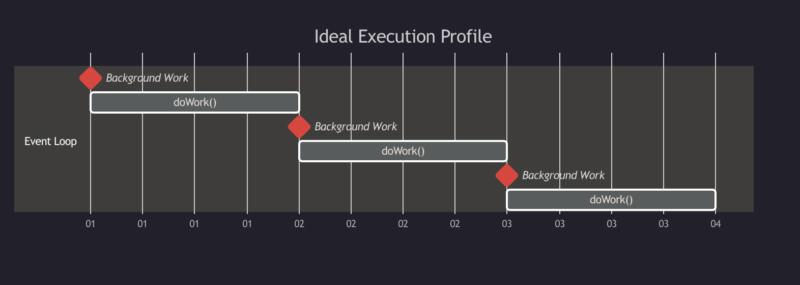
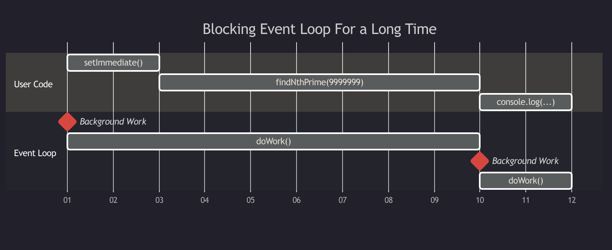
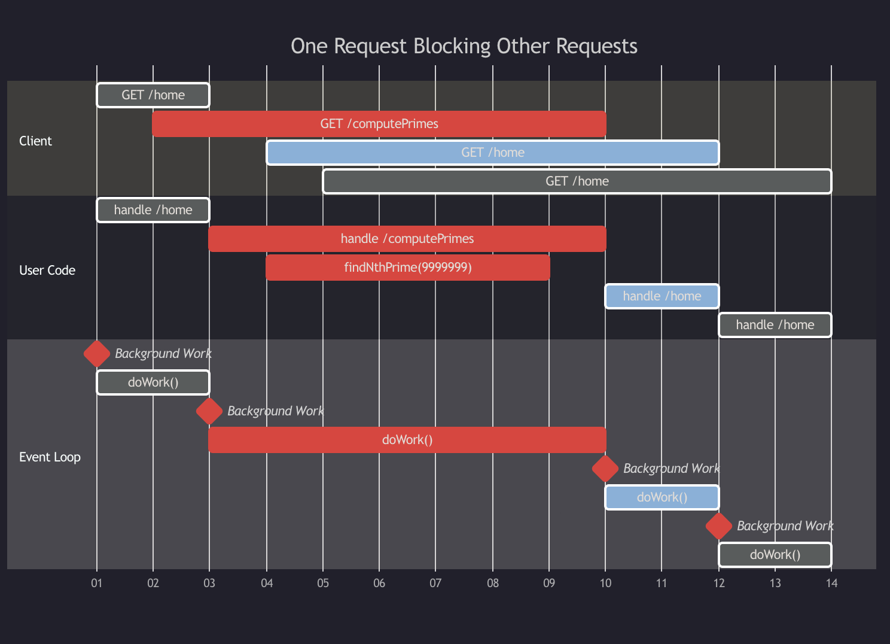
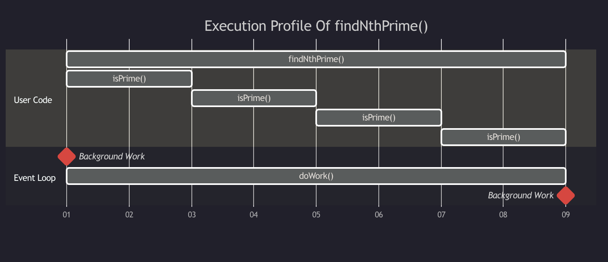
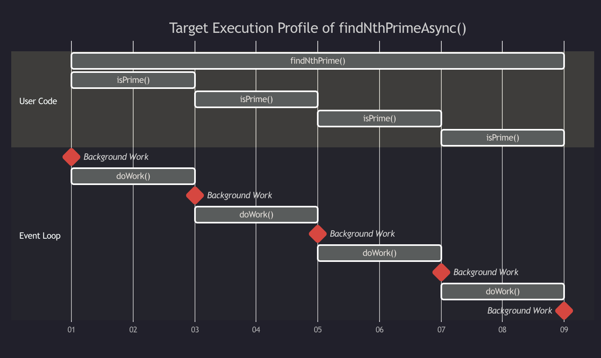
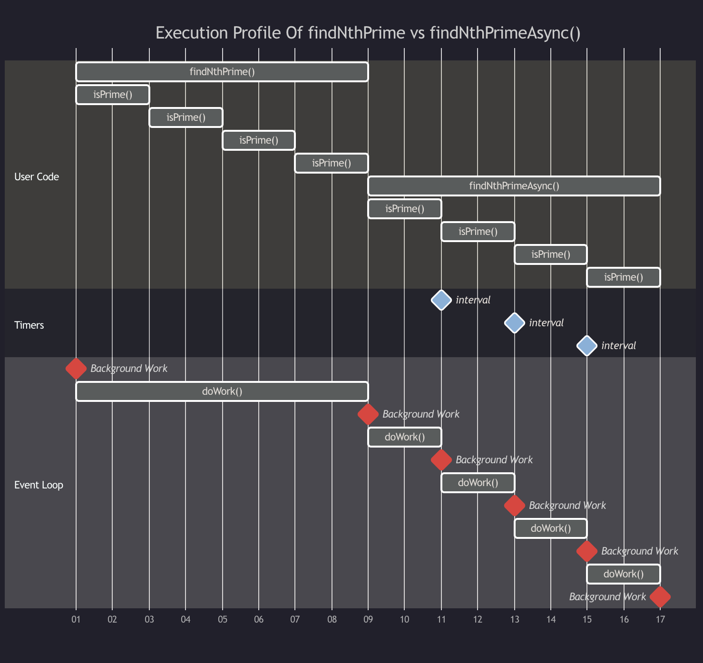
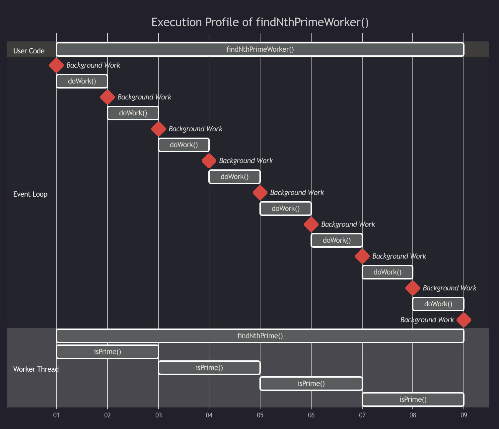

> 원문: [Practical Guide To Not Blocking The Event Loop](https://www.bbss.dev/posts/eventloop/)


자바스크립트는 이벤트 루프가 있는 단일 스레드 환경에서 실행되며, 이는 추론하기 매우 쉬운 아키텍처입니다. 이벤트 루프는 들어오는 작업을 실행하는 연속 루프이며 더 많은 작업을 수행하도록 스케줄링할 수 있습니다.

```javascript
while (hasWorkToDo) {
  /* 타이머와 I/O 콜백을 실행하고
     들어오는 연결을 확인하기도 하는 등
     여러 가지 작업이 수행됩니다.*/
  doWork();
}
```

동기식 작업은 즉시 실행되고, 비동기식 작업은 수행해야 할 동기식 작업이 없을 때(또는 간단히 말해서 _"나중에"_) 실행됩니다. 이상적으로는 애플리케이션의 실행 프로파일에서 백그라운드 작업(예: 새 연결 수락, 타이머 실행 등)을 수행하기 위해 이벤트 루프가 자주 실행되도록 허용해야 합니다.



이 설계는 동기식 작업을 수행하는 것이 *큰 문제*라는 것을 의미합니다. 동기식 작업이 실행되는 동안 이벤트 루프는 어떤 작업도 수행할 수 없습니다.

```javascript
/* setImmediate는 이벤트 루프에
   콜백 함수를 등록합니다. */
setImmediate(() => {
  console.log('This will at some point in the future');
});
/* 끝을 확인할 수 없는
   동기식 작업 입니다. */
findNthPrime(9999999);
```



서버 환경에서는 이러한 요청 하나가 다른 모든 요청을 무기한 차단할 수 있습니다.

```js
/* /computePrimes 경로로 요청이 전송된 경우,
   이 경로는 (절대) 응답을 전송할 수 없고,
   타임 아웃이 발생합니다. */
app.get('/home', () => {
  return response('Welcome Home!');
});

app.get('/computePrimes', () => {
  /* 끝을 확인할 수 없는
     동기식 작업입니다. */
  return response(findNthPrime(9999999));
});
```



이러한 시나리오에는 세 가지 해결책이 있습니다.

1. 더 많은 노드 투입하기
2. 비동기적으로 작업을 수행하도록 `findNthPrime` 리팩터링 하기
3. 다른 스레드에 `findNthPrime` 오프로딩(Off-loading)하기

## 더 많은 노드 투입하기!

"더 많은 리소스를 투입한다"라는 용어는 *수평적 확장*을 의미합니다("더 나은 리소스를 투입한다"는 의미의 *수직적 확장*과는 반대되는 의미). 사람들을 열광시킨 Node.js의 기능 중 하나는 [클러스터](https://nodejs.org/api/cluster.html)를 통한 손쉬운 수평 확장을 기본 지원한다는 점입니다.

일반적으로 여러 서버를 병렬로 실행하여서 한 서버가 사용 중일 경우 다른 서버가 들어오는 요청을 처리할 수 있도록 하는 것입니다. 이 접근 방식의 함정은 부하가 해결될 때까지 문제가 묻힐 수 있다는 점입니다.

저희 서버 구현에서는 동기화가 완료되는 속도가 느립니다. 노드가 하나 있는 경우, 하나의 요청만으로 노드의 동작을 멈출 수 있습니다. 노드 수를 늘리면 해당 요청에 대한 용량이 같은 수만큼 증가합니다.

이 접근 방식은 구현하기는 간단하지만, 이벤트 루프를 차단하지 않고 단순히 이벤트 루프를 더 추가할 뿐입니다. 이 전략은 들어오는 요청의 속도가 요청을 처리하는 데 걸리는 시간을 초과하지 않는 한 효과적입니다.

## 작업을 비동기적으로 수행하도록 리팩터링 하기

비동기 작업은 _일반적으로_ CPU에 종속되지 않습니다. 예를 들어, 파일을 읽는 데 10ms가 걸리는 경우 1ms 미만은 CPU 대기 시간이고 나머지는 디스크 대기 시간일 가능성이 높습니다.

반면에 소수를 계산하는 것은 전적으로 CPU에 의존하는 기본적인 수학 연산에 불과합니다.

이벤트 루프 아키텍처에서 장기간 실행되는 알고리즘은 작업을 이벤트 루프에 청크로 분할하여 비동기 작업으로 변환할 수 있습니다.

다음과 같은 `findNthPrime` 구현을 고려해 보세요.

```js
const findNthPrime = num => {
  let i,
    primes = [2, 3],
    n = 5;
  const isPrime = n => {
    let i = 1,
      p = primes[i],
      limit = Math.ceil(Math.sqrt(n));
    while (p <= limit) {
      if (n % p === 0) {
        return false;
      }
      i += 1;
      p = primes[i];
    }
    return true;
  };
  for (i = 2; i <= num; i += 1) {
    while (!isPrime(n)) {
      n += 2;
    }
    primes.push(n);
    n += 2;
  }
  return primes[num - 1];
};
```



이 접근 방식의 기본 목표는 동기 실행 블록 사이에 간격을 추가하여 알고리즘이 실행되는 동안 이벤트 루프가 실행될 수 있도록 하는 것입니다. 이러한 간격을 _어디에_ 표시할지는 원하는 성능 프로파일에 따라 다릅니다. 알고리즘이 이벤트 루프를 1초 이상 차단하는 경우 **아무 곳에나** 간격을 추가하는 것이 좋습니다.

이 경우 `isPrime()`은 여러 반복에 걸쳐 대부분의 작업을 수행합니다. 이미 함수로 편리하게 분리되어 있으므로 이벤트 루프에서 지연시킬 수 있는 가장 적합한 후보가 됩니다.



### 프로미스화 하기(Promisify)

첫 번째 단계는 이벤트 루프로 넘어갈 코드 부분을 Promise로 분리하는 것입니다.

```js
  const isPrime = n => new Promise(
    resolve => {
      let i = 1, p = primes[i],
        limit = Math.ceil(Math.sqrt(n));
      while (p <= limit) {
        if (n % p === 0) {
          return resolve(false);
        }
        i += 1;
        p = primes[i];
      }
      return resolve(true);
    }
  )
  // ...
  while (!await isPrime(n)) {
  //...
```

동기화 코드를 Promise로 전환한다고 해서 코드가 비동기화되지는 않습니다. 코드가 비동기적이 되려면 이벤트 루프에서 호출되어야 합니다. [`setImmediate`](https://nodejs.dev/en/learn/understanding-setimmediate/)는 콜백을 받아 정확하게 이를 수행합니다.

```js
const isPrime = n =>
  new Promise(resolve =>
    setImmediate(() => {
      let i = 1,
        p = primes[i],
        limit = Math.ceil(Math.sqrt(n));
      while (p <= limit) {
        if (n % p === 0) {
          return resolve(false);
        }
        i += 1;
        p = primes[i];
      }
      return resolve(true);
    })
  );
```

### 완료된 구현

```js
const asyncInterval = setInterval(() => {
  console.log('Event loop executed');
  exCount++;
}, 1);
const findNthPrimeAsync = async num => {
  let i,
    primes = [2, 3],
    n = 5;
  const isPrime = n =>
    new Promise(resolve =>
      setImmediate(() => {
        let i = 1,
          p = primes[i],
          limit = Math.ceil(Math.sqrt(n));
        while (p <= limit) {
          if (n % p === 0) {
            return resolve(false);
          }
          i += 1;
          p = primes[i];
        }
        return resolve(true);
      })
    );
  for (i = 2; i <= num; i += 1) {
    while (!(await isPrime(n))) {
      n += 2;
    }
    primes.push(n);
    n += 2;
  }
  return primes[num - 1];
};
```

이제 코드가 실제로 이벤트 루프에 있다는 것을 증명하기 위해 이벤트 루프에 있는 작업을 스케줄링하여 실행되는지 확인할 수 있습니다.

```js
console.log('Calculating Sync Prime...');
let syncCount = 0;
const syncInterval = setInterval(() => {
  console.log('Event loop executed');
  exCount++;
}, 1);

const sync = findNthPrime(nth);
console.log('Sync Prime is', sync);
clearInterval(syncInterval);
console.log('Intervals on event loop:', syncCount);

console.log('Calculating Async Prime...');
let asyncCount = 0;
const asyncInterval = setInterval(() => {
  console.log('Event loop executed');
  asyncCount++;
}, 1);

findNthPrimeAsync(nth)
  .then(n => console.log('Async Prime is', n))
  .then(() => clearInterval(asyncInterval))
  .then(() => console.log('Intervals on event loop:', asyncCount));
```

결과는 아래와 같습니다.

```bash
Calculating Sync Prime...
Sync Prime is 541
Intervals on event loop: 0
Calculating Async Prime...
Event loop executed
Event loop executed
Event loop executed
Event loop executed
Event loop executed
Event loop executed
Async Prime is 541
Intervals on event loop: 6
```

시각화하면, 실행 프로파일은 다음과 같습니다.



[Replit 데모 링크](https://replit.com/@knyzorg/FindPrimeAsync)

## 다른 스레드로 오프로딩(off-loading)하기

메인 스레드를 차단하지 않고 동기식 작업을 처리하는 마지막 방법은 작업을 다른 스레드로 완전히 오프로드하는 것입니다. 워커(Worker) 풀은 이 전략을 더욱 최적화합니다.

전제는 메인 스레드가 워커를 디스패치 하는 것입니다.

```js
const nth = 100; // 이 값을 활용합니다.

const findNthPrimeWorker = num =>
  new Promise(resolve => {
    const worker = new Worker(require.resolve('./worker.js'), {
      workerData: num,
    });

    worker.on('message', d => resolve(d));
  });

findNthPrimeWorker(nth);
```

워커가 계산을 수행하고 결과를 전송합니다.

```js
// worker.js

const findNthPrime = num => {
  // ...
};

parentPort.postMessage(findNthPrime(workerData));
```



[Replit 데모 링크](https://replit.com/@knyzorg/FindPrimeWorker?v=1)

### 워커 제한 사항

워커는 오래 실행되고 CPU를 사용하는 작업을 메인 스레드 밖으로 옮기는 데 이상적이지만 만병통치약은 아닙니다. 주요 제한 사항은 전송할 수 있는 데이터입니다. 제한 사항은 [`port.postMessage()`](https://nodejs.org/api/worker_threads.html#portpostmessagevalue-transferlist)에 문서화되어 있습니다.

### 워커는 마법이 아닙니다! (Workers != Magic!)

워커를 사용할 때 중요한 점은 CPU에 바인딩 된 작업에 전용으로 사용하면 사용할 수 있는 스레드 수에 제한이 있다는 점입니다. 서버에 스레드가 8개인 경우 워커를 8개 이상 실행한다고 해서 더 빠르게 실행되는 것은 아닙니다.

워커의 장점은 무한한 병렬 처리가 아니라 속도가 빠르지 않은 작업을 오프로드하여 메인 스레드가 _항상_ 빠른 작업을 수행할 수 있도록 보장한다는 것입니다.

<br/>

> 🚀 한국어로 된 프런트엔드 아티클을 빠르게 받아보고 싶다면 Korean FE Article(https://kofearticle.substack.com/)을 구독해주세요!
