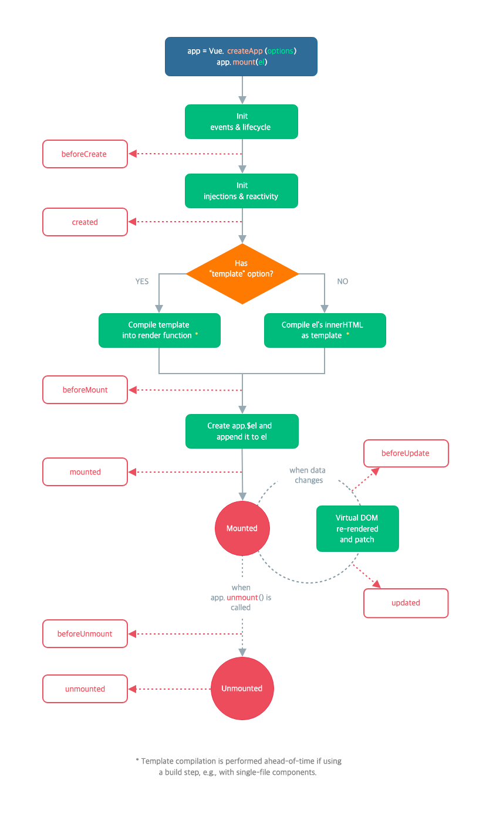

Vue 인스턴스나 컴포넌트가 생성될 때, 사전에 정의된 몇 단계의 과정을 거치는데, 이것을 라이프 사이클이라고 한다. 즉, Vue 인스턴스가 생성되고 나타나고, 사라지기까지의 단계라고 할 수 있다. 아래는 공식 문서에서 제공하는 다이어그램이다. 뷰 인스턴스는 크게 생성(create)되고, DOM에 부착(mount)되고, 업데이트(update)되고, 없어지는(unmount)되는 과정을 거친다.



위 다이어그램에서 나타낸대로 시간 순서에 따른 라이프 사이클 훅을 알아보자.

## beforeCreate

```typescript
var app = new Vue({
    el: '#app',
    data() {
        return {
            msg: 'hello';
        }
    },
    beforeCreate(function() {
        console.log(this.msg); // undefined
    })
})
```

가장 먼저 실행되는 훅이다. Vue 인스턴스가 초기화 된 직후에 발생한다. 컴포넌트가 DOM에 추가되기 전이기 때문에 `this.$el` 에 접근할 수 없다. 그리고 `data`, `event`, `watcher` 설정전에 동기적으로 호출되기 때문에 `data`, `methods`에도 접근할 수 없다.

## created

```typescript
var app = new Vue({
    el: '#app',
    data() {
        return {
            msg: 'hello';
        }
    },
    created(function() {
        console.log(this.msg); // hello
    })
})
```

`data`를 반응형으로 추적할 수 있고, `computed`, `methods`, `watch` 등이 활성화되어 접근 가능하다. 하지만 아직까지 DOM에는 부착되지 않은 상태(`$el`속성 사용 불가)이다. `data`에 직접 접근 가능하기 때문에 컴포넌트 초기에 외부에서 받아온 값들로 `data`를 세팅해야 하거나 이벤트 리스너를 선언해야하면 이 단계가 적절하다.

## beforeMount

```typescript
var app = new Vue({
  el: '#app',
  beforeMount(function() {
    console.log('beforeMount');
  })
})
```

DOM에 부착 직전에 호출되는 훅으로, 템플릿을 렌더링한 상태이다. 가상 DOM은 생성되어있으나 실제 DOM에는 부착되지 않은 상태이다. `render` 함수가 처음으로 호출된다. 이 훅은 서버측 렌더링 중 호출되지 않는다.

## mounted

```typescript
var app = new Vue({
  el: '#app',
  mounted(function() {
    console.log('mounted');
  })
})
```

일반적으로 가장 많이 사용하는 훅이다. 가상 DOM의 내용이 실제 DOM에 부착된 이후이므로, `this.$el`을 비롯한 `data, computed, methods, watch` 등 모든 요소에 접근 가능하다.

react의 `useEffect`랑 가장 비슷한 훅이라고 생각된다.

```typescript
var app = new Vue({
  el: '#app',
  mounted(function() {
    this.$nextTick(function() {
    // 모든 화면이 렌더링된 후 실행합니다.
    })
  })
})
```

서버에서 비동기로 데이터를 받아오는 경우 처럼, 부모 `mounted` 훅이 모든 자식 컴포넌트가 마운트된 상태를 보장하지는 않는다. 이때 `this.$nextTick`을 이용하면 모든 화면이 렌더링 된 이후에 실행되므로 마운트 상태를 보장할 수 있다.

## beforeUpdate

```typescript
var app = new Vue({
  el: '#app',
  beforeUpdate(function() {
    console.log('beforeUpdate');
  })
})
```

DOM이 패치되기 전에 데이터가 변경될 때 호출됩니다. 이 훅은 업데이트 전에 기존 DOM에 접근 (예: 수동으로 추가된 이벤트 리스너를 제거)할 수 있다. 변할 값을 이용해 작업할 수 있다. 이 훅에서 값들을 추가적으로 변화시켜도 렌더링을 추가로 발생시키지는 않는다.

초기 렌더링만 서버측에서 수행되기 때문에, 이 훅은 서버측 렌더링 중 호출되지 않는다.

## updated

```typescript
var app = new Vue({
  el: '#app',
  updated(function() {
    console.log('updated');
  })
})
```

가상 DOM을 렌더링하고 실제 DOM이 변경된 이후에 호출되는 훅이다. 변경된 `data`가 DOM에도 적용된 상태이다. 변경된 값들을 DOM을 이용해 접근하고 싶으면 updated 훅이 가장 적절하다. 하지만 이 훅에서 `data`를 변경하면 무한 루프가 발생할 수 있기 때문에 데이터를 직접 바꾸는 것은 안된다. 일반적으로 상태 변경에 반응하기 위해서는 `computed property`속성이나 `watcher`를 사용하는 것이 더 좋다.

```typescript
updated() {
  this.$nextTick(function () {
    // 전체 화면내용이 다시 렌더링된 후에 아래의 코드가 실행됩니다.
  })
}
```

mounted훅과 마찬가지로 `this.$nextTick`을 이용해 모든 화면이 업데이트된 이후의 상태를 보장할 수 있다.

## beforeUnmount

```typescript
var app = new Vue({
  el: '#app',
  beforeUnmount(function() {
    console.log('beforeUnmount');
  })
})
```

컴포넌트 인스턴스가 마운트 해제되기 직전에 호출된다. 이 단계에서 인스턴스는 완전하게 작동된다. 즉, 모든 속성에 접근이 가능하다. 이 단계에서 이벤트 리스너를 해제하는 등 인스턴스가 사라지기 전에 해야할 일들을 처리하면 된다. 이 훅은 서버측 렌더링 중 호출되지 않는다.

## unmounted

```typescript
var app = new Vue({
  el: '#app',
  unmounted(function() {
    console.log('unmounted');
  })
})
```

인스턴스가 해체되고 난 직후에 호출되는 훅이다. 해체가 끝난 이후기 때문에, 인스턴스의 속성에는 접근할 수 없고, 하위 인스턴스도 삭제된다. 모든 이벤트 리스너가 제거되고 모든 디렉티브가 바인딩 해제된다. 이 훅은 서버측 렌더링 중 호출되지 않는다.

## 정리

뷰에서도 리액트처럼 라이프사이클 훅을 이용해야 하는 경우가 많을 것 같다. 이전에 정리한 네비게이션 가드와 함께 필요한 상황에 따라 적절한 훅을 사용하는 것이 중요하다는 생각이 든다.

---

## 출처

1. [Vue 라이프사이클 이해하기](https://wormwlrm.github.io/2018/12/29/Understanding-Vue-Lifecycle-hooks.html)

2. [vue 공식 다큐멘테이션](https://v3.ko.vuejs.org/api/options-lifecycle-hooks.html#rendertriggered)
