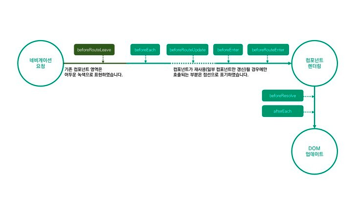

네비게이션 가드는 리다이렉션 하거나 취소해서 네비게이션을 보호하는데 사용된다. 상황에 따라 전역, 라우트별, 또는 컴포넌트 별로 네비게이션 가드를 등록해서 사용할 수 있다.

## Vue Router의 라이프사이클 훅 Flow

아래 그림과 같이 네비게이션 요청이 일어난 시점부터 DOM이 업데이트 될 때까지 시간에 따라 순차적으로 훅을 살펴보려고 한다.



### beforeRouteLeave (컴포넌트 내부 가드)

기존에 존재하던 컴포넌트가 제거되기 전 이 훅을 호출한다. 이 훅은 주로 문서를 저장하지 않은 상태로 다른 곳으로 이동하는 것을 방지하는 데 사용한다.

```typescript
const Foo = {
 template: `...`,
 beforeRouteLeave (to, from, next) {
  const answer = window.confirm('저장되지 않은 작업이 있습니다! 정말 나갈까요?');
  if (answer) {
    next();
  } else {
    next(false);
  }
 };
};
```

### beforeEach (전역 가드)

기존의 컴포넌트가 제거된 후 새로운 네비게이션이 시작될 때 이 훅을 호출한다. 어떤 페이지가 이동하는지에 관계없이 실행되고 전역가드(Global Guards)이다.

```typescript
const router = new VueRouter({ ... });
router.beforeEach((to, from, next) => {
// ...
});
```

### beforeRouteUpdate (컴포넌트 내부 가드)

컴포넌트를 재사용 할 경우에만 발생하는 훅이다. 예를 들어 첫 번째 페이지에서 두 번째 페이지로 이동하는 경우, 컴포넌트는 유지되고 데이터만 변경되는데, 이것을 재사용이라고 한다.

```typescript
const Foo = {
  template: `...`,
  beforeRouteUpdate(to, from, next) {
    // ...
  },
}
```

### beforeEnter (라우트 가드)

이동하려는 라우트 진입 전에 호출되는 훅이다. `beforeEach`와 달리 라우트마다 각각 다르게 가드를 지정할 수 있다.

```typescript
routes: [
  {
    path: '/foo',
    component: Foo,
    beforeEnter: (to, from, next) => {
      //...
    },
  },
]
```

### beforeRouteEnter (컴포넌트 내부 가드)

새로운 컴포넌트를 만들기 전에 호출되는 훅이다. 컴포넌트 생성 전이므로 `this`로 접근이 불가하다. 객체에 접근하려는 경우에는 인자로 주어지는 `next` 함수에 콜백을 이용해 접근 가능하다.

```typescript
const Foo = {
  template: `...`,
  beforeRouteEnter(to, from, next) {
    // ...
  },
}
```

### beforeResolve (전역 가드)

네비게이션 작업 완료 전 호출되는 훅이다. `beforeEach`처럼 전역 가드이다.

```typescript
const router = new VueRouter({ ... })
router.beforeResolve((to, from, next) => {
  // ...
})
```

### afterEach (전역 훅)

네비게이션 작업 완료 후 호출되는 훅이다. 모두 완료된 이후이므로 네비게이션 작업에 영향을 미칠 수 없다. 가드라고 표현하지 않고 훅으로 부른다. (`next` 함수가 인자로 전달되지 않는다.)

```typescript
router.afterEach((to, from) => {
  // ...
})
```

### 돔(DOM) 업데이트 이후

`beforeRouteEnter`에서 `next`함수에 콜백을 걸어둔 것은 돔이 업데이트되고 난 이 시점에 실행된다.

---

출처

1. [Vue Router의 LifeCycle 이해하기](https://adeuran.tistory.com/14)

2. [vue-router 네비게이션 가드](https://beomy.tistory.com/75)
