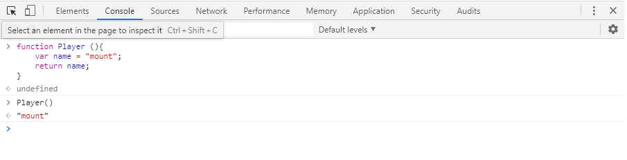

**크롬 개발자도구**는 크롬 브라우저에서 제공하는 툴이다. `HTML`, `CSS`, `Javascript`는 컴파일을 따로 거치지 않고 브라우저에서 런타임으로 동작하는데, 크롬 개발자 도구는 우리가 웹페이지를 효과적으로 분석할 수 있도록 해준다. 웹 개발을 할 때, 매우 유용하고 필수적인 도구라고 할 수 있다. 크롬 개발자 도구를 사용하는 것은 어렵지 않다. 크롬 브라우저에서 `f12`버튼을 누르거나 크롬에서 접속한 어떠한 페이지라도 마우스 우클릭 후 검사(inspect) 항목을 클릭하면 사용할 수 있다.

크롬 개발자 메뉴의 탭을 보면 `Elements`, `Console`, `Sources`, `Network` 등 여러가지 기본 탭들이 존재한다. 그리고 기본탭 외에도 추가적인 탭들도 존재한다.  단순히 개발자 도구만으로 여러가지 기능을 할 수 있다. `HTML`과 `CSS` 렌더링과 구조를 확인하고 속성 변경을 할 수도 있고, `server`와 `client`간에 HTTP 통신 과정을 살펴 볼 수도 있고, `source`를 보며 자바스크립트 디버깅을 진행할 수도 있다. 뿐만 아니라 프로파일링과 성능 개선이나 진단도 할 수있다.  게다가 계속해서 크롬 개발자 도구는 발전하고 있다. 

---

#### 1. Elements 탭

`Elements`탭은 크롬 개발자도구의 첫번 째 탭이다. 우리는 `Elements`탭을 통해서 HTML 구조를 살펴 볼 수 있다. 특정 웹페이지의 HTML이 어떻게 이루어져 있는지 `DOM`트리를 확인해 볼 수 있다. 좌측 상단의 `inspect` 기능을 통해 웹페이지의 특정 부분이 어떠한 HTML 구조로 이루어져있는지도 확인 가능하고 우측 메뉴에서는 **Styles**탭에서 해당 항목이 `CSS`로는 어떻게 적용되어있는지도 확인할 수 있고, **Event Listeners**탭을 통해서는 이 페이지에 어떤 부분에 어떤 이벤트 리스너등이 사용되는지 확인 가능하다. 여기서 매우 중요한 것은 단지 이것을 확인할 수 있는 것만이 아니고 추가/삭제하거나 변경할 수 있다. 내가 원하는대로 HTML을 수정해보고나 CSS Style을 적용해 볼 수도 있다. 위 탭에서 가장 많이 쓰는 부분은 기본적으로 HTML 구조 확인(DOM inspection)과 CSS 스타일 변경 등의 목적으로 가장 많이 쓰인다.

#### 2. Console 탭

콘솔 탭은 자바스크립트 개발에 있어 필수적인 탭이라고 할 수 있다. 크롬 개발자 도구 탭 중에 단연 제일 많이 쓰이는 탭일 것이다. 콘솔 탭에서는 자바스크립트 코딩을 하고 자바스크립트 파서를 통해 즉시 실행 해볼 수 있다. 주로 자바스크립트개발을 할 때 `console.log()` 함수 등을 통해 실행 결과를 확인하고 로그를 찍어보면서 **디버그**를 하는데 이때도 콘솔이 주로 사용된다. 콘솔 탭에서 긴 코드를 코딩하기는 어렵지만, 짧고 간단한 코드의 경우 콘솔 탭을 통해서 테스트 해보기 유용하다. 콘솔 탭은 단순히 콘솔 탭만 사용할 수 있을 뿐만 아니라 `Elements`나 `Sources` 탭 등에서도 `ESC`키를 통해 불러 사용할 수 있다. 주로 **디버깅**시 많이 쓴다는 것을 기억하자.

#### 3. Sources 탭

크롬 개발자 도구에서 가장 중요한 탭이라고 할 수도 있는 것이 바로 `Sources`탭이다. Javascript 디버깅 시에 주로 사용되는 탭이다. 단순히 코드를 보고 디버깅하는 것이 아니고 **Breakpoint**를 설정할 수 있다. Breakpoint 시점의 scope내 변수를 확인할 수 있다. 하지만 소스만 보고는 어느 부분에 적용되는 것인지 정확히 파악하기가 쉽지 않기 때문에 `Elements`탭과 연계하여 `DOM breakpoint`를 설정할 수도 있고 `Console`과 연계하여 breakpoint에서 변수 등을 확인하고 변경해보는 등 작업을 수행할 수 있다. 그리고 `source`를 보기가 어려운 구조라면 왼쪽 하단에 `{}`아이콘을 누르면 `pretty print`라는 기능으로 우리가 보기 좋도록 코드를 포맷화 해준다. 

#### 4. Network 탭

네트워크 탭에서는 HTTP 통신 과정을 살펴볼 수 있다.  페이지가 로딩되면서 어떤 통신이 이루어지는지 다 볼 수 있고, 아래 이미지의 하단을 보면 몇 개의 요청이 이루어지는지, 그 사이즈가 얼마나되는지, DOM 콘텐츠가 로드되는데 총 어느정도의 시간이 걸리는지, 모든 호출이 완료되고 로딩이 몇 초나 걸리는지 확인할 수 있다. 그리고 Catch Frame 기능을 통해 ms 단위로 화면이 어느정도 로드되는지 확인하는 것도 가능하다. 네트워크 탭을 살펴보면서 브라우저와 서버 통신의 문제점을 찾을 수도 있고 클라이언트 성능 개선 지점을 찾고 분석하는데 유용하게 사용될 수 있다.

