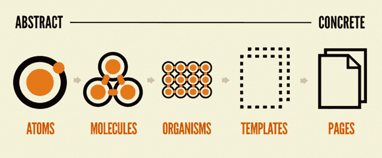
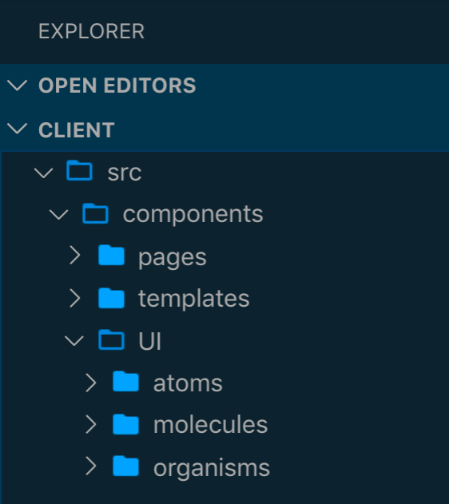
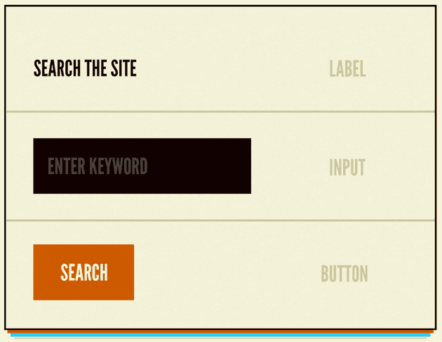
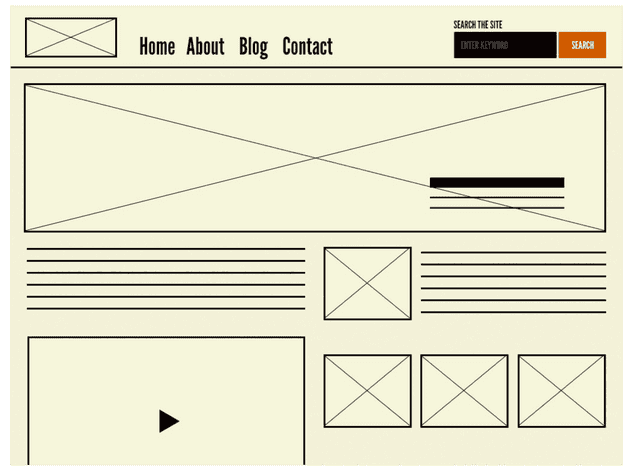
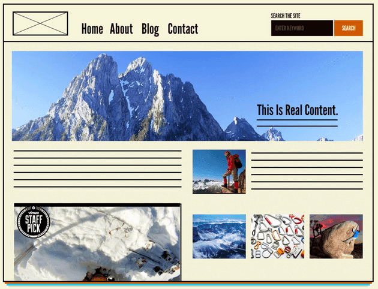
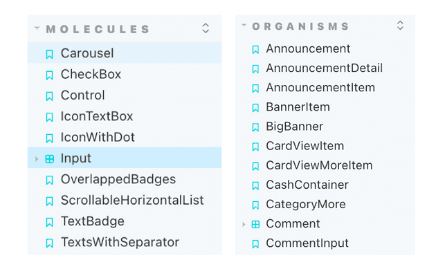

리액트나 뷰와 같은 프레임워크(라이브러리)가 주로 사용되고 SPA가 프론트엔드 개발의 주를 이루면서 화면을 컴포넌트들로 나누고 설계하는 방식이 보편화 되었다. 기본적으로는 `container-presentational` 패턴을 사용하여 컴포넌트를 나누는 방식이 많이 사용되었다. 하지만 컴포넌트를 잘 이해하지 못하고 설계하면, 비슷한 컴포넌트를 반복해서 만들어서 재사용성을 떨어뜨리고 UI를 복잡하게 만들 수 있고, 컴포넌트 기반 프로그래밍을 제대로 활용하지 못할 수 있다.

하나의 디자인 시스템 내에서 관리되고 있지 않은 컴포넌트라면 같은 역할을 하는 컴포넌트라도 페이지 별로 크기나 폰트, 정렬같은 부분들이 다를 수 있기 때문에 통일감을 주지 못하고, 일관성을 유지하지 못해서 유지보수에도 더 많은 비용을 발생시킬 수 있다. 그러던 중 디자인 시스템이 해결책으로 등장했고, 그 방법론 중 하나로 등장한 것이 `Brad Frost`가 소개한 **아토믹 디자인**이다.

## 1. 아토믹 디자인이란 무엇일까?

위와 같은 문제에서 디자인 시스템을 만들면 해결할 수 있는 부분이 많다. 공통으로 사용하는 타이포그라피와 컬러 팔레트 등을 활용해서 공통 컴포넌트를 설계하고 개발하면 어느정도는 위 문제가 해소할 수 있는데, 아토믹 디자인은 이 디자인 시스템을 만드는 방법론 중 하나라고 할 수 있다.

아토믹(Atomic)이라는 말에서 유추해 볼 수 있는 것처럼, 이 개념은 화학적인 관점에서 영감을 받은 디자인 시스템이다. 모든 것은 원자(Atom)으로 시작해서 원자들이 결합하여 분자(molecule)를 이루고, 분자들이 모여 복잡한 유기체(organism)로 결합하여 모든 것을 생성한다는 컨셉이다.

아토믹 디자인은 위 개념을 컴포넌트에 적용하여 컴포넌트를 atom, molecule, organism, template, page의 5가지 레벨로 나눈다. 단계가 올라갈수록 추상적인 것에서 구체적인 것으로 나아간다. 이렇게 원자 컴포넌트 부터 설계했을 때는 page 레벨의 컴포넌트에 가서도 일관성을 유지할 수 있다.



아토믹 디자인을 반영한 UI의 디렉터리 구조는 아래와 같이 구성할 수 있다.



## 2. Atom

atom은 아토믹 디자인의 첫 단계로 더 이상 분해할 수 없는 기본 컴포넌트를 의미한다. `label`, `input`, `button` 처럼 `html`의 기본 태그나 폰트 등이 주를 이루는 컴포넌트라고 할 수 있다. 다만 기본 컴포넌트로 추상적인 개념을 포함하고 있기 때문에 단일 컴포넌트로 사용되기는 어렵다. atom을 다른 atom들과 결합한 후에 molecule이나 organism 단계에서 주로 쓰인다.



## 3. Molecule

moleclue은 여러 개의 atom을 결합하여 고유한 특성을 가지는 컴포넌트이다. `button`과 `input`등 atom을 결합하여 `form` molecule로 만들 수 있다. molecule의 특징은 하나의 일을 하는 것이다. `SRP(Single Responsibility Principle)` 원칙으로 인해 한 가지 역할을 하도록 구성한다. 그렇기 때문에 다른 컴포넌트에서도 재사용될 수 있다는 특성을 가지고 있다.


## 4. Organism

organism은 좀 더 복잡하고 명확한 영역과 컨텍스트를 가진다. 예를 들어 `header`라는 organism은 `logo`라는 atom과 `navigation`이라는 molecule, `search form` 이라는 molecule로 구성할 수 있다. atom이나 molecule에 비해서 좀 더 구체적으로 표현되기 때문에 재사용성은 비교적 떨어진다.


## 5. Template

템플릿은 page를 만들 수 있는 여러 개의 organism과 molecule로 구성된다. 실제 컴포넌트를 레이아웃에 배치하고 구조를 잡는 와이어 프레임이라고 볼 수 있다.



## 6. Page

유저가 볼 수 있는 실제 컨텐츠를 담고있는 페이지이고, template의 인스턴스라고 볼 수 있다.



## 7. 아토믹 디자인을 적용할 때 팁

### - 컴포넌트를 제외하는 것들은 아토믹 컴포넌트 외부에서 주입한다.

컴포넌트를 제어하는 UI 상태나 동작에 대한 이벤트 핸들러는 컴포넌트 내에서 작성하지 않고 외부에서 처리할 수 있도록 `props`로 다룬다. 이렇게하면 컴포넌트의 유연성과 재사용성을 높힐 수 있다.

### - 레이아웃과 관련된 스타일은 외부에서 주입한다.

디자인 시스템의 컴포넌트는 재사용될 수 있기 때문에 마진이나 패딩 같은 스타일은 컴포넌트 내에서 정의하거나 변경하지 않고 컴포넌트를 사용할 때 주입하도록 한다. 그리고 가장 바깥쪽 DOM의 attribute를 인터페이스로 확장해서 사용할 떄 레이아웃 스타일을 지정하도록 한다.

```ts
// organism/Comment.tsx
interface CommentProps extends HTMLAttributes<HTMLDivElement> {
  name: string;
}

function Comment({ name, children, ...props }: CommentProps) {
  return (
    <div {...props}>
    	<Text>{name}</Text>
      <Text>{children}</Text>
    </div>
  )
}

// pages/Product.tsx
function ProductPage ({
  commentList,
  ...
}) {
  return (
    <div>
      ...
      {
        commentList.map(comment => <Comment style={{margin: '20px 40px', flex: 1}}/>)
      }
    </div>
  )
}

// pages/Comment.tsx
function CommentPage({
  ...
}) {
  return (
    <div>
      ...
      <Comment style={{ width: '80%', margin: '0 auto'}}>
    </div>
  )
}
```

## 8. 아토믹 디자인을 적용할 때 주의할 점

### - Molecule과 Organism을 나누는 기준을 잘 잡아야 한다. (컴포넌트 개념에 대한 높은 이해도 필요)

원자 컴포넌트의 경우는 어렵지 않게 작성할 수 있지만, 분자 컴포넌트와 유기체 컴포넌트는 사람의 기준에 따라서 다르게 나눠질 수 있다.

작성한 컴포넌트에 컨텍스트가 존재한다면 organism으로 컨텍스트가 없이 UI적인 요소라면 재사용하기 쉽도록 molecule로 작성할 수 있다. molecule 같은 경우는 컨텍스트 없이 단순 UI 네이밍을 주로 사용한다.



### - 약간만 다른 organism이 존재 할 때, 중복 컴포넌트가 생기거나 불필요한 Props가 증가할 수 있다.

거의 유사한 컴포넌트이고 같은 기능을 하지만 조금의 차이에 따라서 추가 Props를 받아야 하거나, 새로운 컴포넌트를 만들어야 하는 경우가 생길 수 있다. props를 추가할 경우 컴포넌트 내부가 복잡해질 수 있고, 따로 컴포넌트를 만들게 되면, 컴포넌트 재 사용성이 떨어지고, 추후 수정이 필요하다면 유지보수 비용이 높아질 수 있다.

이런 경우에서는 `compound` 컴포넌트를 활용하면 유연하게 대처할 수 있지만, `compound components`에 대한 학습과 이해가 선행되어야 한다.

### - UI 변화 시에 유연성이 떨어진다.

만약 특정 organism에서 디자인 요소를 변경할 경우에 그것들이 atom으로 구성되거나 molecule로 구성된 부분에 대해서 변경을 했을 때, 해당 atom과 molecule로 구성된 다른 organism에 까지 영향을 끼칠 수 있으므로 주의해야 한다. 또는 서로 다른 컴포넌트를 합치거나, 쪼개야할 수도 있기 때문에 그런 작업이 생길 때, 아토믹 디자인으로 구성되면 예측하지 못한 어려움을 겪을 수 있다.

### - 오히려 비효율을 초래할 수 있다.

보통 아토믹 디자인을 실현하기 위해서는 컴포넌트 단위의 디자인 및 설계가 잘 되어야 한다. 때문에 처음 설계 시 체계적인 UI 설계를 하지 못한다면 개발에 어려움을 겪을 수 있고, 이 과정 속에서 불필요한 회의 참석이 많아지고, 기획자/디자이너/개발자 간 의사소통 비용이 증가할 수 있다.

그리고 상위 컴포넌트를 하나 만들기 위해서 하위 컴포넌트들을 모두 학습하고, 숙지하고 있어야 하기 때문에 평소 아토믹 디자인에 대해서 잘 모르거나, 해당 프로젝트가 속도가 필요한 경우 오히려 독이 될 수 있다.

## 정리

아토믹 디자인은 컴포넌트를 기초부터 차근차근 설계해나가고 조립해가는 직관적인 방법론으로 생각이 되었다. 하지만 이 과정 속에서 체계적인 설계가 이루어지지 않는다면, 생각보다 아토믹 디자인을 적용하는데 어려움이 더 많을 수도 있다는 생각이 들었다.

하지만 만약 비교적 단순하고 반복적인 디자인으로 구성된 프로젝트라면, 아토믹 디자인을 통해서 좀 더 명확하고 간결하게 컴포넌트를 나누고 표현하고 재사용할 수 있겠다는 생각이 들었다. 만약 유사하지만 다른 컴포넌트들이 많이 쓰이는 프로젝트라면 오히려 프로젝트를 더 복잡하게 만들 수 있기 때문에 충분한 고민과 체계적인 설계가 필요하겠다는 생각이 든다.

---

## 출처

1. [아토믹 디자인을 활용한 디자인 시스템 도입기](https://fe-developers.kakaoent.com/2022/220505-how-page-part-use-atomic-design-system/)

2. [리액트 어플리케이션 구조 - 아토믹 디자인](https://ui.toast.com/weekly-pick/ko_20200213)

3. [Stop Using Atomic Design Pattern](https://jbee.io/react/stop-using-atomic-design/)

4. [아토믹 디자인(Atomic Design) 적용기 : 한계점, 단점](https://sumini.dev/guide/009-dont-use-atomic-design/)
