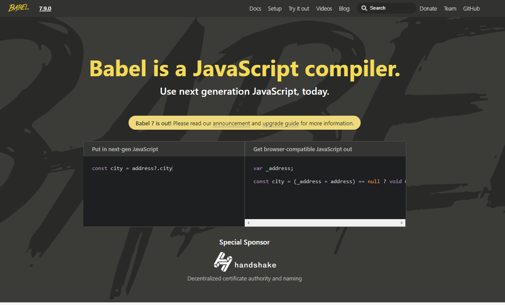

**Babel**은 자바스크립트 개발을 하다보면 자연스럽게 접하게 되는 것인데, Babel이란 무엇일까? [Babel의 공식 홈페이지](https://babeljs.io/)에 보면 매우 간단하게 "`Babel is a Javascript complier.` "라고 표현되어있다. 쉽게 말하면 자바스크립트의 컴파일러인 것이다. 그것도 코드를 코드로 바꿔주는 `code to code` 컴파일러이다. `code to code`라고 설명하는 이유는 최신의 자바스크립트의 코드들을 **babel**을 통해서 이전의 자바스크립트로 바꿔주는 역할을 수행하기 때문이다. 때문에 **트랜스파일러(Transpiler)**라고 불린다. 

---

#### Babel이 필요하게 된 이유

자바스크립트의 경우, `ES-`으로 시작되는 매년 새로운 자바스크립트 버전(ECMAScript)을 발표한다. 이렇게 자바스크립트가 매우 빠르게, 그리고 꾸준히 발전하고 있는데 브라우저가 그것을 전부 다는 지원하지 못하는 경우가 존재한다. 그렇기 때문에 ESNext 문법을 사용하여 웹 개발을 할 때는 코드와 브라우저의 호환을 맞춰주기 위해 **Babel**이 필수적인 역할을 담당한다. 개발자가 어떠한 버전의 자바스크립트로 개발을 하더라도 **Babel**이 중간에서 호환성을 모두 신경써주기 때문에 개발자가 따로 코드의 버전에 대해서 신경 쓸 필요가 없는 것이다. 이것은 개발자의 수고를 상당 부분 덜어주고, 개발에만 더욱 집중할 수 있도록 도와주는 역할을 한다. 뿐만 아니라 요즘은 `typescript`와 같은 언어도 자주 쓰는데, 이때도 **Babel**이 문제없이 javascript로 컴파일 되도록 역할을 수행해준다. 

---

#### Polyfill 기능

**Babel**이 수행하는 또 하나의 역할은 바로 Polyfill이다. **Polyfill**은 지원하지 않는 이전 브라우저에서 최신 기능을 제공하는데 필요한 코드라고 할 수 있다. 비표준화 되어있는 각 브라우저들의 기능을 모두 다 호환될 수 있도록 표준화해주는 것이라고 할 수 있다. 그렇기 때문에 개발자 입장에서는 브라우저별로 다르게 개발할 필요가 없어지는 것이다. Javascript 코드 호환성을 맞춰주는 것과 같은 맥락이라고 할 수 있다. 하지만 Polyfill을 통해서 기능을 지원하지 않는 웹 브라우저에서 원하는 기능을 사용할 수는 있지만, polyfill 플러그인 로드로 인해서 로드 타임이 증가하고, 성능이 저하될 가능성이 있다. 

Babel에서는 이런 Polyfill 기능을 지원하려고 `babel-polyfill`을 지원한다. Babel을 사용해도 최신 함수를 그냥 사용할 수 있는게 아니기 때문에, Polyfill을 통해 실행할 때 지원하지 않는 기능들을 추가해주는 것이다. babel은 컴파일 시에 실행하고, `babel-polyfill`은 런타임에 실행된다.

Babel의 활용에 대한 자세한 내용은 다음 프로젝트 시 적용 과정을 정리하여 포스팅할 것이다.

---

### 출처

> 1. [MDN web docs](https://developer.mozilla.org/ko/docs/Glossary/Polyfill)
> 2. [babel이란 무엇인가?](https://bravenamme.github.io/2020/02/12/what-is-babel/)

