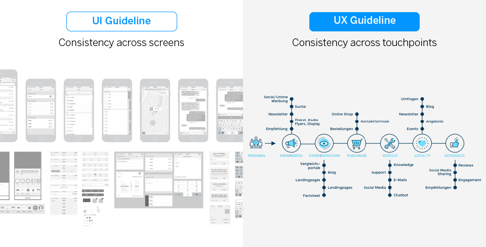

구글이 머터리얼 디자인 시스템을 공개하고 난 이후, 많은 테크 기업들은 각자 고유의 디자인 시스템 구축에 관심을 가지기 시작했고 각 기업 고유의 디자인 시스템을 만들고 사용하고 있다. 현재 국내 기업 중에도 토스, 라인, 쏘카, 지마켓 등 수 많은 기업들이 디자인 시스템을 구축하여 사용하고 있다. 디자인 시스템은 무엇이고, 왜 많은 기업들이 디자인 시스템을 구축하고 사용할까?

## 1. 디자인 시스템이란?

> "디자인 시스템은 확장할 수 있고 지속 가능한 방식으로 디자인을 위한 구성 요소를 출력하는 체계적인 접근법이다” - 쉐인 윌리엄스(Shane Williams)

디자인 시스템은 **디자인 원칙, 규격, 다시 사용할 수 있는 UI 컴포넌트와 코드, 패턴을 모두 포함하는 개념**이다. 정의 상으로는 디자인 시스템이 UI/UX 가이드 라인을 포괄하고 있지만, 실제 사례에서는 디자인 시스템 마다 그 범위는 다르다. 어떤 시스템에서는 단순 스타일 가이드, 패턴 라이브러리 역할만 하고 어떤 시스템은 브랜드 원칙, UX 원칙과 철학까지 담고 있다.

> - UI 가이드 라인
>
> UI를 표준화하고 화면간 일관성을 확보하기 위한 가이드 라인이다. 주요 화면에서 사용되는 공통 UI 패턴과 주요 컴포넌트를 정의하고 속성을 규정하여 설계한다.
>
> - UX 가이드 라인
>
> 서비스와 브랜드 측면에서 사용자가 일관적이고 차별화된 경험을 할 수 있도록 한다. 컨텐츠와 기능 별로 사용자의 니즈를 반영해서 UX 원칙을 도출한다. 브랜드의
> 정체성이나 색깔을 일관되게 전달할 수 있도록 정의하고 설계한다.

디자인 시스템은 단순한 유행이나 트렌드가 아닌 기업이 성장하고 프로덕트가 많아지고 규모가 커지면서, 일관성과 효율성을 모색하기 위한 기업들의 해결 흐름이며, 여러 팀의 분산된 노력과 작업들을 포괄적으로 관리해주는 체계적인 방법이라고 할 수 있다.

## 2. 디자인 시스템이 필요한 이유

### 일관성

디자인의 일관성은 브랜드의 정체성을 효과적으로 전달할 수 있고, 프로덕트의 사용성을 높일 수 있다. 디자인 시스템은 일관성을 향상 시키며, 궁극적으로 사용자 경험을 향상 시킬 수 있다.

### 확장성

디자인 시스템의 핵심은 공동 자산을 지속적으로 쌓고, 유지하고 관리하며, 규모를 확장할 수 있다는 것이다. 디자인 시스템을 활용하여 디자인 시스템을 활용하면서, 각 프로덕트의 디자인 또한 함께 향상시킬 수 있다. 그렇기 때문에 설계 시 확장성을 필수적으로 고려해야 한다. 통합된 디자인 시스템을 통해 여러 프로덕트를 더 빠르게 만들 수 있게된다.

### 효율성

디자인 시스템을 통해 UI 패턴과 컴포넌트 등을 재 사용하여 개발자의 생산성과 효율성을 높일 수 있다. 그리고 여러 부서에서 커뮤니케이션 기준을 공유 함을 통해서 비효율적인 커뮤니케이션 비용을 줄여주고, 협업 효율성을 높여 준다.

## 3. 디자인 시스템 구축 시 생각할 점

### 명확한 목표

디자인 시스템을 통해서 **어떠한 것을 얻고자 하는지, 어떤 문제를 해결하고자 하는지 명확히 정의**해야 한다.

### 우선순위 설정

한번에 모든 것을 포괄할 수 있는 디자인 시스템을 만드는 것은 시간이 오래 걸리기 때문에, 현재 디자인 시스템이 필요한 시스템의 특성에 맞춰 필요한 주요 컴포넌트 부터 **우선순위를 정해서 설계**해야 한다.

### AS-IS 분석

디자인 시스템 구축을 위해서는 기존 시스템이나, 신규 프로젝트의 경우는 비슷한 기능을 하는 타 브랜드의 프로젝트 AS-IS 분석을 통해서 필요한 기능과 콘텐츠를 분류하고, 그에 맞는 UI 구성 요소 및 컴포넌트를 설계해야 한다.

### 이해하기 쉬운 명칭 정의

디자인 시스템에는 수많은 컴포넌트가 존재하기 때문에 같은 컴포넌트를 부르는 명칭도 여러 명칭으로 존재할 수 있다. 명칭을 분명히 정해주지 않으면 불필요한 오해가 생기기 쉽기 때문에 명칭을 잘 정의하는 게 중요하다.

### 문서화

디자인 시스템을 구축하면서 생기는 많은 의사결정 과정들을 문서화 해야한다. 디자인 시스템은 문서화가 매우 중요하다. 문서화를 통해 의사 결정을 더 매끄럽게 할 수 있으며, 활용성을 높일 수 있다.

신규 UI 컴포넌트를 만들었을 경우, 해당 컴포넌트의 용도와 사용법에 대해서 정리해줘야한다.

### 다양한 플랫폼 고려

대부분의 서비스는 웹 뿐만 아니라, 모바일, 모바일 웹 환경으로도 제공되기 때문에 디자인 시스템 또한 같은 역할의 컴포넌트여도 플랫폼의 특성에 따라서 구현되어야 한다.

## 4. 결론

디자인 시스템은 프로젝트가 많아지고, 그 규모가 커질 수록 일관성을 유지해주고, 확장성을 주며, 업무의 효율성을 높여줄 수 있다. 하지만 디자인 시스템이 모든 문제를 해결해주는 것이라는 생각은 잘못된 것이다. 디자인 시스템의 구축은 매우 많은 리소스가 필요한 작업이고, 구축과 설계에 있어 수 많은 커뮤니케이션 비용이 발생할 수 있으며, 상황에 따라 오히려 생산성을 떨어뜨릴 수 있는 부분이기 때문에, 구축과 도입에 대한 충분한 이해와 검토가 된 이후에 결정해야 한다.

---

## 출처

1. [디자인 시스템 1편 - 디자인 가이드/디자인 시스템은 왜 필요한가](https://story.pxd.co.kr/1434)

2. [Airbnb의 디자인 시스템 만들기](https://brunch.co.kr/@designforhuman/2)
