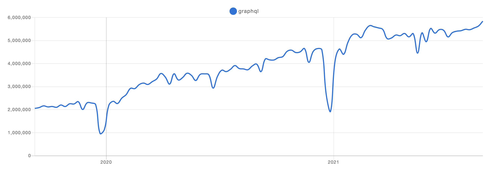

최근 개발을 진행하다보면 GraphQL이라는 것을 자주 들어보게 되었다. 하지만 정작 `GraphQL`이 무엇인지는 알지 못하다보니 알아봐야 겠다는 생각이 들어서 이번 포스트를 통해 정리하고자 한다.

## 1. `GraphQL`이란?

`GraphQL`은 페이스북에서 만든 쿼리 언어이다. 아직 역사가 오래되지는 않았으나, 최근 인기가 매우 가파르게 상승하고 있다. 아래 트렌드를 보면 꾸준히 증가하고 있는 추세임을 알 수 있다.



`GraphQL`(gql)은 SQL과 마찬가지로 쿼리언어이지만, sql과 gql은 구조부터 매우 다르고, 그 쓰임새도 또한 다르다. sql은 주로 데이터베이스에 저장된 데이터를 효율적으로 가져오는 것이 목적이지만, gql은 웹 클라이언트가 데이터를 서버로 부터 효율적으로 가져오는 것이 목적이다. sql의 경우, 주로 백엔드에서 많이 작성하여 사용되지만, gql의 경우 클라이언트 쪽에서 작성하여 사용한다. 아래는 sql과 gql의 예시이다.

```sql
SELECT * FROM example WHERE user_id in ('ykss');
```

```gql
{
  example {
    admin
    users {
      name
    }
  }
}
```

서버사이드 gql 앱은 gql로 작성된 쿼리를 입력으로 받아서 쿼리 처리 결과를 클라이언트로 돌려준다. HTTP API가 특정 DB나 플랫폼에 종속적이지 않은 것 처럼 gql도 또한 DB나 플랫폼에 종속되지 않는다. 그리고 네트워크 방식에도 종속적이지 않은데, 일반적으로는 HTTP POST와 웹소켓 프로토콜을 사용하지만, TCP/UDP를 활용하는 것 또한 가능하다.


## 2. REST API와 비교

REST API의 경우, URL과 METHOD를 조합하여 요청하기 때문에 다양한 ENDPOINT가 존재한다. 하지만 이에 반해 gql은 단 하나의 ENDPOINT가 존재한다. 또한, gql API에서는 불러오는 데이터 종류를 쿼리 조합을 통해 결정한다. 만약 REST API에서 각 엔드포인트 마다 DB SQL 쿼리가 달라지지만, gql API는 gql 스키마의 타입마다 DB SQL 쿼리가 달라진다. gql API를 사용할 경우 네트워크 호출을 여러번 할 필요 없이 한번의 네트워크 호출로 처리가 가능하다.


## 3. GraphQL의 구조

### 3.1 쿼리 & 뮤테이션

gql의 쿼리와 뮤테이션, 그리고 응답은 매우 직관적이다. 쿼리의 구조와 응답의 구조가 거의 일치한다고 볼 수 있다.


쿼리와 뮤테이션이 나눠지는데 사실 큰 차이는 없으나, 쿼리의 경우, CRUD에서 R(Read)의 기능을 담당하고, 뮤테이션은 CUD(Create,Update,Delete)시에 사용한다.

```js
{
  human(id: "1000") {
    name
    height
  }
}

query HeroNameAndFriends($episode: Episode) {
  hero(episode: $episode) {
    name
    friends {
      name
    }
  }
}
```

위에 보면 `{`로 시작하는게 일반 쿼리이고 `query`로 시작하는게 오퍼레이션 네임 쿼리이다. 왜 이러한 두 종류가 있는지 알기 위해서는 오퍼레이션 네임과 변수의 쓰임새를 알아야 한다. 주로 정보를 불러 올 때는 `id`값이나 다른 파라미터를 사용하여 데이터를 불러온다. gql에는 변수라는 개념이 있는데, 이 변수는 이것을 위해 존재한다. 오퍼레이션 네임 쿼리는 쉽게 말하면 쿼리용 함수라고 할 수 있겠다. DB에서 프로시저와 유사하다. 이것 덕분에 REST API와는 다르게 한번의 통신으로 원하는 모든 데이터를 가져올 수 있다. 이전에 DB 프로시저의 경우는 백엔드에서 작업했지만, gql에서는 오퍼레이션 네임 쿼리를 통해 클라이언트에서 작성하고 관리할 수 있다.

### 3.2 스키마 & 타입

DB 스키마를 작성할 때, gql의 스키마 작성은 C, C++의 헤더파일 작성과 유사하여 프로그래밍 언어에 익숙하다면 스키마 정의도 어렵지 않다.

#### 오브젝트 타입과 필드

```typescript
type Character {
  name : String!
  appearIn : [Episode!]
}
```

- 오브젝트 타입 : Character

- 필드 : name, appearIn

- 스칼라 타입 : String, ID, Int 등

- 느낌표(!) : 필수 값(non-nullable)

- 대괄호([,]) : 배열

### 3.3 리졸버(resolver)

gql에서는 데이터를 가져오는 구체적인 과정을 구현해야 한다. gql 쿼리문 파싱의 경우 대부분 gql 라이브러리에서 처리하지만, 데이터를 가져오는 구체적인 과정은 resolver(리졸버)가 담당하고 이 리졸버는 직접 구현해야 한다. 직접 구현해야 한다는 부담은 있으나 대신 데이터 소스의 종류와 상관 없이 구현 가능하다. 리졸버를 통해 디비에서 가져올 수도 있고, 파일에서 가져올 수 도 있고, 네트워크를 통해 원격 데이터도 가져올 수 있다. 이러한 특성을 이용하면, legacy 시스템을 gql 기반으로 바꾸는데 활용 될 수 있다.

gql 쿼리에서는 각각 필드마다 함수가 존재한다고 생각하면 된다. 그리고 그 함수는 다음 타입을 반환하는데 그 각각의 함수를 리졸버라고 한다. 연쇄 리졸버 호출의 장점은 DBMS의 관계에 대한 쿼리를 쉽고 효율적으로 처리할 수 있다. 예시로 gql의 쿼리에서 어떤 타입의 필드 중 하나가 해당 타입과 1:n을 관계를 맺고 있다고 가정해보자.

```ts
type Query {
  users: [User]
  user(id: ID): User
  limits: [Limit]
  limit(UserId: ID): Limit
  paymentsByUser(userId: ID): [Payment]
}

type User {
	id: ID!
	name: String!
	sex: SEX!
	birthDay: String!
	phoneNumber: String!
}

type Limit {
	id: ID!
	UserId: ID
	max: Int!
	amount: Int
	user: User
}

type Payment {
	id: ID!
	limit: Limit!
	user: User!
	pg: PaymentGateway!
	productName: String!
	amount: Int!
	ref: String
	createdAt: String!
	updatedAt: String!
}
```

여기서 User와 Limit은 1:1 관계이고, User와 Payment는 1:N 관계이다.

```ts
{
  paymentsByUser(userId: 10) {
    id
    amount
  }
}

{
  paymentsByUser(userId: 10) {
    id
    amount
    user {
      name
      phoneNumber
    }
  }
}
```

위 두 쿼리는 쿼리명은 동일하지만 호출되는 리졸버 함수는 아래가 더 많고, 각각 리졸버 함수에는 내부적으로 데이터베이스 쿼리가 존재한다. 쿼리에 맞게 필요한 만큼만 최적화 해서 호출할 수 있다는 뜻이다. 어떻게 설계하냐에 따라 효율적인 설계가 가능하다. REST API에서는 정해진 쿼리는 전부 호출되는 것과는 대비되는 것이다.

```ts
Query: {
    paymentsByUser: async (parent, { userId }, context, info) => {
        const limit = await Limit.findOne({ where: { UserId: userId } })
        const payments = await Payment.findAll({ where: { LimitId: limit.id } })
        return payments
    },
  },
  Payment: {
    limit: async (payment, args, context, info) => {
      return await Limit.findOne({ where: { id: payment.LimitId } })
    }
  }
```

리졸버 함수는 총 4개의 인자를 받는다.

- 첫번째 인자는 parent로 연쇄적 리졸버 호출에서 부모 리졸버가 리턴한 객체이다. 이 객체를 통해 현재 리졸버가 내보낼 값을 조정할 수 있다.

- 두번째 인자는 args로 쿼리에서 입력으로 넣은 인자이다.

- 세번째 인자는 context로 모든 리졸버에 전달된다. 미들웨어 관련 값들이 들어 있다. 로그인 정보나 권한 같은 주요 컨텍스트를 가진다.

- 마지막 인자는 info로 스키마 정보와 현재 쿼리의 특정 필드 정보를 가지고 있고, 거의 사용하지 않는다.

### 3.4 인트로스펙션(introspection)

기존 서버-클라이언트 협업에서는 API 명세서를 주고 받는게 반드시 필요했지만, 이러한 문제를 해결한 것이 gql의 인트로스펙션이다. gql의 인트로스펙션은 서버 자체에서 현재 서버에 정의된 스키마의 실시간 정보를 공유해준다. 이 스키마 정보만 알고 있다면 클라이언트 단에서 따로 연동 규격서 필요 없이 현재 서버에서 제공하고 있는 스키마에 따라 쿼리문을 작성하면 된다.

그리고 이러한 인트로스펙션 쿼리가 따로 존재한다. 하지만 보통은 서버용 gql 라이브러리에서 쿼리용 IDE를 제공하기 때문에 쿼리문을 따로 작성할 필요가 많이 없다. 물론 해당 기능은 개발시에만 켜야한다.

## 4. GraphQL과 함꼐 사용되는 라이브러리

gql 자체는 쿼리 언어일 뿐이기 때문에 라이브러리들과 함께 쓰여야 한다. gql 자체는 개발 언어나 사용 네트워크에 완전 독립적이기 때문에 어떤 환경으로 사용할지는 개발자에게 달려 있다. 대표적인 라이브러리로는 `Relay`와 `Apollo GraphQL`이 있다.

## 정리

사실 개념적으로는 정리하고 알아봤지만, gql을 제대로 알기 위해서는 한번 써보는 것이 제일 적합할 것 같다는 생각이 들었다. gql을 보면서, 기존의 REST API 방식과는 다르게 좀 더 편할 수 있겠다는 생각은 들었지만, 일단 익숙치는 않기 때문에 어느정도 러닝커브는 있겠다는 생각이 들었다. 그리고 gql을 활용함으로써 좀 더 클라이언트 단에서, 즉 프론트엔드 개발자로써 할 수 있는 범위가 넓어진다는 생각이 들었다. 다음에 좀 더 apollo에 대해서 알아보는 것도 좋을 것 같다.

---

출처 :

1. [GraphQL 개념잡기](https://tech.kakao.com/2019/08/01/graphql-basic/)
