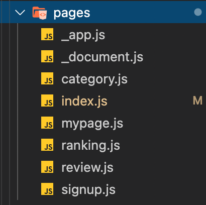

지난 포스트에서 SSR과 CSR에 대해서 정리했는데, 보통 SPA는 CSR을 쓰기 때문에 어쩔 수 없는 단점들을 가지게 되었다. 이러한 환경에서 next.js는 리액트와 SPA에 SSR을 반영할 수 있도록 도와주도록 만들어진 프레임워크이다.


## 1. SPA 등장과 Next.js의 렌더링 방식

예전에는 대부분 SSR 방식을 사용한 MPA(Multi-Page Application)였다. 하지만 모바일 환경이 많아지면서, MPA 방식이 모바일 UX에 적합하지는 않았다. 그래서 등장한게 SPA이다. 그리고 SPA를 구현하기 위해 리액트뿐만 아니라 Angular, Vue등 여러가지 프레임워크들이 쓰이게 되었다. SPA가 등장하면서 한페이지에서 여러가지 동작이 이루어지며 모바일 환경에 적합한 CSR기반의 SPA가 각광받게 되었다.


react.js는 기본적으로 CSR방식이기 때문에 먼저 `render()`를 호출하여 한번 렌더링 한 후에, `componentDidMount()`를 통해 데이터를 받아와서 다시 한번 렌더링을 진행하는 방식이다. 하지만 여기에 next.js를 적용할 경우에는 SSR 방식으로 먼저 `getInitialProps()` 방식을 통해 데이터를 가져온 상태로 한번에 렌더링한다.


## 2. Next.js의 기능

- SSR 제공을 통한 SEO(Search Engine Optimization) 향상
- Babel, Webpack 설정 커스터마이징 가능
- HMR(Hot Module Replacement)을 지원하는 웹팩 기반 환경
- Express나 Node.js와 같은 http 서버와 함께 구현 가능
- 코드스플리팅 (Code-splitting)을 통한 더욱 빠른 페이지 로드
- 간단한 클라이언트 사이드 라우팅 제공
- API route 제공
- Built-in CSS Support

### 2-1. 코드스플리팅 (Code-splitting)을 통한 더욱 빠른 페이지 로드

Next.js는 용량이 커지면 로딩속도가 느려지는 것을 대비하여 파일을 분리하는 코드 스플리팅을 자동적으로 해준다. 필요하지 않은 컴포넌트까지 모두 불러오는 것은 비효율적인데, Next.js는 `Pages` 폴더에 있는 `Page`를 처음에는 `index` 페이지만 불러오고 그 이후에는 각 페이지에 필요한 `Component`만 불러오는 방식이다. 그리고 해당 페이지들은 별도로 라우팅을 해주지 않아도 링크가 된다.

### 2-2. SSR 제공을 통한 SEO(Search Engine Optimization) 향상

SSR을 통해 데이터를 다 넣어서 렌더링해주기 때문에 검색엔진 최적화가 되어 SPA의 단점인 SEO 비효율을 상쇄할 수 있다.

### 2-3. 간단한 클라이언트 사이드 라우팅 제공

Next.js는 React.router와 같은 Routing 기능을 자체적으로 가지고 있다. 방법은 `pages` 폴더에 소문자로 시작하는 파일들을 만든 후에 아래와 같은 형식으로 link만 걸어주면 된다.

```javascript
<Link href="/mypage"><a>mypage<a/></Link>
<Link href="/signup"><a>signup<a/></Link>
```



---

> 참고 글

1. [Next.js 제대로 알고 쓰자](https://medium.com/@msj9121/next-js-%EC%A0%9C%EB%8C%80%EB%A1%9C-%EC%95%8C%EA%B3%A0-%EC%93%B0%EC%9E%90-8727f76614c9)
2. [Next.js 공식 Docs 흝기](https://velog.io/@baramofme/Next.js-%EA%B3%B5%EC%8B%9D-Docs-%ED%9D%9D%EA%B8%B0)