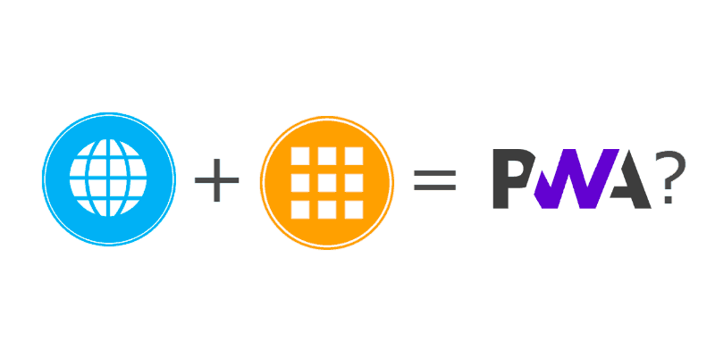
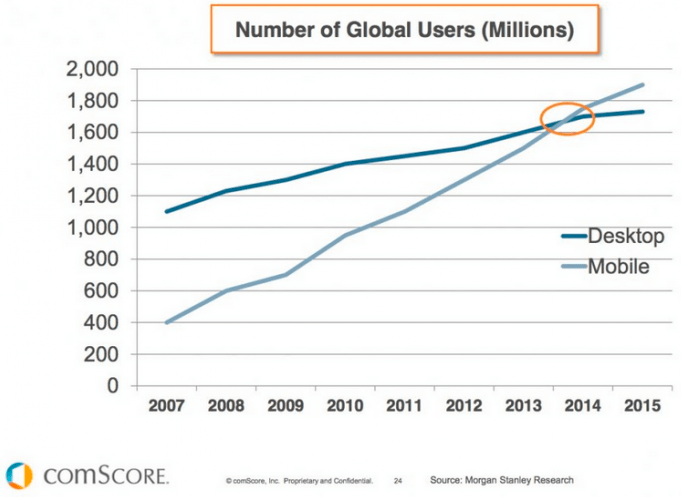
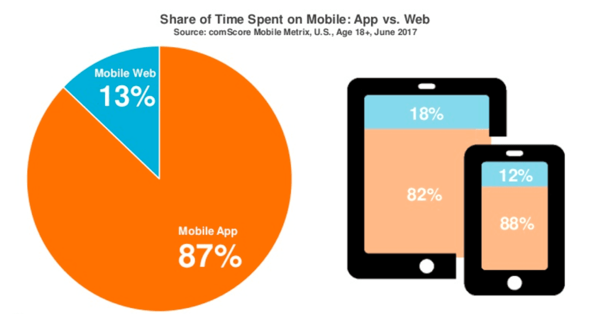
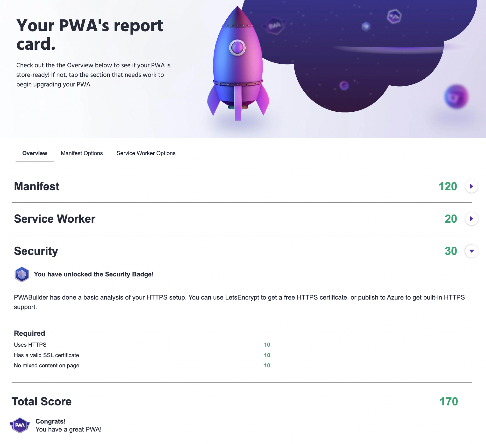
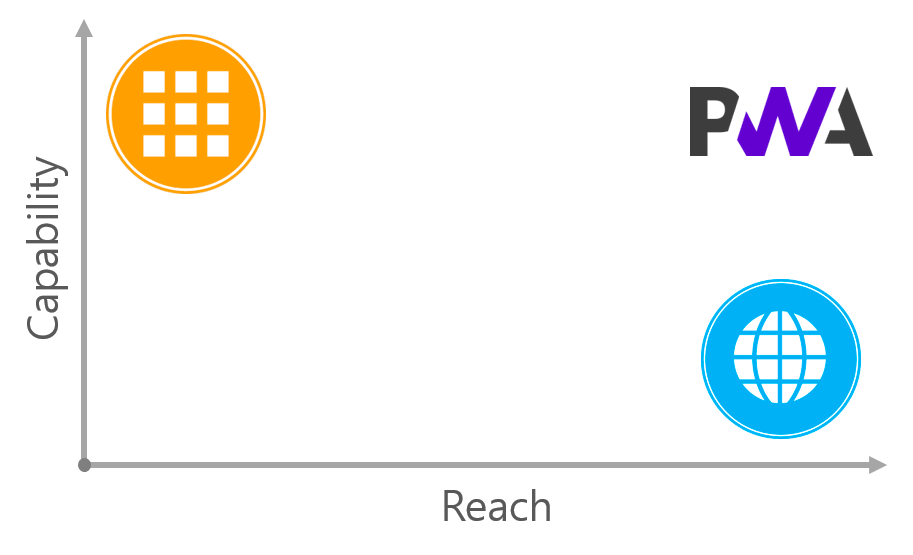

**프로그레시브 웹앱(Progressive Web App)** 은 Google I/O 2016에서 처음 소개된 웹 기술로, 주로 PWA라고 불린다. 구글에서 정의한 **PWA**는 아래와 같다.

> PWA는 최고의 웹과 최고의 앱을 결합한 경험이다. 브라우저를 통해 처음 방문한 사용자에게 유용하며, 설치가 필요하지 않다. 사용자가 PWA와 관계를 점진적으로 형성할수록 성능이 더욱 강력해 질 것이다. 느린 네트워크에서도 빠르게 로드되고, 관련된 푸시 알림을 전송한다. 모바일 앱처럼 전체 화면으로 로드되고, 홈 화면에 아이콘이 있다.

PWA는 **모바일 앱**과 **웹 기술**의 장점을 결합한 App-Like한 웹이라고 할 수 있다.

## PWA가 등장한 배경

위 통계를 보면 모바일 사용자가 데스크톱 사용자 수를 넘어선지는 이미 오래고, 모바일에서 모바일 웹보다는 모바일 앱을 사용하는 시간이 훨씬 많이 차지하고 있다. 모바일 앱이 **앱 아이콘을 통해서 쉽게 접근**할 수 있고, **푸시 알림**을 보내줄 수 있고, 스마트폰의 여러 네이티브 기술들을 활용할 수 있기 때문에 점점 많이 사용 되고 있다.

하지만 반면 여전히 앱을 다운하지 않고 모바일 웹을 통해서 서비스를 이용하는 사용자가 많기 때문에, 모바일 웹을 고려하지 않을 수 없다. 모바일 웹은 앱을 설치하는 번거로운 과정 없이 **URL을 통해 간단하게 공유하고 접속**할 수 있다는 장점이 있기 때문에 모바일 웹을 선호하는 사용자도 상당 수 존재한다.

네이티브 앱이 플랫폼에 종속되어 별도의 개발 기술이 필요한 반면에, 웹은 **플랫폼에 종속**되지 않는다. 반면 웹은 **네트워크에 종속적**이기 때문에, 네트워크 연결이 불안정하거나 끊기면 아예 사용이 불가하게 된다. 네이티브 앱의 경우는 오프라인에서도 작동할 수 있다.

|                    | 네이티브 앱                     | 모바일 웹              | PWA                                           |
| ------------------ | ------------------------------- | ---------------------- | --------------------------------------------- |
| 접근성             | 다운로드, 설치 과정 필요        | URL로 접근 가능        | URL과 홈 스크린 아이콘 모두 가능              |
| 푸시알림           | 가능                            | 불가                   | 가능                                          |
| 플랫폼 종속성      | 안드로이드, IOS 플랫폼에 종속   | 플랫폼에 종속되지 않음 | 플랫폼에 종속되지 않음                        |
| 네트워크 종속성    | 네트워크에 종속되지 않음        | 네트워크에 종속적      | 오프라인 캐시를 통해 오프라인 상태에서도 동작 |
| 네이티브 기능 사용 | 카메라, 마이크 등 네이티브 기능 | 제한적                 | 제한적                                        |

## PWA의 특징

모바일 앱과 웹 기술의 장점을 결합한 PWA는 아래와 같은 특징이 있다.

- Offline에서도 동작한다.
- 유저 동작에 빠르게 응답한다.
- 풀 스크린으로 동작한다.
- 홈 스크린에 추가될 수 있다.
- 푸시 알림 기능을 사용할 수 있다.
- 기본적으로 반응형이기 때문에 다양한 화면크기에 잘 동작한다.

즉, 웹사이트 만으로도 앱과과 같은 사용자 경험을 만들 수 있다. 잘 구현된 PWA는 사용자가 사용하면서 앱인지 웹인지 구분하지 못할 수 있다.

## PWA를 구성하기 위한 세 가지 요소

### 보안 연결(HTTPS)

PWA는 신뢰할 수 있는 연결 상태에서만 동작하기 때문에, 보안 연결을 통해서 서비스를 제공해야 한다.

### 서비스 워커(service worker)

PWA의 실질적인 동작은 대부분 서비스 워커를 통해 구현된다. 서비스 워커는 아래와 같은 특징을 가진다.

- 브라우저가 백그라운드에서 실행하는 스크립트이고, 웹페이지와는 다른 라이프 사이클을 가진다.
- 오프라인일 경우에도 웹 어플리케이션을 기동할 수 있도록 오프라인 캐시를 지원한다. 사용자의 fetch 요청을 가로채서 대신 응답할 수 있다.
- 캐싱 덕분에 로딩 시간이 줄어든다.

서비스 워커는 싱글스레드인 자바스크립트를 멀티 스레드로 사용할 수 있게 하는 `웹 워커(web worker)` 개념이다.

### 매니페스트 파일(manifest file)

JSON 형식의 파일로 PWA가 표시되고 기능하는 방식에 대한 정보가 포함되어있는 파일이다. PWA의 이름, 설명, 아이콘, 색상 등을 지정할 수 있다.

## PWA Builder

[PWA Builder](https://www.pwabuilder.com/)는 웹사이트가 PWA로 서비스하는데 준비가 되어있는지 체크해주는 사이트이다. URL만 입력하면 아래와 같은 진단을 해주고, PWA로 구성되기 위해서 무엇이 부족한지 알려 준다.

## 정리

1. PWA는 네이티브 앱과 웹의 단점을 개선할 수 있다.
2. PWA는 네이티브 앱과 같은 사용자 경험을 제공하는 웹앱이다.
3. PWA는 사용자 경험의 품질을 근본적으로 향상시키는 것을 의미한다.

하지만 아직 모든 브라우저가 PWA를 완전하게 지원하고 있는 것은 아니다. 그렇기 때문에 모든 브라우저에서 동일한 환경을 제공하는데는 한계가 존재한다.

---

## 출처

1. [프로그레시브 웹앱(Progressive Web Apps)이란?](https://altenull.github.io/2018/02/25/%ED%94%84%EB%A1%9C%EA%B7%B8%EB%A0%88%EC%8B%9C%EB%B8%8C-%EC%9B%B9-%EC%95%B1-Progressive-Web-Apps-%EB%9E%80/)

2. [PWA & 서비스 워커](https://velog.io/@teihong93/PWA-%EC%84%9C%EB%B9%84%EC%8A%A4-%EC%9B%8C%EC%BB%A4)

3. [프로그레시브 웹 앱(PWA)이란 무엇이며, 왜 필요한가?](https://blog.wishket.com/%ED%94%84%EB%A1%9C%EA%B7%B8%EB%A0%88%EC%8B%9C%EB%B8%8C-%EC%9B%B9-%EC%95%B1pwa%EC%9D%B4%EB%9E%80-%EB%AC%B4%EC%97%87%EC%9D%B4%EB%A9%B0-%EC%99%9C-%ED%95%84%EC%9A%94%ED%95%9C%EA%B0%80/)
