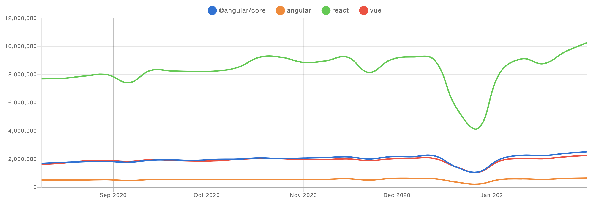

이전 포스트 들을 통해서 SSR과 CSR에 대해서 알았고, 왜 SPA가 등장하게 되었는지에 대해서 알게되었다. 그럼 이제 SPA를 구현하기 위해 어떤 프레임워크들이 사용되는지 살펴볼 차례이다. SPA를 구현하기 위해 Angular, Vue, React, Svelt등의 프레임워크들이 사용되는데, 이번 포스트에서는 최근 가장 많이 사용되는 Vue와 React를 비교해보며 중점적으로 알아보자.

## 1. React.js 란?

리액트는 2013년 페이스북으로 부터 만들어진 엄밀히 말하면 프레임워크가 아닌 자바스크립트 라이브러리라고 할 수 있다. 리액트는 자바스크립트에 가까워서 HTML과 CSS까지도 자바스크립트로 표현한다. 리액트는 라이브러리기 때문에 비교적 기능들이 간단하다. 그렇기 때문에 더 복잡한 것을 하려면 직접 구현해야 한다. 하지만 리액트 같은 경우 커뮤니티가 잘 구성되어 있고, 실제로 사용하고 있는 회사들도 많기 때문에 국내에선 수요가 조금 더 확실하다고 할 수 있다.

> 트렌드를 확인해보면 리액트가 여전히 더 많이 사용되고 있다.

## 2. Vue.js 란?

Vue.js는 HTML, CSS, JS 각각의 특성을 다 살려서 만드는 특징을 가진 프레임워크로, 2014년 Evan Yu 개인에 의해 만들어졌다. 뷰는 라이브러리가 아닌 프레임워크이기 때문에 리액트에 비해 더 많은 것이 갖춰져 있다. 그리고 프레임워크이기 때문에 자체 생애주기를 가지고 있다. 그렇기 때문에 웹 개발을 처음하는 사람이라면, HTML, CSS, JS 구분이 명확하고 더 많이 갖춰져 있는 뷰를 사용하는게 더 나을 수 있다.

## 3. 리액트와 뷰의 주요 특징

리액트와 뷰의 공통적인 특징은 다음과 같다.

- 사용자 인터페이스(UI) 개발을 위한 가볍고 빠른 프레임 워크이다.
- 컴포넌트 기반 프레임워크로 UI를 작은 컴포넌트로 구성해서 재사용성을 높이고, 캡슐화와 확장이 용이하게 한다.
- Virtual DOM 방식을 사용하여 실제 DOM의 변화를 최소화해서 성능을 향상 시킨다.

이와 별개로 리액트와 뷰는 각각의 특징도 가지고 있다. 먼저 리액트(React)의 특징은 다음과 같다.

- 뷰에 비해서 거대한 커뮤니티를 가지고 있다. 페이스북이 지원하기 때문에 상대적으로 사용자가 많아서, 다양한 라이브러리와 참고할 레퍼런스가 있기 때문에 그것이 리액트의 큰 장점이 된다.
- JSX 기반 컴포넌트 구문을 사용한다. 뷰는 템플릿 방식인데 반해서 리액트는 JSX 코드로 컴포넌트를 작성한다. 변화가 일어나면 실제 브라우저 DOM을 변화시키지 않고, Virtual DOM에 렌더링 하고 변화가 일어난 부분만 업데이트 한다.
- Vue는 하나로 합쳐져있지만, React는 설계와 디자인이 분리되어 있기 때문에 역할이 분명이 나눠져있어서, 대규모 프로젝트에 비교적 적합하다.
- 뷰에서는 데이터를 직접 변경할 수 있는데 반해 리액트의 state는 불변의 속성을 가진다. 직접적으로 변경하지 않고 `setState()`를 통해 변경할 수 있다.

뷰(Vue)의 특징은 다음과 같다.

- Vue는 렌더링하는 과정에 HTML 기반 템플릿(`<template>`) 구문은 사용한다. 이 문법이 HTML로 이루어져 있어서 상대적으로 배우기 쉬운 장점이 있다.
- 단일 파일 컴포넌트 기반 프레임워크로 뷰를 구성하는 HTML, CSS, Javascript를 `.vue` 파일에 모두 정의한다. 이러한 특징은 크지않은 규모의 프로젝트에서는 관리 생산성이 높아지고, 협업에 용이하다.
- 전 세계적인 사용량에서는 리액트가 압도적이지만, Vue 생태계가 한국에서는 잘 갖춰져 있는 편이다.
- 템플릿 기반으로 가독성이 좋고 배우기 편하지만, 프로젝트 규모가 커질 경우에 템플릿은 런타임 에러가 나기 쉽고, 테스트하기 어렵고, 재구조화에 적합하지 않아서 단점이 될 수 있다.

## 결론

어떤 프레임워크가 더 나은 것이라고 말할 수는 없고, 두 프레임워크 모두 많은 개발자들이 사용하고 있는 프레임워크이기 때문에 각 프로젝트 특징에 맞게, 아니면 본인이 더 익숙하고 선호하는 것을 사용하면 된다고 볼 수 있다.

---

> 참고 글

1. [REACT.JS VS VUE.JS, 자바스크립트 프레임워크 비교](https://library.gabia.com/contents/infrahosting/8284/)
2. [React 인가 Vue 인가?](https://joshua1988.github.io/web_dev/vue-or-react/)
