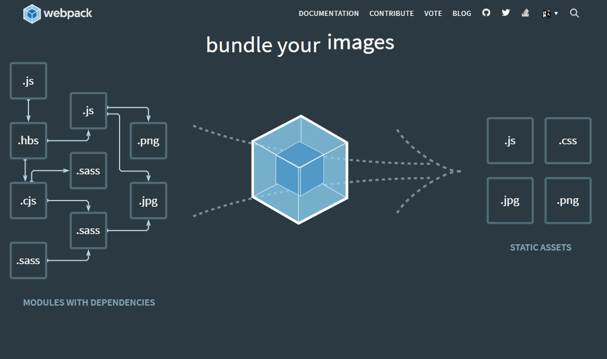

**Webpack**은 앞선 포스트에 소개 했던 **Babel**과 같이 자바스크립트 개발 환경에 많이 쓰이는 도구이다. **Webpack**은 무엇이며 어떤 역할을 하는 도구일까? **Webpack**은 모듈 번들러(Module Bundler)라고 불리는데 모듈 번들러가 무엇인지 앎으로써 **Webpack**에 대해 알아갈 수 있다. 


#### 모듈 번들러

먼저, **Module**은 프로그램이 있으면 그 프로그램을 구성하는 요소의 일부들을 모듈이라고 한다. 개발을 하다보면 모듈화 프로그래밍을 접하게 되는데, 이것은 관련된 데이터들과 함수들을 모아서 그것들로 모듈을 형성하여 파일단위로 나누어 개발하는 것을 말한다. 모듈화 프로그래밍은 현재 보편화된 방법 중 하나이다. 기능별로 모듈을 나누어 개발함을 통해서 특정 기능에 문제가 있을 때는 해당 모듈만 수정하면 되기 때문에 유지보수의 용이성으로 인해 자주 쓰이는 방법이다. 최근 많이 관심 같는 **MSA(Micro Service Architect)**와 같은 맥락이라고 할 수 있겠다.


**Bundler**는 어떠한 단위를 정해서 정한 단위들로 파일들을 하나로 만들어서 전달하도록 해주는 역할을 하는 것이다. 번들러를 사용하면서 모듈화할 수 있고 외부 라이브러리 의존성도 관리 가능하다. 여러가지 모듈들을 일정 단위로 모아서 브라우저에서 실행할 수 있도록 컴파일 된 것이 번들 파일이다.


서버에서 처리하는 로직이 많아지며 Javascript 코드도 자연스레 증가하게 되었는데, 그렇기 때문에 유지 보수를 용이하게 하기 위에서 말한 **Module**이 중요하게 된 것이다. 그리고 이러한 모듈들을 관리할 수 있도록 하는 모듈 시스템이 필요해진 것인데, Javascript에는 자체적으로 이렇게 모듈을 관리하는 시스템이 없기 때문에, **Module Bundler**인 **Webpack**이 등장하게 된 것이다.  **Webpack**을 사용하면서 의존 모듈이 하나의 파일로 번들링 되면서 별도로 모듈 로더가 필요하지 않게 된다. 다수의 자바스크립트 파일이 하나의 파일로 번들링되어서 기존에 웹 개발시 HTML 코드에서 `<script>`태그를 사용해 Javascript 코드를 일일이 불러들이는 과정이 필요가 없어진다.


#### Webpack

위에서 설명한 것처럼 **Webpack**은 자바스크립트의 모듈 번들러이다. 웹팩에서는 모든 것을 다 모듈로 취급한다. 자바스크립트 코드 뿐만 아니라 이미지와 스타일시트 등을 모듈로 로딩해서 사용한다. **Webpack**의 주요 개념은 Entry, Output, Loader, Plugin 등이 있다.


* Entry

  * 엔트리 파일은 서로 의존 관계에 있는 다양한 모듈을 사용하는 시작점이라고 할 수 있다. 
  * 여러가지 모듈들을 엮어서 번들파일을 만드는데, 이런 모듈들의 시작점이 **엔트리(Entry)**이다.
  * 엔트리가 여러개면 각각 엔트리 파일마다 번들 파일이 생성된다. 
  * 쉽게 말해 HTML에서 사용할 자바스크립트의 시작점을 정하는 것이다.

  

* Output

  * 엔트리에서 설정한 자바스크립트 파일부터 시작해서 하나로 묶어 번들파일을 만든다.
  * 생성할 번들 파일의 위치와 이름을 정하는 것이다.


* Loader
  * Webpack에서는 Javascript 언어와 Json만 읽을 수 있다. 
  * Loader를 통해 `.js`파일이나 `.json`파일 외에 이미지나 폰트와 스타일 파일 등을 모듈로 관리할 수 있도록 Webpack이 이해할 수 있도록 모듈로 변환시키는 역할을 담당한다.


* Plugin
  * 플러그인은 번들로 생성된 결과물을 처리한다. `loader`의 경우엔 파일 단위로 처리하지만, `plugin`은 번들 단위로 처리하는 것이다. 번들된 자바스크립트에 여러가지 플러그인을 통해 난독화, 텍스트 추출 등의  여러가지 역할을 수행할 수 있다.


#### Webpack의 활용

웹팩을 설치하는 것은 `npm`을 이용해 매우 간단하게 설치할 수있다.

```bash
npm install --save-dev webpack webpack-cli
```

그리고 Webpack의 설정을 세팅하려면 `webpack.config.js` 파일을 관리해줘야 한다. **Webpack**이 실행될 때 해당 파일을 참조하기 때문이다. 기본 형태는 다음과 같다.

```java
module.exports = {  
    context: __dirname + '/app', // 모듈 파일 폴더
    entry: { // 엔트리 파일 목록
        app: './app.js' 
    },
    output: {
        path: __dirname + '/dist', // 번들 파일 폴더
        filename: '[name].bundle.js' // 번들 파일 이름 규칙
    }
}
```

**Webpack**을 활용하는 것은 실제 프로젝트에 적용하는 것이 중요하기 때문에, 프로젝트를 통해 앞서 다뤘던 **Babel과 Webpack**을 함께 적용해서 따로 포스트로 다루도록 하겠다.


---


### 출처

> 1. [webpack 기초](https://velog.io/@hih0327/Webpack-기초)
>
> 2. [Babel과 Webpack을 이용한 ES6 환경 구축 ②](https://poiemaweb.com/es6-babel-webpack-2)
>
> 3. [JavaScript 모듈화 도구, webpack](https://d2.naver.com/helloworld/0239818)
>
>    


